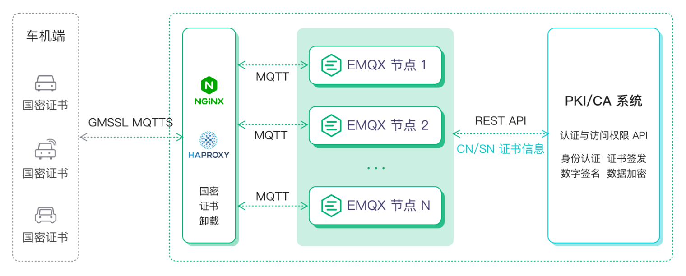

# 国密 SSL

国密即国家密码局认定的国产密码算法。通过自主可控的国产密码算法保护重要数据的安全，是有效提升信息安全保障水平的重要举措。目前，我国在金融银行、教育、交通、通信、国防工业等各类重要领域的信息系统均已开始进行国产密码算法的升级改造。

尽管 EMQX 暂时无法直接接入国密 SSL，但 EMQX 提供了国密算法整体解决方案，通过 C 语言的 GmSSL SDK 对原生的 NGINX/HAProxy 两种主流的 LB 代理软件进行编译扩展，使其具备 GmSSL 证书认证卸载的能力，结合 [集群负载均衡](../deploy/cluster/lb.md) 部署实现物联网设备国密接入。

详细信息请参考 [国密在车联网安全认证场景中的应用](https://www.emqx.com/zh/blog/application-of-gmsm-in-internet-of-vehicles-security-authentication-scenario)。
