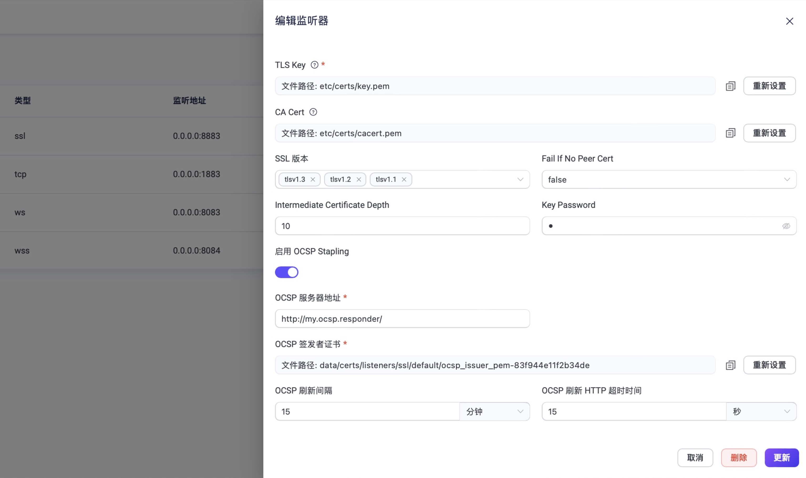

### OCSP Stapling



在线证书状态协议 (OCSP) 是一种在线服务和协议，用于获取 X509 数字证书的撤销状态，它是维护服务器和其它网络资源安全性的普遍模式之一。作为业界领先的 MQTT 消息中间件，EMQX 始终将用户的数据安全做为首要考虑，从 5.0.23 版本开始，EMQX 支持针对 MQTT SSL 监听器设置 OCSP Stapling，以更好地满足用户对安全性的要求。





在线证书状态协议 (OCSP) 是一种在线服务和协议，用于获取 X509 数字证书的撤销状态，是维护服务器和其它网络资源安全性的普遍模式之一。作为业界领先的 MQTT 消息中间件，EMQX 始终将用户的数据安全做为首要考虑，从 5.0.3 版本开始，EMQX 支持针对 MQTT SSL 监听器设置 OCSP Stapling，以更好地满足用户对安全性的要求。



注意：QUIC 类型监听器暂不支持此功能。

如希望在 SSL 监听器中启用 OCSP Stapling，您应首先在监听器设置中启用相应选项，并提供必要的 OCSP 签发者证书和 OCSP 服务器地址。之后，EMQX 会自动获取并缓存 OCSP 响应信息，确保 SSL/TLS 连接的安全性。

EMQX 支持通过 Dashboard 和配置文件启用 SSL 监听器 OCSP Stapling。

::: tip 前置准备

正式配置前，请准备好 OCSP 签发者证书。

:::

## 通过 Dashboard 配置

登陆 EMQX Dashboard，点击左侧导航目录的**管理**->**监听器**，访问**监听器**页面。在本章我们将为默认的 SSL 监听器启用 OCSP Stapling，点击监听器名称进入**编辑监听器**页面。拖动到页面底部，找到 **启用 OCSP Stapling**的设置开关。



按照以下说明对字段进行配置：

- **OCSP 服务器地址**：输入 OCSP 服务器地址 URL。您可以在 SSL/TLS 证书的 AIA 扩展中找到此信息。
- **OCSP 签发者证书**：输入 OCSP 签发者证书。EMQX 将根据该证书来验证 OCSP 响应的真实性。
- **OCSP 刷新时间**：设置 EMQX 请求一个新的 OCSP 响应的时间间隔。默认值：5分钟。
- **OCSP 刷新 HTTP 超时时间**：设置 EMQX 判定请求失败的等待时间。默认值：15 秒。

点击**更新**按钮确认以上输入。

## 通过配置文件配置

EMQX 也支持通过配置文件 `emqx.conf` 启用 OCSP Stapling 功能。

您只需将相关的配置项附加到 `emqx.conf` 文件的末尾，相应设置将在 EMQX 重启后生效。

**示例代码**：

```hcl
listeners.ssl.default {
  bind = "0.0.0.0:8883"
  max_connections = 512000
  ssl_options {
    keyfile = "/etc/emqx/certs/server.key"
    certfile = "/etc/emqx/certs/server.pem"
    cacertfile = "/etc/emqx/certs/ca.pem"
    ocsp {
      enable_ocsp_stapling = true
      issuer_pem = "/etc/emqx/certs/ocsp-issuer.pem"
      responder_url = "http://ocsp.responder.com:9877"
      refresh_interval = 15m
      refresh_http_timeout = 15s
    }
  }
}
```

请根据实际情况修改以上配置中的证书路径、私钥路径，以及 OCSP 服务器地址 URL。

