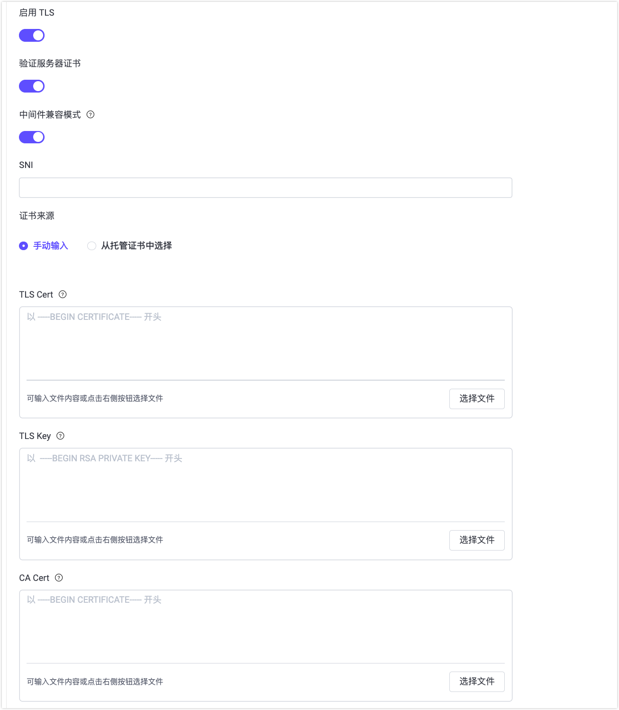

# 网络与 TLS

信息安全对于物联网场景下的端对端加密通信至关重要。SSL 和 TLS 常被用于网络通信，以确保数据传输保持机密性，并且无法被攻击者截获或修改。SSL/TLS 加密功能在传输层加密网络连接，并涉及使用数字证书来验证涉及各方的身份并建立安全通信通道。

EMQX 在以下几种应用中使用 SSL 和 TLS 协议来保障网络通信安全：

- MQTT 客户端与 EMQX 建立连接
- 连接到外部资源，比如外部数据库
- 集群中不同节点之间的通信

EMQX 提供了全面的 SSL/TLS 功能支持，包括单向/双向身份验证和 X.509 证书身份验证。当接受 MQTT 客户端或连接到外部资源（如数据库）时，EMQX 可以通过 SSL/TLS 建立安全连接。

## 启用 TLS 进行客户端加密连接

EMQX 支持对 MQTT 客户端连接进行 SSL/TLS 加密，实现客户端与消息代理之间的安全加密通信。您可以根据安全需求配置 TLS 监听器，以支持单向认证（仅验证服务器身份）或双向认证（mTLS，客户端与服务器相互认证）。

本章节中的[开启 SSL/TLS 连接](./emqx-mqtt-tls.md)将逐步介绍如何为 MQTT 客户端配置 TLS 监听器，包括通过 Dashboard 和配置文件进行监听器配置。

### 证书管理

EMQX 为 SSL/TLS 提供了统一的证书管理模型，涵盖证书的获取、存储、管理以及在监听器和其他支持 TLS 的组件之间的复用。这既包括传统的基于路径的证书，也包括具备集中式生命周期管理能力的托管证书。

有关 EMQX 中证书相关概念和使用流程的完整说明，请参阅 [SSL/TLS 证书](./tls-certificate.md)。

### 证书校验与吊销

为进一步提升 TLS 安全性，EMQX 支持证书校验与吊销检查机制：

- **CRL 检查**：通过证书吊销列表（CRL）验证证书是否已被吊销。参见 [CRL 检查](./crl.md)。
- **OCSP Stapling**：通过在线证书状态协议（OCSP）检查证书的吊销状态。参见 [OCSP Stapling](./ocsp.md)。

这些功能可在配置 TLS 监听器时启用，有助于防止使用已被泄露或吊销的证书。

### 客户端 TLS 示例

[客户端 TLS](./mqtt-client-tls.md) 页面提供了 MQTT 客户端示例代码和示例项目，演示如何使用 SSL/TLS 安全地连接到 EMQX。这些示例包含了客户端证书配置以及 TLS 相关选项的实用指导。

### 国密 SSL

[国密 SSL](./gmssl.md) 即国家密码局认定的国产密码算法。我国在金融银行、教育、交通、通信、国防工业等各类重要领域的信息系统均已开始进行国产密码算法的升级改造。本节将介绍 EMQX 国密算法整体解决方案。

## 启用 TLS 加密访问外部资源

EMQX 在访问外部资源（例如基于 HTTP 的认证服务、数据库或其他数据集成服务）时，同样支持使用 SSL/TLS 进行加密通信。在配置相应功能时，您可以直接在 EMQX Dashboard 中通过**启用 TLS** 选项来开启 TLS。

### Dashboard 中的 TLS 配置项

启用 TLS 后，可以配置以下选项：

- **验证服务器证书**：控制是否校验外部资源服务器的证书。启用后，EMQX 会验证服务器证书链的有效性。
- **中间件兼容模式**：为 TLS 1.3 连接启用中间设备兼容模式。某些网络中的中间设备可能无法正确处理标准的 TLS 1.3 握手流程，启用该选项后，EMQX 会将 TLS 1.3 的握手过程调整为类似 TLS 1.2，从而提高在此类环境中的连接成功率。
- **SNI**：服务器名称指示（Server Name Indication），用于在 TLS 握手过程中校验服务器域名是否与证书中的域名一致。如果留空，则不会进行主机名校验。
- **证书来源**：当需要客户端证书时，用于指定客户端证书的提供方式：
  - **手动输入**：直接填写或上传证书内容或证书文件。
  - **从托管证书中选择**：引用由 EMQX 集中管理的现有证书包（EMQX 6.1+）。这种方式支持证书复用，并简化证书轮换。有关创建和管理证书包的详细信息，请参阅[托管证书](./tls-certificate.md#托管证书)。
- **TLS Cert / TLS Key**：当外部服务器需要校验客户端证书（双向 TLS）时必须配置。
- **CA Cert**：当启用**验证服务器证书**时必需，用于校验服务器证书的合法性。



### 通过配置文件进行 TLS 配置

您也可以通过在配置文件中设置相应的 `ssl` 选项，为外部资源访问启用 TLS。例如，在配置基于 HTTP 的认证后端时：

```hocon
authentication {
  url = "https://127.0.0.1:8080"
  backend = "http"

  ...

  ssl {
    enable = true
    # PEM 格式的文件，包含一个或多个用于验证 HTTP 服务器证书的根 CA 证书
    cacertfile = "etc/certs/cacert.pem"
    # PEM 格式的客户端证书，如果证书不是直接由根 CA 签发，那么中间 CA 的证书必须加在服务器证书的后面组成一个证书链
    certfile = "etc/certs/cert.pem"
    # PEM 格式的密钥文件
    keyfile = "etc/certs/key.pem"
    # 设置成 'verify_peer' 来验证 HTTP 服务器端证书是否为 cacertfile 中某个根证书签发
    verify = verify_none
  }
}
```

对于外部资源，配置文件中同样可以引用托管证书，其证书管理模型与监听器使用的方式一致。有关配置选项的更多信息，请参阅[启用单向认证的 SSl/TLS 连接](./emqx-mqtt-tls.md#启用单向认证的-ssltls-连接)。

## 启用 TLS 加密节点通信

关于如何在集群节点通信中启用 TLS的具体介绍，您可以参阅[集群安全](../deploy/cluster/security.md)。
