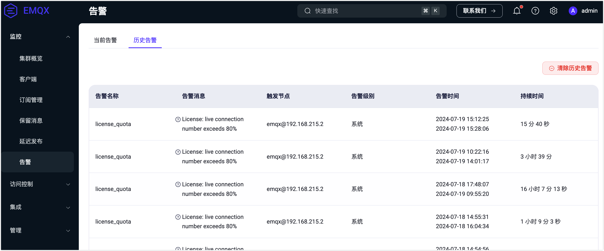
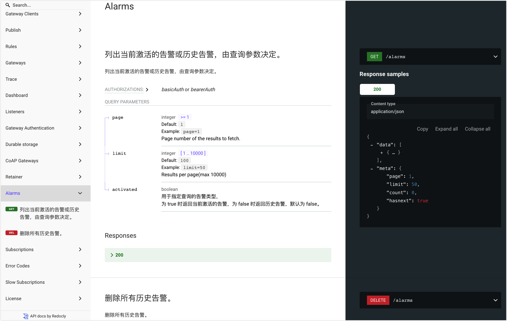
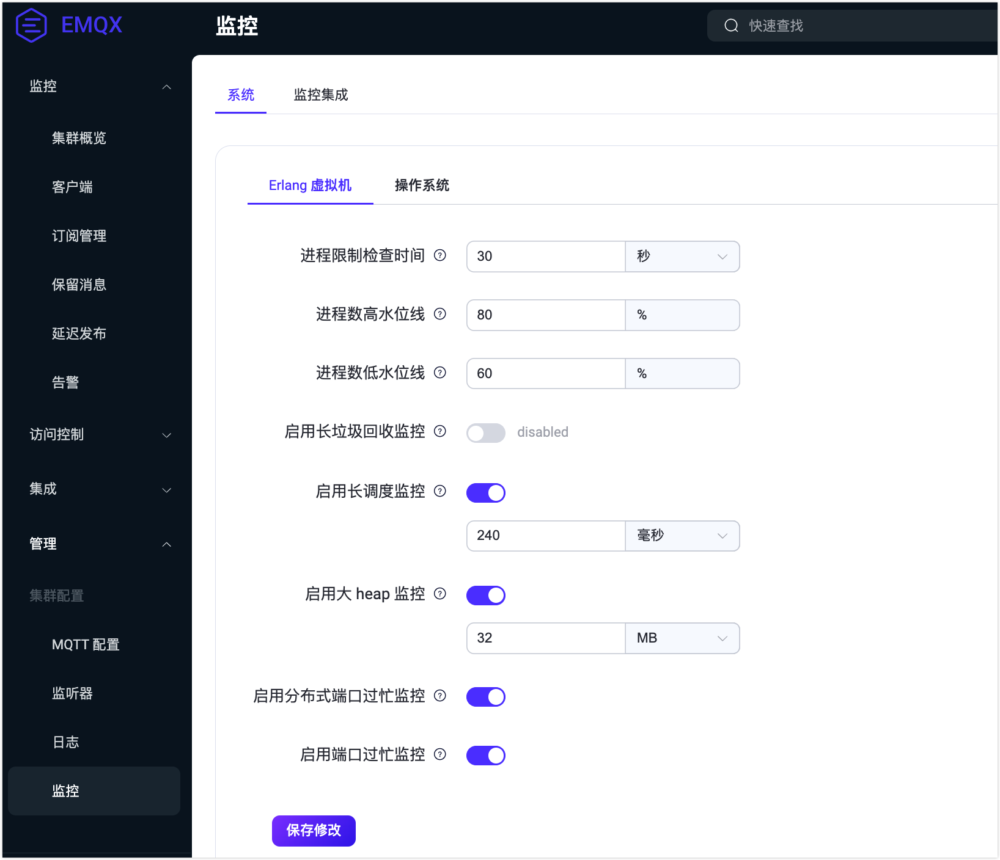
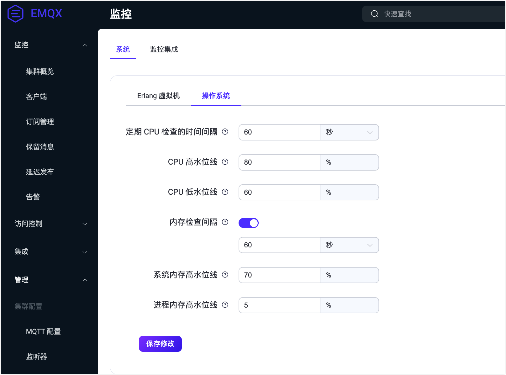

# 告警

::: tip 注意

告警是 EMQX 企业版功能。

:::

EMQX 提供内置的监控和告警功能，用于监视内部状态变化，如 CPU 占用率、系统和进程内存占用率、进程数量、规则引擎资源状态以及集群分区和治理。当这些状态超过阈值或偏离预期时，EMQX 会触发并记录这些变化，并在恢复正常后将其从列表中移除。

本页面介绍了 EMQX 提供的告警信息、如何获取和查看详细的告警信息，以及如何在 EMQX 中配置告警设置和阈值。监控和告警功能可帮助您在运行过程中及时发现潜在问题。通过配置告警并设置适当的阈值，您可以确保EMQX 保持安全、稳定和可靠。

## 告警列表

告警列表详细描述了 EMQX 在监控和处理系统状态变化时可能触发的不同告警类型及其级别。

::: tip 提示

根据对系统的严重性和影响，告警可分为三个级别：

- **错误（Error）**：由用户预设引起的错误。客户端可以感知到错误并重试。
- **警告（Warning）**：偶发性错误，如果频繁发生则需要认真对待。
- **严重（Critical）**：客户端和服务器之间不可逆的数据丢失，导致通信和业务中断。

这些级别是从开发角度定义的，仅供参考。您可以根据业务需求定义自己的告警级别。

:::

**EMQX 开源版告警列表：**

| **告警**                  | 级别 | 描述                                               | **详情**                | **阈值**                                                     |
| ------------------------- | ---- | -------------------------------------------------- | ----------------------- | ------------------------------------------------------------ |
| high_system_memory_usage  | 警告 | 系统内存使用过高                                   | "系统内存使用高于 ~p%"  | `os_mon.sysmem_high_watermark = 70%`                         |
| high_process_memory_usage | 警告 | 单个 Erlang 进程内存使用过高（占系统内存的百分比） | 进程内存使用高于 ~p%    | `os_mon.procmem_high_watermark = 5%`                         |
| high_cpu_usage            | 警告 | CPU 使用率过高                                     | ~p% CPU 使用率          | `os_mon.cpu_high_watermark = 80%` `os_mon.cpu_low_watermark = 60%` |
| too_many_processes        | 警告 | 进程过多                                           | ~p% 进程使用率          | `vm_mon.process_high_watermark = 80%` `vm_mon.process_low_watermark = 60%` |
| partition                 | 严重 | 节点发生分区                                       | 节点发生分区 ~s         | -                                                            |
| resource                  | 严重 | 资源断开连接                                       | 资源 ~s（~s）已断开连接 | -                                                            |
| conn_congestion           | 严重 | 连接过程拥塞                                       | 连接拥塞                | -                                                            |

**EMQX 企业版告警列表：**

| **告警**                  | 级别 | 描述                                               | **详情**                | **阈值**                                                     |
| ------------------------- | ---- | -------------------------------------------------- | ----------------------- | ------------------------------------------------------------ |
| high_system_memory_usage  | 警告 | 系统内存使用过高                                   | "系统内存使用高于 ~p%"  | `os_mon.sysmem_high_watermark = 70%`                         |
| high_process_memory_usage | 警告 | 单个 Erlang 进程内存使用过高（占系统内存的百分比） | 进程内存使用高于 ~p%    | `os_mon.procmem_high_watermark = 5%`                         |
| high_cpu_usage            | 警告 | CPU 使用率过高                                     | ~p% CPU 使用率          | `os_mon.cpu_high_watermark = 80%` `os_mon.cpu_low_watermark = 60%` |
| too_many_processes        | 警告 | 进程过多                                           | ~p% 进程使用率          | `vm_mon.process_high_watermark = 80%` `vm_mon.process_low_watermark = 60%` |
| license_quota             | 警告 | License 超过配额                                   | License：连接数超过 %   | `license.connection_high_watermark_alarm = 80%` `license.connection_low_watermark_alarm = 75%` |
| license_expiry            | 严重 | License 过期                                       | License 将于 % 过期     | -                                                            |
| partition                 | 严重 | 节点发生分区                                       | 节点发生分区 ~s         | -                                                            |
| resource                  | 严重 | 资源断开连接                                       | 资源 ~s（~s）已断开连接 | -                                                            |
| conn_congestion           | 严重 | 连接过程拥塞                                       | 连接拥塞                | -                                                            |

## 获取告警信息

EMQX 提供多种方式获取告警并查看详细信息。其中一种方式是通过 EMQX Dashboard 查看告警，您可以在此查看已触发的活动或历史告警列表，然而 Dashboard 仅作为一个便于查看告警概览信息的中心。另一种方式是通过 MQTT 订阅系统主题，实时接收带有详细告警信息的通知。告警也可以通过日志或 REST API 访问。

### 在 Dashboard 中查看告警

在 EMQX Dashboard 上，点击**监控** -> **告警**。选择**当前告警**或**历史告警**页签，您可以查看当前活动的告警和历史告警列表。

### 订阅系统主题获取告警

当告警被激活或取消，EMQX 会发布一条主题为 `$SYS/brokers/<Node>/alarms/activate` 或 `$SYS/brokers/<Node>/alarms/deactivate` 的 MQTT 消息，用户可以通过订阅对应主题来获取告警通知。

告警通知消息的 Payload 为 JSON 格式，包含以下字段：

| 字段            | 类型             | 说明                                                         |
| --------------- | ---------------- | ------------------------------------------------------------ |
| `name`          | string           | 告警名称                                                     |
| `details`       | object           | 告警详情                                                     |
| `message`       | string           | 可读的告警说明                                               |
| `activate_at`   | integer          | UNIX 时间戳，表示告警激活时间，单位：微秒                    |
| `deactivate_at` | integer / string | UNIX 时间戳，表示告警取消的时间，单位：微秒 ；该字段在激活告警中的值为 `infinity` |
| `activated`     | boolean          | 告警是否处于激活状态                                         |

以系统内存占用率过高告警为例，您将收到以下格式的消息：

告警不会重复产生，即如果 CPU 占用率过高告警已经激活，则在其激活期间，不会出现第二个 CPU 占用率过高告警。告警会在被监控项恢复正常后自动取消，也支持用户手动取消激活。

### 通过日志获取告警

告警的启用和禁用可以记录到日志（控制台或文件）。当消息传输或事件处理发生故障时，可以记录详细信息，并且日志系统还可以通过日志分析捕获警报。以下示例显示了打印在日志中的详细告警信息： 日志级别为 `warning`，`msg` 字段为 `告警已激活` 和 `告警已取消`。

### 通过 REST API 获取告警

您可以通过 API 查询和管理告警。在 UI 的左侧导航菜单中点击 **Alarms** 来执行此 API 请求。有关如何使用 EMQX API，请参阅 [REST API 文档](../admin/api.md)。

## 告警配置

告警配置包括配置告警设置和告警阈值。告警设置确定如何显示和存储告警消息，而告警阈值配置将设置当检测到潜在问题时触发告警的限制或值。告警配置功能允许您根据业务需求自定义告警设置和阈值。

### 配置告警设置

告警的设置只能通过修改 `emqx.conf` 文件中的配置项来进行。以下表格列出了用于告警设置配置的可用配置项。

| 配置项                | 描述                                                         | 默认值               | 可选值   |
| --------------------- | ------------------------------------------------------------ | -------------------- | -------- |
| alarm.actions         | 将告警写入日志（控制台或文件）并将告警作为 MQTT 消息发布到系统主题 `$SYS/brokers/<node_name>/alarms/activate` 和 `$SYS/brokers/<node_name>/alarms/deactivate` 的操作。这些操作在告警激活或取消时触发。 | `["log", "publish"]` | -        |
| alarm.size_limit      | 已取消告警的最大总数。当超过此限制时，最早取消的告警将被删除。 | `1000`               | `1-3000` |
| alarm.validity_period | 已取消告警的保留时间。告警在取消后不会立即删除，而是在一段时间后删除。 | `24h`                | -        |

通过这些配置项，您可以灵活地管理和定制 EMQX 发出的各类告警设置，以便更好地满足您的业务运营需求。

### 通过 Dashboard 配置告警阈值

您可以在 EMQX Dashboard 上配置告警阈值。有两种方法可以打开用于配置告警阈值的**监控**页面：

1. 在**告警**页面，点击**设置**按钮，将会跳转到**监控**页面。
2. 在左侧导航菜单中，点击**管理** -> **监控**。

在**监控** -> **系统**页签中，点击 **Erlang 虚拟机** 标签，您可以为 Erlang 虚拟机的系统性能配置以下项目：

- **进程限制检查时间**：指定周期性检查进程限制的时间间隔。默认值为 `30` 秒。
- **进程数高水位线**：指定可以同时存在于本地节点的进程的阈值百分比。当超过指定数值时，会触发告警。默认值为 `80`%。
- **进程数低水位线**：指定可以同时存在于本地节点的进程的阈值百分比。当降低到指定数值时，告警将被清除。默认值为 `60`%。
- **启用长垃圾回收 监控**：默认禁用。启用后，当 Erlang 进程执行长时间垃圾回收时，将发出警告级别的日志 `long_gc`，并发布 MQTT 消息到系统主题 `$SYS/sysmon/long_gc`。
- **启用长调度监控**：默认启用，意味着当 Erlang VM 检测到任务调度时间过长时，会发出警告级别的日志 `long_schedule`。您可以在文本框中设置任务的适当调度时间。默认值为 `240` 毫秒。
- **启用大 heap 监控**：默认启用，意味着当 Erlang 进程为其堆空间消耗大量内存时，会发出警告级别的日志 `large_heap`，并发布 MQTT 消息到系统主题 `$SYS/sysmon/large_heap`。您可以在文本框中设置空间字节大小的限制。默认值为 `32` MB。
- **启用分布式端口过忙监控**：默认启用，意味着当用于与集群中其他节点通信的远程过程调用（RPC）连接过载时，会发出警告级别的日志 `busy_dis_port`，并发布 MQTT 消息到系统主题 `$SYS/sysmon/busy_dis_port`。
- **启用端口过忙监控**：默认启用，意味着当端口过载时，会发出警告级别的日志 `busy_port`，并发布 MQTT 消息到系统主题 `$SYS/sysmon/busy_port`。

完成配置后，点击**保存更改**。

点击**操作系统**标签，您可以为系统性能配置以下项目：

- **定期 CPU 检查的时间间隔**：指定检查 CPU 使用率的时间间隔。默认值为 `60` 秒。
- **CPU 高水位线**：指定系统 CPU 使用率的阈值百分比。当超过指定值时，会触发相应的告警。默认值为 `80`%。
- **CPU 低水位线**：指定系统 CPU 使用率的阈值百分比。当降低到指定值时，相应的告警将被解除。默认值为 `60`%。
- **内存检查间隔**：默认启用。您可以指定周期性内存检查的时间间隔。默认值为 `60` 秒。
- **系统内存高水位线**：指定系统内存分配的阈值百分比。当超过指定值时，会触发相应的告警。默认值为 `70`%。
- **进程内存高水位线**：指定单个 Erlang 进程所分配的系统内存的阈值百分比。当超过指定值时，会触发相应的告警。默认值为 `5`%。

完成配置后，点击**保存更改**。

### 通过配置项配置告警阈值

您还可以通过修改告警阈值的配置项来配置告警阈值。以下配置项目前可在 `emqx.conf` 文件中进行修改：

| 配置项                            | 描述                                                         | 默认值     |
| --------------------------------- | ------------------------------------------------------------ | ---------- |
| sysmon.os.cpu_check_interval      | CPU 使用率检查间隔。                                         | `60s`      |
| sysmon.os.cpu_high_watermark      | CPU 使用率的高水位标记，超过此阈值将触发告警。               | `80%`      |
| sysmon.os.cpu_low_watermark       | CPU 使用率的低水位标记，低于此阈值将解除告警。               | `60%`      |
| sysmon.os.mem_check_interval      | 内存使用率检查间隔。                                         | `60s`      |
| sysmon.os.sysmem_high_watermark   | 系统内存使用率的高水位标记。当总内存占用达到此值时将触发告警。 | `70%`      |
| sysmon.os.procmem_high_watermark  | 进程内存使用率的高水位标记。当单个进程占用内存达到此值时将触发告警。 | `5%`       |
| sysmonn.vm.process_check_interval | 进程数检查间隔。                                             | `30s`      |
| sysmon.vm.process_high_watermark  | 进程占用率的高水位标记。当达到此阈值时将触发告警。以创建进程数/最大限制数的比率来衡量。 | `80%`      |
| sysmon.vm.process_low_watermark   | 进程占用率的低水位标记。当低于此阈值时将解除告警。以创建进程数/最大限制数的比率来衡量。 | `60%`      |
| sysmonn.vm.long_gc                | 是否启用长 GC 监控。                                         | `disabled` |
| sysmon.vm.long_schedule           | 是否启用长调度监控。                                         | `disabled` |
| sysmon.vm.large_heap              | 是否启用大 Heap 监控。                                       | `disabled` |
| Sysmon.vm.busy_dist_port          | 是否启用分端口过忙监控。                                     | `true`     |
| sysmon.vm.busy_port               | 是否启用分布式端口过忙监控。                                 | `true`     |
| sysmonn.top.num_items             | 每个监控组的前进程数。                                       | `10`       |
| sysmon.top.sample_interlval       | 顶级进程的检查间隔。                                         | `2s`       |
| sysmon.top.max_procs              | 当 VM 中的进程数超过此值时停止收集数据。                     | `1000000`  |

在 EMQX 企业版中，当 License 在不到 30 天内过期或连接数超过高水位标记时，会触发告警。您可以通过修改以下配置项在 `emqx.conf` 文件中调整连接数的高/低水位标记。有关如何配置 License 设置的更多信息，请参阅 [License](../configuration/license.md)。

| 配置项                                  | 描述                                                         | 默认值 |
| --------------------------------------- | ------------------------------------------------------------ | ------ |
| license.connection_high_watermark_alarm | License 支持的最大连接数的高水位标记。当达到此阈值时触发告警。以活跃连接数/最大连接数的比率来衡量。 | `80%`  |
| license.connection_low_watermark_alarm  | License 支持的最大连接数的低水位标记。当低于此阈值时解除告警。以活跃连接数/最大连接数的比率来衡量。 | `75%`  |
