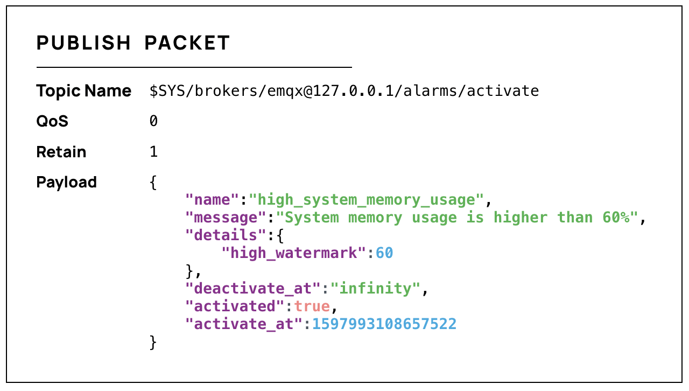

# 告警

EMQX 内置监控与告警功能，目前支持监控 CPU 占用率、系统与进程的内存占用率、进程数量、规则引擎资源状态、集群脑裂与愈合，并会在发现异常时进行告警。告警的激活与取消都将产生一条警告日志，EMQX 会同时发布一条主题为 `$SYS/brokers/<Node>/alarms/activate` 或 `$SYS/brokers/<Node>/alarms/deactivate` 的 MQTT 消息，用户可以通过订阅对应主题来获取告警通知。

告警通知消息的 Payload 为 JSON 格式，包含以下字段：

| 字段            | 类型             | 说明                                                         |
| --------------- | ---------------- | ------------------------------------------------------------ |
| `name`          | string           | 告警名称                                                     |
| `details`       | object           | 告警详情                                                     |
| `message`       | string           | 人们可读的告警说明                                           |
| `activate_at`   | integer          | UNIX 时间戳，表示告警激活时间，单位：微秒                    |
| `deactivate_at` | integer / string | UNIX 时间戳，表示告警取消的时间，单位：微秒 ；该字段在激活告警中的值为 `infinity` |
| `activated`     | boolean          | 告警是否处于激活状态                                         |

以系统内存占用率过高告警为例，您将收到以下格式的消息：

告警不会重复产生，即如果 CPU 占用率过高告警已经激活，则在其激活期间，不会出现第二个 CPU 占用率过高告警。告警会在被监控项恢复正常后自动取消，也支持用户手动取消激活。

用户可以在 Dashboard 查看当前告警与历史告警，也可以通过 EMQX 提供的 HTTP API 查询和管理告警。

用户可通过配置项对告警功能进行调整以适应实际需要，EMQX 目前开放了以下配置项：

| 配置项                            | 类型              | 默认值                    | 说明                                                         |
| --------------------------------- | ----------------- | ------------------------- | ------------------------------------------------------------ |
| sysmon.os.cpu_check_interval      | duration          | 60s                       | CPU 占用率的检查间隔                                         |
| sysmon.os.cpu_high_watermark      | percent           | 80%                       | CPU 占用率高水位，即 CPU 占用率达到多少时激活告警            |
| sysmon.os.cpu_low_watermark       | percent           | 60%                       | CPU 占用率低水位，即 CPU 占用率降低到多少时取消告警          |
| sysmon.os.mem_check_interval      | duration          | 60s                       | 内存占用率的检查间隔                                         |
| sysmon.os.sysmem_high_watermark   | percent           | 70%                       | 系统内存占用率高水位，即申请的总内存占比达到多少时激活告警   |
| sysmon.os.procmem_high_watermark  | percent           | 5%                        | 进程内存占用率高水位，即单个进程申请的内存占比达到多少时激活告警 |
| sysmonn.vm.process_check_interval | duration          | 30s                       | 进程数量的检查间隔                                           |
| sysmon.vm.process_high_watermark  | percent           | 80%                       | 进程占用率高水位，即创建的进程数量与最大数量限制的占比达到多少时激活告警 |
| sysmon.vm.process_low_watermark   | percent           | 60%                       | 进程占用率低水位，即创建的进程数量与最大数量限制的占比降低到多少时取消告警 |
| sysmonn.vm.long_gc                | disabled/duration | disabled                  | 是否启用长垃圾回收（Long GC）监控                            |
| sysmon.vm.long_schedule           | disabled/duration | disabled                  | 是否启用长调度监控                                           |
| sysmon.vm.large_heap              | disabled/bytesize | disabled                  | 是否启用 Large Heap 监控                                     |
| sysmon.vm.busy_port               | boolean           | true                      | 启用分布式端口过忙监控                                       |
| sysmonn.top.num_items             | integer           | 10                        | 每个监视组的 Top K 数量                                      |
| sysmon.top.sample_interlval       | duration          | 2s                        | Top K 的检查间隔                                             |
| sysmon.top.max_procs              | integer           | 1000000                   | 当 VM 中的进程数超过此值时，停止收集数据                     |
| sysmonn.top.db_hostname           | string            | ""                        | PostgreSQL 数据库的主机名                                    |
| sysmonn.top.db_port               | integer           | 5432                      | PostgreSQL 数据库的端口                                      |
| sysmon.top.db_username            | string            | "system_monitor"          | PostgreSQL 数据库的用户名                                    |
| sysmon.top.db_password            | string            | "system_monitor_password" | PostgreSQL 数据库的密码                                      |
| sysmon.top.db_name                | string            | "postgres"                | PostgreSQL 数据库的数据库名                                  |


EMQX 企业版在证书到期日小于30天或连接数超过高水位线时会发出告警。用户可以根据实际情况对连接数的高/低水位线进行调整：

| 配置项                        | 类型     | 默认值      | 说明                                                         |
| ----------------------------- | -------- | ----------- | ------------------------------------------------------------ |
| license.connection_high_watermark_alarm  | percent  | 80%         | 证书允许的最大连接数高水位，即实时在线数/最大允许连接数达到多少时激活告警 |
| icense.connection_low_watermark_alarm    | percent  | 75%         | 证书允许的最大连接数低水位，即实时在线数/最大允许连接数达到多少时取消告警 |
|||||
