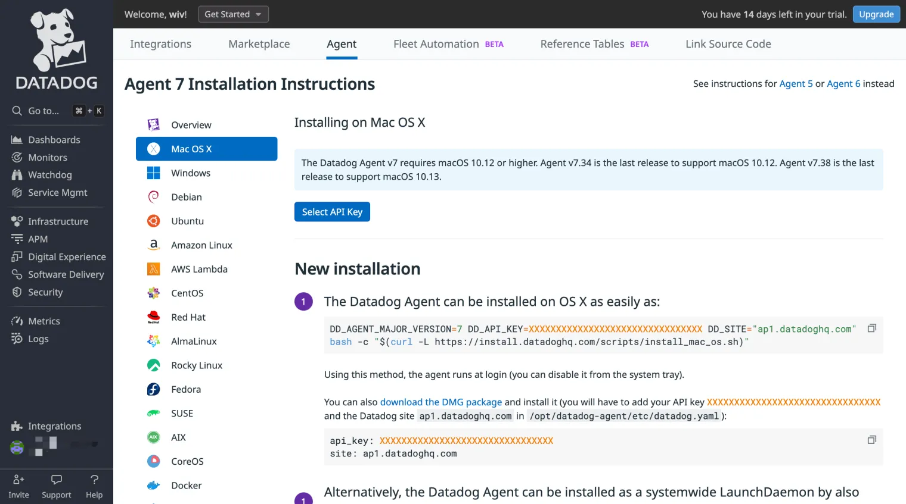

# 集成 Datadog

[Datadog](https://www.datadoghq.com/) 是一款基于云服务的可观测性和安全平台，提供自动化基础设施监控、应用程序性能监控、日志管理、真实用户监控等功能。它为应用程序提供统一、实时的可观测性和安全性解决方案，帮助开发人员轻松监控、分析和优化其应用程序的性能和可靠性。

EMQX 提供了开箱即用的 [Datadog 集成](https://docs.datadoghq.com/integrations/emqx/)，方便用户更好地了解 EMQX 的状态，并监测和排查系统性能问题，更好地构建高效、可靠和实时数据传输的物联网应用。

## 工作原理

EMQX 与 Datadog 的集成不是一个新的功能，它充分利用了 EMQX 现有的功能，工作原理如下：

1. 在 EMQX 集群侧安装 Datadog Agent，并添加 [Datadog - EMQX 集成](https://docs.datadoghq.com/integrations/emqx/)，这是 Datadog 针对 EMQX 提供的开箱即用的扩展插件。

2. 通过修改集成预设的配置，让 Datadog Agent 周期性的从 EMQX 的 Prometheus pull REST API 拉取指标数据。指标数据经过 Datadog Agent 处理后上传到 Datadog 平台。

3. 在 Datadog 云平台中，可以通过集成预设的 Dashboard 图表查看各类指标数据。

接下来，我们将按照以上步骤进行设置。

## 安装 Datadog Agent

[Datadog Agent](https://docs.datadoghq.com/getting_started/agent/) 用于收集 EMQX 指标并将指标发送到 Datadog 云端，需要部署在 EMQX 集群所在服务器或能够访问 EMQX 节点的服务器上。

如果第一次使用 Datadog，先访问 [Datadog](https://www.datadoghq.com/) 创建一个帐户并登录进入 Datadog 控制台。接下来，您需要在 EMQX 所在的服务器上安装 Datadog Agent。可以按照以下步骤进行操作：

1. 菜单栏选择 **Integrations** → **Agent** 打开 Agent 安装说明页面。

2. 根据实际情况，选择您对应操作系统版本，按照页面指引进行安装。



## 在 Datadog 中添加 EMQX 集成

EMQX 提供了开箱即用的 [Datadog 集成](https://docs.datadoghq.com/integrations/emqx/)，您可以使用如下步骤，将其添加到您 Datadog 控制台中：

1. 菜单栏选择 **Integrations** → **Integrations** 打开集成页面。

2. 在搜索框中，输入 EMQX，找到同名且作者是 EMQX 的集成。

3. 打开集成，在弹出框中点击右上角 **Install Integration** 按钮，即可将集成添加到 Datadog 中。


4. 安装完成后，切换到 **Configure** 标签页查看 EMQX 集成的配置指引，配置所需的操作均在 Datadog Agnet 上进行。


## 在 Datadog Agnet 上添加并启用 EMQX 集成

根据配置指引，在 Datadog Agent 上添加 EMQX 集成，以完成 EMQX 指标的采集与上报配置。

1. 在 Datadog Agent 所在服务器运行以下命令为 Agent 添加 EMQX 集成。此处使用的是 1.1.0 版本，请根据指引内容使用最新的版本。

    ```bash
    datadog-agent integration install -t datadog-emqx==1.1.0
    ```

2. 安装完成后，修改 Agnet 配置文件以启用 EMQX 集成。

    打开 Agent 配置目录（默认是 `/opt/datadog-agent/etc/conf.d/`），找到目录下的 `emqx.d` 目录，可以看到 `emqx.d` 目录下有一个示例配置文件 `conf.yaml.example`。

    在相同目录下复制一份该文件并重命名为 `conf.yaml`，修改文件中的以下配置项：

    ```bash
    instances:
      - openmetrics_endpoint: http://localhost:18083/api/v5/prometheus/stats?mode=all_nodes_aggregated
    
    ```

    `openmetrics_endpoint` 选项是 Datadog Agnet 提取 OpenMetrics 格式的指标数据的地址，这里设置的是 EMQX 的 HTTP API 地址。实际使用中，请修改为 Datadog Agent 能够访问到的地址。

    该 API 还支持通过 `mode` 查询参数指定拉取的指标范围，每个参数的含义如下：
    
    | **参数**               | **说明**                                                     |
    | ---------------------- | ------------------------------------------------------------ |
    | node                   | 返回当前请求的节点的指标，没有指定 `mode` 参数时默认使用这个值。 |
    | all_nodes_unaggregated | 返回集群中每个节点的指标，保持指标的独立性，同时在返回结果中包含节点名称，以便区分各个节点。 |
    | all_nodes_aggregated   | 返回集群中所有节点聚合后的指标值。                           |
    
    为方便统一查看，此处使用 mode=all_nodes_aggregated 配置，Datadog 控制上将看到整个集群的值。

3. 参考[此文档](https://docs.datadoghq.com/agent/guide/agent-commands/#start-stop-and-restart-the-agent)重启 Agent，以 macOS 为例：

    ```bash
    launchctl stop com.datadoghq.agent
    launchctl start com.datadoghq.agent
    ```

4. 重启后使用以下命令检查 EMQX 集成是否成功启用，当看到 `Instance ID: ... [OK]` 时表示已经启用成功：

    ```bash
    $ datadog-agent status | grep emqx -A 4
        emqx (1.1.0)
        ------------
          Instance ID: emqx:1865f3a06d300ccc \[OK\]
          Configuration Source: file:/opt/datadog-agent/etc/conf.d/emqx.d/conf.yaml
          Total Runs: 17
          Metric Samples: Last Run: 166, Total: 2,822
          Events: Last Run: 0, Total: 0
          Service Checks: Last Run: 1, Total: 17
          Average Execution Time : 43ms
          Last Execution Date : 2024-05-11 17:35:41 CST / 2024-05-11 09:35:41 UTC (1715420141000)
          Last Successful Execution Date : 2024-05-11 17:35:41 CST / 2024-05-11 09:35:41 UTC (1715420141000)
    
    ```

至此，您已经完成 Datadog Agnet 端的所有配置，Agent 将定期收集 EMQX 运行数据，并发送到 Datadog 中。接下来，我们到 Datadog 控制台中查看指标是否正确收集。

## 在 Datadog 控制台上查看 EMQX 指标

Datadog Agnet 的 EMQX 集成提供了一个开箱即用的 Dashboard 图表，用于展示节点状态、消息状态信息，以及其他更深入的可观察性指标。我们可以通过以下步骤使用：

1. 菜单栏选择 **Integrations** → **Integrations** 打开集成页面。

2. 在已安装的集成中找到 EMQX 集成，点击打开。

3. 在弹出框中选择 **Monitoring Resources** 标签页，打开 **Dashboards** 下的 **EMQX Overview** 图表。

    

**图表包含以下内容**：

- OpenMetrics Health: 活跃的指标收集器数量
- Total Connections：总连接数，包含已断开但保留会话的连接
- NodeRunning：集群中正在运行的节点数
- Active Topics：活跃主题数
- NodeStopped：集群中已停止的节点数
- Connection
  - Total：连接总数，包含已断开但保留会话的连接
  - Live：活跃连接数，即保持了 TCP 连接
- Topic
  - Total：主题总数
  - Shared：共享主题数
- Session：会话数
- Erlang VM：Erlang 虚拟机的 CPU、内存和队列使用情况
- Retainer&Delayed
  - Retained：保留消息数
  - Delayed：延迟消息数
- Message
  - Sent&Received：发送和接收消息速率
  - Delayed&Retained：延迟和保留消息速率
  - Publish&Delivered：发布和传递消息速率
  - Delivery Dropped：丢弃的传递消息数
- Client
  - Connected&Disconnected：连接和断开连接速率
  - Sub&UnSub：订阅和取消订阅速率
  - AuthN&AuthZ：认证和授权速率
  - Delivery Dropped：丢弃的传递消息数
- Mria： Mria 事务数量

以下是部分概览指标图表的截图，当 EMQX 负载和客户端情况发生变化后，相应的数值也会变化。


## 下一步

Datadog 的 EMQX 集成内置的图表仅展示了部分关键的指标，您还可以查阅[此文档](https://docs.datadoghq.com/integrations/emqx/#metrics)，获取 EMQX 所有上报的指标，并基于此构建自己的监控图表。

您可以基于这些指标在 Datadog 上配置告警规则，以便在某些指标达到预设的阈值或发生异常情况时，通过 Datadog 发送通知及时提醒您采取必要的行动，从而最大限度地减少系统故障对业务的影响。
