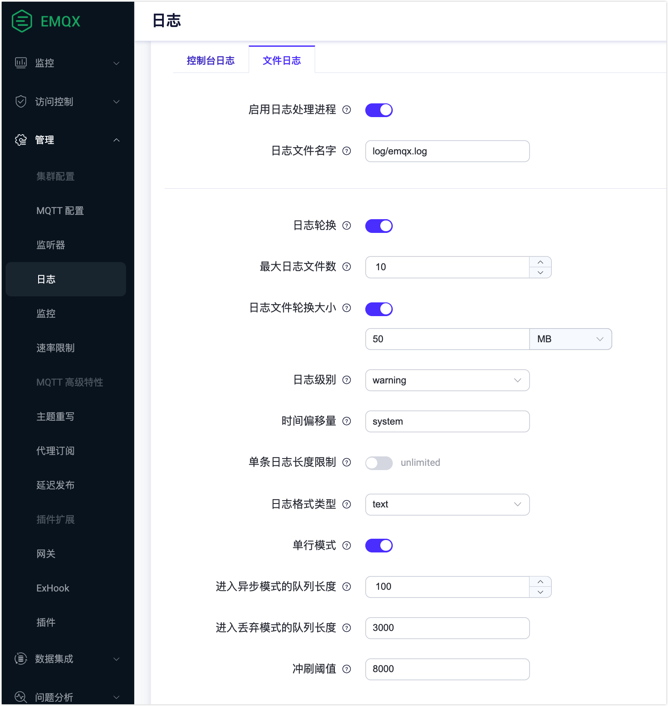
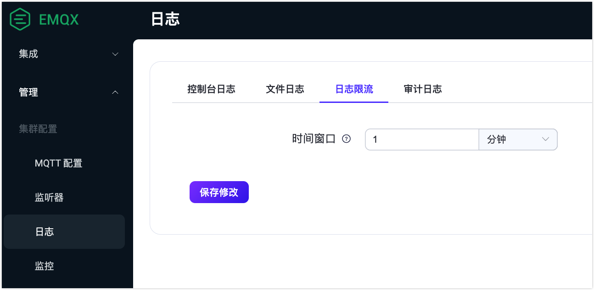

# 日志

通过 EMQX 的日志功能，您可查看客户端访问、操作系统或网络异常等问题，如登录错误，异常访问，性能故障等等，并基于日志信息进行问题排查或系统性能优化。

EMQX 支持两种不同的日志输出方式：控制台输出日志和文件输出日志。您可以根据需要选择输出方式或同时启用这两种方式。将日志数据输出到控制台或命令行界面通常在开发和调试过程中使用，这样开发人员能实时快速查看EMQX运行时的日志数据。将日志数据输出到文件通常在生产环境中使用，随着时间进展、日志数据能够被持久化以便进行分析和故障排除。

系统的默认日志处理行为可以通过环境变量 `EMQX_DEFAULT_LOG_HANDLER` 来配置，该环境变量接受以下设置：

- `file`: 将日志输出定向到文件。
- `console`: 将日志输出传送到控制台。

环境变量 `EMQX_DEFAULT_LOG_HANDLER` 默认为 `console`，但当通过 systemd 的 emqx.service 文件启动 EMQX 时，会显式设置为 `file`。

为避免日志数据过多或日志写入过慢等问题，EMQX 默认开启了过载保护机制，以确保正常业务不被日志影响。

## 日志级别

EMQX 日志包含 8 个等级 ([RFC 5424](https://www.ietf.org/rfc/rfc5424.txt))，默认为 warning 级别，由低到高分别为：

```bash
debug < info < notice < warning < error < critical < alert < emergency
```

下面的表格描述了每个日志级别的含义和输出内容。

| 日志级别  | 含义                                                         | 输出内容                                                     |
| --------- | ------------------------------------------------------------ | ------------------------------------------------------------ |
| debug     | 调试级别的日志，包含最详细的信息和调试数据。仅在需要进行详细调试时才使用此级别的日志。不建议在生产环境直接输出该级别日志，可以使用 [日志追踪](./tracer.md) 为指定客户端开启。 | 通常包含最详细的调试信息、变量值、函数调用栈等信息。         |
| info      | 提供有用的信息，比 debug 级别的日志更粗略                    | 如客户端连接、订阅、发布、QoS 等级别、消息传递等信息。       |
| notice    | 提供重要的系统信息，表示有事件发生但不需要采取行动。         | 例如，连接到代理服务器的客户端数量、重连次数、崩溃的节点数量等。 |
| warning   | 表示存在潜在的问题或错误，需要采取一定的行动； 此级别的日志通常用于发现问题和错误之前的预警。 | 连接断开、连接超时、认证失败等情况。                         |
| error     | 表示出现了错误，需要进行错误处理；此级别的日志通常用于标记错误，以便管理员可以快速检测和解决问题 | 无法连接到外部数据库、订阅的主题不存在、未能解析配置文件等。 |
| critical  | 表示出现了严重错误，导致系统崩溃或无法继续工作；此级别的日志通常用于标记严重问题，以便管理员可以尽快采取行动。 | 代理服务器崩溃、数据库无法访问等。                           |
| alert     | 表示需要立即采取行动，以防止进一步的损失；此级别的日志记录将触发警报通知操作，并且可能导致应用程序的停止。 | 例如，应用程序已达到关键阈值，例如磁盘空间或内存耗尽，或关键系统进程已崩溃或停止响应。 |
| emergency | 导致系统无法继续运行的严重错误；这种级别的日志通常只会在极少数情况下出现，并且需要立即对其进行处理。 | 例如，EMQX 节点间数据同步失败                                |

## 通过 Dashboard 修改日志配置

本节将主要介绍如何通过 EMQX Dashboard 修改日志配置。保存修改后将立即生效，无需重启节点。

点击左侧导航栏的 **管理**-> **日志**。选择相应的页签配置控制台输出日志或文件输出日志。

### 控制台输出日志

在**日志**页面，选择**控制台日志**页签。


配置控制台日志处理进程的选项：

- **启用日志处理进程**：单击切换开关以启用控制台日志处理进程。
- **日志级别**：从下拉列表中选择要使用的日志级别。可选值为：`debug`, `info`, `notice`, `warning`, `error`, `critical`, `alert`, `emergency` 。默认值为：`warning`。
- **日志格式类型**：从下拉列表中选择日志格式。可选值为：`text` 和 `json`。默认值为 `text`。
- **时间偏移量**：定义日志中时间戳的格式。默认情况下为 `system`。

完成配置后，点击 **保存更改**。

### 文件输出日志

在**日志**页面，选择**文件日志**页签。



配置文件日志处理进程的选项：

- **启用日志处理进程**：单击切换开关以启用文件日志处理进程。
- **日志文件名字**：填写日志文件的名称。默认为`log/emqx.log`。
- **最大日志文件数**：轮换的最大日志文件数。默认值为`10`。
- **日志文件轮换大小**：设置日志文件大小，达到设定的值时日志文件将进行轮换。如果禁用，则日志文件将无限增长。可在文本框输入设定的值，在下拉列表中选择单位，可选值为：`MB`, `GB`, `KB`。
- **日志级别**：从下拉列表中选择要使用的日志级别。可选值为：`debug`, `info`, `notice`, `warning`, `error`, `critical`, `alert`, `emergency` 。默认值为：`warning`。
- **日志格式类型**：从下拉列表中选择日志格式。可选值为：`text` 和 `json`。默认值为 `text`。
- **时间偏移量**：定义日志中时间戳的格式。默认情况下为 `system`。

完成配置后，点击**保存修改**。

在文件日志启用后，日志目录下会有如下几种文件:

- **emqx.log.N:** 以 emqx.log 为前缀的文件为日志文件，包含了 EMQX 的所有日志消息。比如 `emqx.log.1`、`emqx.log.2` ...
- **emqx.log.siz 和 emqx.log.idx:** 用于记录日志滚动信息的系统文件，**请不要手动修改**。
- **run_erl.log:** 以 `emqx start` 方式后台启动 EMQX 时，用于记录启动信息的系统文件。
- **erlang.log.N:** 以 erlang.log 为前缀的文件为日志文件，是以 `emqx start` 方式后台启动 EMQX 时，控制台日志的副本文件。比如 `erlang.log.1`、`erlang.log.2` ...

## 通过配置文件修改日志配置

您可通过 EMQX Dashboard 或者配置文件修改日志配置。比如，如果您想要将级别为 warning 的日志输出到日志文件和控制台，您可以在 `emqx.conf` 文件中修改 `log` 下的配置项，参见下面示例。重启节点后配置生效。

```bash
log {
  file {
    enable = true
    level = warning
    file = "/var/log/emqx/emqx.log"
    routation_count = 10
    routation_size = 50MB
    formatter = text
  }
  console {
    enable = true
    level = warning
    formatter = text
  }
}
```

## 日志格式

日志消息的格式为（各个字段之间用空格分隔）：

```
**date time level key-value-struct**
```

其中：

- **date-time:** 当地时间的日期。格式为：`RFC3339`
- **level:** 日志级别，使用中括号包裹。格式为：`[Level]`
- **flat log-content**：扁平化日志消息内容。

### 日志消息举例 1：

```bash
2022-06-30T16:07:47.689512+08:00 [debug] clientid: test, line: 792, mfa: emqx_connection:handle_incoming/2, msg: mqtt_packet_received, packet: PINGREQ(Q0, R0, D0), payload: [], peername: 127.0.0.1:64391, tag: MQTT
```

此日志消息里各个字段分别为:

- **datetime:** `2022-06-30T15:59:19.438914+08:00`
- **level:** `[debug]`
- **flat log-content:** `clientid: test, line: 792, mfa: emqx_connection:handle_incoming/2, msg: mqtt_packet_received, packet: PINGREQ(Q0, R0, D0), payload: [], peername: 127.0.0.1:64391, tag: MQTT`

这条日志表示 EMQX 在 `2022-06-30T16:07:47.689512+08:00` 时 Client ID 为 `test` 客户端收到了一个 `PINGREQ(Q0,R0,D0)` 包。对应客户端的 IP 为 `127.0.0.1:64391`。

### 日志消息举例 2：

```bash
2022-06-30T16:25:32.446873+08:00 [debug] line: 150, mfa: emqx_retainer_mnesia:store_retained/2, msg: message_retained, topic: $SYS/brokers/emqx@127.0.0.1/sysdescr
```

此日志消息里各个字段分别为:

- **date-time:** `2022-06-30T16:25:32.446873+08:00`
- **level:** `[debug]`
- **flat log-content:** `line: 150, mfa: emqx_retainer_mnesia:store_retained/2, msg: message_retained, topic: $SYS/brokers/emqx@127.0.0.1/sysdescr`

## 日志限流

日志限流功能可以通过限制指定时间窗口内重复事件的记录来减少日志溢出的风险。通过仅记录第一个事件并在此窗口内抑制后续相同事件的记录，日志管理能够变得更加高效，同时不牺牲可观测性。

您可以在 Dashboard 中配置限流时间窗口：选择左侧菜单中的**管理**->**日志**，并点击**日志限流**页签。默认的时间窗口设置为1分钟，最小允许值为1秒。



您也可以直接在配置文件中配置限流时间窗口：

```bash
log {
  throttling {
    time_window = "5m"
  }
}
```

日志限流默认启用，并适用于选定的日志事件，如授权失败或消息队列溢出等。然而，当 `console` 或 `file` 的日志级别设置为调试时，将禁用限制，以确保详细记录以便进行故障排除。

限流仅应用于以下日志事件：

- "authentication_failure"
- "authorization_permission_denied"
- "cannot_publish_to_topic_due_to_not_authorized"
- "cannot_publish_to_topic_due_to_quota_exceeded"
- "connection_rejected_due_to_license_limit_reached"
- "dropped_msg_due_to_mqueue_is_full"

::: tip 注意 

受限事件列表可能会更新。 

:::

如果在一个时间窗口内有事件被限流，一条摘要警告消息将记录每种类型丢弃事件的计数。例如，如果在一个窗口期内发生5次未授权的订阅尝试，将记录以下事件：

```yaml
2024-03-13T15:45:11.707574+02:00 [warning] clientid: test, msg: authorization_permission_denied, peername: 127.0.0.1:54870, username: test, topic: t/#, action: SUBSCRIBE(Q0), source: file
2024-03-13T15:45:53.634909+02:00 [warning] msg: log_events_throttled_during_last_period, period: 1 minutes, 0 seconds, dropped: #{authorization_permission_denied => 4}
```

您可以看到，第一个 "authorization_permission_denied" 事件被完整记录。接下来的4个类似事件被丢弃，但在 "log_events_throttled_during_last_period" 统计中记录了它们的数量。
