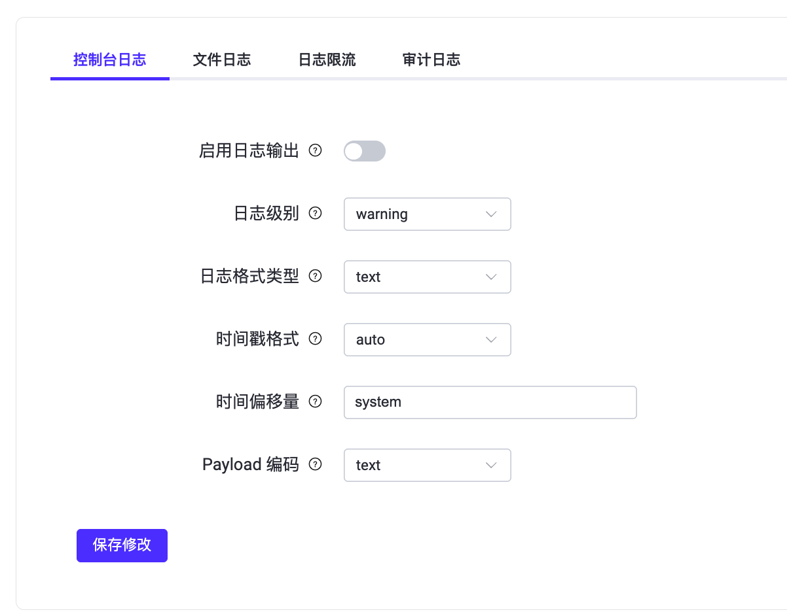
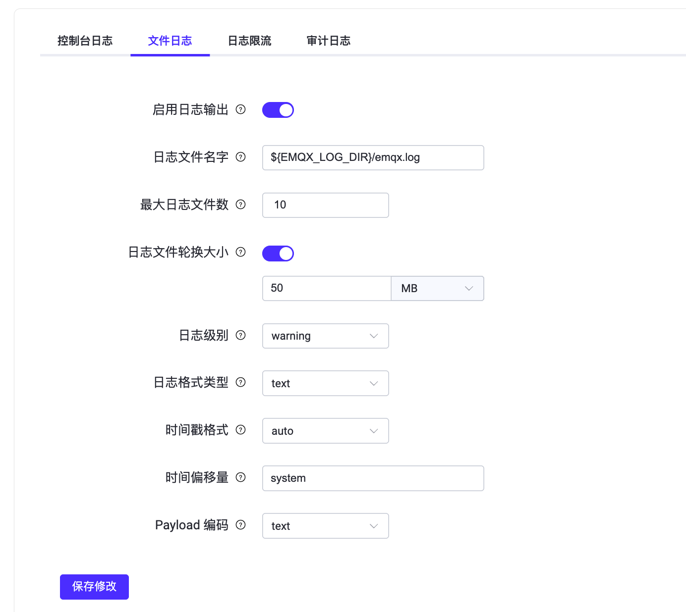
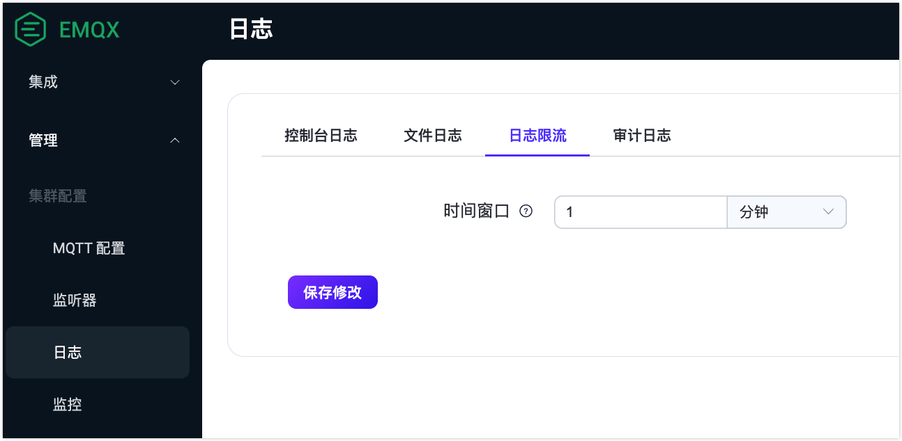

# 日志

通过 EMQX 的日志功能，您可查看客户端访问、操作系统或网络异常等问题，如登录错误，异常访问，性能故障等等，并基于日志信息进行问题排查或系统性能优化。

EMQX 支持两种不同的日志输出方式：控制台输出日志和文件输出日志。您可以根据需要选择输出方式或同时启用这两种方式。将日志数据输出到控制台或命令行界面通常在开发和调试过程中使用，这样开发人员能实时快速查看EMQX运行时的日志数据。将日志数据输出到文件通常在生产环境中使用，随着时间进展、日志数据能够被持久化以便进行分析和故障排除。

系统的默认日志处理行为可以通过环境变量 `EMQX_DEFAULT_LOG_HANDLER` 来配置，该环境变量接受以下设置：

- `file`: 将日志输出定向到文件。
- `console`: 将日志输出传送到控制台。

环境变量 `EMQX_DEFAULT_LOG_HANDLER` 默认为 `console`，但当通过 systemd 的 emqx.service 文件启动 EMQX 时，会显式设置为 `file`。

为避免日志数据过多或日志写入过慢等问题，EMQX 默认开启了过载保护机制，以确保正常业务不被日志影响。

## 日志级别

EMQX 日志包含 8 个等级中的 6 个常用级别 ([RFC 5424](https://www.ietf.org/rfc/rfc5424.txt))，默认为 warning 级别，由低到高分别为：

```bash
debug < info < notice < warning < error < critical
```

下面的表格描述了每个日志级别的含义和输出内容。

| 日志级别  | 含义                                                         | 输出内容                                                     |
| --------- | ------------------------------------------------------------ | ------------------------------------------------------------ |
| debug     | 调试级别的日志，包含最详细的信息和调试数据。仅在需要进行详细调试时才使用此级别的日志。不建议在生产环境直接输出该级别日志，可以使用 [日志追踪](./tracer.md) 为指定客户端开启。 | 通常包含最详细的调试信息、变量值、函数调用栈等信息。         |
| info      | 提供有用的信息，比 debug 级别的日志更粗略                    | 授权拒绝等轻微异常，以及管理操作的结果，例如成功的配置更改。 |
| notice    | 提供重要的系统信息，表示有事件发生但不需要采取行动。         | 例如，连接到代理服务器的客户端数量、重连次数、崩溃的节点数量等。 |
| warning   | 表示存在潜在的问题或错误，需要采取一定的行动； 此级别的日志通常用于发现问题和错误之前的预警。 | 连接断开、连接超时、认证失败等情况。                         |
| error     | 表示出现了错误，需要进行错误处理；此级别的日志通常用于标记错误，以便管理员可以快速检测和解决问题 | 无法连接到外部数据库、订阅的主题不存在、未能解析配置文件等。 |
| critical  | 表示出现了严重错误，导致系统崩溃或无法继续工作；此级别的日志通常用于标记严重问题，以便管理员可以尽快采取行动。 | 组件无法正常启动或运行，原因可能是配置不正确。               |

::: warning 重要提示

连接日志和报文解析错误日志中的原始 MQTT 报文数据默认会被脱敏。如需临时记录原始报文数据用于故障诊断，可在对应监听器的 `allow_log_packet_data_from` 配置项中添加可信客户端 IP 地址或 CIDR 范围。该配置可能暴露凭据和其他敏感信息，仅应在诊断期间为可信客户端启用。

:::

## 通过 Dashboard 修改日志配置

本节将主要介绍如何通过 EMQX Dashboard 修改日志配置。保存修改后将立即生效，无需重启节点。

点击左侧导航栏的 **管理**-> **日志**。选择相应的页签配置控制台输出日志或文件输出日志。

### 控制台输出日志

在**日志**页面，选择**控制台日志**页签。



配置控制台日志处理进程的选项：

- **启用日志处理进程**：单击切换开关以启用控制台日志处理进程。
- **日志级别**：从下拉列表中选择要使用的日志级别。可选值为：`debug`, `info`, `notice`, `warning`, `error`, `critical` 。默认值为：`warning`。
- **日志格式类型**：从下拉列表中选择日志格式。可选值为：`text` 和 `json`。默认值为 `text`。
- **时间戳格式**：从下拉列表中选择日志时间戳格式。可选值为：
  - `auto`: 根据所使用的日志格式类型自动确定时间戳格式。对于文本格式类型，使用 `rfc3339` 格式；对于 JSON 格式类型，则使用 `epoch`格式。
  - `epoch`: 时间戳以微秒精度的 Unix 纪元时间格式表示。
  - `rfc3339`: 时间戳使用符合 RFC3339 标准的日期时间字符串格式，格式示例为 `2024-03-26T11:52:19.777087+00:00`。

- **时间偏移量**：定义日志中时间相对 UTC 的偏移量，默认情况下跟随系统，默认值为 `system`。

完成配置后，点击 **保存更改**。

### 文件输出日志

在**日志**页面，选择**文件日志**页签。



配置文件日志处理进程的选项：

- **启用日志处理进程**：单击切换开关以启用文件日志处理进程。
- **日志文件名字**：填写日志文件的名称。默认为`log/emqx.log`。
- **最大日志文件数**：轮换的最大日志文件数。默认值为`10`。
- **日志文件轮换大小**：设置日志文件大小，达到设定的值时日志文件将进行轮换。如果禁用，则日志文件将无限增长。可在文本框输入设定的值，在下拉列表中选择单位，可选值为：`MB`, `GB`, `KB`。
- **日志级别**：从下拉列表中选择要使用的日志级别。可选值为：`debug`, `info`, `notice`, `warning`, `error`, `critical` 。默认值为：`warning`。
- **日志格式类型**：从下拉列表中选择日志格式。可选值为：`text` 和 `json`。默认值为 `text`。
- **时间戳格式**：从下拉列表中选择日志时间戳格式。可选值为：
  - `auto`: 根据所使用的日志格式类型自动确定时间戳格式。对于文本格式类型，使用 `rfc3339` 格式；对于 JSON 格式类型，则使用 `epoch`格式。
  - `epoch`: 时间戳以微秒精度的 Unix 纪元时间格式表示。
  - `rfc3339`: 时间戳使用符合 RFC3339 标准的日期时间字符串格式，格式示例为 `2024-03-26T11:52:19.777087+00:00`。
- **时间偏移量**：定义日志中时间相对 UTC 的偏移量，默认情况下跟随系统，默认值为 `system`。

完成配置后，点击**保存修改**。

在文件日志启用后，日志目录下会有如下几种文件:

- **emqx.log.N:** 以 emqx.log 为前缀的文件为日志文件，包含了 EMQX 的所有日志消息。比如 `emqx.log.1`、`emqx.log.2` ...
- **emqx.log.siz 和 emqx.log.idx:** 用于记录日志滚动信息的系统文件，**请不要手动修改**。

## 通过配置文件修改日志配置

您可通过 EMQX Dashboard 或者配置文件修改日志配置。比如，如果您想要将级别为 warning 的日志输出到日志文件和控制台，您可以在 `emqx.conf` 文件中修改 `log` 下的配置项，参见下面示例。重启节点后配置生效。

```bash
log {
  file {
    enable = true
    level = warning
    file = "/var/log/emqx/emqx.log"
    routation_count = 10
    routation_size = 50MB
    formatter = text
  }
  console {
    level = warning
    formatter = text
  }
}
```

## 日志格式

日志消息的格式为（各个字段之间用空格分隔）：

```
**timestamp level tag clientid msg peername username ...**
```

其中

- **timestamp（时间戳）**：采用 RFC-3339 格式的时间戳，指明日志条目创建的时间。
- **level（级别）**：日志的严重性级别，用括号包裹。格式为：`[level]`，其中 `level` 是标准的日志级别，如 `info`（信息）、`warning`（警告）、`error`（错误）等。
- **tag（标签）**：必填项，一个全大写的单词，用于对日志进行分类，以简化搜索和分析。例如 `MQTT`、`AUTHN`（认证）、`AUTHZ`（授权）。
- **clientid（客户端ID）**：仅当日志与特定客户端相关时包含。标识与日志条目相关的客户端。
- **username（用户名）**：仅针对具有指定用户名的客户端相关的日志。指出涉及的客户端的用户名。
- **peername（对端名称）**：客户端源 IP 地址和端口号，采用 `IP:端口` 格式，指示连接的来源。
- **msg（消息）**：日志消息的内容。为了提高可搜索性和可读性，大多数消息采用 `snake_case` 格式，如 `mqtt_packet_received`（接收到MQTT包）。注意：不是所有消息都遵循此格式；有些可能会有所不同。
- **...（其他）**：在 `msg` 字段之后，可能会跟随额外的任意字段，根据需要提供更多上下文或细节。


### 日志消息举例

```bash
2024-03-20T11:08:39.568980+01:00 [warning] tag: AUTHZ, clientid: client1, msg: cannot_publish_to_topic_due_to_not_authorized, peername: 127.0.0.1:47860, username: user1, topic: republish-event/1, reason: not_authorized
```

## 日志限流

日志限流功能可以通过限制指定时间窗口内重复事件的记录来减少日志溢出的风险。通过仅记录第一个事件并在此窗口内抑制后续相同事件的记录，日志管理能够变得更加高效，同时不牺牲可观测性。

您可以在 Dashboard 中配置限流时间窗口：选择左侧菜单中的**管理**->**日志**，并点击**日志限流**页签。默认的时间窗口设置为1分钟，最小允许值为1秒。



您也可以直接在配置文件中配置限流时间窗口：

```bash
log {
  throttling {
    time_window = "5m"
  }
}
```

日志限流默认启用，并适用于选定的日志事件，如授权失败或消息队列溢出等。然而，当 `console` 或 `file` 的日志级别设置为调试时，将禁用限制，以确保详细记录以便进行故障排除。

限流仅应用于以下日志事件：

- "authentication_failure"
- "authorization_permission_denied"
- "cannot_publish_to_topic_due_to_not_authorized"
- "cannot_publish_to_topic_due_to_quota_exceeded"
- "connection_rejected_due_to_license_limit_reached"
- "data_bridge_buffer_overflow"
- "dropped_msg_due_to_mqueue_is_full"
- "dropped_qos0_msg"
- "external_broker_crashed"
- "failed_to_fetch_crl"
- "failed_to_retain_message"
- "handle_resource_metrics_failed"
- "retain_failed_for_payload_size_exceeded_limit"
- "retain_failed_for_rate_exceeded_limit"
- "retained_delete_failed_for_rate_exceeded_limit"
- "socket_receive_paused_by_rate_limit"
- "transformation_failed"
- "unrecoverable_resource_error"
- "validation_failed"

::: tip 注意

受限事件列表可能会更新。

:::

如果在一个时间窗口内有事件被限流，一条摘要警告消息将记录每种类型丢弃事件的计数。例如，如果在一个窗口期内发生5次未授权的订阅尝试，将记录以下事件：

```yaml
2024-03-13T15:45:11.707574+02:00 [warning] clientid: test, msg: authorization_permission_denied, peername: 127.0.0.1:54870, username: test, topic: t/#, action: SUBSCRIBE(Q0), source: file
2024-03-13T15:45:53.634909+02:00 [warning] msg: log_events_throttled_during_last_period, period: 1 minutes, 0 seconds, dropped: #{authorization_permission_denied => 4}
```

您可以看到，第一个 "authorization_permission_denied" 事件被完整记录。接下来的4个类似事件被丢弃，但在 "log_events_throttled_during_last_period" 统计中记录了它们的数量。

## 在生产环境中集中收集日志

在生产环境中，将每个 EMQX 节点的日志发送到 EMQX 集群外部的集中式系统。仅保存在 broker 主机上的日志可能会在节点或存储故障后无法访问。集中收集日志还可以关联来自核心节点和复制节点的事件，并针对指标或内置告警未覆盖的情况触发告警。

### 选择收集方式

使用以下一种日志收集方式：

- 在 Kubernetes 等容器化部署中，将 JSON 日志写入控制台，并使用平台的日志 agent 收集容器输出。
- 对于文件日志，使用日志 agent 收集 `emqx.log.N` 文件，在轮转期间避免重复采集，并保留结构化字段。
- 使用 [OpenTelemetry 日志处理器](./opentelemetry/logs.md)，将日志导出到 OpenTelemetry Collector 和兼容的后端。

### 添加上下文并保护日志

在收集链路中添加集群、节点、节点角色、EMQX 版本和可用区等部署元数据。

像保护其他运维数据一样保护集中存储的日志。日志字段可能包含客户端 ID、用户名、主题、对端地址和错误详情。

### 监控日志收集链路

使用收集器和传输组件的健康指标，或者不依赖应用日志量的显式心跳，监控日志收集链路。为以下情况配置告警：

- 收集器或传输组件处于不健康状态。
- 收集器或传输组件拒绝或丢弃记录。
- 集中式后端接近存储限制。

不要仅因可访问的 EMQX 节点没有产生日志而触发告警。空闲或健康节点在配置的日志级别下可能没有需要报告的内容。

### 定义日志告警策略

选择性地创建日志告警，并匹配 `level` 和 `msg` 等稳定的结构化字段。

- **warning 事件：**这类事件通常可用作预警信号，但部分事件可能由预期的客户端行为引起。当单个事件不需要处理时，请根据发生率或相对于正常基线的偏差触发告警。
- **error 或 critical 事件：**如果事件表明复制、配置同步、监听器启动或持久存储发生故障，通常应立即触发告警。

有关建议的指标和日志告警，包括 Mria 复制信号，请参阅[生产监控最佳实践](./monitoring-best-practices.md#集中收集日志并选择性告警)。
