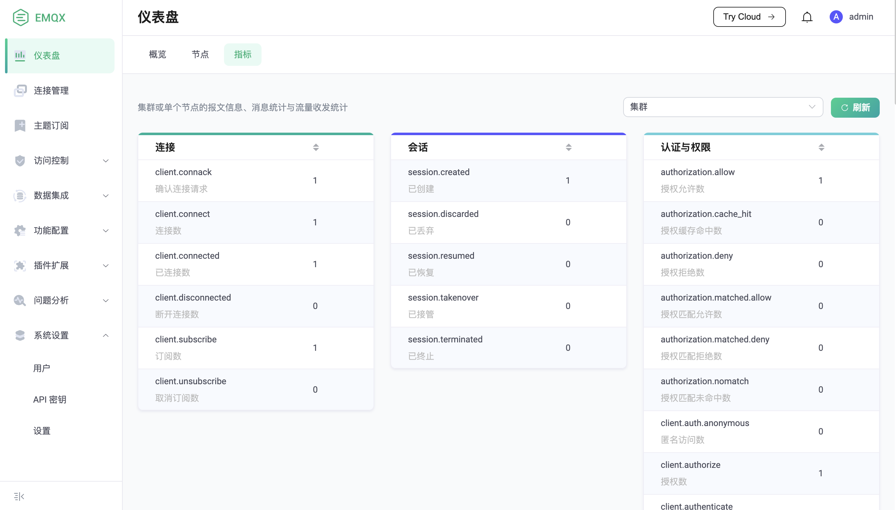

# 指标

EMQX 为用户提供了丰富的指标来帮助用户与因为人员了解当前服务状态，监测和排除系统的性能问题。

EMQX 为用户提供了指标获取方式：

1. 最直接的，用户可以在 EMQX Dashboard 的 **仪表盘** -> **指标** 页面看到这些数据。

如果不方便访问 Dashboard，你还可以通过 HTTP API 和系统主题消息来获取这些数据，参见 [HTTP API](../admin/api.md) 与 [$SYS 系统主题](../advanced/system-topic.md)。

## 与监控系统集成

EMQX 指标支持与 [Prometheus]((./prometheus.md) ) 以及 [StatsD](./statsd.md) 集成。使用第三方监控系统对 EMQX 进行监控有如下好处：

- 可以将 EMQX 的监控数据与其他系统的监控数据进行整合，形成一个完整的监控系统，如监控服务器主机的相关信息；
- 可以使用更加丰富的监控图表，更直观地展示监控数据，如使用 Grafana 的仪表盘；
- 可以使用更加丰富的告警方式，更及时地发现问题，如使用 Prometheus 的 Alertmanager。

## 指标对照手册

EMQX 将指标分为了 Metrics 与 Stats 两种。

- Metrics 通常指那些只会单调递增的数据，例如发送字节数量、发送报文数量。EMQX 目前提供的 Metrics 覆盖了字节、报文、消息和事件四个维度。

- Stats 则通常指那些成对出现的数据，包括当前值和历史最大值，例如当前订阅数量和订阅历史最大数量。

### Metrics

#### 字节 (Bytes)

| Key            | Data Type | Description  |
| -------------- | --------- | ------------ |
| bytes.received | Integer   | 已接收字节数 |
| bytes.sent     | Integer   | 已发送字节数 |

#### 报文 (Packets)

| Key                          | Data Type | Description                                                                                     |
| ---------------------------- | --------- | ----------------------------------------------------------------------------------------------- |
| packets.received             | Integer   | 接收的报文数量                                                                                  |
| packets.sent                 | Integer   | 发送的报文数量                                                                                  |
| packets.connect.received     | Integer   | 接收的 CONNECT 报文数量                                                                         |
| packets.connack.auth_error   | Integer   | 发送的原因码为 0x86 和 0x87 的 CONNACK 报文数量                                                 |
| packets.connack.error        | Integer   | 发送的原因码不为 0x00 的 CONNACK 报文数量，此指标的值大于等于 `packets.connack.auth_error` 的值 |
| packets.connack.sent         | Integer   | 发送的 CONNACK 报文数量                                                                         |
| packets.publish.received     | Integer   | 接收的 PUBLISH 报文数量                                                                         |
| packets.publish.sent         | Integer   | 发送的 PUBLISH 报文数量                                                                         |
| packets.publish.inuse        | Integer   | 接收的报文标识符已被占用的 PUBLISH 报文数量                                                     |
| packets.publish.auth_error   | Integer   | 接收的未通过 ACL 检查的 PUBLISH 报文数量                                                        |
| packets.publish.error        | Integer   | 接收的无法被发布的 PUBLISH 报文数量                                                             |
| packets.publish.dropped      | Integer   | 超出接收限制而被丢弃的 PUBLISH 报文数量                                                         |
| packets.puback.received      | Integer   | 接收的 PUBACK 报文数量                                                                          |
| packets.puback.sent          | Integer   | 发送的 PUBACK 报文数量                                                                          |
| packets.puback.inuse         | Integer   | 接收的报文标识符已被占用的 PUBACK 报文数量                                                      |
| packets.puback.missed        | Integer   | 接收的未知报文标识符 PUBACK 报文数量                                                            |
| packets.pubrec.received      | Integer   | 接收的 PUBREC 报文数量                                                                          |
| packets.pubrec.sent          | Integer   | 发送的 PUBREC 报文数量                                                                          |
| packets.pubrec.inuse         | Integer   | 接收的报文标识符已被占用的 PUBREC 报文数量                                                      |
| packets.pubrec.missed        | Integer   | 接收的未知报文标识符 PUBREC 报文数量                                                            |
| packets.pubrel.received      | Integer   | 接收的 PUBREL 报文数量                                                                          |
| packets.pubrel.sent          | Integer   | 发送的 PUBREL 报文数量                                                                          |
| packets.pubrel.missed        | Integer   | 接收的未知报文标识符 PUBREL 报文数量                                                            |
| packets.pubcomp.received     | Integer   | 接收的 PUBCOMP 报文数量                                                                         |
| packets.pubcomp.sent         | Integer   | 发送的 PUBCOMP 报文数量                                                                         |
| packets.pubcomp.inuse        | Integer   | 接收的报文标识符已被占用的 PUBCOMP 报文数量                                                     |
| packets.pubcomp.missed       | Integer   | 发送的 PUBCOMP 报文数量                                                                         |
| packets.subscribe.received   | Integer   | 接收的 SUBSCRIBE 报文数量                                                                       |
| packets.subscribe.error      | Integer   | 接收的订阅失败的 SUBSCRIBE 报文数量                                                             |
| packets.subscribe.auth_error | Integer   | 接收的未通过 ACL 检查的 SUBACK 报文数量                                                         |
| packets.suback.sent          | Integer   | 发送的 SUBACK 报文数量                                                                          |
| packets.unsubscribe.received | Integer   | 接收的 UNSUBSCRIBE 报文数量                                                                     |
| packets.unsubscribe.error    | Integer   | 接收的取消订阅失败的 UNSUBSCRIBE 报文数量                                                       |
| packets.unsuback.sent        | Integer   | 发送的 UNSUBACK 报文数量                                                                        |
| packets.pingreq.received     | Integer   | 接收的 PINGREQ 报文数量                                                                         |
| packets.pingresp.sent        | Integer   | 发送的 PUBRESP 报文数量                                                                         |
| packets.disconnect.received  | Integer   | 接收的 DISCONNECT 报文数量                                                                      |
| packets.disconnect.sent      | Integer   | 发送的 DISCONNECT 报文数量                                                                      |
| packets.auth.received        | Integer   | 接收的 AUTH 报文数量                                                                            |
| packets.auth.sent            | Integer   | 发送的 AUTH 报文数量                                                                            |

#### 消息 (PUBLISH 报文)

| Key                                   | Data Type | Description                                                                                                        |
| ------------------------------------- | --------- | ------------------------------------------------------------------------------------------------------------------ |
| delivery.dropped.too_large            | Integer   | 发送时由于长度超过限制而被丢弃的消息数量                                                                           |
| delivery.dropped.queue_full           | Integer   | 发送时由于消息队列满而被丢弃的 QoS 不为 0 的消息数量                                                               |
| delivery.dropped.qos0_msg             | Integer   | 发送时由于消息队列满而被丢弃的 QoS 为 0 的消息数量                                                                 |
| delivery.dropped.expired              | Integer   | 发送时由于消息过期而被丢弃的消息数量                                                                               |
| delivery.dropped.no_local             | Integer   | 发送时由于 `No Local` 订阅选项而被丢弃的消息数量                                                                   |
| delivery.dropped                      | Integer   | 发送时丢弃的消息总数                                                                                               |
| messages.delayed                      | Integer   | EMQX 存储的延迟发布的消息数量                                                                                      |
| messages.delivered                    | Integer   | EMQX 内部转发到订阅进程的消息数量                                                                                  |
| messages.dropped                      | Integer   | EMQX 内部转发到订阅进程前丢弃的消息总数                                                                            |
| messages.dropped.no_subscribers       | Integer   | 由于没有订阅者而被丢弃的消息数量                                                                                   |
| messages.dropped.await_pubrel_timeout | Integer   | 由于等待 PUBREL 报文超时                                                                                           |
| messages.forward                      | Integer   | 向其他节点转发的消息数量                                                                                           |
| messages.publish                      | Integer   | 除系统消息外发布的消息数量                                                                                         |
| messages.qos0.received                | Integer   | 接收来自客户端的 QoS 0 消息数量                                                                                    |
| messages.qos1.received                | Integer   | 接收来自客户端的 QoS 1 消息数量                                                                                    |
| messages.qos2.received                | Integer   | 接收来自客户端的 QoS 2 消息数量                                                                                    |
| messages.qos0.sent                    | Integer   | 发送给客户端的 QoS 0 消息数量                                                                                      |
| messages.qos1.sent                    | Integer   | 发送给客户端的 QoS 1 消息数量                                                                                      |
| messages.qos2.sent                    | Integer   | 发送给客户端的 QoS 2 消息数量                                                                                      |
| messages.received                     | Integer   | 接收来自客户端的消息数量，等于 `messages.qos0.received`，`messages.qos1.received` 与 `messages.qos2.received` 之和 |
| messages.sent                         | Integer   | 发送给客户端的消息数量，等于 `messages.qos0.sent`，`messages.qos1.sent` 与 `messages.qos2.sent` 之和               |
| messages.acked                        | Integer   | 已经应答的消息数量                                                                                                 |

#### 事件

| Key                 | Data Type | Description                        |
| ------------------- | --------- | ---------------------------------- |
| client.connect      | Integer   | `client.connect` 钩子触发次数      |
| client.authenticate | Integer   | `client.authenticate` 钩子触发次数 |
| client.connack      | Integer   | `client.connack` 钩子触发次数      |
| client.connected    | Integer   | `client.connected` 钩子触发次数    |
| client.disconnected | Integer   | `client.disconnected` 钩子触发次数 |
| client.authorize    | Integer   | `client.authorize` 钩子触发次数    |
| client.subscribe    | Integer   | `client.subscribe` 钩子触发次数    |
| client.unsubscribe  | Integer   | `client.unsubscribe` 钩子触发次数  |
| session.created     | Integer   | `session.created` 钩子触发次数     |
| session.discarded   | Integer   | `session.discarded` 钩子触发次数   |
| session.resumed     | Integer   | `session.resumed` 钩子触发次数     |
| session.takenover   | Integer   | `session.takenover` 钩子触发次数   |
| session.terminated  | Integer   | `session.terminated` 钩子触发次数  |

#### 认证和授权

| Key                         | Data Type | Description                                                |
| --------------------------- | --------- | ---------------------------------------------------------- |
| authorization.allow         | Integer   | 授权总的通过次数（包括命中缓存，和规则未匹配时默认通过的） |
| authorization.deny          | Integer   | 总的拒绝授权次数（包括命中缓存，和规则未匹配时默认通过的） |
| authorization.matched.allow | Integer   | 由于匹配已有规则而授权通过的次数                           |
| authorization.matched.deny  | Integer   | 由于匹配已有规则而拒绝授权的次数                           |
| authorization.nomatch       | Integer   | 授权未匹配任何规则的次数                                   |
| authorization.cache_hit     | Integer   | 授权命中缓存的次数                                         |

### Stats

| Key                        | Data Type | Description                |
| -------------------------- | --------- | -------------------------- |
| connections.count          | Integer   | 当前连接数量               |
| connections.max            | Integer   | 连接数量的历史最大值       |
| live_connections.count     | Integer   | 当前活跃连接数量           |
| live_connections.max       | Integer   | 活跃连接历史最大值         |
| channels.count             | Integer   | 即 `sessions.count`        |
| channels.max               | Integer   | 即 `session.max`           |
| sessions.count             | Integer   | 当前会话数量               |
| sessions.max               | Integer   | 会话数量的历史最大值       |
| topics.count               | Integer   | 当前主题数量               |
| topics.max                 | Integer   | 主题数量的历史最大值       |
| suboptions.count           | Integer   | 即 `subscriptions.count`   |
| suboptions.max             | Integer   | 即 `subscriptions.max`     |
| subscribers.count          | Integer   | 当前订阅者数量             |
| subscribers.max            | Integer   | 订阅者数量的历史最大值     |
| subscriptions.count        | Integer   | 当前订阅数量，包含共享订阅 |
| subscriptions.max          | Integer   | 订阅数量的历史最大值       |
| subscriptions.shared.count | Integer   | 当前共享订阅数量           |
| subscriptions.shared.max   | Integer   | 共享订阅数量的历史最大值   |
| retained.count             | Integer   | 当前保留消息数量           |
| retained.max               | Integer   | 保留消息的历史最大值       |
| delayed.count              | Integer   | 当前延迟发布消息数量       |
| delayed.max                | Integer   | 延迟发布下行哦的历史最大值 |
