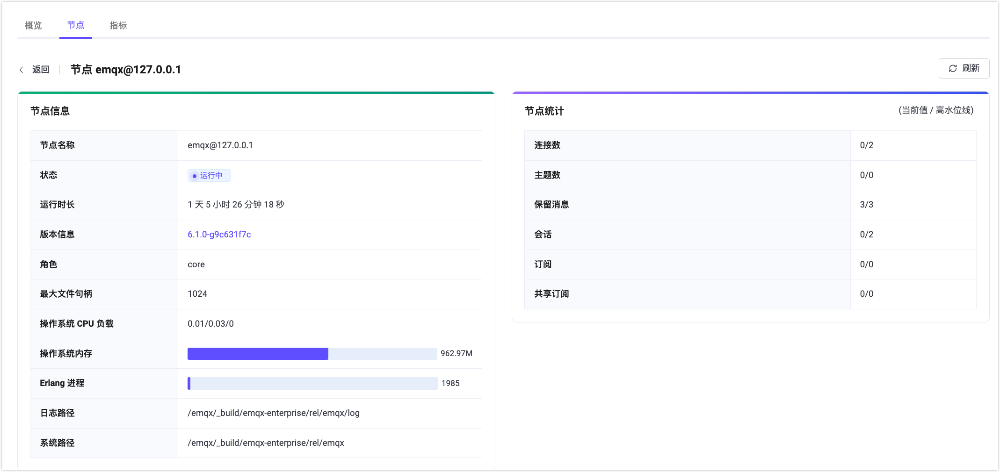
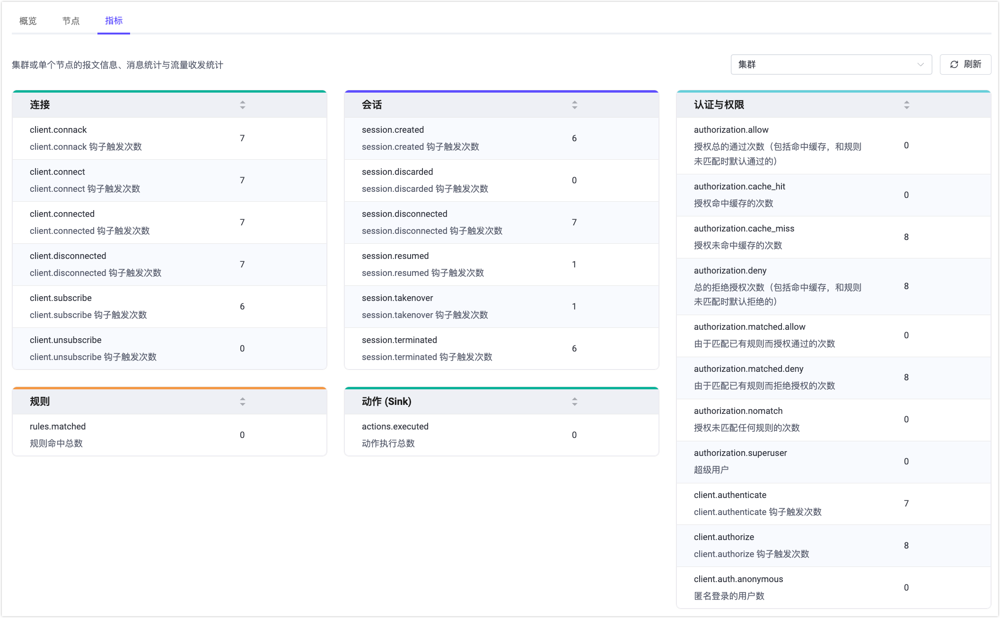
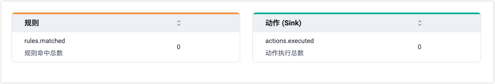
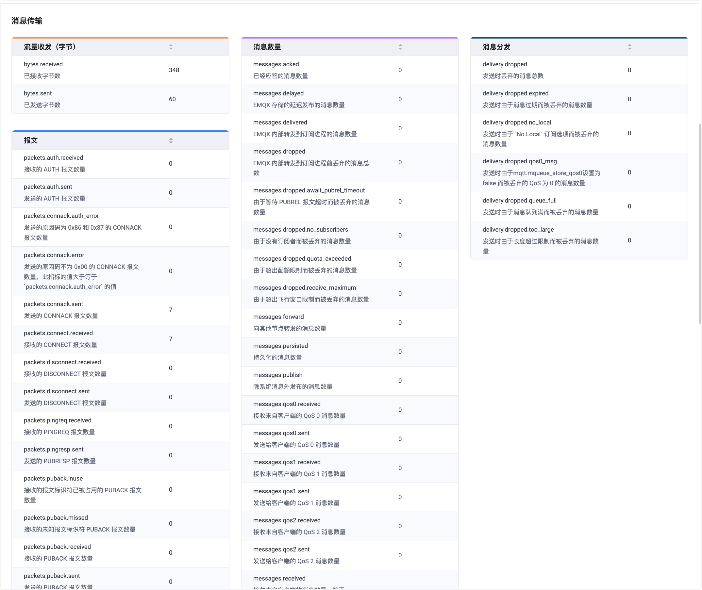
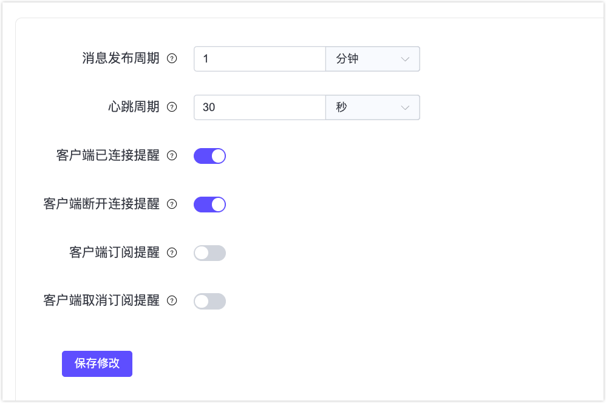

# 统计与指标

EMQX 提供了指标监控功能，运维人员可以基于这些指标监控当前服务状态，并排查可能出现的系统故障。

EMQX 将监控状态分为**统计（Statistics）** 和 **指标（Metrics）**两类。

- **统计**为整型 Gauge，用于返回请求指标时刻的单一数值。
- **指标**为整型 Counter，用于统计简单的递增或递减数值，例如已发送或接收的字节数、消息数等。

EMQX 为用户提供了多种方式来查看统计信息和指标数据。最直接的方式是通过 EMQX Dashboard 查看。当不方便访问 Dashboard 时，也可以通过 REST API 和系统主题获取相关数据。此外，你还可以将监控功能集成到自有监控系统中，详情参见[集成 Prometheus](./prometheus.md)。

## 在 Dashboard 上查看统计

在 EMQX Dashboard 中，点击左侧导航栏的 **监控** -> **集群概览**。点击**节点**标签页。点击节点名称，即可在右侧查看该节点的统计信息详情。

统计包含两类数值：当前值和历史最大值。例如：当前订阅数以及历史最大订阅数。

以下为 EMQX 提供的统计列表：

| 统计                       | 说明                         |
| -------------------------- | ---------------------------- |
| connections.count          | 当前连接数                   |
| connections.max            | 历史最大连接数               |
| live_connections.count     | 当前在线连接数               |
| live_connections.max       | 历史最大在线连接数           |
| channels.count             | 等同于 `sessions.count`      |
| channels.max               | 等同于 `sessions.max`        |
| sessions.count             | 当前会话数                   |
| sessions.max               | 历史最大会话数               |
| topics.count               | 当前主题数                   |
| topics.max                 | 历史最大主题数               |
| suboptions.count           | 等同于 `subscriptions.count` |
| suboptions.max             | 等同于 `subscriptions.max`   |
| subscribers.count          | 当前订阅者数量               |
| subscribers.max            | 历史最大订阅者数量           |
| subscriptions.count        | 当前订阅数量（包含共享订阅） |
| subscriptions.max          | 历史最大订阅数量             |
| subscriptions.shared.count | 当前共享订阅数量             |
| subscriptions.shared.max   | 历史最大共享订阅数量         |
| retained.count             | 当前保留消息数量             |
| retained.max               | 历史最大保留消息数量         |
| delayed.count              | 当前延迟消息数量             |
| delayed.max                | 历史最大延迟消息数量         |

## 在 Dashboard 上查看指标

在 EMQX Dashboard 中，点击左侧导航栏的**监控** -> **集群概览**。点击**指标**标签页，即可查看集群或指定节点的运行时指标。

EMQX 的指标以计数器（Counter）的形式实现，用于记录自节点启动以来某一类事件发生的累计次数。这些指标有助于运维人员观察系统行为、评估负载模式，并排查问题。

Dashboard 中的指标按以下类别进行分组：

- **连接与会话指标**：客户端连接、会话及访问控制相关事件
- **规则和动作（Sink）指标**：数据集成中的规则匹配与动作执行情况
- **消息指标**：字节、报文、消息及投递统计

### 连接与会话指标

该部分展示集群或节点级别的事件类指标，包括客户端连接、会话以及访问控制相关指标。

#### 连接

| 指标                | 说明                                               |
| ------------------- | -------------------------------------------------- |
| client.connack      | 客户端收到的连接确认（`CONNACK`）报文数量          |
| client.connect      | 客户端发起的连接请求数量，包括成功和失败的连接请求 |
| client.connected    | 成功建立的客户端连接数量                           |
| client.disconnected | 客户端断开连接的数量，包括主动断开和异常断开       |
| client.subscribe    | 成功的订阅次数                                     |
| client.unsubscribe  | 成功的取消订阅次数                                 |

#### 会话

| 指标               | 说明             |
| ------------------ | ---------------- |
| session.created    | 已创建的会话数量 |
| session.discarded  | 被丢弃的会话数量 |
| session.resumed    | 被恢复的会话数量 |
| session.takenover  | 被接管的会话数量 |
| session.terminated | 被终止的会话数量 |

#### 认证与权限

访问控制指标用于反映客户端的认证与授权行为，包括规则匹配情况以及缓存使用情况。

| 指标                        | 说明                                                         |
| --------------------------- | ------------------------------------------------------------ |
| authorization.allow         | 客户端授权通过的总次数，包括缓存命中和规则匹配通过的授权请求 |
| authorization.deny          | 客户端授权失败的总次数，包括缓存命中和规则未匹配的授权请求   |
| authorization.matched.allow | 根据授权规则允许的授权请求数量                               |
| authorization.matched.deny  | 根据授权规则拒绝的授权请求数量                               |
| authorization.nomatch       | 未匹配到任何授权规则的授权请求数量                           |
| authorization.cache_hit     | 从缓存中获取授权结果（允许或拒绝）的次数                     |
| authorization.superuser     | 被授权为超级用户的客户端数量                                 |
| client.auth.anonymous       | 以匿名方式登录的客户端数量                                   |
| client.authenticate         | 触发认证操作的次数                                           |
| client.authorize            | 触发授权操作的次数                                           |

### 规则与动作（Sink）

该部分提供与数据集成相关的指标，用于帮助了解规则被匹配的次数以及动作（Sink）被执行的情况。

这些指标可用于评估规则的有效性、监控下游数据流，以及分析整体数据集成的使用情况。

#### 规则

| 指标          | 说明                                             |
| ------------- | ------------------------------------------------ |
| rules.matched | 当消息或事件经过规则引擎时，规则被成功匹配的次数 |

#### 动作（Sink）

| 指标             | 说明                                       |
| ---------------- | ------------------------------------------ |
| actions.executed | 由于规则匹配而触发并执行的动作（Sink）次数 |

### 消息传输指标

在**指标**页面向下滚动，可以查看消息传输相关的指标，包括字节、报文、消息以及投递统计。

#### 消息收发（字节）

| 指标           | 说明           |
| -------------- | -------------- |
| bytes.received | 接收到的字节数 |
| bytes.sent     | 已发送的字节数 |

#### 报文

| 指标                         | 说明                                                         |
| ---------------------------- | ------------------------------------------------------------ |
| packets.received             | 接收到的报文数量                                             |
| packets.sent                 | 发送的报文数量                                               |
| packets.connect.received     | 接收到的 CONNECT 报文数量                                    |
| packets.connack.auth_error   | 发送的原因码为 0x86 和 0x87 的 CONNACK 报文数量              |
| packets.connack.error        | 发送的原因码不为 0x00 的 CONNACK 报文数量，该值大于或等于 `packets.connack.auth_error` |
| packets.connack.sent         | 发送的 CONNACK 报文数量                                      |
| packets.publish.received     | 接收到的 PUBLISH 报文数量                                    |
| packets.publish.sent         | 发送的 PUBLISH 报文数量                                      |
| packets.publish.inuse        | 接收到的报文标识符已被占用的 PUBLISH 报文数量                |
| packets.publish.auth_error   | ACL 校验失败的 PUBLISH 报文数量                              |
| packets.publish.error        | 无法发布的 PUBLISH 报文数量                                  |
| packets.puback.received      | 接收到的 PUBACK 报文数量                                     |
| packets.puback.sent          | 发送的 PUBACK 报文数量                                       |
| packets.puback.inuse         | 接收到的报文标识符已被占用的 PUBACK 报文数量                 |
| packets.puback.missed        | 接收到的未知标识符 PUBACK 报文数量                           |
| packets.pubrec.received      | 接收到的 PUBREC 报文数量                                     |
| packets.pubrec.sent          | 发送的 PUBREC 报文数量                                       |
| packets.pubrec.inuse         | 接收到的报文标识符已被占用的 PUBREC 报文数量                 |
| packets.pubrec.missed        | 接收到的未知标识符 PUBREC 报文数量                           |
| packets.pubrel.received      | 接收到的 PUBREL 报文数量                                     |
| packets.pubrel.sent          | 发送的 PUBREL 报文数量                                       |
| packets.pubrel.missed        | 接收到的未知标识符 PUBREL 报文数量                           |
| packets.pubcomp.received     | 接收到的 PUBCOMP 报文数量                                    |
| packets.pubcomp.sent         | 发送的 PUBCOMP 报文数量                                      |
| packets.pubcomp.inuse        | 接收到的报文标识符已被占用的 PUBCOMP 报文数量                |
| packets.pubcomp.missed       | 丢失的 PUBCOMP 报文数量                                      |
| packets.subscribe.received   | 接收到的 SUBSCRIBE 报文数量                                  |
| packets.subscribe.error      | 订阅失败的 SUBSCRIBE 报文数量                                |
| packets.subscribe.auth_error | ACL 校验失败的 SUBACK 报文数量                               |
| packets.suback.sent          | 发送的 SUBACK 报文数量                                       |
| packets.unsubscribe.received | 接收到的 UNSUBSCRIBE 报文数量                                |
| packets.unsubscribe.error    | 取消订阅失败的 UNSUBSCRIBE 报文数量                          |
| packets.unsuback.sent        | 发送的 UNSUBACK 报文数量                                     |
| packets.pingreq.received     | 接收到的 PINGREQ 报文数量                                    |
| packets.pingresp.sent        | 发送的 PINGRESP 报文数量                                     |
| packets.disconnect.received  | 接收到的 DISCONNECT 报文数量                                 |
| packets.disconnect.sent      | 发送的 DISCONNECT 报文数量                                   |
| packets.auth.received        | 接收到的 AUTH 报文数量                                       |
| packets.auth.sent            | 发送的 AUTH 报文数量                                         |

#### 消息数量

| 指标                                  | 说明                                                         |
| ------------------------------------- | ------------------------------------------------------------ |
| messages.acked                        | 已确认的消息数量                                             |
| messages.delayed                      | EMQX 存储的延迟发布消息数量                                  |
| messages.delivered                    | EMQX 内部转发至订阅处理流程的消息数量                        |
| messages.dropped                      | 在转发至订阅流程前被 EMQX 丢弃的消息总数                     |
| messages.dropped.no_subscribers       | 因无订阅者而被丢弃的消息数量                                 |
| messages.dropped.await_pubrel_timeout | 因等待 PUBREL 超时而被丢弃的消息数量                         |
| messages.dropped.quota_exceeded       | 因超出配额（通常是连接数限制）而被丢弃的消息数量             |
| messages.dropped.receive_maximum      | 因达到 Receive Maximum 限制而被丢弃的消息数量                |
| messages.forward                      | 转发至其他节点的消息数量                                     |
| messages.publish                      | 客户端发布的消息数量（不包含系统消息）                       |
| messages.qos0.received                | 接收到的 QoS 0 消息数量                                      |
| messages.qos1.received                | 接收到的 QoS 1 消息数量                                      |
| messages.qos2.received                | 接收到的 QoS 2 消息数量                                      |
| messages.qos0.sent                    | 发送给客户端的 QoS 0 消息数量                                |
| messages.qos1.sent                    | 发送给客户端的 QoS 1 消息数量                                |
| messages.qos2.sent                    | 发送给客户端的 QoS 2 消息数量                                |
| messages.received                     | 接收到的消息总数，等于 `messages.qos0.received`、`messages.qos1.received` 和 `messages.qos2.received` 之和 |
| messages.sent                         | 发送给客户端的消息总数，等于 `messages.qos0.sent`、`messages.qos1.sent` 和 `messages.qos2.sent` 之和 |

#### 消息分发

| 指标                        | 说明                                      |
| --------------------------- | ----------------------------------------- |
| delivery.dropped            | 投递过程中被丢弃的消息总数                |
| delivery.dropped.expired    | 因消息过期而在投递过程中被丢弃的消息数量  |
| delivery.dropped.no_local   | 因 `No Local` 订阅选项而被丢弃的消息数量  |
| delivery.dropped.qos0_msg   | 因消息队列已满而被丢弃的 QoS 0 消息数量   |
| delivery.dropped.queue_full | 因消息队列已满而被丢弃的非 QoS 0 消息数量 |
| delivery.dropped.too_large  | 因消息长度超出限制而被丢弃的消息数量      |

## 通过 REST API 获取监控状态

你也可以通过 API 获取统计和指标。在 API 页面左侧导航栏中点击 **Metrics**，即可执行对应的 API 请求。关于如何使用 EMQX API，请参见 [REST API](../admin/api.md)。

## 通过系统主题获取监控状态

EMQX 会通过系统主题周期性地发布运行状态、消息统计以及客户端上下线事件。客户端可以通过在主题名前加上 `$SYS/` 前缀来订阅系统主题。

有关不同类型系统主题的详细说明，请参见[系统主题](./mqtt-system-topics.md)。

您可以在 Dashboard 中配置系统主题相关设置。点击左侧导航栏的**管理** -> **MQTT 设置**，选择**系统主题**标签页。

- **消息发布周期**：设置 `$SYS` 系统主题消息的发布周期。
- **心跳周期**：设置系统心跳消息的发送周期。
- **客户端已连接提醒**：默认启用，启用后会发布客户端成功建立连接的事件消息。
- **客户端断开连接提醒**：默认启用，启用后会发布客户端断开连接的事件消息。
- **客户端订阅提醒**：默认关闭，启用后会发布客户端订阅主题的事件消息。
- **客户端取消订阅提醒**：默认关闭，启用后会发布客户端取消订阅主题的事件消息。
