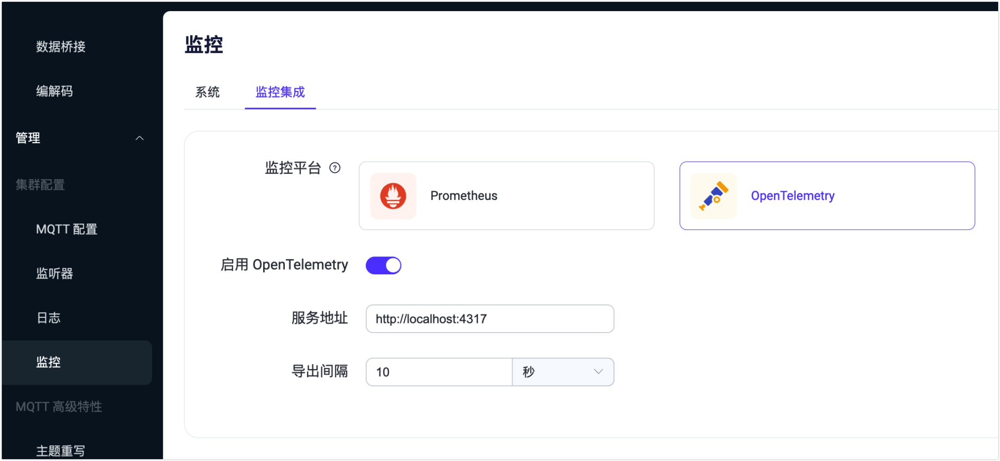
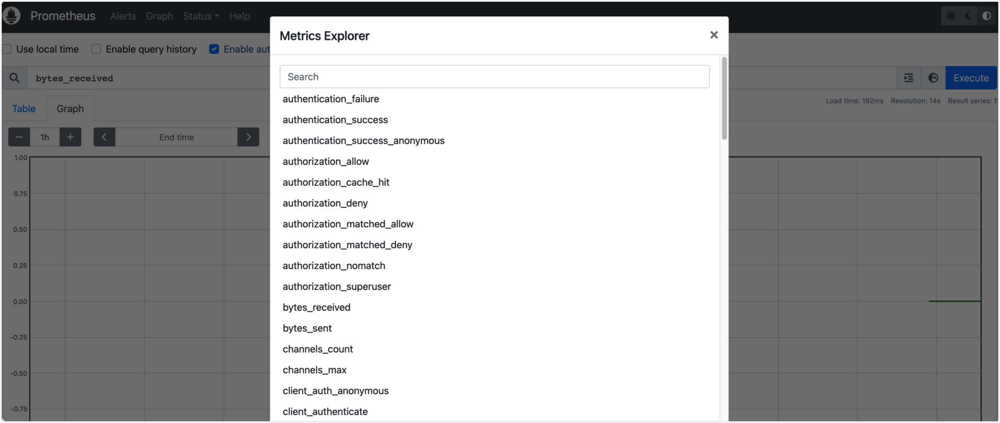

# 集成 OpenTelemetry
[OpenTelemetry](https://opentelemetry.io/docs/what-is-opentelemetry/) 是一个用于管理 traces、metrics 和 logs 等遥测数据的可观测性框架。它可对接 Jaeger 和 Prometheus 类的可观测性后台。EMQX 5.2 已支持通过 gRPC OTEL 协议直接把 metrics 推送到 OpenTelemetry Collector，再经 Collector 中转/过滤/转换到任意你想要集成的后台中作存储和可视化。

本页介绍了如何在 EMQX Dashboard 中配置 EMQX 与 OpenTelemetry 的集成，然后通过 [Prometheus](./open-telemetry.md) 查看 EMQX 指标。

未来我们也将集成 trace 和 log 遥测数据到 Collector，全面支持 OpenTelemetry 生态。

```
                                       -> StatsD
                                       -> ElasticSearch        
       GRPC                            -> InfluxDB
EMQX    -->   Opentelemetry Collector  -> Prometheus
       OTEL Protocol                   -> Datadog
                                       -> Amazon CloudWatch
                                       -> Any open source or vendor backend of your choice
```
## 前期准备工作

在集成 Opentelemetry 之前，您需要先部署和配置 OpenTelemetry 以及 Prometheus。

- 部署 [OpenTelemetry Collector](https://opentelemetry.io/docs/collector/getting-started)。
- 配置 Collector GRPC 接收端口（端口默认为 4317 ），及导出为 Prometheus Metrics 的端口（8889）。
```
# otel-collector-config.yaml
receivers:
  otlp:
    protocols:
      grpc:

exporters:
  prometheus:
    endpoint: "0.0.0.0:8889"
      
processors:
  batch:
  
service:  
  pipelines:    
    metrics:
      receivers: [otlp]
      processors: [batch]
      exporters: [prometheus]
```
- 部署 [Prometheus](https://prometheus.io/docs/prometheus/latest/installation)。
- 配置 Prometheus 拉取 Collector 收集的指标。
```
# prometheus.yaml
scrape_configs:
  - job_name: 'otel-collector'
    scrape_interval: 10s
    static_configs:
      - targets: ['otel-collector:8889'] # emqx metrics
      - targets: ['otel-collector:8888'] # collector metrics
```
## 通过 Dashboard 配置集成

您可在 EMQX Dashboard 设置集成 OpenTelemetry。点击左侧导航目录中的**管理** -> **监控**，在**监控集成**页签，设置启用 OpenTelemetry。


- 服务地址： OpenTelemetry Collector 的 GRPC 端口地址，默认为`http://localhost:4317`
- 导出间隔：周期性推送指标到 Collector 的时间间隔，默认为 10 秒。

## 通过 Prometheus 查看 EMQX 指标
通过 Prometheus 的控制台（`http://otel-collector:9090`）可以查看到 EMQX 指标：



