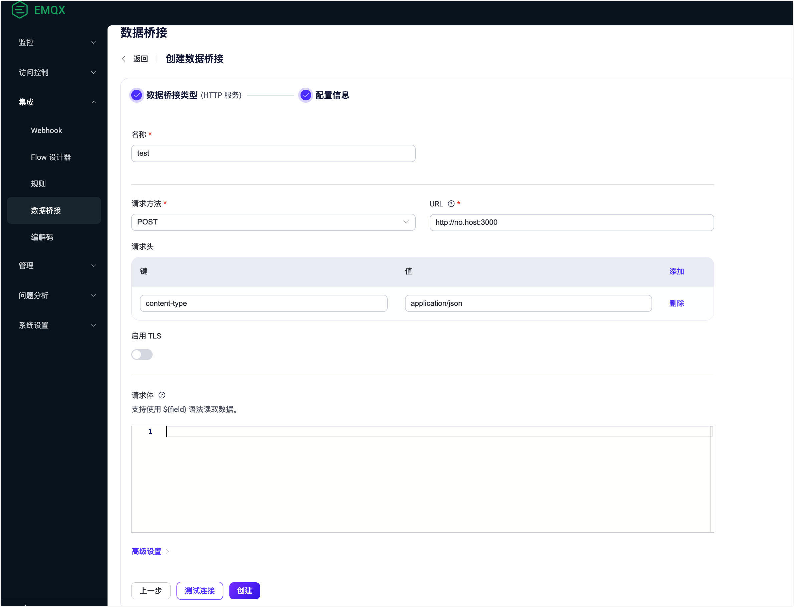

# 集成 OpenTelemetry 进行日志管理

本页面提供了一个全面的指南，介绍了如何将 OpenTelemetry 与 EMQX 集成，以实现高级日志管理。内容涵盖了设置 OpenTelemetry Collector、在 EMQX 中启用 OpenTelemetry 日志处理进程导出日志，以及管理潜在的日志过载。与 OpenTelemetry 的集成允许您根据 [OpenTelemetry 日志数据模型](https://opentelemetry.io/docs/specs/otel/logs/data-model/) 格式化 EMQX 日志事件，并将它们导出到配置的 OpenTelemetry Collector 或后端系统，提高了对 EMQX 的监控和调试能力。

## 配置 OpenTelemetry Collector

在启用 EMQX OpenTelemetry 日志处理进程之前，你需要部署和配置 OpenTelemetry Collector 以及一些兼容的日志收集系统。以下步骤将引导您部署 [OpenTelemetry Collector](https://opentelemetry.io/docs/collector/getting-started) 并将其设置使用调试导出器将日志重定向到 `stdout`。

1. 创建名为 `otel-logs-collector-config.yaml` 的 OpenTelemetry Collector 配置文件：

   ```yaml
   receivers:
     otlp:
       protocols:
         grpc:
   
   exporters:
     logging:
       verbosity: detailed
   
   processors:
     batch:
   
   extensions:
     health_check:
   
   service:
     extensions: [health_check]
     pipelines:
       logs:
         receivers: [otlp]
         processors: [batch]
         exporters: [logging]
   ```
   
2. 在同一目录下创建一个 Docker Compose 文件 `docker-compose-otel-logs.yaml`：

   ```yaml
   version: '3.9'
   
   services:
     # Collector
     otel-collector:
       image: otel/opentelemetry-collector:0.90.0
       restart: always
       command: ["--config=/etc/otel-collector-config.yaml", "${OTELCOL_ARGS}"]
       volumes:
         - ./otel-logs-collector-config.yaml:/etc/otel-collector-config.yaml
       ports:
         - "13133:13133" # 健康检查扩展
         - "4317:4317"   # OTLP gRPC 接收器
   ```
   
3. 使用 Docker Compose 启动 Collector：

   ```bash
   docker compose -f docker-compose-otel-logs.yaml up
   ```
   
4. 一旦运行，OpenTelemetry Collector 应该在 [http://localhost:4317](http://localhost:4317/) 上可访问。

## 在 EMQX 中启用 OpenTelemetry 日志处理进程

1. 将以下配置添加到 EMQX `cluster.hocon` 文件中（假设 EMQX 在本地机器上运行）：

   ```bash
   opentelemetry {
     exporter {endpoint = "http://localhost:4317"}
     logs {enable = true, level = warning}
   }
   ```
   
   ::: warning 注意
   
   `opentelemetry.logs.level` 设置将被默认配置在 [EMQX 日志处理进程](../../observability/log.md) 中的日志级别覆盖。例如，如果 OpenTelemetry 日志级别为 `info` 但 EMQX 控制台日志级别为 `error`，则只有 `error` 级别或更高级别的事件才会被导出。
   
   :::
   
2. 启动 EMQX 节点。

3. 生成 EMQX 日志事件，例如通过 Dashboard 创建一个无法访问的 HTTP 服务动作：

   

4. 短时间后（默认约 1 秒），Otel Collector 应该显示接收到的 EMQX 日志事件，例如指示 HTTP 桥接连接失败的事件：

   

## 管理日志过载

EMQX 会定期批量累积并导出日志事件。这种导出的频率由 `opentelemetry.logs.scheduled_delay` 参数控制，默认为 1 秒。 批处理日志处理进程包含一种过载保护机制，只允许累积事件直到特定限制，默认为 2048。你可以使用以下配置来设置这个限制：

```yaml
opentelemetry {
  logs {max_queue_size = 2048}
}
```

一旦达到 `max_queue_size` 限制，新的日志事件将被丢弃，直到当前队列被导出。

::: warning 注意

OpenTelemetry 日志过载保护独立于默认的 [EMQX 日志处理进程](../../observability/log.md) 过载保护。 因此，根据配置，相同的日志事件可能会被 OpenTelemetry 处理进程丢弃，但被默认的 EMQX 日志处理进程记录，反之亦然。 

:::