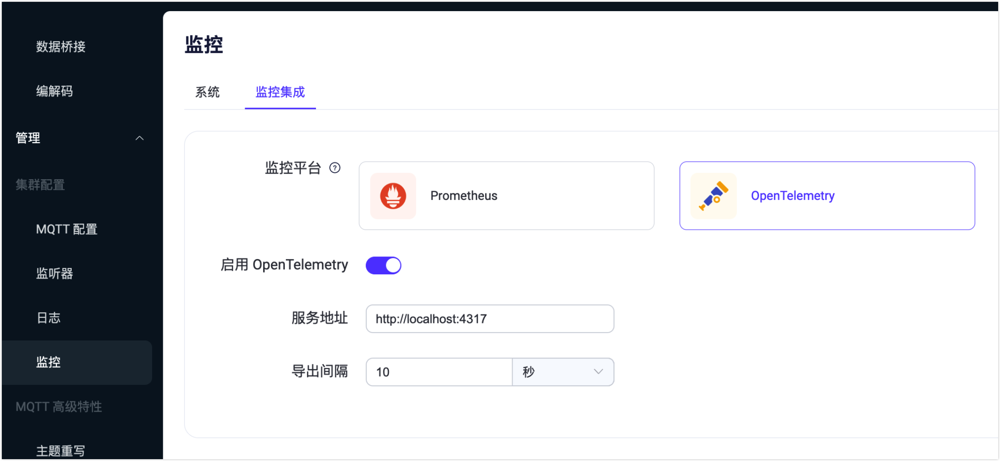

# 集成 OpenTelemetry 查看 EMQX 指标

EMQX 内置支持通过 gRPC OTEL 协议将指标直接推送到 OpenTelemetry Collector。然后 Collector 可以将数据路由、过滤并转换到任何想要使用的后端进行存储和可视化。

本页面介绍了如何通过 EMQX Dashboard 将 OpenTelemetry 与 EMQX 集成，并通过 [Prometheus](../../observability/prometheus.md) 查看 EMQX 指标。

## 前置准备

在集成 Opentelemetry 之前，您需要先部署和配置 OpenTelemetry 以及 Prometheus。

- 部署 [OpenTelemetry Collector](https://opentelemetry.io/docs/collector/getting-started)。
- 配置 Collector GRPC 接收端口（端口默认为 4317 ），及导出为 Prometheus Metrics 的端口（8889）。

```
# otel-collector-config.yaml
receivers:
  otlp:
    protocols:
      grpc:

exporters:
  prometheus:
    endpoint: "0.0.0.0:8889"
      
processors:
  batch:
  
service:  
  pipelines:    
    metrics:
      receivers: [otlp]
      processors: [batch]
      exporters: [prometheus]
```

- 部署 [Prometheus](https://prometheus.io/docs/prometheus/latest/installation)。
- 配置 Prometheus 拉取 Collector 收集的指标。

```
# prometheus.yaml
scrape_configs:
  - job_name: 'otel-collector'
    scrape_interval: 10s
    static_configs:
      - targets: ['otel-collector:8889'] # emqx metrics
      - targets: ['otel-collector:8888'] # collector metrics
```

## 通过 Dashboard 配置集成

您可在 EMQX Dashboard 设置集成 OpenTelemetry。点击左侧导航目录中的**管理** -> **监控**，在**监控集成**页签，设置启用 OpenTelemetry。



- 服务地址： OpenTelemetry Collector 的 GRPC 端口地址，默认为`http://localhost:4317`
- 导出间隔：周期性推送指标到 Collector 的时间间隔，默认为 10 秒。

## 通过 Prometheus 查看 EMQX 指标

通过 Prometheus 的控制台（`http://otel-collector:9090`）可以查看到 EMQX 指标：


