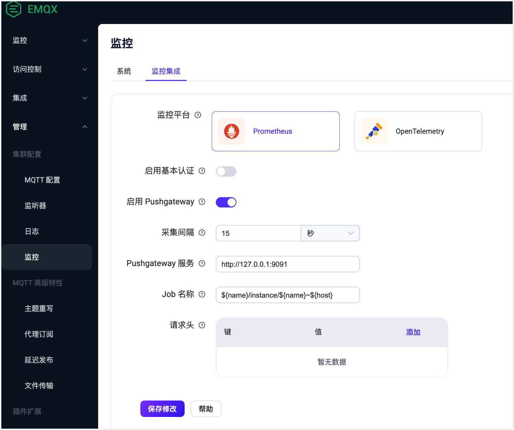

# 集成 Prometheus

EMQX 支持将指标数据集成到第三方服务中来监控指标，例如 [Prometheus](https://prometheus.io/)，是由 SoundCloud 开源的监控告警解决方案，支持多维数据模型、灵活的查询语言、强大的告警管理等特性。还可以结合 Prometheus 和 Grafana 实现 EMQX 统计指标可视化。

使用第三方监控系统可以带来以下优势：

- 一个完整的监控系统，EMQX 的监控数据将与其他系统的监控数据集成。例如，您可以获取服务器主机的监控信息；
- 更直观的监控报告，包含图形和图表，比如使用 [Grafana 仪表板](#use-grafana-to-visualize-EMQX-metrics)；
- 多种报警通知选项，例如使用 Prometheus Alertmanager。



EMQX 在 v5.0.4 后，支持通过 Dashboard 中的**管理** -> **监控** -> **监控集成**设置集成 Prometheus，保存后直接生效，无需重启节点。





您可以在 EMQX Dashboard 中点击左侧导航目录中的**管理** -> **监控**，在**监控集成**页签，选择 Prometheus 进行相关的集成配置。



## 配置集成

通过集成 Prometheus 监控指标有两种不同的模式：pull 模式和使用 Pushgateway。本节介绍了这两种模式的配置以及 Grafana 的配置。

### 通过 REST API 采集指标

使用 pull 模式通过 REST API 采集指标，需要在 Prometheus 上配置 pull 规则。您可以点击 Prometheus 配置页面上的**帮助**按钮查看具体的配置步骤。

EMQX 提供以下 API 端点供 Prometheus 采集系统指标：

- `http://127.0.0.1:18083/api/v5/prometheus/stats`：EMQX 的基础指标及计数器。

- `http://127.0.0.1:18083/api/v5/prometheus/auth`：包含访问控制中认证和鉴权的关键指标及计数器。

- `http://127.0.0.1:18083/api/v5/prometheus/data_integration`：包含规则引擎，连接器，动作，编解码相关指标及计数器。

:::tip 提示:
更多 Prometheus pull 端点相关信息，请参考 API 文档: [Monitor](https://www.emqx.io/docs/zh/v5.4/admin/api-docs.html#tag/Monitor)。
:::

#### 节点或集群指标

在调用以上的 API 端点获取指标时，均支持使用不同的 URL 查询参数，以获取不同模式的指标值。


- `mode=node`：缺省值，返回当前节点的指标。在没有指定具体模式的情况下，默认为返回该指标。

- `mode=all_nodes_aggregated`：集群指标聚合模式。集群所有运行中节点指标的算术和或逻辑和。
  :::tip 逻辑和：
  对于 "开启状态"，"运行状态" 等指标，将返回逻辑和。
  :::

- `mode=all_nodes_unaggregated`：集群指标非聚合模式。集群所有运行中节点的指标。对于不同节点的指标，会将节点名加入标签以区分不同节点。
  :::tip 示例：

  ```
  ...
  emqx_connections_count{node="emqx@127.0.0.1"} 0
  ...
  ```

  :::


### 使用 Pushgateway 推送指标

EMQX 支持向 Pushgateway 推送指标，此功能默认为关闭状态。如需启用 Pushgateway 服务，您可以在 Dashboard 中的 Prometheus 配置页面上打开**启用 Pushgateway** 按钮。

:::tip
向 Pushgateway 推送指标，目前仅包含 `/api/v5/prometheus/stats` 端点的内容。
:::



根据您的业务需求配置以下字段，然后点击**保存修改**。

- **采集间隔**：指定向 Pushgateway 报告监控指标数据的时间间隔。默认值为 `15` 秒。
- **Pushgateway 服务**：输入 Prometheus 服务器的 URL。默认为 `http://127.0.0.1:9091`。
- **Job 名称**：指定包含 EMQX 节点名称和主机名的变量。默认值为 `${name}/instance/${name}~${host}`。例如，当 EMQX 节点名称为 `emqx@127.0.0.1` 时，`name` 变量取值为 `emqx`，`host` 变量取值为 `127.0.0.1`。
- **请求头**：输入推送到 Pushgateway 的监控指标的 HTTP 头的键和值。您可以通过点击**添加**按钮添加请求头列表。类型为字符串，例如，{ Authorization = "some-authz-tokens"}。

同时，您可以点击**帮助**按钮，参考**使用 Pushgateway** 页签上的步骤进行配置。

您还可以通过在 `etc/emqx.conf` 中添加以下配置来启用和配置 Pushgateway：

```bash
prometheus {

  ## Prometheus的URL
  ## @path prometheus.push_gateway_server
  ## @type string()
  ## @default "http://127.0.0.1:9091"
  push_gateway_server: "http://127.0.0.1:9091"


  ## 数据报告间隔。
  ## @path prometheus.interval
  ## @type emqx_schema:duration_ms()
  ## @default 15s
  interval: 15s


  ## 打开 Prometheus 的数据推送，或者关闭
  ## @path prometheus.enable
  ## @type boolean()
  ## @default false
  enable: true
}
```

### 通过 Grafana 可视化 EMQX 指标

EMQX 提供了 Grafana 的 Dashboard 模板，可以直接导入到 Grafana 中查看 EMQX 的指标数据图表。默认的 Dashboard 模板可以在 [EMQX | Grafana Dashboard](https://grafana.com/grafana/dashboards/17446-emqx/) 中下载，也可以在帮助页面里下载。

:::tip
完整的 Prometheus Grafana 可视化展示操作步骤可以参考 [EMQX+Prometheus+Grafana：MQTT 数据可视化监控实践](https://www.emqx.com/zh/blog/emqx-prometheus-grafana)。
:::
