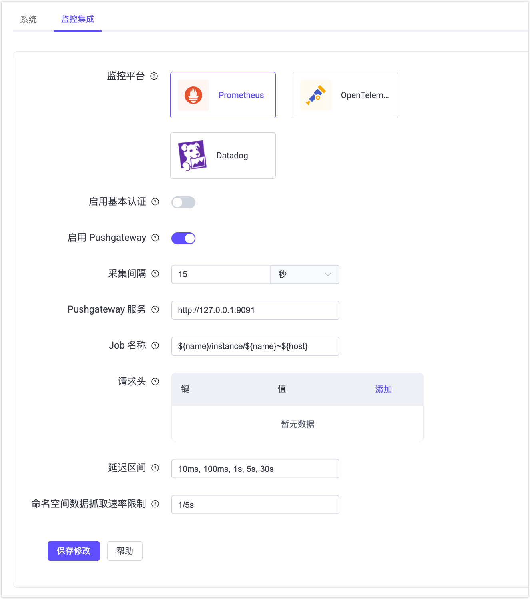

# 使用 Prometheus 监控 EMQX

EMQX 支持向 Prometheus 暴露运行指标，用于查询、告警和可视化。您可以通过以下任一方式采集指标：

- **Pull 模式（推荐）**：Prometheus 直接从 EMQX REST API 端点抓取指标。需要采集完整指标时，请使用此模式。
- **Push 模式**：EMQX 将基础指标发送到 Pushgateway，再由 Prometheus 从 Pushgateway 抓取。Prometheus 无法直接连接 EMQX 时，可使用此模式。

完成采集后，可以使用 Grafana [可视化 EMQX 指标](#在-grafana-中可视化-emqx-指标)。

::: tip
从 EMQX 6.3.0 开始，Prometheus 指标由 `metrics` 功能门控控制。如果手动设置 `EMQX_FEATURES`，启用 `metrics` 时也会自动启用其依赖的 `dashboard`。认证和授权属于核心能力，不受功能门控控制。更多信息请参见[功能门控](../deploy/feature-gates.md)。
:::

## 在 EMQX 中配置指标采集行为

通过 Dashboard 中的 Prometheus 集成页面，可以控制身份认证、Pushgateway 推送、延迟区间和命名空间请求速率。本节说明各选项控制的行为；后续章节分别提供 Pull 和 Push 模式的完整配置步骤。

进入 Prometheus 集成设置：

1. 在 EMQX Dashboard 中进入**管理** -> **监控**。
2. 选择**监控集成**标签页。
3. 选择 **Prometheus**。



如需查看下方端点所暴露的指标精选参考（包括建议告警的指标），请参见 [Broker 健康指标](./broker-health-indicators.md)。

### 要求抓取请求进行身份认证

**启用基本认证**控制 `/api/v5/prometheus/*` 下所有 Prometheus 抓取 API 的身份认证。虽然 Dashboard 中的名称是“启用基本认证”，但该选项同时控制 HTTP Basic 认证和 Bearer 认证。

从 EMQX 6.3.0 开始，身份认证默认启用。未携带凭据的请求返回 `401`。Prometheus 可以使用 API Key 和 Secret Key 进行 HTTP Basic 认证。EMQX 也接受 Dashboard 登录 Token 作为 Bearer Token，但该 Token 会过期，不适合持续抓取。

对于持续运行的 Prometheus 服务，请创建具有 `monitoring` scope 的专用 API 密钥，并[配置 Prometheus 对抓取请求进行身份认证](#配置-prometheus-对抓取请求进行身份认证)。

如需允许未认证的抓取请求，可关闭**启用基本认证**，或设置 `prometheus.enable_basic_auth = false`。该选项仅影响 Pull 模式，不影响向 Pushgateway 推送指标。

::: warning 重要提示
关闭身份认证后，任何能够访问 Dashboard 监听器的客户端都可以抓取 EMQX 指标。升级后，显式设置 `prometheus.enable_basic_auth = false` 的配置和旧格式的 Prometheus 配置仍允许未认证抓取。升级后请在 Dashboard 中检查**启用基本认证**的状态。
:::

### 配置向 Pushgateway 推送指标

打开**启用 Pushgateway**，使 EMQX 向 Pushgateway 实例发送指标。指标推送默认关闭。请配置以下字段：

| 字段 | 说明 |
| --- | --- |
| **采集间隔** | EMQX 推送指标的时间间隔，默认值为 `15` 秒。 |
| **Pushgateway 服务** | Pushgateway URL，默认值为 `http://127.0.0.1:9091`。 |
| **Job 名称** | 推送指标的 Job 标签。默认值为 `${name}/instance/${name}~${host}`，其中 `${name}` 是节点名称中 `@` 之前的部分，`${host}` 是 `@` 之后的主机部分。例如，`emqx@127.0.0.1` 对应的值分别为 `emqx` 和 `127.0.0.1`。 |
| **请求头** | 发送到 Pushgateway 的可选 HTTP 请求头。请以键值对形式添加，例如 `Authorization = "some-auth-token"`。 |

有关完整操作步骤，请参见[配置 EMQX 向 Pushgateway 推送指标](#配置-push-模式集成)。

### 定义延迟直方图的区间

在**延迟区间**中输入以英文逗号分隔的时间长度，例如：

```text
10ms, 100ms, 1s, 5s, 30s
```

这些值用于定义 Pull 和 Push 模式下延迟直方图的区间边界。增加区间可以提高统计粒度，但可能增加指标基数和存储开销。

### 限制抓取所有命名空间的请求速率

**命名空间数据抓取速率限制**用于设置抓取所有命名空间指标时的最大请求速率。针对特定命名空间的请求不受限制。请按 `<requests>/<duration>` 格式输入。默认值 `1/5s` 表示每 5 秒允许 1 次请求；该时间段内的额外请求将被拒绝。

## 配置 Prometheus 抓取 EMQX 指标

在 Pull 模式下，Prometheus 连接 EMQX Dashboard 监听器，并抓取一个或多个 REST API 端点。

### 选择要抓取的指标端点

为需要采集的每类指标添加一个 Prometheus 抓取任务：

| 端点 | 指标 |
| --- | --- |
| `/api/v5/prometheus/stats` | EMQX 基础指标和计数器 |
| `/api/v5/prometheus/namespaced_stats` | 按命名空间聚合的指标 |
| `/api/v5/prometheus/auth` | 认证、授权和禁用客户端指标 |
| `/api/v5/prometheus/data_integration` | 规则、连接器、动作、Sink/Source 和编解码指标 |
| `/api/v5/prometheus/schema_validation` | Schema 验证指标 |
| `/api/v5/prometheus/message_transformation` | 消息转换指标 |
| `/api/v5/prometheus/topic_metrics` | 主题指标采集器的计数器 |

完整的 API 参考请参见 [EMQX 企业版 API 文档](https://docs.emqx.com/zh/enterprise/v@EE_MINOR_VERSION@/admin/api-docs.html)。

### 按命名空间抓取数据集成指标

从 EMQX 6.3.0 开始，`GET /api/v5/prometheus/data_integration` 根据认证用户所属的命名空间限制规则、动作和连接器指标的可见范围：

- 命名空间用户只能获取所属命名空间的指标。用户通过 `ns=<namespace>` 指定其他命名空间时，EMQX 返回 `403`。
- 全局管理员默认获取所有命名空间的指标。设置 `ns=<namespace>` 可抓取指定命名空间的指标；不设置 `ns` 并设置 `only_global=true`，可仅抓取全局命名空间的指标。
- 关闭身份认证后，EMQX 按照全局管理员的可见范围处理请求。默认返回所有命名空间的指标。

非全局命名空间中的规则、动作和连接器逐资源指标包含 `namespace` 标签。全局命名空间中的逐资源指标不包含该标签。由于 Schema Registry 资源不按命名空间隔离，`emqx_schema_registrys_count` 仍是集群级指标。

抓取所有命名空间指标的请求受[命名空间数据抓取速率限制](#限制抓取所有命名空间的请求速率)约束。

### 选择指标采集模式

对于支持该参数的端点，使用 `mode` 查询参数控制端点返回当前节点还是整个集群的指标。

:::: tabs type: card

::: tab 当前节点

```text
mode=node
```

返回接收请求的节点的指标。此模式为默认模式。

:::

::: tab 集群聚合

```text
mode=all_nodes_aggregated
```

返回所有运行节点的指标，并按以下规则聚合：

- 状态类指标采用逻辑聚合。例如，仅当所有节点均处于开启或运行状态时返回 `1`，否则返回 `0`。
- CPU 和内存使用量等节点独立指标不进行聚合，并保留 `node` 标签：

  ```text
  emqx_vm_cpu_use{node="emqx@172.17.0.2"} 7.6669163995887715
  emqx_vm_cpu_idle{node="emqx@172.17.0.2"} 92.33308360041123
  emqx_vm_cpu_use{node="emqx@172.17.0.3"} 7.676007766679973
  emqx_vm_cpu_idle{node="emqx@172.17.0.3"} 92.32399223332003
  ```

- 集群内取值一致的指标直接返回接收请求节点上的值，不求和，也不包含 `node` 标签：

  ```text
  emqx_topics_count 3
  emqx_cert_expiry_at{listener_type="ssl",listener_name="default"} 1904285225
  emqx_cert_expiry_at{listener_type="wss",listener_name="default"} 1904285225
  ```

- 其他指标返回所有运行节点指标的算术和。

:::

::: tab 集群非聚合

```text
mode=all_nodes_unaggregated
```

分别返回所有运行节点的指标。节点独立的值包含 `node` 标签：

```text
emqx_connections_count{node="emqx@127.0.0.1"} 0
```

集群内取值一致的指标仅返回接收请求节点上的一个值，不包含 `node` 标签：

```text
emqx_retained_count 3
```

:::

::::

<a id="身份认证"></a>

### 配置 Prometheus 对抓取请求进行身份认证

从 EMQX 6.3.0 开始，Prometheus 抓取 API 默认要求身份认证。对于持续抓取，请使用专用 API 密钥进行 HTTP Basic 认证：

1. 在 EMQX 中创建具有 `monitoring` scope 的 [API 密钥](../admin/api.md#创建-api-密钥)。
2. 将 API Key 和 Secret Key 添加到 `prometheus.yaml` 中的每个 EMQX 抓取任务：

   ```yaml
   basic_auth:
     username: '<API_KEY>'
     password: '<SECRET_KEY>'
   ```

EMQX 也接受通过 `POST /api/v5/login` 获取的 Bearer Token。Dashboard 登录 Token 会过期，因此持续运行的 Prometheus 抓取程序应使用 API 密钥。

### 在 Prometheus 中添加 EMQX 抓取任务

以下 `prometheus.yaml` 示例采集三个常用指标类别。请替换目标地址和凭据，并根据需要为其他[指标端点](#选择要抓取的指标端点)添加任务。修改后重启 Prometheus。

```yaml
global:
  scrape_interval: 10s
  evaluation_interval: 10s
  external_labels:
    monitor: 'emqx-monitor'

scrape_configs:
  - job_name: 'emqx_stats'
    static_configs:
      - targets: ['127.0.0.1:18083']
    metrics_path: '/api/v5/prometheus/stats'
    scheme: 'http'
    basic_auth:
      username: '<API_KEY>'
      password: '<SECRET_KEY>'

  - job_name: 'emqx_auth'
    static_configs:
      - targets: ['127.0.0.1:18083']
    metrics_path: '/api/v5/prometheus/auth'
    scheme: 'http'
    basic_auth:
      username: '<API_KEY>'
      password: '<SECRET_KEY>'

  - job_name: 'emqx_data_integration'
    static_configs:
      - targets: ['127.0.0.1:18083']
    metrics_path: '/api/v5/prometheus/data_integration'
    scheme: 'http'
    basic_auth:
      username: '<API_KEY>'
      password: '<SECRET_KEY>'
```

<a id="配置-push-模式集成"></a>

## 配置 EMQX 向 Pushgateway 推送指标

Push 模式仅发送 `/api/v5/prometheus/stats` 提供的基础指标和计数器。如需采集其他端点的指标，请使用 Pull 模式。

### 在 Dashboard 中启用 Pushgateway 推送

1. 在 Dashboard 中进入 Prometheus 集成设置。
2. 打开**启用 Pushgateway**。
3. 配置 Pushgateway 服务、采集间隔、Job 名称和所需的 HTTP 请求头。
4. 点击**保存修改**。

同时还需要配置 Prometheus 抓取 Pushgateway 实例。

### 在配置文件中启用 Pushgateway 推送

也可以在 `etc/base.hocon` 中添加以下推荐的嵌套配置：

```hocon
prometheus {
  push_gateway {
    enable = true
    url = "http://127.0.0.1:9091"
    interval = 15s
    headers {}
    job_name = "${name}/instance/${name}~${host}"
  }
}
```

## 在 Grafana 中可视化 EMQX 指标

Prometheus 开始采集 EMQX 指标后，可以导入 [EMQX Grafana Dashboard](https://grafana.com/grafana/dashboards/17446-emqx/) 进行可视化。也可以从 Dashboard 的 Prometheus 集成**帮助**页面下载该模板。

完整示例请参见 [EMQX+Prometheus+Grafana：MQTT 数据可视化监控实践](https://www.emqx.com/zh/blog/emqx-prometheus-grafana)。
