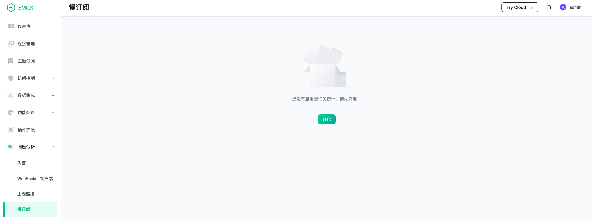
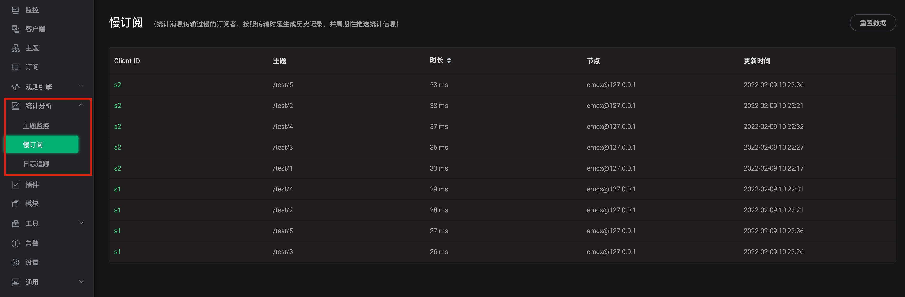
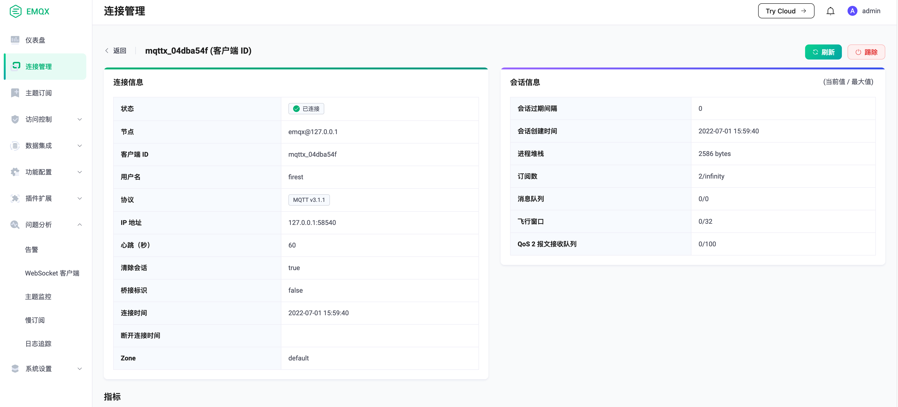

# 慢订阅统计

该功能按照消息传输的耗时，从高到低对订阅者进行排名

## 开启模块

打开 EMQX Dashboard，在`问题分析`中选择`慢订阅`，然后点击`开启`即可：

## 实现说明

该功能会追踪 QoS 1 和 QoS 2 消息到达 EMQX 后，完成消息传输全流程的时间消耗，然后根据配置中的选项，计算消息的传输时延，
之后按照时延高低对订阅者、主题进行统计排名

## 配置说明

-   时延阈值/threshold

    *时延阈值* 用来判断订阅者是否可以参与统计，如果订阅者的时延低于这个值，将不会进行统计

-   最大统计条数/top\_k\_num

    这个字段决定统计记录表中数量上限

-   有效时长/expire\_interval

    *有效时长* 控制统计记录中每一条数据的有效时间，如果该数据在这个时间范围内，一直没有被更新过，将会被移除
    (比如发送一条消息后因为时延很长，被加入到统计记录中，之后长时间没有再次发送消息，在超过这个字段后，将会被清除掉)

-   统计类型/stats\_type
    计算时延的方式，分别为:

    1.  whole

        从消息到达 EMQX 时起，直到消息完成传输时

    2.  internal

        从消息到达 EMQX 时起，直到 EMQX 开始投递消息时

    3.  response

        从 EMQX 开始投递消息时起，直到消息完成传输时

    消息完成传输的定义:

    1.  QoS 0

        EMQX 开始投递时

    2.  QoS 1

        EMQX 收到客户端的 *puback* 时

    3.  QoS 2

        EMQX 收到客户端的 *pubcomp* 时

注意:开源版配置在emqx.conf中

## 慢订阅记录

这个标签页下会按照时延，从高到底依次显示订阅者和主题信息，点击 *Client ID* 将会显示订阅者详情，可以通过订阅者详情来进行问题分析和查找。

