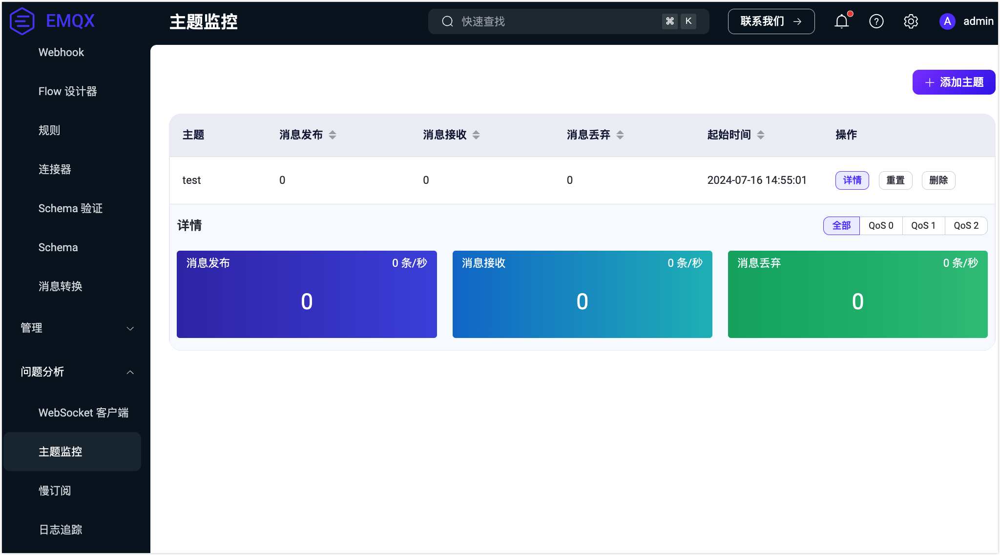
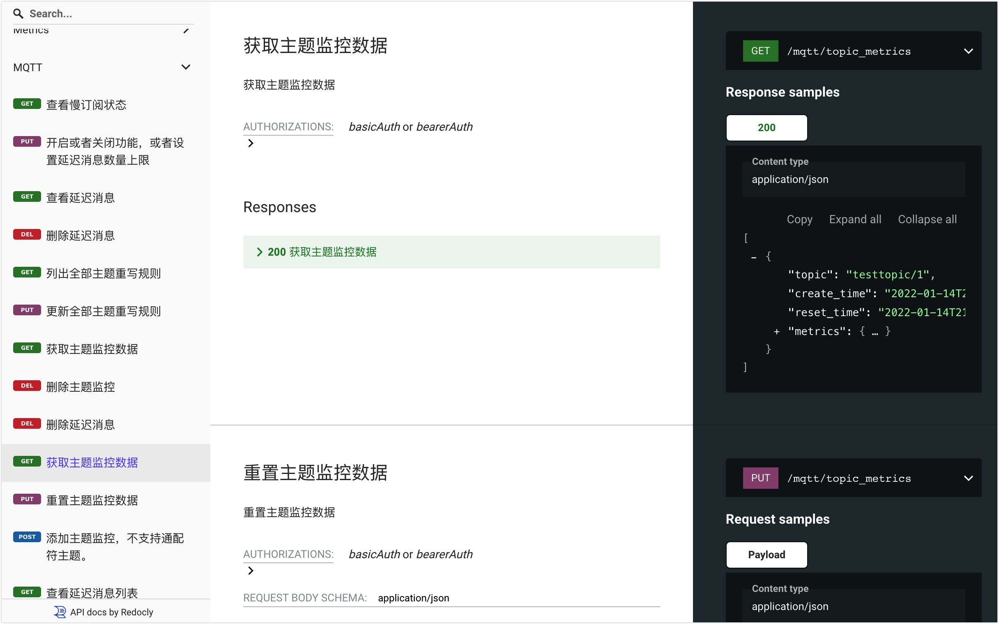

# 主题监控

::: tip 注意

主题监控是 EMQX 企业版功能。

:::

EMQX 提供了主题监控功能，可以统计指定主题下的消息收发数量、速率等指标。您可以通过 Dashboard 的 **问题分析** -> **主题监控** 页面查看和使用这一功能，也可以通过 REST API 完成相应操作。

## 在 Dashboard 中查看主题指标

主题监控功能开启后，你可以点击页面右上角的**添加主题**按钮来创建新的主题监控。请注意，目前不支持使用带有通配符的主题过滤器，例如 `+` 或 `#`。您必须使用具体的主题名称。

点击**操作**列中的**详情**按钮，您将看到关于指定主题每秒接收、发送和丢弃的消息数量的详细信息。您还可以根据不同的 QoS 级别筛选这些信息。

主题指标列表包括以下字段：

- **主题**：您想监控的主题名称。
- **消息接收**：当前主题的总入站消息数和每秒入站消息数。
- **消息发布**：当前主题的总出站消息数和每秒出站消息数。
- **消息丢弃**：当前主题的总丢弃消息数和每秒丢弃消息数。
- **起始时间**：您创建此主题监控记录的时间。
- **操作**：您可以对该主题监控记录执行的操作。
  - **详情**：根据不同的 QoS 级别查看主题的详细指标。
  - **重置**：点击此按钮将重新开始监控。
  - **删除**：删除记录。

## 通过 REST API 获取主题指标

您还可以通过 API 获取主题指标。有关如何使用 EMQX API 的详细信息，请参阅 [REST API](../admin/api.md)。

