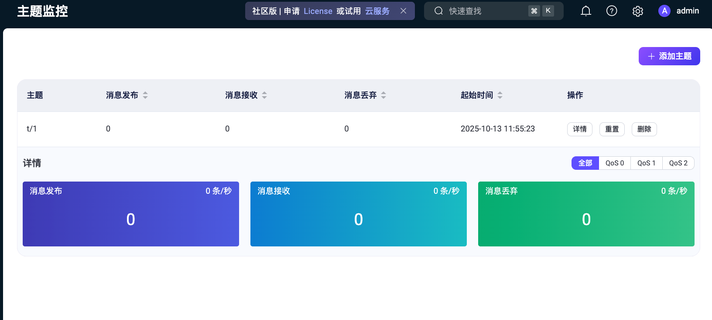

# 主题监控

主题监控用于统计指定 MQTT 主题的消息活动。您可以在 Dashboard 中监控具体主题。从 EMQX 6.3 开始，还可以通过 REST API 创建支持通配符主题过滤器的命名指标集合，并将计数器导出到 Prometheus。

## 主题监控接口

EMQX 6.3 提供以下主题监控接口：

| 接口 | 主题选择方式 | 指标 | 使用场景 |
| --- | --- | --- | --- |
| Dashboard | 不包含 `+` 或 `#` 的单个主题名 | 消息计数、速率和按 QoS 划分的指标 | 查看并诊断具体主题的消息活动。 |
| REST API | 可包含 `+` 或 `#` 的主题过滤器 | 消息和字节计数器 | 创建命名指标集合，用于程序化监控和 Prometheus 集成。 |

::: tip 兼容性

从 EMQX 6.3 开始，`/api/v5/mqtt/topic_metrics` 下的 REST API 被标记为弃用，但仍可用于兼容已有集成。EMQX 不会将通过该 API 创建的监控记录迁移为命名指标集合。

:::

## 在 Dashboard 中查看主题指标

在 Dashboard 中，点击**问题分析** -> **主题监控**。点击**添加主题**，输入要监控的主题名，然后点击**添加**。

请输入具体主题名，例如 `devices/001/status`。Dashboard 不支持包含 `+` 或 `#` 的主题过滤器。通过 REST API 创建的通配符主题指标集合不会显示在 Dashboard 中。



主题指标列表包括以下字段：

- **主题**：正在监控的主题名。
- **消息接收**：入站消息总数和入站消息速率。
- **消息发布**：出站消息总数和出站消息速率。
- **消息丢弃**：丢弃消息总数和丢弃消息速率。
- **起始时间**：监控记录的创建时间。
- **操作**：
  - **详情**：查看按 QoS 等级划分的指标。
  - **重置**：重置该主题的指标。
  - **删除**：删除监控记录。

## 通过 REST API 管理主题指标集合

从 EMQX 6.3 开始，REST API 支持管理命名主题指标集合。每个集合包含独立的名称和 MQTT 主题过滤器。不同集合的过滤器可以重叠，一条消息会递增所有匹配集合的计数器。

有关 REST API 认证的信息，参见 [REST API](../admin/api.md#认证)。

### 集合限制

主题指标集合具有以下限制：

- 集合名称长度必须为 1 至 64 个字符，只能包含字母、数字、下划线（`_`）或连字符（`-`）。
- 主题过滤器必须符合 MQTT 主题过滤器语法，可以包含 `+` 或 `#`。
- 一个集群最多可包含 512 个指标集合。

### 创建指标集合

调用 `POST /api/v5/mqtt/topic_metrics2`，并在请求中指定集合名称和主题过滤器。以下请求创建一个匹配所有传感器温度消息的集合：

```bash
curl -u '<API_KEY>:<SECRET_KEY>' \
  -H 'Content-Type: application/json' \
  -X POST 'http://localhost:18083/api/v5/mqtt/topic_metrics2' \
  -d '{
    "name": "sensor-temperatures",
    "topic_filter": "sensors/+/temperature"
  }'
```

响应中包含集合元数据和计数器：

```json
{
  "name": "sensor-temperatures",
  "topic_filter": "sensors/+/temperature",
  "namespace": null,
  "create_time": "2026-06-02T12:34:56+00:00",
  "metrics": {
    "messages.in.count": 0,
    "messages.out.count": 0,
    "messages.dropped.count": 0,
    "bytes.in": 0,
    "bytes.out": 0
  }
}
```

### 查询和管理指标集合

使用以下端点查询和管理指标集合：

| 方法和端点 | 操作 |
| --- | --- |
| `GET /api/v5/mqtt/topic_metrics2` | 列出当前管理员可见的指标集合。 |
| `POST /api/v5/mqtt/topic_metrics2` | 创建指标集合。 |
| `DELETE /api/v5/mqtt/topic_metrics2` | 删除当前管理员可见的所有指标集合。 |
| `GET /api/v5/mqtt/topic_metrics2/:name` | 获取一个指标集合及其集群聚合计数器。 |
| `DELETE /api/v5/mqtt/topic_metrics2/:name` | 删除一个指标集合。 |
| `PUT /api/v5/mqtt/topic_metrics2/:name/reset` | 重置一个指标集合的计数器。 |

### 指标集合计数器

每个指标集合包含以下计数器：

| 计数器 | 说明 |
| --- | --- |
| `messages.in.count` | 发布到匹配主题的消息数量。 |
| `messages.out.count` | 投递给订阅者的匹配消息数量。 |
| `messages.dropped.count` | EMQX 丢弃的匹配消息数量。 |
| `bytes.in` | 匹配发布消息的主题和 Payload 总大小。 |
| `bytes.out` | 匹配投递消息的主题和 Payload 总大小。 |

字节计数器不包含 MQTT 属性、用户属性或其他协议开销。REST API 不计算消息速率，也不提供按 QoS 划分的计数器。如需计算速率，请将计数器导出到 Prometheus，并使用 PromQL `rate()` 函数。

### 命名空间隔离

主题指标集合归属于创建集合的管理员所在命名空间：

- 命名空间管理员创建的集合归属于该命名空间。这些集合只统计发布者属于相同命名空间的消息。
- 命名空间管理员只能列出、查询、重置和删除本命名空间中的集合。
- 全局管理员创建全局集合。全局集合统计所有发布者的消息，不受命名空间限制。
- 全局管理员可以列出所有命名空间中的集合。不同命名空间可以包含同名集合。

有关命名空间的更多信息，参见[命名空间概览](../multi-tenancy/namespace-overview.md)。

## 将主题指标导出到 Prometheus

从 EMQX 6.3 开始，Prometheus 可以通过 `GET /api/v5/prometheus/topic_metrics` 抓取指标集合计数器。有关指标名称、标签、采集模式和 Prometheus 配置示例，参见[集成 Prometheus](./prometheus.md#主题指标)。
