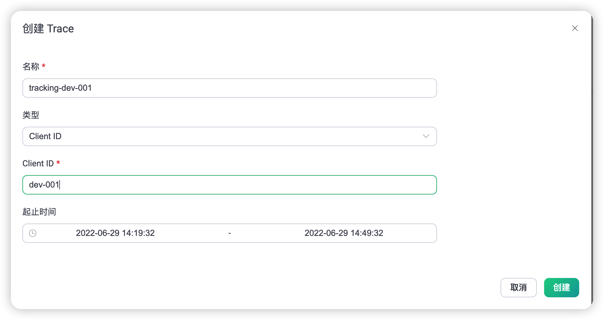
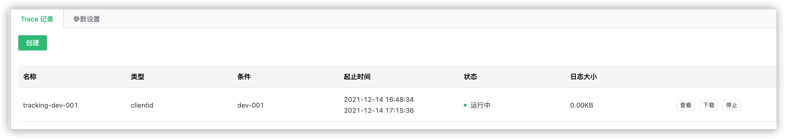
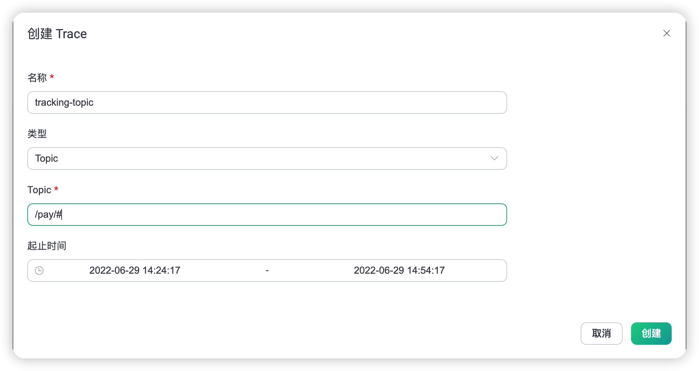
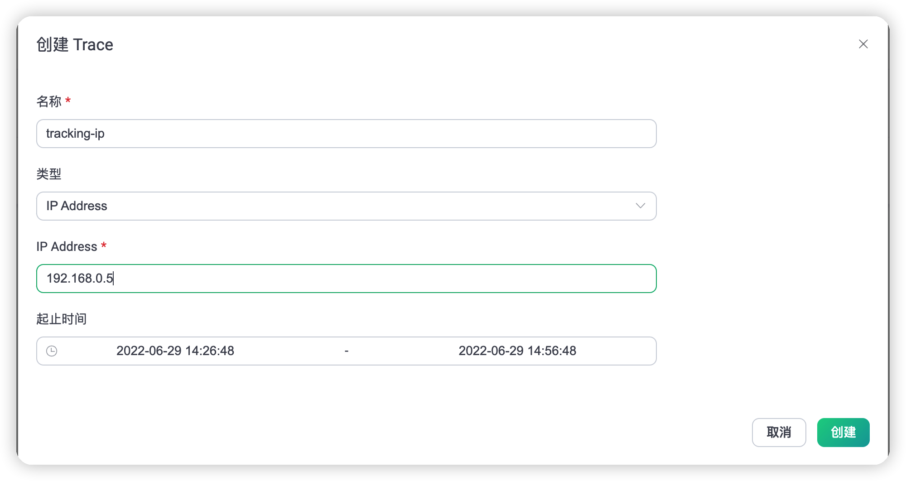
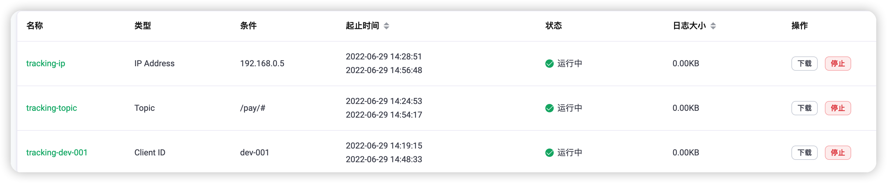

# 日志追踪 (Trace)

通过开启 DEBUG 级别日志能够有效地排查各类问题，但这会引起大量日志落地进而影响 EMQX 整体性能，尤其是在有大量连接与消息收发的生产环境中，该手段几乎是不可实施的。

针对这种问题，EMQX 5.0 新增了在线日志追踪(Trace)功能，允许用户指定客户端 ID、主题或 IP 实时过滤输出 DEBUG 级别日志。

## 日志追踪介绍

日志追踪基于 Erlang 内置强大的 Logger Filter 功能，对整体的消息吞吐影响可以忽略不计：

- EMQX 使用独立的 File Handlers 进程来持久化 Trace 的磁盘日志。
- 每个客户端连接会在 EMQX 内部生成一个独立进程来处理它的消息。
- 当收到客户端消息时，这个独立进程会根据定制的 Trace Filter 判断是否符合规则（比如：是否为指定的 客户端 ID）。如果不符合，则执行原来的传输逻辑。反之，则在本进程序列化消息为二进制数据，再异步发消息给 File Handler。
- 通过 File Handlers 负责把二进制数持久化至 Trace 文件中。

在此机制下，所有的过滤动作都前置在对接客户端的独立进程，过滤掉了大部分不符合规则的日志，保证了 File Handler 不被大量消息累积，因此能够在生产环境中安全的使用。

Trace 几乎适用于所有疑难杂症，如消息或数据异常丢弃、客户端异常断线、订阅不生效等。针对特定时间段发生的异常，Trace 允许用户设置任务启动/停止时间进行自动化收集，极大的方便用户使用。

日志追踪位于 Dashboard 的 **问题分析** -> **日志追踪**页面，下面将介绍创建不同追踪的操作步骤。

<!-- TODO 下面的内容先凑合使用，后续更新 -->

## 追踪指定 客户端 ID

1. 点击创建后，选择类型为 客户端 ID；
2. 填写需要追踪的 客户端 ID 信息（必须是精确的 客户端 ID）；
3. 选择起止时间，如果开始时间小于等于当前时间，会默认从当前时间开始。
   
   

创建成功后，可以在列表中看到当前的 Trace 记录，可以查看，或下载日志。
日志内容包含了当前 客户端 ID 与 EMQX 连接所有交互信息。

## 追踪指定 Topic

1. 点击创建后，选择类型为 Topic；
2. 填写需要追踪的 Topic 信息（支持通配符）；
3. 选择起止时间，如果开始时间小于等于当前时间，会默认从当前时间开始。

创建成功后，可以在列表中看到当前的 Trace 记录，可以查看，或下载日志。
日志内容包含了当前主题在 EMQX 上的 Publish/Subscribe/UnSubscribe 信息。

## 追踪指定 IP

1. 点击创建后，选择类型为 IP Address；
2. 填写需要追踪的 IP 地址信息（必须是精确的 IP）；
3. 选择起止时间，如果开始时间小于等于当前时间，会默认从当前时间开始。

创建成功后，可以在列表中看到当前的 Trace 记录，可以查看，或下载日志。
日志内容包含了当前 IP 与 EMQX 连接所有交互信息。

## 注意事项

1. 最多可保存 30 个追踪日志。
2. 追踪日志在每个节点产生的日志最大为 512MB。如果产生的日志文件达到最大值，则会停止追加日志，并在主日志文件中给出提示。
3. 可以选择手动停止记录，或等到结束时间时自动停止。
4. 列表中查看到的日志文件大小为未压缩过的文件大小总和。
5. EMQX 集群重启后，会继续未完成的追踪。
6. 如果 Dashboard 下载超时，可以直接在服务器的 `/data/trace` 目录上找到该日志文件。
