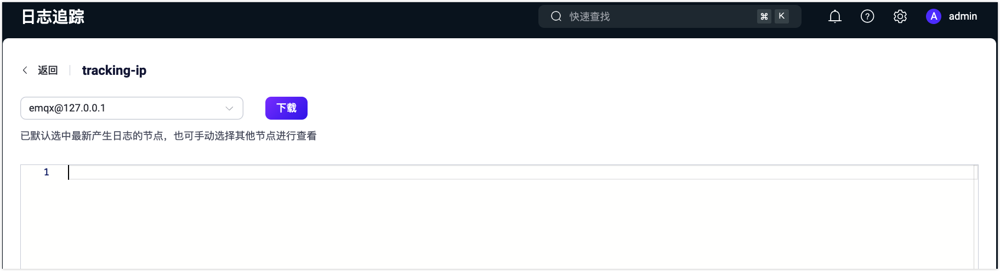

# 日志追踪

EMQX 5.0 引入了日志追踪功能，允许对特定的客户端 ID、主题、IP 地址或规则 ID 进行实时 debug 级别的日志输出。这使得在生产环境中能够进行详细调试，而不会因日志过多影响系统性能，从而提高了诊断和解决 EMQX 问题的效率。

## 日志追踪工作原理

日志追踪功能基于 Erlang 内置的日志过滤器功能实现，对整体消息吞吐量的影响微乎其微。EMQX 使用独立的文件处理器来持久化每个追踪日志，并为每个客户端连接创建一个独立的进程来处理其消息。

当客户端发送消息时，负责该连接的独立进程会首先检查消息是否符合自定义追踪过滤器设置的规则。例如，进程可能会检查消息是否来自指定的客户端 ID：

- 如果消息来自指定的客户端 ID，进程会将消息转换为二进制数据，然后异步发送到相应的文件处理器。
- 如果消息不来自指定的客户端 ID，EMQX 将执行原始的转发逻辑。

文件处理器负责将二进制数据持久化到磁盘上的追踪文件中。

如果节点或整个集群发生重启，未完成的日志追踪任务将自动恢复。

## 为什么使用日志追踪

日志追踪功能具有多项关键优势，使其成为在生产环境中调试和监控的有效工具。

- **安全性**：过滤过程是针对每个客户端独立执行的，避免了文件处理器因接收过多消息而超载。由于大多数日志被过滤掉，这种方法适用于生产环境。
- **可靠性**：此功能确保追踪日志不会影响 EMQX 的整体消息吞吐量，并提供了一种可靠高效的方式来存储和检索日志数据。
- **灵活性**：日志追踪适用于多种调试场景，如调试异常消息或数据丢失、客户端断开、订阅失败等。对于在特定时间发生的系统故障，可以设置追踪任务的开始和结束时间，实现自动采集日志。

## 创建日志追踪

本节演示了如何在 Dashboard 中创建日志追踪规则。您可以基于客户端 ID、主题、IP 地址或规则 ID 进行追踪。

1. 点击左侧导航菜单中的 **诊断工具** -> **日志追踪**。
2. 在**日志追踪**页面中，点击**创建**来配置您的追踪规则。

### 配置通用追踪选项

在**创建 Trace** 对话框中，配置以下适用于所有追踪类型的选项：

- **名称**：输入一个描述性的名称来标识该追踪，以便在日志中进行识别。此名称将出现在追踪列表中，并应提供有用的上下文，例如追踪的类型（如 “客户端 ID 追踪” 或 “主题追踪”），以便快速搜索和识别。
- **起止时间**：选择追踪的开始时间和结束时间。如果开始时间早于或等于当前时间，追踪将从当前时间开始。
- **日志格式**：选择格式化程序，指定日志输出的格式。支持 `JSON` 和 `Text`。
- **Payload 编码**：指定 payload 在追踪日志文件中的编码格式。选择以下选项之一：
  - `Text`：基于文本的协议或纯文本协议。推荐用于 JSON 编码的 payload。
  - `HEX`：二进制十六进制编码。推荐用于自定义二进制协议。
  - `Hidden`：将 payload 隐藏为 `******`（适用于掩码敏感信息）。
- **Payload 限制**：设置在追踪文件中打印的 payload 的最大字节数。此选项仅在 **Payload 编码**设置为 `Text` 或 `HEX` 时有效。如果 payload 超过此限制，它将被截断。默认值为 `1024 B`。当 Payload 限制被禁用时，追踪不会对 payload 大小进行限制，默认为启用。

### 按客户端 ID 追踪

该日志追踪内容将包含指定客户端 ID 与 EMQX 连接的交互信息。

1. 在**创建 Trace** 对话框中，从**类型**下拉列表中选择`客户端 ID`。
2. 输入要追踪的**客户端 ID**。
3. 配置通用的选项。请参阅[配置通用追踪选项](#配置通用追踪选项)。
4. 点击**创建**完成。

### 按主题追踪

该日志追踪内容将包含指定主题的发布、订阅和退订信息。

1. 在**创建 Trace** 对话框中，从**类型**下拉列表中选择`主题`。
2. 填写需要追踪的主题信息，支持通配符，例如：`/pay/#`。
3. 配置通用的选项。请参阅[配置通用追踪选项](#配置通用追踪选项)。
4. 点击**创建**完成。

### 按 IP 地址追踪

该日志追踪内容将包含指定 IP 地址与 EMQX 连接的交互信息。

1. 在**创建 Trace** 对话框中，从**类型**下拉列表中选择 `IP 地址`。
2. 填写需要追踪的 IP 地址信息（必须是精确的 IP），例如 `192.168.0.5`。
3. 配置通用的选项。请参阅[配置通用追踪选项](#配置通用追踪选项)。
4. 点击**创建**完成。

### 按规则 ID 追踪

追踪结果将包含规则 SQL 的执行结果，以及与规则中添加的所有动作的执行过程日志。可以用于规则的调试和优化。

该追踪类型可以通过[测试规则](../data-integration/rule-get-started.md#测试规则)操作自动创建和管理。测试规则时，EMQX 会自动生成一个追踪任务，并在测试停止后自动删除。

1. 在**创建 Trace** 对话框中，从**类型**下拉列表中选择`规则 ID`。
2. 输入需要追踪的规则 ID。您可以在**集成** -> **规则**页面找到规则 ID。
3. 配置通用的选项。请参阅[配置通用追踪选项](#配置通用追踪选项)。
4. 点击**创建**完成。

## 查看日志追踪

已创建的日志追踪任务会显示在**日志追踪**页面中。页面中显示的日志大小为未压缩文件的总和。你可以手动点击**停止**按钮中止追踪，也可以设置结束时间自动停止。

系统允许的最大追踪任务数默认为 30，可通过配置参数 `trace.max_traces` 进行调整。

点击某个追踪任务名称可进入详情页面，在其中查看追踪事件，或下载特定节点上的日志文件。

默认情况下，每个节点的单个追踪任务最多生成 128 MB 的日志数据。该限制可通过 `trace.max_file_size` 参数进行配置。为优化磁盘使用，EMQX 使用循环日志写入机制：当日志文件达到限制大小后，最旧的日志事件将被丢弃，以便写入新的日志。请注意，这不是一个严格的限制，日志总大小通常低于配置值，但在某些缓冲情况下可能会短暂超出几 KB。

若在 Dashboard 下载日志时出现超时，可前往集群中对应节点的 `/data/trace` 目录，手动获取日志文件。
