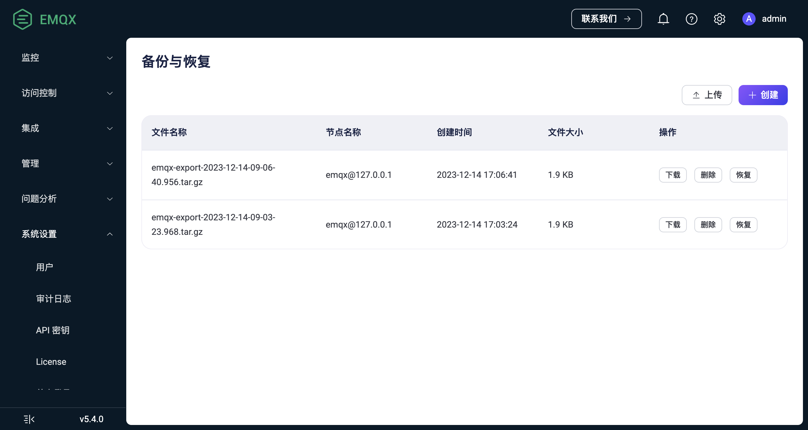

# 备份与恢复

EMQX 集群能够确保系统的高可用性，并且采用分布式存储将数据复制到所有节点。

尽管如此，我们仍然应当做最坏的打算来确保数据万无一失，本页指导您如何进行 EMQX 数据备份和恢复。

## 功能说明

EMQX 提供了 CLI 命令用于数据导入和导出实现备份与恢复，尽管它与 EMQX 4.x 的命令类似，但导出文件格式与 4.x 是不兼容的：

- EMQX 4.x 中，使用单个 JSON 文件保存 EMQX 配置和内置数据库的所有必要数据。
- EMQX 5.x 中，导出的数据压缩为 tar 格式的文件，这样可以更高效、更有结构地处理潜在的大量用户数据。



除了 CLI 命令之外，EMQX 企业版还在 Dashboard 上提供了数据备份与恢复页面，您可以在其中进行数据导入和导出操作。



EMQX 支持导入和导出的数据包括：

- EMQX [配置重写](../configuration/configuration.md#配置重写)的内容：
  - 认证与授权配置
  - 规则、连接器与 Sink/Source
  - 监听器、网关配置
  - 其他 EMQX 配置
- 内置数据库 (Mnesia) 的数据
  - Dashboard 用户和 REST API 密钥
  - 客户端认证凭证（内置数据库密码认证、增强认证）
  - PSK 认证数据
  - 授权规则
  - 黑名单数据
- 存储在 EMQX 数据目录（`node.data_dir`）中的 SSL/TLS 证书
- 存储在 EMQX 数据目录中的授权 acl.conf 文件

::: tip 特别提示

1. 请注意，导出的文件仅包含存储在 EMQX 数据目录中的 SSL/TLS 证书和 acl.conf 文件。如果存在任何位于数据目录之外的证书或 acl.conf 文件，请在导入数据之前手动将其复制到相应的位置，以确保完整性和正确性。

2. 导出的文件名格式为 `emqx-export-YYYY-MM-DD-HH-mm-ss.sss.tar.gz`，导出目录为 `<EMQX data directory>/backup`。

:::

### 导出

数据可以从任何运行的集群节点导出。

### 导入

要导入数据，EMQX 节点必须处于运行状态，并且需要满足一些条件才能成功进行导入操作：

- 如果启用了[核心节点 + 复制节点](../deploy/cluster/mria-introduction.md)模式，数据导入只能在核心节点上进行。这不会影响实际的导入行为，因为数据将被复制到所有集群节点，包括核心节点和复制节点。在核心节点上进行操作可以确保正确导入数据。
- 从 EMQX 企业版集群导出的数据无法导入到 EMQX 开源版集群。
- 数据文件不能被重命名。

如果上述任何条件不满足，导入过程将被中止，并显示对应的错误消息。

在数据导入操作期间，数据将被插入（如果在目标 EMQX 集群中不存在）或更新（如果存在冲突）到 EMQX 中。导入过程不会从 EMQX 集群中删除任何现有数据。

::: tip 特别提示

在极少数情况下，现有数据可能与导入的数据不兼容。
例如，某个 EMQX 集群使用了内置数据库认证，并设置盐的位置为“后缀”，而导入的数据将相同配置设置为”前缀“。导入之后新的配置将生效，之前创建的旧用户身份凭证将不再起作用。

因此，将数据导入到未清除数据的 EMQX 集群可能需要额外的注意。

:::



## 通过 Dashboard 操作

本节介绍如何在 Dashboard 上进行数据导入和导出操作。

:::tip

- 通过 Dashboard 备份恢复在 EMQX 企业版 v5.4.0 及之后版本中可用。
- 通过 CLI 导出的备份文件也可以在 Dashboard 备份恢复页面中进行管理。

:::

1. 登录 Dashboard，进入 **系统设置** -> **备份与恢复** 页面。

2. 如需导出数据，点击右上角的**创建**按钮将基于当前 EMQX 集群的数据创建一个备份文件。您可以在备份文件列表页查看文件信息：
   - **文件名称**：备份文件的名称。
   - **节点名称**：该名称指的是备份文件所存储的节点，并不表示备份仅包含该节点的数据。
   - **创建时间**：备份文件的创建时间。
   - **文件大小**：备份文件的大小。

   您可以在**操作**列点击**下载**，将文件下载备份到本地。

3. 如需导入数据，点击右上角的**上传**按钮，上传一个备份文件到当前 EMQX 集群。上传的时候并不会立即恢复，您可以稍后在备份文件列表的**操作**列点击**恢复**，将备份文件导入到当前 EMQX 集群。





## 通过 CLI 操作

本节介绍如何使用 CLI 导入和导出数据。

1. 导出数据，导出成功后将输出文件名称和路径。

   ```bash
   $ ./emqx ctl data export
   Exporting data to "data/backup/emqx-export-2023-06-19-15-14-19.947.tar.gz"...
   Exporting cluster configuration...
   Exporting additional files from EMQX data_dir: "data"...
   Exporting built-in database...
   Exporting emqx_admin database table...
   Exporting emqx_authn_mnesia database table...
   Exporting emqx_enhanced_authn_scram_mnesia database table...
   Exporting emqx_app database table...
   Exporting emqx_acl database table...
   Exporting emqx_psk database table...
   Exporting emqx_banned database table...
   Data has been successfully exported to data/backup/emqx-export-2023-06-19-15-14-19.947.tar.gz.
   ```

2. 导入数据，导入的文件名应指定为绝对路径。如果文件位于 `<EMQX data directory>/backup` 目录中，则也可以使用不带路径的基本名称，例如：

   ```bash
   # 通过绝对路径导入文件：
    $ ./emqx ctl data import /tmp/emqx-export-2023-06-19-15-14-19.947.tar.gz
    Importing data from "/tmp/emqx-export-2023-06-19-15-14-19.947.tar.gz"...
    Importing cluster configuration...
    Importing built-in database...
    Importing emqx_banned database table...
    Importing emqx_psk database table...
    Importing emqx_acl database table...
    Importing emqx_app database table...
    Importing emqx_enhanced_authn_scram_mnesia database table...
    Importing emqx_authn_mnesia database table...
    Importing emqx_admin database table...
    Data has been imported successfully.
   
    # 通过 EMQX 根目录下的相对路径导入文件：
    $ ./emqx ctl data import ../../../tmp/emqx-export-2023-06-21-13-28-06.418.tar.gz
    Importing data from "../../../tmp/emqx-export-2023-06-21-13-28-06.418.tar.gz"...
    Importing cluster configuration...
    Importing built-in database...
    Importing emqx_enhanced_authn_scram_mnesia database table...
    Importing emqx_authn_mnesia database table...
    Importing emqx_admin database table...
    Importing emqx_acl database table...
    Importing emqx_banned database table...
    Importing emqx_psk database table...
    Importing emqx_app database table...
    Data has been imported successfully.
   
    # 从 `<EMQX data directory>/backup` 目录导入文件：
    $ cp /tmp/emqx-export-2023-06-21-13-28-06.418.tar.gz /opt/emqx/data/backup/
    $ ./emqx ctl data import emqx-export-2023-06-21-13-28-06.418.tar.gz
    Importing data from "data/backup/emqx-export-2023-06-21-13-28-06.418.tar.gz"...
    Importing cluster configuration...
    Importing built-in database...
    Importing emqx_enhanced_authn_scram_mnesia database table...
    Importing emqx_authn_mnesia database table...
    Importing emqx_admin database table...
    Importing emqx_acl database table...
    Importing emqx_banned database table...
    Importing emqx_psk database table...
    Importing emqx_app database table...
    Data has been imported successfully.
   ```
