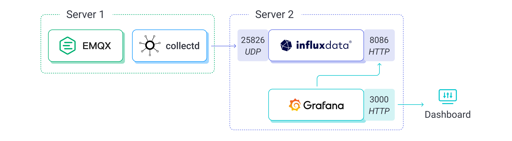
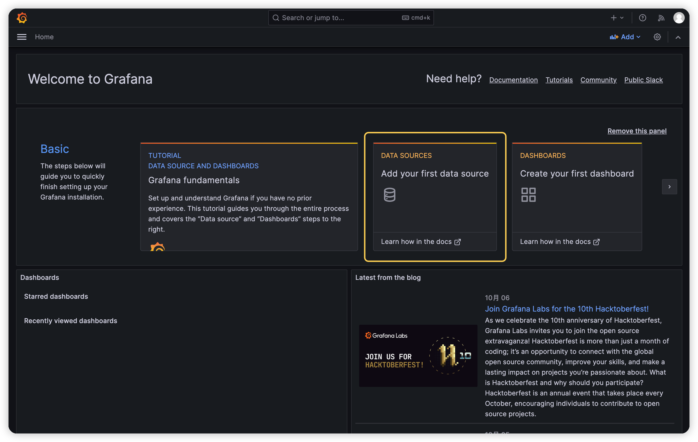
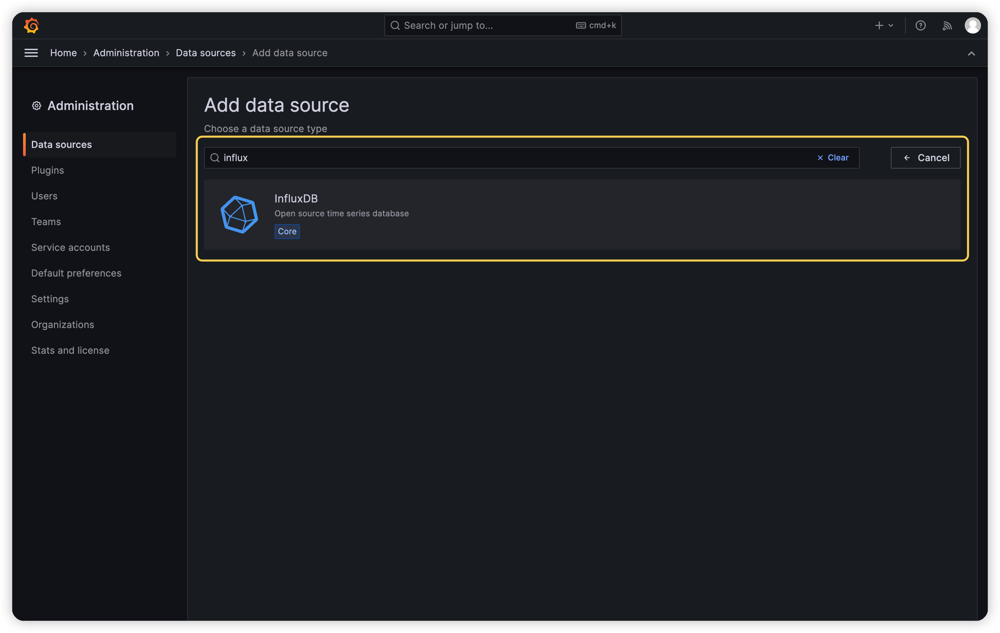
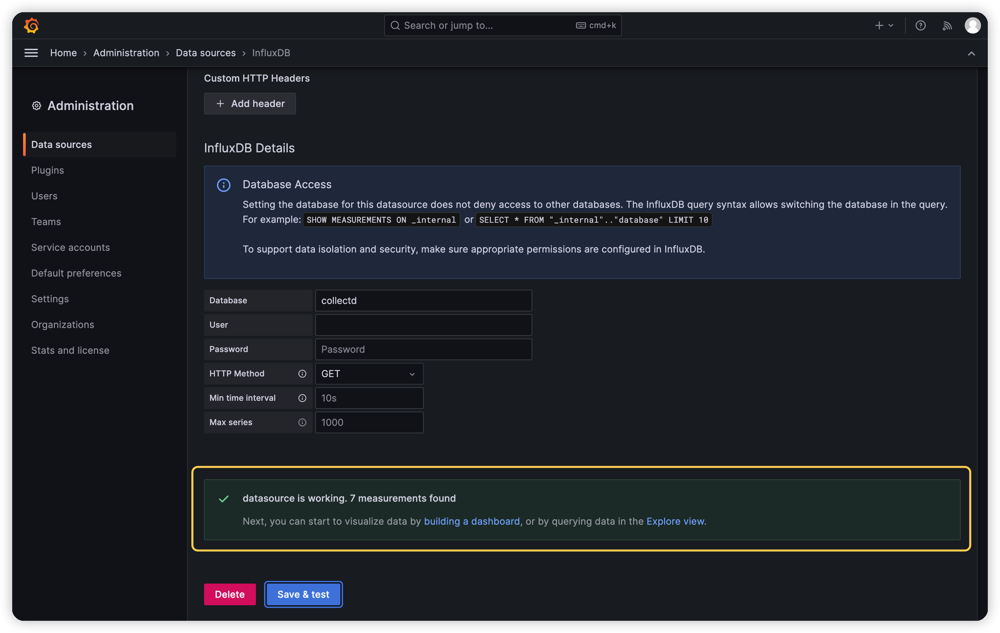
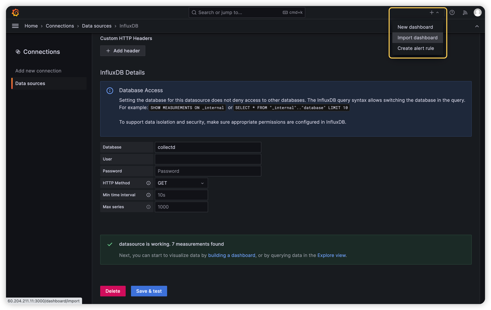
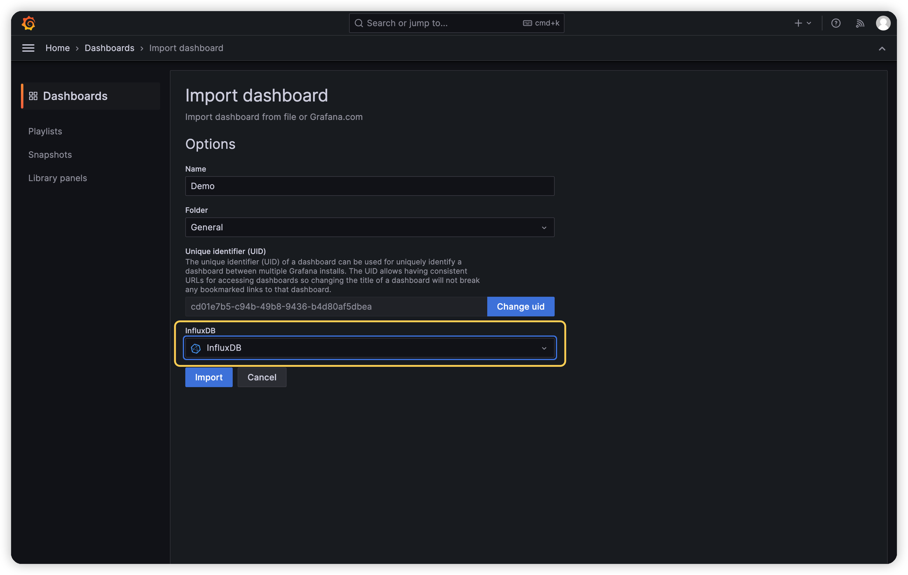
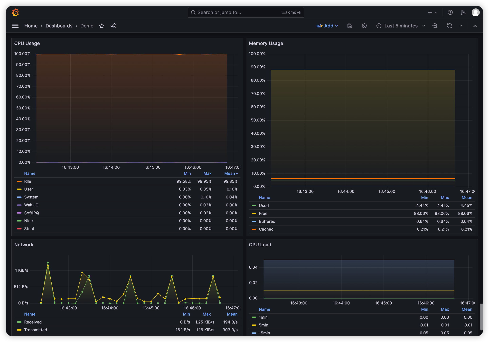
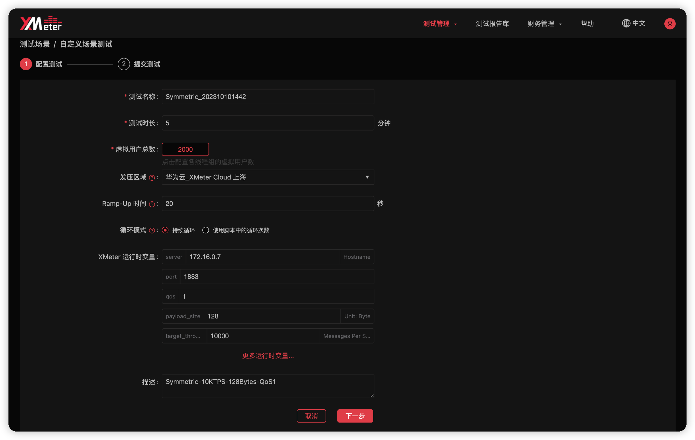
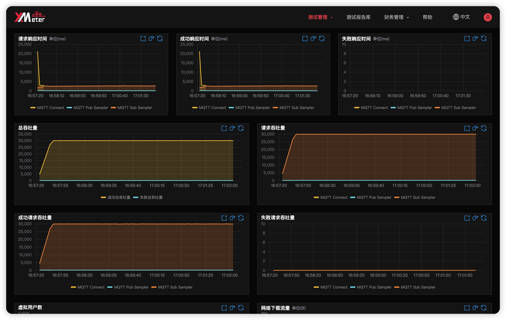

# 使用 XMeter Cloud 进行性能测试

本章节将介绍如何使用 XMeter Cloud 等工具对 EMQX 进行性能测试并获取更为全面的性能数据，比如消息的端到端平均延迟、P99 延迟等。XMeter Cloud 是 EMQ 公司推出的面向物联网关键业务的大规模性能测试公有云服务。它基于 Apache 开源项目 JMeter 构建，可以支持百万量级的模拟用户、设备并发连接以及消息吞吐的性能测试。

## 测试工具

你将用到以下软件或工具：

1. [EMQX Open Source](https://www.emqx.com/zh/try?tab=self-managed)，一款开源的大规模分布式 MQTT 消息服务器，专为物联网和实时通信应用而设计。
2. [XMeter Cloud](https://www.emqx.com/zh/products/xmeter)，全托管的 MQTT 负载测试云服务，基于 Apache 开源项目 JMeter 构建，可以快速运行各种 MQTT 负载和场景测试。
3. [collectd](https://github.com/collectd/collectd)，一个运行在系统上的守护进程，它可以收集CPU、内存、磁盘使用情况、网络数据等信息，并将这些数据发送到指定的数据存储中。
4. [InfluxDB](https://www.influxdata.com/)，一个用于存储和分析时间序列数据的开源时序数据库。
5. [Grafana](https://grafana.com/grafana/)，一个开源的数据可视化和监控工具，它可以将来自各种数据源的数据转换成美观的图表、图形和警告。

## 搭建测试环境

首先你需要部署两台服务器，其中一个服务器用来运行 EMQX 和 collectd，另一个服务器则用来运行 InfluxDB 和 Grafana。前者的硬件规格需要根据实际的测试规模进行调整，后者一般使用 4 核的机器即可。EMQX 所在的服务器必须拥有公网 IP 以便 XMeter Cloud 访问与测试。公有云通常是一个不错的选择。

如果不希望广域网的网络延迟影响最终的性能测试结果，你可以在 EMQX 与 XMeter 之间创建对等连接。XMeter Cloud 目前仅支持与华为云平台建立对等连接，你可以联系 XMeter 的技术团队完成对等连接的创建。

collectd 负责收集 EMQX 所在服务器的 CPU 占用等系统指标，然后把这些指标发送给部署在另一台服务器上的 InfluxDB，InfluxDB 会将这些数据存储下来。最后，Grafana 将 InfluxDB 作为数据源，以图表的方式展示这些指标数据。



接下来，你需要先在这两台云主机上完成这些软件的安装与配置，然后再从 XMeter Cloud 发起 MQTT 测试。

在这个过程中，你将用到一些文件，例如 Grafana Dashboard 的模板文件和在 XMeter Cloud 使用的测试脚本，你可以在 [bootcamp](https://github.com/emqx/bootcamp) 的 mqtt-test-kit 目录下找到它们。

### 1. 安装并配置 EMQX

在 Server 1 中下载并安装 EMQX：

```
wget https://www.emqx.com/en/downloads/broker/5.3.0/emqx-5.3.0-el7-amd64.rpm
sudo yum install emqx-5.3.0-el7-amd64.rpm -y
```

安装完成后运行以下命令即可启动 EMQX：

```
sudo systemctl start emqx
```

> 实际命令会因操作系统版本、安装方式的不同发生变化，请以 [下载](https://www.emqx.com/zh/downloads-and-install/broker) 页面提供的命令为准。

### 2. 安装并配置 collectd

在 Server 1 中安装 collectd：

```
yum install collectd -y
```

你将用到 CPU, Load, Interface, Memory 这四个插件，它们分别用来收集 CPU 占用、CPU 负载、网络流量和内存占用这些系统指标。这些插件默认启用，你可以在配置文件 `/etc/collectd.conf` 中找到以下配置：

```
LoadPlugin cpu
...
LoadPlugin interface
...
LoadPlugin load
...
LoadPlugin memory
```

collectd 的 CPU 插件默认报告每个核的 CPU 使用情况，并且使用的是 CPU Jiffies。你需要在配置文件中添加以下配置，才能使它直接报告所有核平均后的百分比：

```
<Plugin cpu>
  ReportByCpu false
  ReportByState true
  ValuesPercentage true
</Plugin>
```

接下来，你还需要配置 collectd 的 network 插件，让 collectd 将收集到的性能指标发送给另一台服务器上的 InfluxDB。你需要在 `/etc/collectd.conf` 中添加以下配置，启用 network 插件并将性能指标发送到指定的 Host 和端口。`{Host}` 需要替换为 Server 2 实际的局域网 IP：

```
LoadPlugin network
<Plugin network>
  Server "{Host}" "25826"
</Plugin>
```

完成以上配置后，运行以下命令启动 collectd：

```
systemctl start collectd
```

### 3. 安装并配置 InfluxDB

在 Server 2 中安装 InfluxDB 1.8：

```
wget https://dl.influxdata.com/influxdb/releases/influxdb-1.8.10.x86_64.rpm
sudo yum localinstall influxdb-1.8.10.x86_64.rpm -y
```

请勿安装 InfluxDB 2.7 及以上的版本，这些版本不再直接支持 collectd、Prometheus 等备用写入协议。你必须使用 Telegraf 将这些协议转换成 Line Protocol 再写入到 InfluxDB 中。所以为了简单起见，请直接安装支持 collectd 写入协议的 InfluxDB 1.8。

安装完成后，你需要修改 InfluxDB 的配置让它能够接收 collectd 发送的性能指标并存储至数据库。打开 InfluxDB 的配置文件 `/etc/influxdb/influxdb.conf`，将 `collectd` 部分的配置项改为以下内容：

```
[[collectd]]
  enabled = true
  bind-address = ":25826"
  database = "collectd"
  batch-size = 5000
  batch-pending = 10
  batch-timeout = "10s"
  read-buffer = 0
  typesdb = "/usr/share/collectd/types.db"
  security-level = "none"
  parse-multivalue-plugin = "split"
```

以上配置表示 InfluxDB 将监听 25826 端口上的 collectd 数据，并将其写入到名为 collectd 的数据库，该数据库由 InfluxDB 自动创建。

`typesdb` 是必须的，它指向一个 `types.db` 文件，这个文件定义了 collectd 数据源规范，InfluxDB 需要通过这个文件来理解 collectd 的数据。你可以在当前机器中安装 collectd 来获取这个文件，`/usr/share/collectd/types.db` 就是以 yum 方式安装 collectd 时 `types.db` 文件的默认路径，或者直接从 [这里](https://github.com/emqx/bootcamp/blob/main/mqtt-test-kit/types.db) 获取 `types.db`。

`security-level` 设置为 `none` 表示 collectd 数据不会经过签名和加密，与 collectd 的配置保持一致。

`parse-multivalue-plugin` 设置为 `split` 表示 InfluxDB 会将具有多个值的数据分开存储为多个数据点。

接下来，启动 InfluxDB：

```
sudo systemctl start influxdb
```

你可以通过以下命令来验证 collectd 的数据是否正确地写入了 InfluxDB：

```
$ influx
Connected to http://localhost:8086 version 1.8.10
InfluxDB shell version: 1.8.10
> use collectd
Using database collectd
> select * from cpu_value limit 8
name: cpu_value
time                host     type    type_instance value
----                ----     ----    ------------- -----
1692954741571911752 ecs-afc3 percent user          0.049981257028614265
1692954741571917449 ecs-afc3 percent system        0.024990628514307132
1692954741571923666 ecs-afc3 percent wait          0.024990628514307132
1692954741571932372 ecs-afc3 percent nice          0
1692954741571943586 ecs-afc3 percent interrupt     0
1692954741571947059 ecs-afc3 percent softirq       0
1692954741571947389 ecs-afc3 percent steal         0
1692954741571949536 ecs-afc3 percent idle          99.90003748594276
```

### 4. 安装并配置 Grafana

在 Server 2 中安装 Grafana：

```
sudo yum install -y https://dl.grafana.com/oss/release/grafana-10.0.0-1.x86_64.rpm
```

启动 Grafana：

```
systemctl start grafana-server
```

接下来，你需要在 Grafana 中导入一个我们提前准备好的 Dashboard，这个 Dashboard 会提供 CPU 占用率、CPU 负载、内存占用率和网络流量四个监控面板，点击 [这里](https://github.com/emqx/bootcamp/blob/main/mqtt-test-kit/Grafana-Dashboard.json) 下载 Dashboard 模板文件。

在导入 Dashboard 前，你需要对 `Grafana-Dashboard.json` 文件稍作修改。因为该 Dashboard 的每个 Query 中都添加了对 host 字段的判断以便在存在多个主机数据来源时进行区分。

在 `Grafana-Dashboard.json` 文件中搜索 `host::tag`，你将找到以下内容：

```
...
{
  "condition": "AND",
  "key": "host::tag",
  "operator": "=",
  "value": "ecs-afc3"
}
...
```

将 `ecs-afc3` 这个主机名全局替换为你自己的主机名即可。你可以运行以下命令来查看主机名：

```
cat /proc/sys/kernel/hostname
```

然后，打开浏览器在地址栏输入 `http://<hostname>:3000` 以访问 Grafana，`<hostname>` 需要替换成实际的服务器地址。

Grafana 的默认用户名和密码均为 `admin`，首次登录时 Grafana 会要求你修改默认密码。完成登录后你需要首先添加 InfluxDB 作为数据源，在首页点击 `Add your first data source`：



找到 InfluxDB 数据源，点击以添加此数据源并进入配置页面：



这里你只需要关注三个配置项：

1. URL，InfluxDB 的 HTTP 服务默认监听 8086 端口，而 InfluxDB 与 Grafana 位于同一台服务器中，所以将它配置为 `http://localhost:8086` 即可。
2. Database，Grafana 将从该数据库中读取 collectd 数据，请将它配置为 `collectd`。
3. HTTP Method，指定 Grafana 向 InfluxDB 查询数据时使用的 HTTP 方法，将它配置为 `GET` 即可。

完成配置后点击 `Save & test` 按钮，如果配置正确，你将看到 `datasource is working. 7 measurements found` 这个提示：



点击右上角的加号，选择 `Import dashboard`：



导入修改好的 `Grafana-Dashboard.json` 文件，并选择刚刚添加的 InfluxDB 数据源：



点击 `Import` 按钮完成导入，你将看到以下四个监控图表，它们分别展示了当前服务器 CPU 占用率、内存占用率、网络收发流量以及 CPU 负载的变化情况：



### 5. 系统调优

根据实际的测试规模，你可能还需要调整 Linux 内核参数和 EMQX 参数。例如当 MQTT 客户端连接数量超过 65535 时，你可能需要调整 `fs.file-max` 等参数以增加 EMQX 能够打开的最大文件句柄数。而当消息吞吐量较大时，你可能还需要调整发送和接收缓冲区的大小设置以获得更好的性能表现。你可以参考 [系统调优](./tune.md) 文档，本章节不再另行展开。

### 6. 在 XMeter Cloud 中创建测试

注册并登录 [XMeter Cloud](https://www.emqx.com/en/products/xmeter)，在进入首页后，你将看到 **标准版** 和 **专业版** 两个版本可供选择，两个版本的具体区别可以查看 XMeter Cloud 文档中的 [产品版本](https://docs.emqx.com/zh/xmeter-cloud/latest/price/plan.html) 章节。

这里我们以 **专业版** 为例，在切换至 **专业版** 后，你将看到 **MQTT 标准场景测试** 和 **自定义场景测试** 两个测试选项。

在 **MQTT 标准场景测试** 中，XMeter Cloud 预设了一些标准场景，比如消息上报、1 对 1 通信等，你只需要简单配置发布、订阅的客户端数量、消息发布速率等参数即可发起测试。

在 **自定义场景测试** 中，你可以实现对更复杂的场景的测试，但需要自行编写 JMeter 测试脚本并上传至 XMeter Cloud。作为参考，你可以在 [这里](https://github.com/emqx/bootcamp/tree/main/mqtt-test-kit/scripts) 中下载示例脚本。其中的 `Fan-In.jmx`、`Fan-Out.jmx`、`Symmetric.jmx`、`Symmetric-Bridge.jmx`，分别对应扇入、扇出、对称以及桥接场景。

每个脚本都提供了自定义变量以便你修改 QoS 等级、Payload 大小、消息发布速率等参数。以对称通信的 `Symmetric.jmx` 脚本为例，在提交测试前，你需要配置以下参数：



- **测试名称**：XMeter Cloud 默认会将测试场景名与当前时间拼接后作为测试名称，你可以将它更改为任何你喜欢的名字，只要它不会让你在多个测试之间混淆。
- **测试时长**：设置本次测试的持续时间。
- **虚拟用户总数**：设置每个线程组的虚拟用户数，也就是 MQTT 客户端的数量，线程组取决于脚本的实际内容。`Symmetric.jmx` 脚本包含了一个用于发布消息的线程组 Pub 和一个用于接收消息的线程组 Sub。所以如果将 Pub 和 Sub 线程组的虚拟用户数均设置为 1000，那么总数就是 2000。
- **发压区域**：设置创建测试机并发起负载的 VPC，仅在使用对等连接时需要配置。
- **Ramp-Up 时间**：设置测试脚本运行时需要在多少时间内到达设置的虚拟用户总数。如果虚拟用户总数为 2000，Ramp-Up 时间设置为 20 秒，那么 XMeter Cloud 将以每秒 100 连接的速率发起连接。
- **循环模式**：`持续循环` 表示测试运行的时长将完全由 `测试时长` 参数决定；`使用脚本中的循环次数` 表示测试可能早于 `测试时长` 指定的时间结束，但最长不会超过 `测试时长`。
- **XMeter 运行时变量**：这里列出的是测试脚本中定义的变量，这允许我们通过修改变量来实现对测试用例的微调，例如改变消息的 QoS 等级等等。以下是 `Symmetric.jmx` 脚本提供的自定义变量：
  - server：MQTT 服务器地址，在创建对等连接后这里需要配置为该服务器的内网地址。
  - host：MQTT 服务器的监听端口。
  - qos：消息被发布时使用的 QoS 等级。订阅者订阅的最大 QoS 固定为 2，确保不会发生消息降级。
  - payload_size：消息的 Payload 大小，单位为字节。
  - target_throughput：目标吞吐量，这里指的是消息的总发布速率。如果将发布线程组的虚拟用户数设置为 1000，target_throughput 设置为 10000，那么每个发布端将以 10 msgs/s 的速率发布消息。
  - publisher_number 等：在 XMeter Cloud 中，这些变量会被前面的虚拟用户总数、Ramp-Up 时间等配置覆盖，所以无需关心。它们仅在你直接使用 JMeter 发起测试时有效。

完成以上配置后，你便可以点击 `下一步` 提交测试。在测试的运行过程中，你可以在 XMeter Cloud 中观察吞吐量、响应时间的实时变化，在 Grafana Dashboard 中观察 EMQX 所在服务器的 CPU 等系统资源使用情况：


