# EMQX 性能参考

按照 [使用 XMeter Cloud 进行性能测试](./benchmark-xmeter) 的测试步骤，我们测试了 EMQX 在几个典型场景下的性能变化曲线，我们可以直观地了解到 EMQX 在这些场景下的基准性能，以及 QoS 等级，Payload 大小这些因素对于 MQTT 性能的实际影响。

## 测试环境

本章节的所有测试均基于单节点部署的 **EMQX v5.1.6 开源版本** 测得。EMQX 与 XMeter Cloud 创建了对等连接以消除外部网络延时的干扰。运行 EMQX 的服务器规格如下：

- **实例类型**：华为云通用计算增强型 c7
- **规格名称**：c7.xlarge.2
- **CPU**：4vCPUs (Intel Xeon Platinum 8378A CPU @ 3.00GHz)
- **内存**：8 GiB
- **硬盘**：通用型 SSD | 40 GiB
- **最大带宽**：8 Gbit/s
- **最大内网收发包**：80万 PPS（Packets Per Second）
- **操作系统**：CentOS 7.9

除扇入场景下 XMeter Cloud 使用了 20 台测试机来发布和接收消息以外，其余场景下的测试机数量均为 10 台。

## 测试场景与结果

### 场景 1：EMQX 处理不同 QoS 时的性能表现

QoS 等级越高，对应的 MQTT 报文交互流程也越复杂，所以传递该 QoS 消息所消耗的系统资源也会更多。不同的 QoS 之间的性能差距到底如何，是开发者一直都很关心的问题。

在本场景中，1,000 个发布者和 1,000 个订阅者使用 Payload 大小为 128 字节的消息进行一对一通信。即，一共存在 1,000 个主题，但每个主题都只会有一个发布者和一个订阅者。

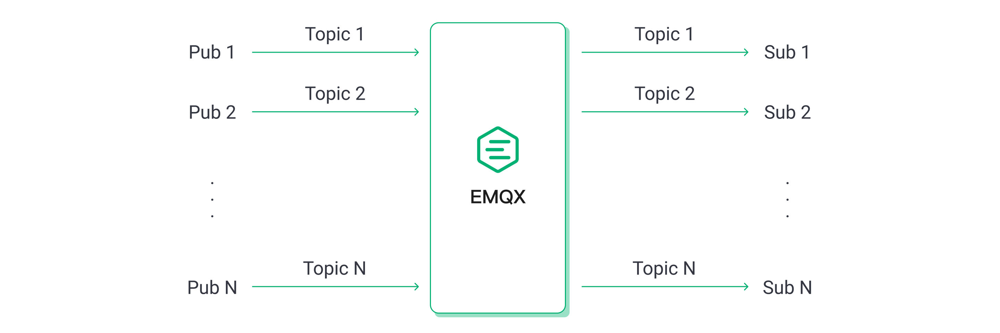

我们以逐渐增大消息发布速率的方式来增加负载，EMQX 在每个负载下运行 5 分钟以确保运行的稳定性。最终我们将获得 EMQX 在不同 QoS 等级，不同负载下的性能表现和资源占用情况，包括但不限于：平均消息延迟、P99 消息延迟、CPU 平均占用率。

最终测试结果如下：

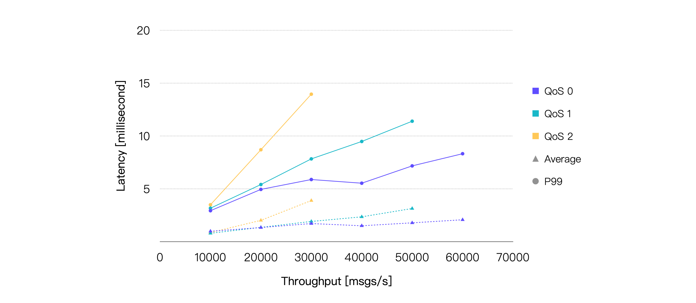

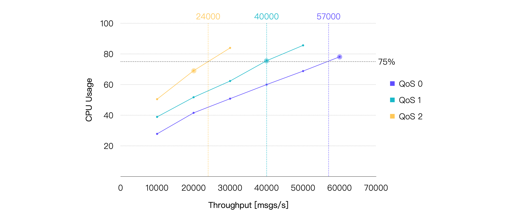

> Latency 指消息从发布到被接收所花费的时间。Throughput 包含消息流入与流出。

如果我们将平均 CPU 占用率在 75% 左右时的负载作为推荐的日常负载，那么可以得出：**在当前的硬件规格以及测试场景下**，QoS 0 的推荐负载约为 57K TPS，QoS 1 的推荐负载约为 40K TPS，QoS 2 的推荐负载约为 24K TPS。以下是 CPU 占用与 75% 最接近的测试点的性能数据：

| **QoS Level** | **Recommended Workload, TPS (In + Out)** | **Average CPU Usage, % (1 - Idle)** | **Average Memory Usage, %** | **Average Letancy, ms** | **P99 Letancy, ms** |
| :------------ | :------------------------------ | :---------------------------------- | :-------------------------- | :---------------------- | :------------------ |
| QoS 0         | 60K                             | 78.13                               | 6.27                        | 2.079                   | 8.327               |
| QoS 1         | 40K                             | 75.56                               | 6.82                        | 2.356                   | 9.485               |
| QoS 2         | 20K                             | 69.06                               | 6.39                        | 2.025                   | 8.702               |

### 场景 2：EMQX 处理不同 Payload 大小时的性能表现

消息的 Payload 越大，操作系统需要更多的软中断来接收和发送网络报文，EMQX 也需要花费更多的计算资源来序列化和反序列化消息，因此理论上最终的性能表现也会越差。

在大部分情况下，我们发送的消息都不会超过 1KB，但在某些场景下，传输更大的消息是必要的。所以在这个场景中，我们将测试 Payload 大小对性能的实际影响。

继续由 1,000 个发布者和 1,000 个订阅者进行一对一通信，但是将消息的 QoS 设置为 1，且发布速率固定为 20K msgs/s，通过增加 Payload 大小的方式增加负载，EMQX 同样将在每个负载下运行 5 分钟以确保稳定，我们记录 EMQX 在每个负载下的性能表现和资源占用情况。

测试结果如下：

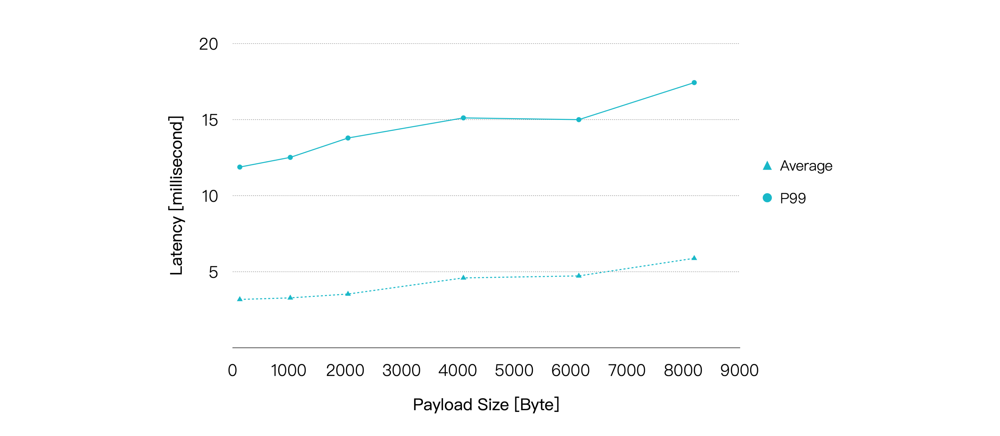

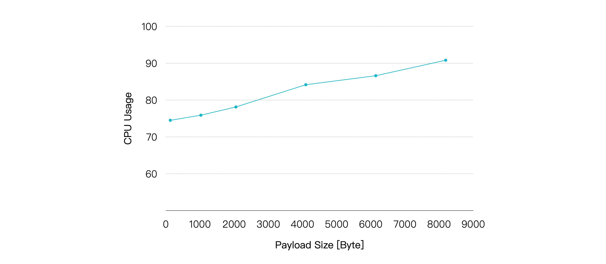

随着 Payload 增大，CPU 占用率逐渐升高，消息的端到端延迟也随之出现较为平滑的增长。不过在 Payload 大小到达 8KB 时，我们仍然可以获得小于 10 毫秒的平均延迟以及小于 20 毫秒的 P99 延迟。

| **Payload Size, KB** | **Recommended Workload, TPS (In + Out)** | **Average CPU Usage, % (1 - Idle)** | **Average Memory Usage, %** | **Average Letancy, ms** | **P99 Letancy, ms** |
| :------------------- | :---------------- | :---------------------------------- | :-------------------------- | :---------------------- | :------------------ |
| 1                    | 40K               | 75.9                                | 6.23                        | 3.282                   | 12.519              |
| 8                    | 40K               | 90.82                               | 9.38                        | 5.884                   | 17.435              |

所以，除了 QoS 等级以外，我们同样需要注意性能测试报告中使用的 Payload 大小，如果我们实际使用的 Payload 大小远远大于报告中使用的值，这意味着我们所需要的硬件规格也会更高。

### 场景 3：EMQX 在不同发布订阅模式下的性能表现

MQTT 的发布订阅机制使我们可以很轻松地调整消息的发布和订阅模式，来满足不同业务场景的需要，例如大量传感器设备作为发布者，少量甚至单个后端应用程序作为订阅者存储或分析传感器数据的这类扇入场景，或者消息广播这类少量发布者大量订阅者的扇出场景，又或者是发布者与订阅者需要一对一通信的对称场景。

但 MQTT Broker 在不同发布订阅模式下的性能表现通常也会存在细微的不同，接下来我们将通过实际的测试来验证这一点。

对称场景与前面保持一致。扇入场景下，我们设置 2,000 个发布者和 100 个订阅者，每 100 个发布者的消息由 5 个订阅者以共享订阅方式消费。

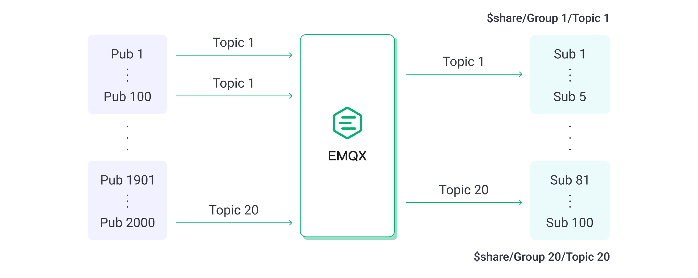

扇出场景下，我们设置 10 个发布者和 2,000 个订阅者，每个发布者的消息由 200 个订阅者以普通订阅方式消费。

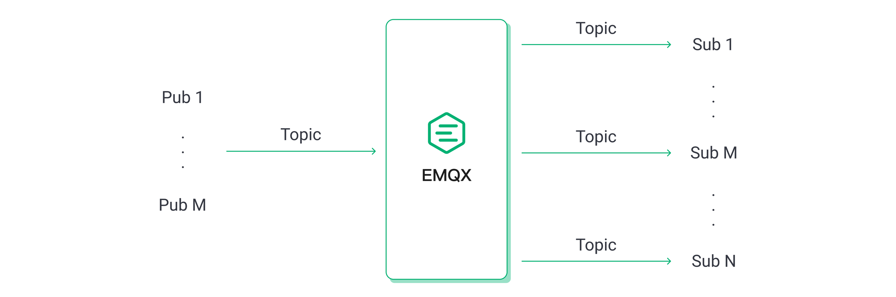

由于扇出场景下消息流入相比其他两个场景更少，因此我们将总吞吐量一致或接近视为相同负载然后进行对比。例如扇出场景下消息流入 100 msgs/s，流出 20K msgs/s，便等同于对称场景下消息流入 10K msgs/s，流出 10K msgs/s。

保持消息的 QoS 等级为 1，Payload 大小为 128 字节，最终测试结果如下：

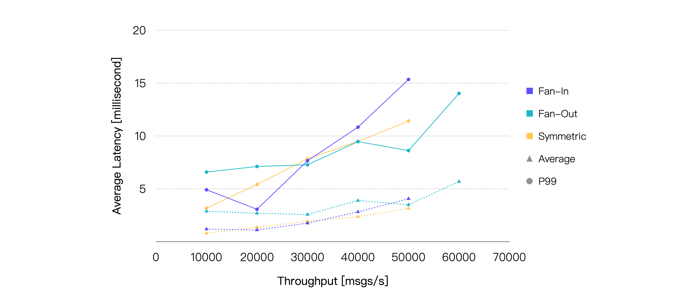

如果仅看消息延迟，三种场景的性能表现其实非常接近。但实际上在相同的负载下，扇出场景消耗的 CPU 总是更低。所以如果我们以 75% 的 CPU 占用率为界限，就能比较直观地看到，相比于另外两个场景，扇出可以达到更高的负载：

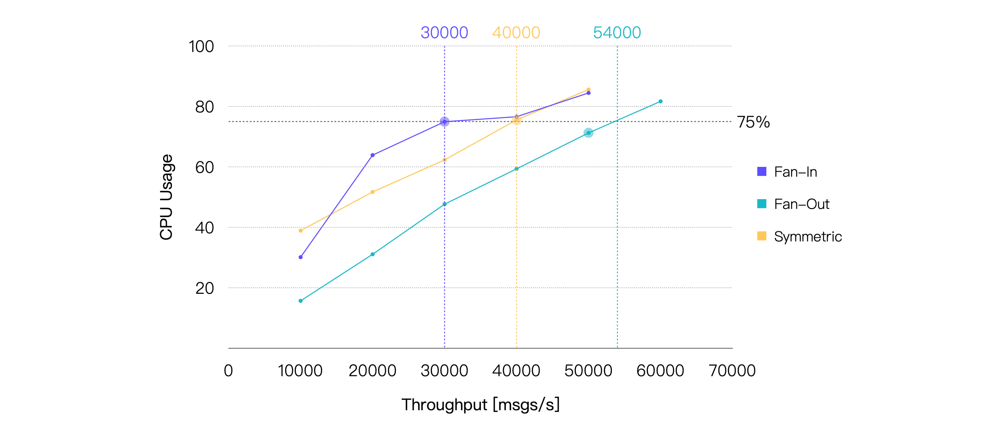

| **Scene** | **Recommended Workload, TPS (In + Out)** | **Average CPU Usage, % (1 - Idle)** | **Average Memory Usage, %** | **Average Letancy, ms** | **P99 Letancy, ms** |
| :-------- | :------------------------------ | :---------------------------------- | :-------------------------- | :---------------------- | :------------------ |
| Fan-In    | 30K                             | 74.96                               | 6.71                        | 1.75                    | 7.651               |
| Fan-Out   | 50K                             | 71.25                               | 6.41                        | 3.493                   | 8.614               |
| Symmetric | 40K                             | 75.56                               | 6.82                        | 2.356                   | 9.485               |

### 场景 4：EMQX 在桥接时的性能表现

MQTT 桥接可以将一个 MQTT 服务器中的消息桥接至另一个服务器，常见的使用场景包括将边缘网关汇聚的消息桥接至云端服务器以及令消息在两个 MQTT 集群间流通。

在这个测试场景中，连接到 MQTT 服务器 1 的 500 个发布端发布的消息，会被桥接到 MQTT 服务器 2，被连接到该服务器的 500 个订阅端接收。而连接到 MQTT 服务器 2 的另外 500 个发布端 发布的消息，则会被连接到 MQTT 服务器 2 的 500 个订阅端接收。

这将保证在客户端的消息发布速率相同的情况下，EMQX 中消息流入流出的速率将与未配置桥接的对称场景接近，以便我们对比两者的性能差异。

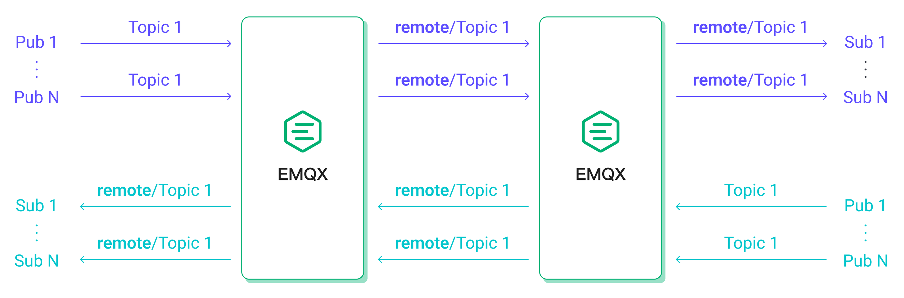

保持消息的 QoS 等级为 1，Payload 大小为 128 字节，最终测试结果如下：

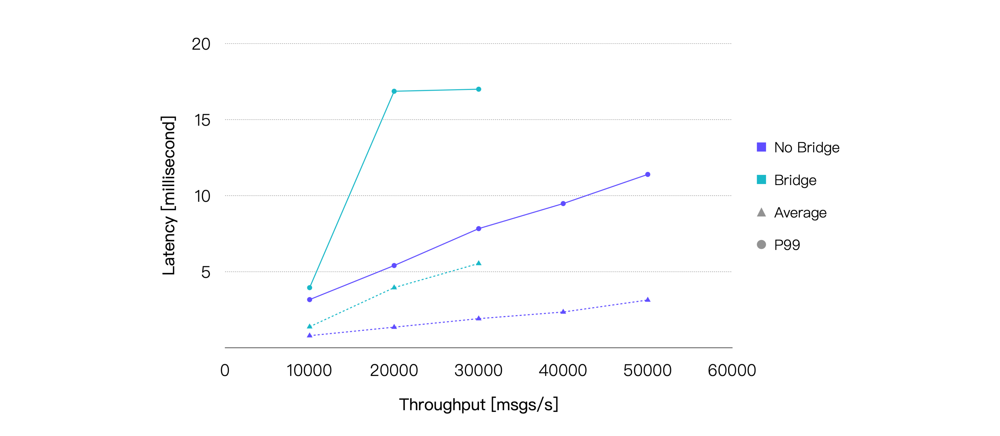

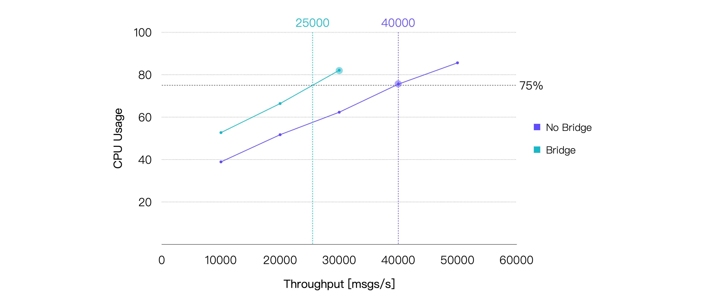

桥接在消息投递的过程中引入了一个额外的中转，所以消息的端到端延迟将会增加。另外，桥接也会带来额外的 CPU 消耗。我们的测试结果也印证了这两点。取平均 CPU 占用率在 75% 左右时的负载，即约 25K TPS 作为桥接场景在本次测试的硬件规格下的推荐负载，CPU 占用与之相差最小的测试点的测试结果如下：

| **Recommended Workload, TPS (In + Out)** | **Average CPU Usage, % (1 - Idle)** | **Average Memory Usage, %** | **Average Letancy, ms** | **P99 Letancy, ms** |
| :------------------------- | :---------------------------------- | :-------------------------- | :---------------------- | :------------------ |
| 30K                        | 82.09                               | 5.6                         | 5.547                   | 17.004              |
