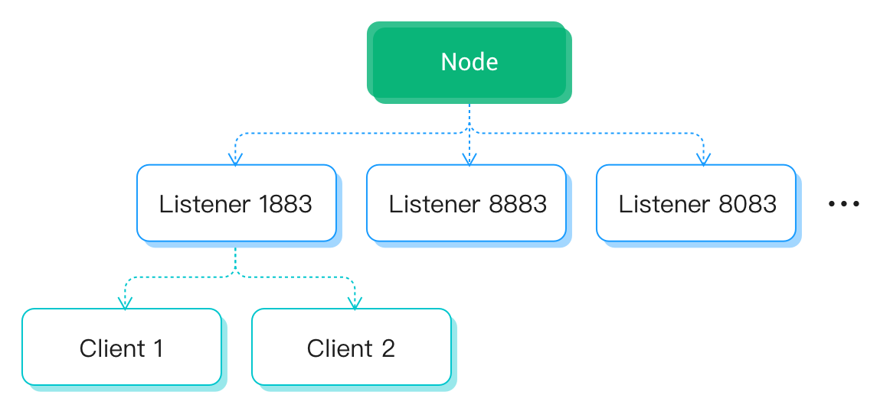

# 速率限制

EMQX 提供对接入速度、消息速度的限制，从入口处避免了系统过载，保证了系统的稳定和可预测的吞吐。

5.0 引入了新的基于分层令牌桶算法的多层速率、流量控制系统，可以灵活和精确的控制 EMQX 节点内相应资源的使用速率。

## 概念

### 资源

该系统目前支持为以下 4 种资源提供速率控制服务:

| 类型            | 描述                       | 过载后行为         |
|:----------------|:---------------------------|:-------------------|
| bytes_in        | 每秒流入的消息的字节数大小 | 暂停接收客户端消息 |
| message_in      | 每秒流入的消息条数         | 暂停接收客户端消息 |
| connection      | 每秒的连接数               | 暂停接收新的连接   |
| message_routing | 会话每秒派发的消息数量     | 暂停消息的派发     |

### 速率控制层级

-   **节点级:** 资源在当前 EMQX 节点上的速率控制
-   **监听器级:** 通过某个端口接入的所有连接(会话)的总和速率限制
-   **连接级:** 资源在单个连接(会话)上的速率控制

### 层级关系

层级关系如图所示:

 

### 短板效应
  低层级的速率无论其配置的是多少，都受到上层实际速率的限制，保证永远不会超过上层的实际速率限制

## 使用

### 连接级
  连接级的速率限制针对的是单个连接，假设需要限制通过 1883 端口接入的每个会话的消息流入速度为每秒 100 条， 则只需要在 emqx.conf 中将 1883 端口配置修改如下:

```
listeners.tcp.default {
  bind = "0.0.0.0:1883"
  max_connections = 1024000
  limiter.client.message_in {
    rate = "100/s"
    capacity = 100
  }
}
```

在该级别下支持的所有字段如下:

| 配置字段       | 类型     | 默认值     | 说明   |
|:---------------|:---------|:---------|:-------|
| rate           | int      | infinity | 令牌生成速率 |
| initial        | int      | 0        | 令牌初始数量 |
| capacity       | int      | infinity | 令牌数量上限 |
| low_watermark  | int      | 0        | 低水位线，当令牌数量低于这个数量时，即使令牌申请成功，也会被轻微限速 |
| divisible      | bool     | false    | 当令牌数量不够时，令牌申请是否可以被拆分成多次申请 |
| max_retry_time | duration | 10s      | 令牌申请的最大尝试时间，超过这个时间都没有获得令牌，则申请失败 |


### 监听器级
  监听器级针对的是通过某个端口接入的所有会话的总和速率限制，比如希望所有通过 1883 端口接入的会话， 在每秒产生的消息输入总和不超过 100 条，则可以将配置修改如下：

```
listeners.tcp.default {
  bind = "0.0.0.0:1883"
  max_connections = 1024000
  limiter.message_in {
    rate = "100/s"
    capacity = 100
  }
}
```

在该级别下支持的所有字段如下:

| 配置字段       | 类型     | 默认值     | 说明   |
|:---------------|:---------|:---------|:-------|
| rate           | int      | infinity | 令牌生成速率 |
| initial        | int      | 0        | 令牌初始数量 |
| capacity       | int      | infinity | 令牌数量上限 |

### 节点级

节点级控制的是当前节点上的资源消耗速度，假如希望限制当前节点每秒流入的消息数量不超过 100 条，则 可以在 emqx.conf 中加入如下配置：


```
limiter.message_in.rate = "100/s"
```

**注意：** 只有配置了速率限制的监听器，才会受到节点级设置的影响

在该级别下支持的所有字段如下:

| 配置字段       | 类型     | 默认值     | 说明   |
|:---------------|:---------|:---------|:-------|
| rate           | int      | infinity | 令牌生成速率 |
| burst          | int      | 0        | 当过载时(令牌的消耗速率大于生成速率)，burst 会作为额外的生成速率进行令牌的补充 |
