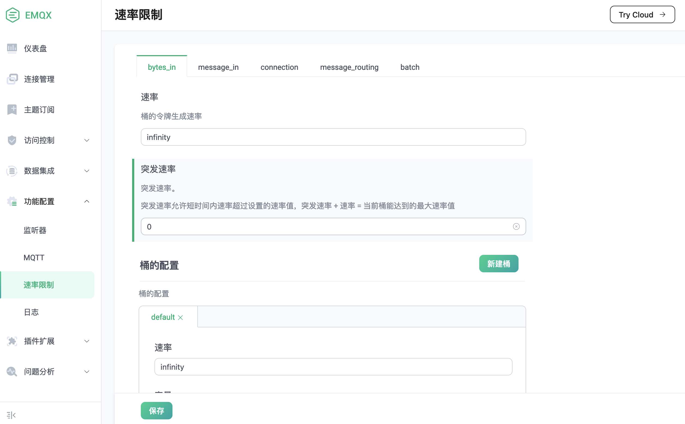
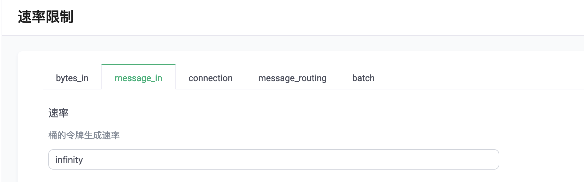
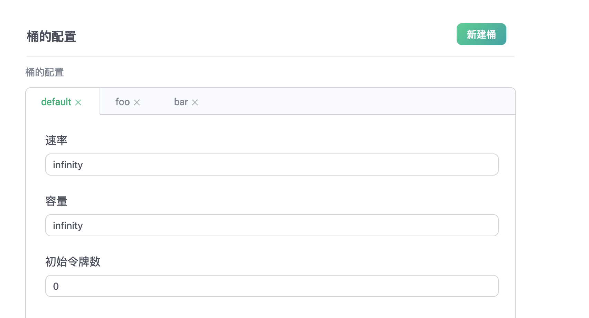
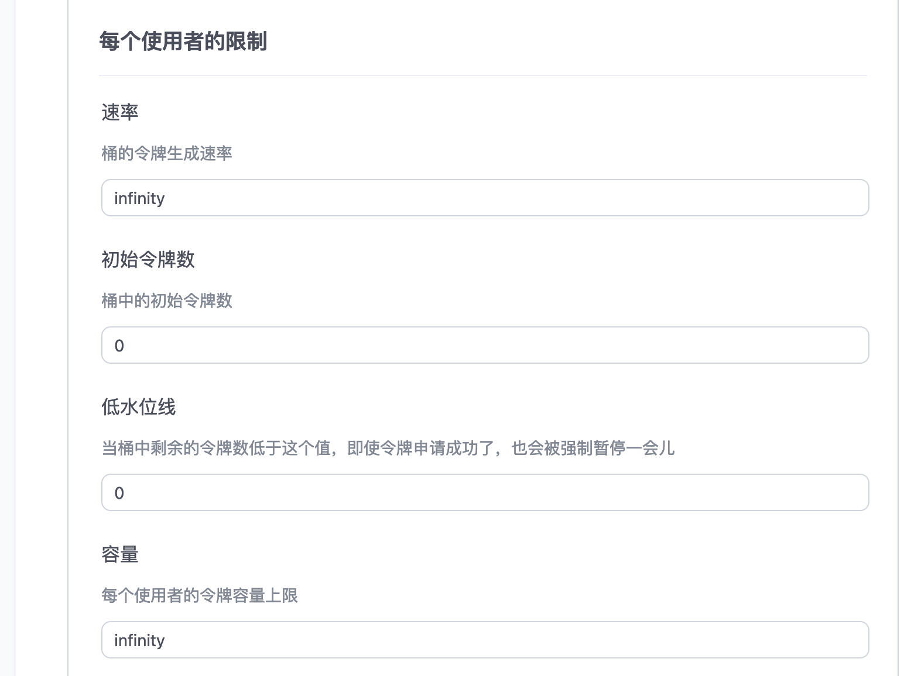
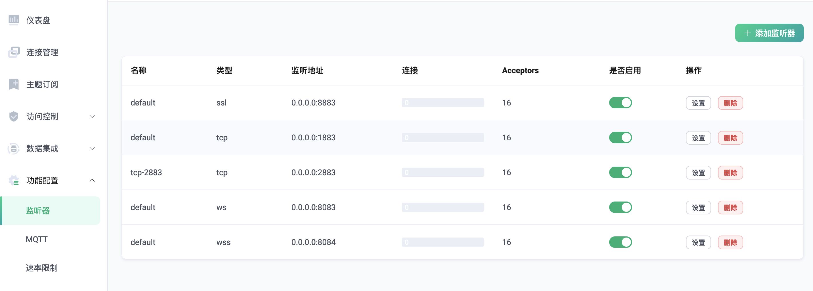
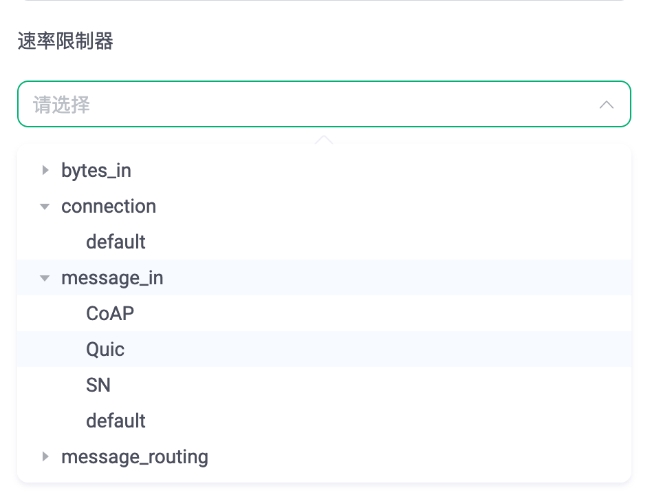
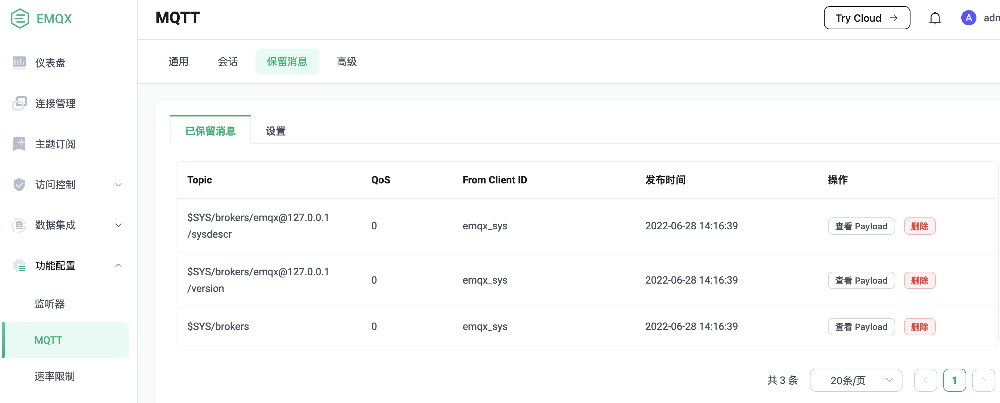

# 分层速率控制系统

分层速率控制系统是一个基于 生产者/消费者 模式的多层速率、流量控制系统，可以灵活和精确的控制 EMQX 节点内相应资源的使用速率。

# 概念

## 资源

该系统目前支持为以下 5 种资源提供速率控制服务:

-   **bytes\_in:** 消息的流入字节速率
-   **message\_in:** 消息的流入速率
-   **connection:** 连接速率
-   **message\_routing:** 消息路由的速率
-   **batch:** 节点内的批量操作的速率

    注意: 目前只有 `保留消息` 使用到了该功能

## 生产者/消费者 模式

整个系统分为 `生产者` 和 `消费者` 两个部分

### 生产者

生产者即系统内的 `速率控制服务`, 用来管理和控制资源令牌的生成、分配

### 消费者

消费者即消费资源的实体，每次消耗资源前，都必须先申请到等量的令牌。

该系统为资源消费提供了三个 `速率控制层级`

## 速率控制层级

-   **节点级:** 资源在当前 EMQX 节点上的速率控制
-   **服务级:** 资源在某一个功能或某一类服务上的速率控制

    服务级目前有 `监听器` 和 `保留消息` 两种类型

    其中， `监听器` 支持以下资源:

    -   bytes\_in
    -   message\_in
    -   connection
    -   message\_routing

    `保留消息` 只支持 `batch` 资源
-   **用户级:** 资源在具体某一个用户上的速率控制
    -   **用户:** 用户是指某个 `服务级` 下，任何消费资源的实体，比如某个连接或者进程等

# 使用

## 设置速率服务

1. 打开 Dashboard 上的设置界面,选择需要设置的类型
2. 按照需要进行设置，然后点击 `保存` 即可

### 层级对应关系

每种资源都有三个层级的速率控制，以 `message_in` 为例，层级和设置的对应关系如下:

-   **节点:** 界面最上层的速率设置，控制当前节点上的消息流入速率

-   **服务级:** 设置界面中的 `桶` 对应的即是 `服务级` ，用来控制某个监听器下所有连接的总和消息流入速率

    注意: `桶` 的数量不是固定的，可以根据具体使用场景设置多个 `桶` ，每个 `桶` 可以用来控制不同的监听器下所有连接的总和速率限制
-   **用户级:** `桶` 中的 `每个使用者的限制` 即对应的是 `用户级`, 用来控制监听器下每个连接的消息流入速率

## 使用速率服务

速率控制服务设置后，并不会对其他功能产生影响，如果某个功能（监听器、保留消息等）想要使用速率控制服务，还需要在相应的地方进行设置

### 监听器

1.  在 dashboard 上打开 `监听器` 界面

    

    选择需要使用速率控制服务的监听器，点击 `设置`
2.  在 `基本信息` 栏中，点击 `速率限制器`

    

3.  在需要进行速率控制的资源下选择对应的桶

    

    注意: 这里是支持多选的，如图
    

### 保留消息

1.  在 dashboard 上打开 `保留消息` 界面

    

2.  在 `流控` 一栏中的的 `Limiter` 上填上 `batch` 速率控制服务下对应的桶，然后更新即可

    
