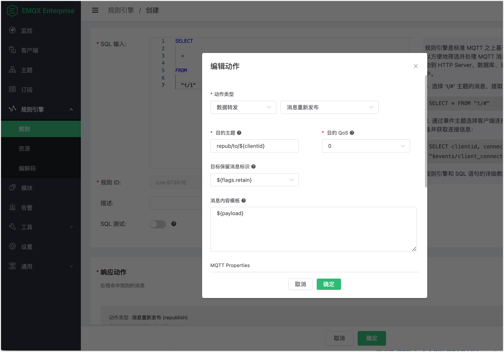

# 消息重发布动作

消息重发布 (Republish) 动作用来重新发出一个新的 MQTT 消息。新消息的`主题`、`QoS`、`Retain` 和`消息内容`等可以通过参数指定。

注意消息重发布动作不会终止老消息的投递。举例来说，如果一个消息 "t/1" 被重发布动作接收，然后重新发出一个新的 "t/2" 消息，"t/1" 的投递不会终止，订阅了 "t/1" 主题的客户端仍然可以接收到该消息。

## 创建规则和动作

1. 点击 Dashboard 左侧导航菜单中的**规则引擎** -> **规则**。
2. 点击页面上的**+** **创建** 按钮，在 **SQL 输入**中输入以下 SQL示例：

```SQL
SELECT

  *

FROM

  "t/1"
```

3. 在**响应动作**区域点击**+** **添加动作**，在**动作类型**下拉框中选择`数据转发` -> `消息重新发布`。配置以下参数：

   - **目的主题**：转发消息的主题名，默认值为 `repub/to/${clientid}`，类型为 String。可以使用占位符变量，例如 `${repub/to/${clientid}}`， 在规则 SQL 配合使用的情况下，表示使用发布者的 clientid 作为后缀。如选择自定义业务规则 SQL，可以使用其他的变量来代替。

   - **目的 QoS**: 转发消息的 QoS 等级，默认值为 `0`，类型为 Integer 或占位符变量。可使用 0、1 或 2，也可以使用占位符变量，例如 `${qos}`，在规则 SQL 配合使用的情况下，表示使用原消息的 QoS 等级。如选择自定义业务规则 SQL，可以使用其他的 Integer 类型的变量来代替。

   - **目标保留消息标识**：转发消息的保留消息标识，类型为 Boolean 或占位符变量。可选值为 `false`, `true`, 或 `${flags.retain}`，默认值为 `false`。在规则 SQL 配合使用的情况下，`${flags.retain} `表示使用原消息的 Retain 标识。自定义业务规则 SQL，可以使用其他的 Boolean 类型的变量来代替。

     ::: tip 注意

     当 QoS 与 Retain 使用占位符变量之后，从消息信息中获取到的参数不合法（即 QoS 不是 `0`、`1` 或 `2`，Retain 不是 `true` 或 `false`）时，消息会被丢弃，并标记此 action 失败。

     :::

   - **消息内容模板**：转发消息的报文内容，类型为 String，可以使用占位符变量，例如 `${payload}`，在规则 SQL 配合使用的情况下，表示使用原消息的 Payload 内容。自定义业务规则 SQL，可以使用其他的变量来代替。

   - **MQTT Properties**：通过添加预定义的键值配置转发的消息的 MQTT 属性，可选的键包括 `Payload-Format-Indicator`、`Message-Expiry-Interval`、`Content-Type`、`Response-Topic`、`Correlation-Data`、`Subscription-Identifier`、`Topic-Alias` 等，用于表示 Payload 格式、消息过期时间、内容 MIME 类型、请求响应主题、消息关联等信息。详见 [MQTT 5.0](https://www.emqx.com/zh/blog/mqtt5-new-features-properties-and-loads) 规范中的定义。

   - **User Properties**：通过添加自定义的键值配置转发消息的[用户属性](https://www.emqx.com/zh/blog/mqtt5-user-properties)，用于表示自定义的消息元数据。

     ::: tip

     MQTT 属性和用户属性为 MQTT 为 MQTT 提供了比主题和 Payload 更丰富的消息描述，可以传递更多的语义信息，从而扩展 MQTT 的应用场景。

     :::

   完成配置后点击**确定**按钮。您可以看到动作已被添加。

4. 回到创建规则页面，点击页面下方的**创建**按钮。



## 测试规则和动作

1. 使用桌面 MQTT 客户端 [MQTTX](https://mqttx.app/zh)，设置 clientid 为 `123456`， 连接设备并订阅 `repub/to/#`。


2. 发布一条消息，可以看到收到了 topic 为 `repub/to/123456` 的消息。


