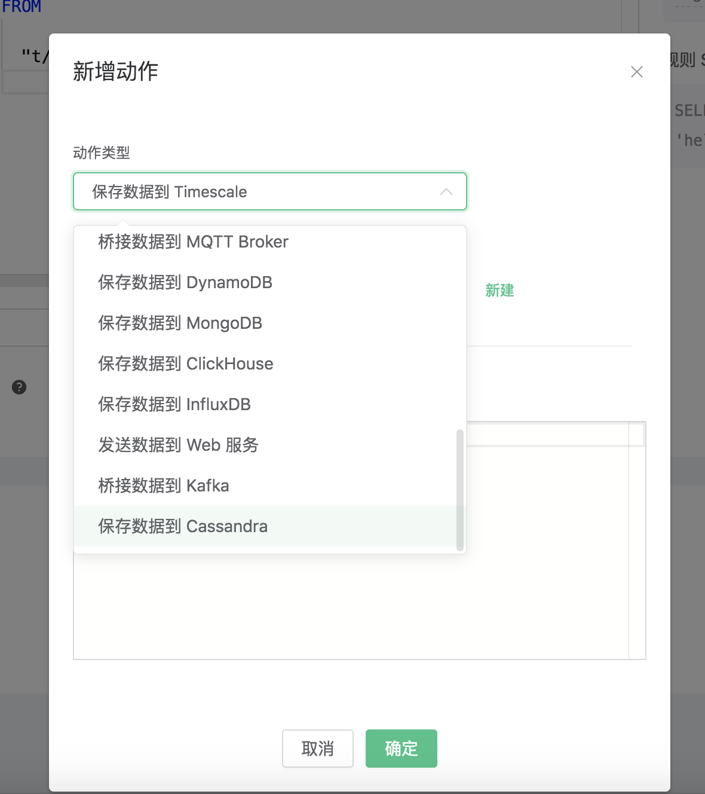
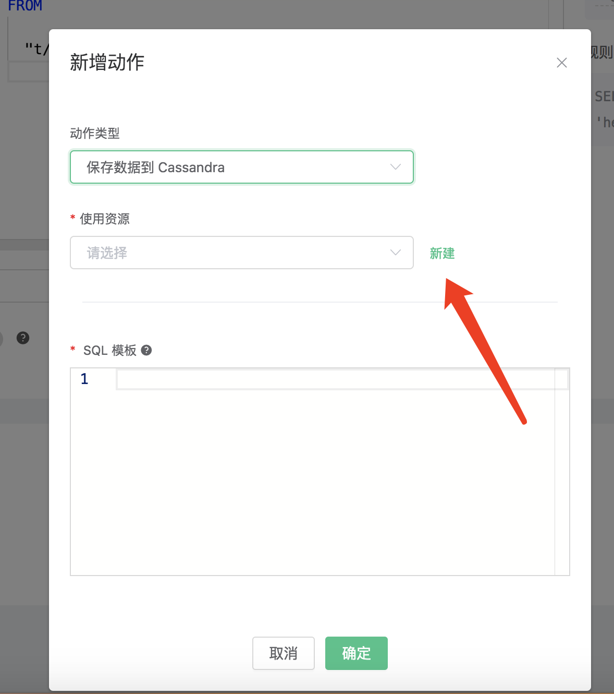
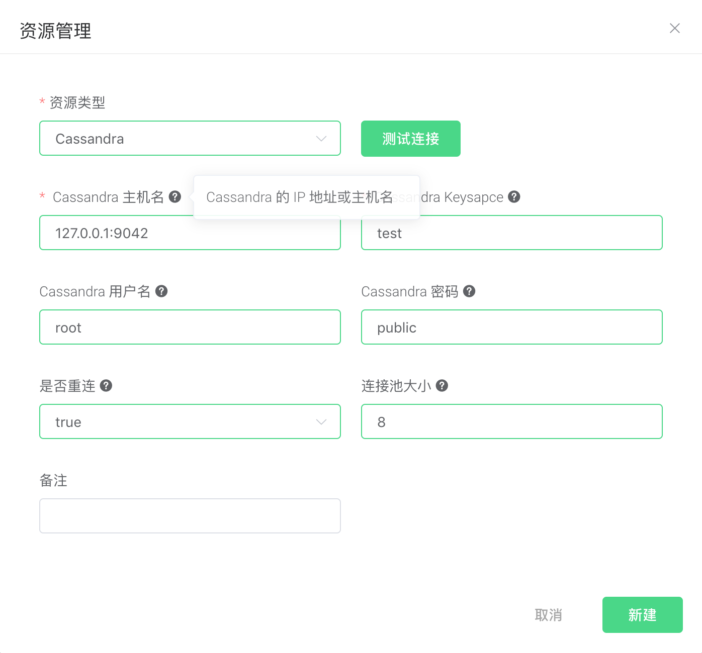
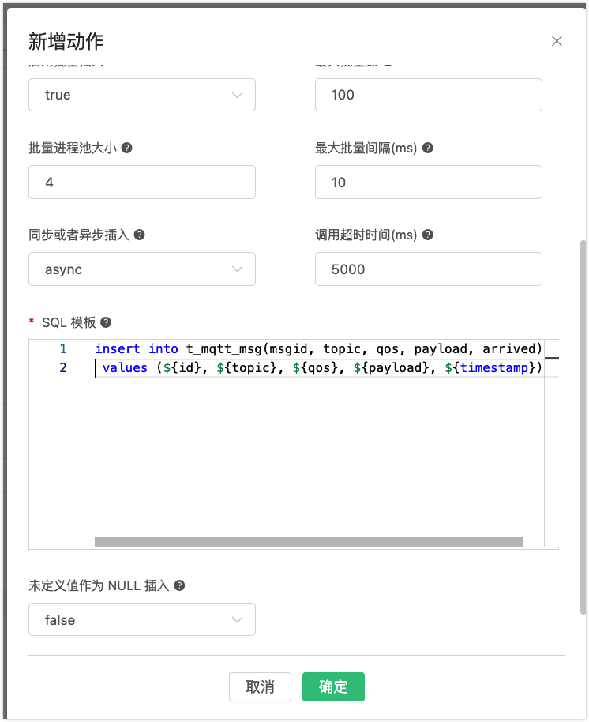
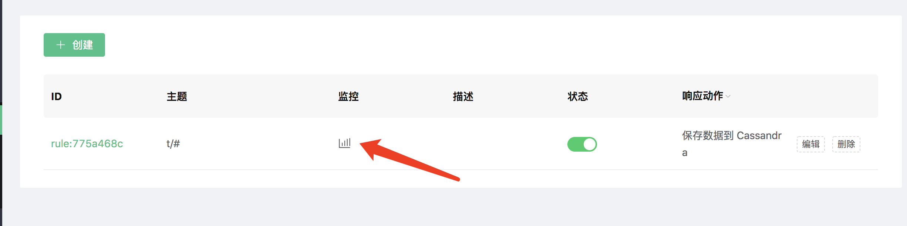

# 保存数据到 Cassandra

搭建 Cassandra 数据库，并设置用户名密码为 root/public，以 MacOS X 为例:

```bash
$ brew install cassandra
## 修改配置，关闭匿名认证
$  vim /usr/local/etc/cassandra/cassandra.yaml

    authenticator: PasswordAuthenticator
    authorizer: CassandraAuthorizer

$ brew services start cassandra

## 创建 root 用户
$ cqlsh -ucassandra -pcassandra

create user root with password 'public' superuser;
```

初始化 Cassandra 表:

```bash
$ cqlsh -uroot -ppublic
```

创建 "test" 表空间:

```bash
CREATE KEYSPACE test WITH replication = {'class': 'SimpleStrategy', 'replication_factor': '1'}  AND durable_writes = true;
```

创建 “t_mqtt_msg” 表:

```sql
USE test;
CREATE TABLE t_mqtt_msg (
    msgid text,
    topic text,
    qos int,
    payload text,
    arrived timestamp,
    PRIMARY KEY (msgid, topic)
);
```

创建规则:

打开 [EMQ X Dashboard](http://127.0.0.1:18083/#/rules)，选择左侧的 “规则” 选项卡。

填写规则 SQL:
```bash
SELECT * FROM "t/#"
```


关联动作:

在 “响应动作” 界面选择 “添加”，然后在 “动作” 下拉框里选择 “保存数据到 Cassandra”。



填写动作参数:

“保存数据到 Cassandra” 动作需要两个参数：

1). 关联资源的 ID。初始状况下，资源下拉框为空，现点击右上角的 “新建资源” 来创建一个 Cassandra 资源。



填写资源配置:

Keysapce 填写 “test”，用户名填写 “root”，密码填写 “public” 其他配置保持默认值，然后点击 “测试连接”
按钮，确保连接测试成功。



点击 “新建” 按钮，完成资源的创建。

2). SQL 模板。这个例子里我们向 Cassandra 插入一条数据，SQL
​    模板为:

```sql
insert into t_mqtt_msg(msgid, topic, qos, payload, arrived) values (${id}, ${topic}, ${qos}, ${payload}, ${timestamp})
```

插入数据之前，SQL 模板里的 ${key} 占位符会被替换为相应的值。



在点击 “新建” 完成规则创建


现在发送一条数据，测试该规则:

```bash
Topic: "t/cass"
QoS: 1
Payload: "hello"
```

然后检查 Cassandra 表，可以看到该消息已成功保存:


在规则列表里，可以看到刚才创建的规则的命中次数已经增加了 1:


