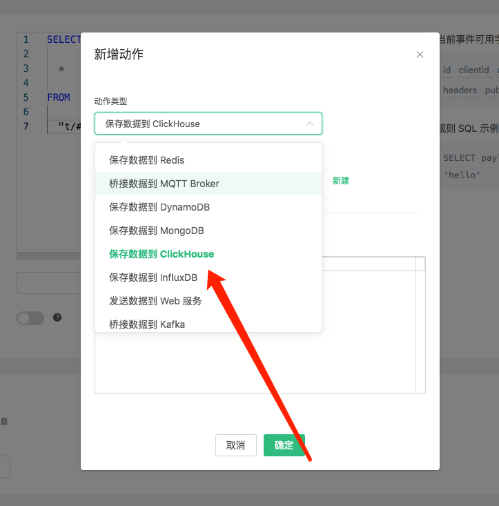
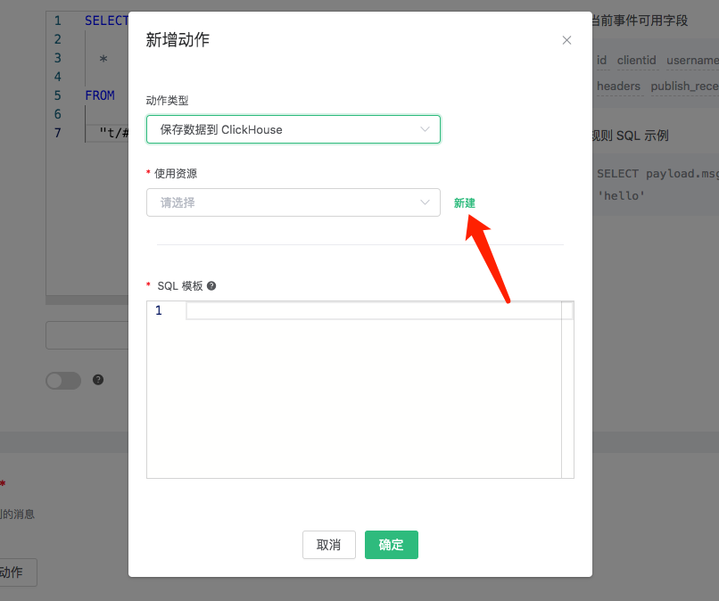
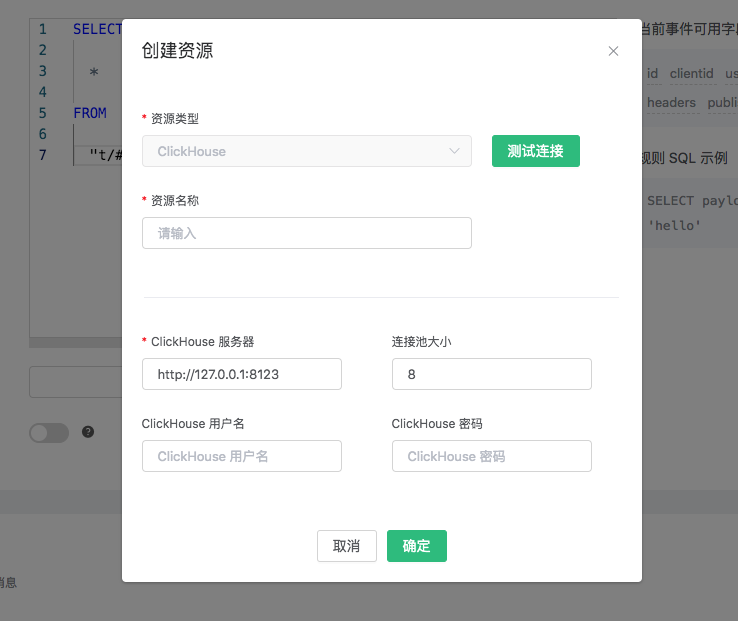
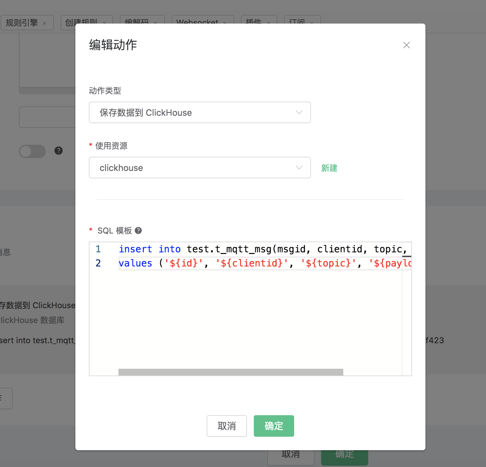
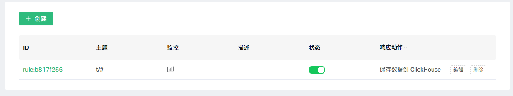
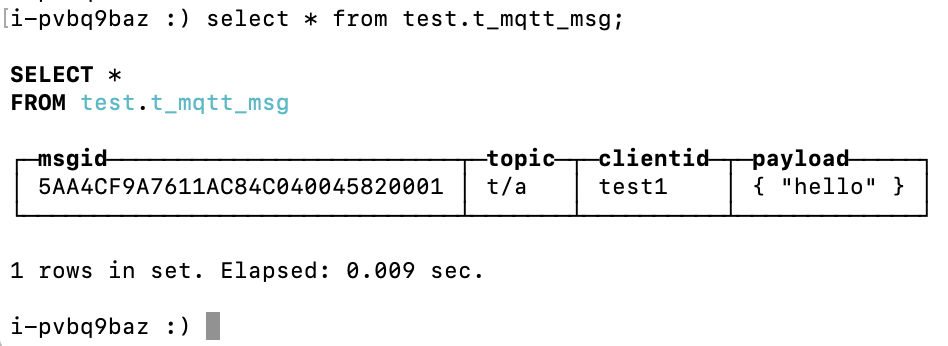

# 保存数据到 ClickHouse

搭建 ClickHouse 数据库，并设置用户名密码为 default/public，以 CentOS 为例:

```bash
## 安装依赖
sudo yum install -y epel-release

## 下载并运行packagecloud.io提供的安装shell脚本
curl -s https://packagecloud.io/install/repositories/altinity/clickhouse/script.rpm.sh | sudo bash

## 安装ClickHouse服务器和客户端
sudo yum install -y clickhouse-server clickhouse-client

## 启动ClickHouse服务器
clickhouse-server

## 启动ClickHouse客户端程序
clickhouse-client
```

创建 “test” 数据库:
```bash
create database test;
```
创建 t_mqtt_msg 表:

```sql
use test;
create table t_mqtt_msg (msgid Nullable(String), topic Nullable(String), clientid Nullable(String), payload Nullable(String)) engine = Log;
```


创建规则:

打开 [EMQ X Dashboard](http://127.0.0.1:18083/#/rules)，选择左侧的 “规则” 选项卡。

填写规则 SQL:

```sql
SELECT * FROM "#"
```


关联动作:

在 “响应动作” 界面选择 “添加”，然后在 “动作” 下拉框里选择 “保存数据到 ClickHouse”。



填写动作参数:

“保存数据到 ClickHouse” 动作需要两个参数：

1). 关联资源的 ID。现在资源下拉框为空，可以点击右上角的 “新建资源” 来创建一个 ClickHouse 资源:



选择 “ClickHouse 资源”。

填写资源配置:



点击 “新建” 按钮。

2). SQL 模板。这个例子里我们向 ClickHouse 插入一条数据，SQL
​    模板为:

```sql
insert into test.t_mqtt_msg(msgid, clientid, topic, payload) values ('${id}', '${clientid}', '${topic}', '${payload}')
```



返回响应动作界面，点击 “确认”。



在规则列表里，点击 “查看” 按钮或规则 ID 连接，可以预览刚才创建的规则:


规则已经创建完成，现在发一条数据:

```bash
Topic: "t/a"
QoS: 1
Payload: "hello"
```

然后检查 ClickHouse 表，新的 record 是否添加成功:



