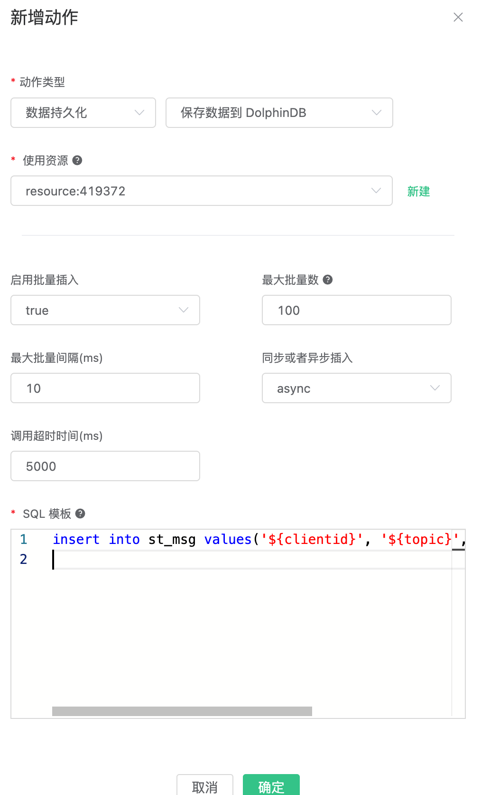

# 保存数据到 DolphinDB

[DolphinDB](https://www.dolphindb.cn) 是由浙江智臾科技有限公司研发的一款高性能分布式时序数据库，集成了功能强大的编程语言和高容量高速度的流数据分析系统，为海量结构化数据的快速存储、检索、分析及计算提供一站式解决方案，适用于量化金融及工业物联网等领域。

EMQ X 用 Erlang 实现了 DolphinDB 的客户端 API，它通过 TCP 的方式将数据传输到 DolphinDB 进行存储。

## 搭建 DolphinDB

目前，EMQ X 仅适配 DolphinDB 1.20.7 的版本。

以 Linux 版本为例，前往官网下载社区最新版本的 Linux64 安装包：https://www.dolphindb.cn/downloads.html

将安装包的 server 目录上传至服务器目录 `/opts/app/dolphindb`，并测试启动是否正常：

```bash
chmod +x ./dolphindb
./dolphindb

## 启动成功后，会进入到 dolphindb 命令行，执行 1+1
>1+1
2
```

启动成功，并得到正确输出，表示成功安装 DolphinDB。然后使用 `<CRTL+D>` 关闭 DolphinDB。

现在，我们需要打开 DolphinDB 的 StreamTable 的发布/订阅的功能，并创建相关数据表，以实现 EMQ X 消息存储并持久化的功能：

1. 修改 DolphinDB 的配置文件 `vim dolphindb.cfg` 加入以下配置项，以打开 发布/订阅 的功能：
``` properties
## Publisher for streaming
maxPubConnections=10
persistenceDir=/ddb/pubdata/
#persistenceWorkerNum=
#maxPersistenceQueueDepth=
#maxMsgNumPerBlock=
#maxPubQueueDepthPerSite=

## Subscriber for streaming
subPort=8000
#subExecutors=
#maxSubConnections=
#subExecutorPooling=
#maxSubQueueDepth=
```

2. 后台启动 DolphinDB 服务：
```bash
## 启动完成后，DolphinDB 会监听 8848 端口供客户端使用。
nohup ./dolphindb -console 0 &
```

3. 前往 DolphinDB 官网，下载合适的 GUI 客户端连接 DolphinDB 服务：
    - 前往 [下载页](http://www.dolphindb.cn/alone/alone.php?id=10) 下载 `DolphinDB GUI`
    - DolphinDB GUI 客户端依赖 Java 环境，先确保已经安装 Java
    - 前往 DolphinDB GUI 目录中执行 `sh gui.sh` 启动客户端
    - 在客户端中添加 Server 并创建一个 Project，和脚本文件。

4. 创建分布式数据库，和 StreamTable 表；并将 StreamTable 的数据持久化到分布式表中：
```ruby
// 创建一个名为 emqx 的 分布式文件数据库
// 并创建一张名为 `msg` 表，按 `clientid` 和 `topic` 的 HASH 值进行分区：
schema = table(1:0, `clientid`topic`qos`payload, [STRING, STRING, INT, STRING])
db1 = database("", HASH, [STRING, 8])
db2 = database("", HASH, [STRING, 8])
db = database("dfs://emqx", COMPO, [db1, db2])
db.createPartitionedTable(schema, "msg",`clientid`topic)

// 创建名为 `st_msg` 的 StreamTable 表，并将数据持久化到 `msg` 表。
share streamTable(10000:0,`clientid`topic`qos`payload, [STRING,STRING,INT,STRING]) as st_msg
msg_ref= loadTable("dfs://emqx", "msg")
subscribeTable(, "st_msg", "save_msg_to_dfs", 0, msg_ref, true)

// 查询 msg_ref；检查是否创建成功
select * from msg_ref;
```
完成后，可以看到一张空的 `msg_ref` 已创建成功：


至此，DolphinDB 的配置已经完成了。

详细的 DolphinDB 使用文档请参考：
- 用户指南：https://github.com/dolphindb/Tutorials_CN/blob/master/dolphindb_user_guide.md
- IoT 场景示例：https://gitee.com/dolphindb/Tutorials_CN/blob/master/iot_examples.md
- 流处理指南：https://github.com/dolphindb/Tutorials_CN/blob/master/streaming_tutorial.md
- 编程手册：https://www.dolphindb.cn/cn/help/index.html

## 配置规则引擎

创建规则:

打开 [EMQ X Dashboard](http://127.0.0.1:18083/#/rules)，选择左侧的 “规则” 选项卡。

填写规则 SQL:

```sql
SELECT * FROM "t/#"
```


关联动作:

在 “响应动作” 界面选择 “添加”，然后在 “动作” 下拉框里选择 “保存数据到 DolphinDB”。


填写动作参数:

“保存数据到 DolphinDB” 动作需要两个参数：

1). SQL 模板。这个例子里我们向流表 `st_msg` 中插入一条数据，SQL 模板为:

```sql
insert into st_msg values('${clientid}', '${topic}', ${qos}, '${payload}')
```

2). 关联资源的 ID。现在资源下拉框为空，可以点击右上角的 “新建资源” 来创建一个DolphinDB 资源:

填写资源配置:

服务器地址填写对应上文部署的 DolphinDB 的服务器，用户名为 `admin` 密码为 `123456`


点击 “确定” 按钮。

返回响应动作界面，点击 “确定”。



返回规则创建界面，点击 “创建”。


在规则列表里，点击 “查看” 按钮或规则 ID 连接，可以预览刚才创建的规则:


规则已经创建完成，现在发一条数据:

```bash
Topic: "t/a"
QoS: 1
Payload: "hello"
```

然后检查持久化的 `msg_dfs` 表，新的数据是否添加成功:


