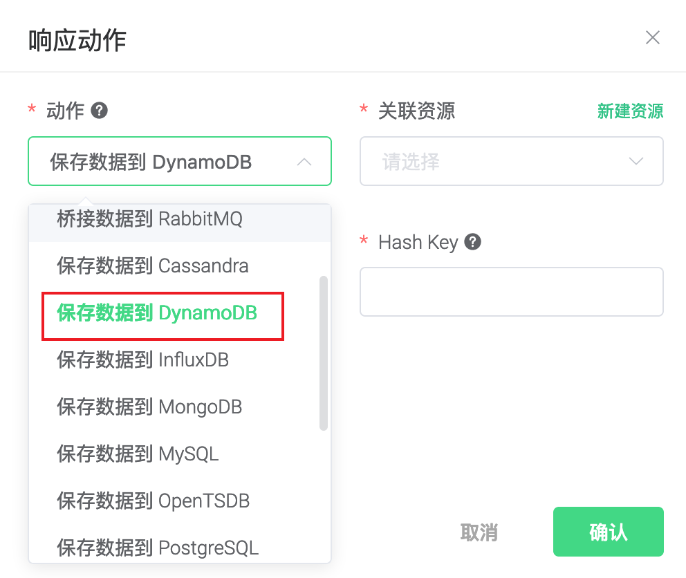
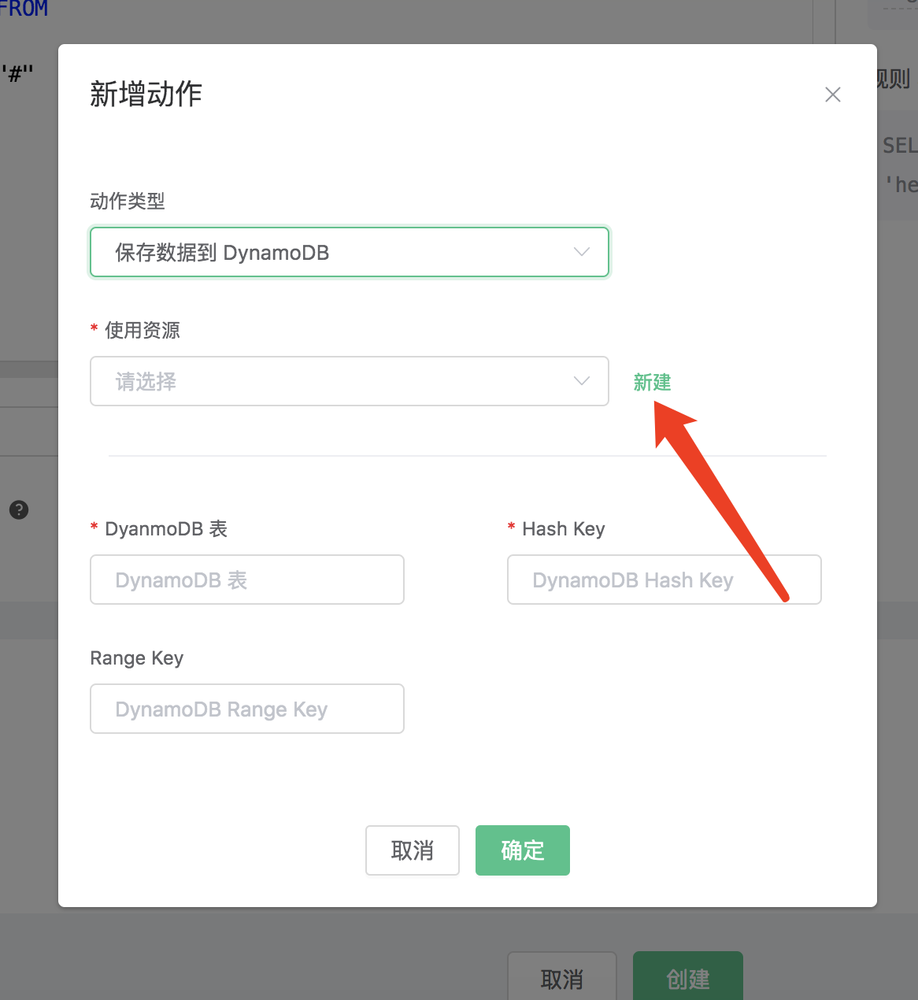
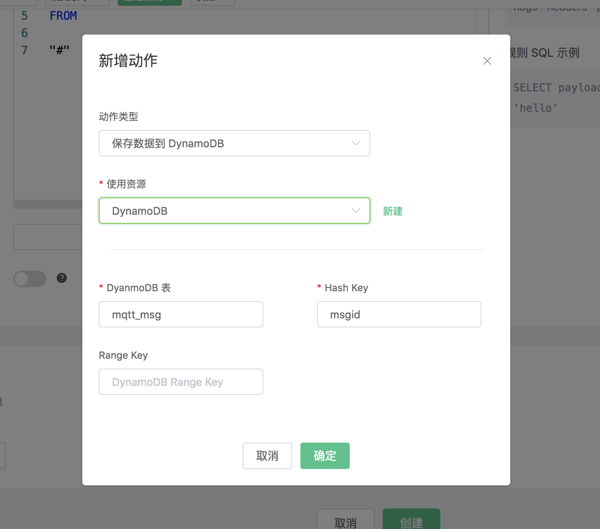
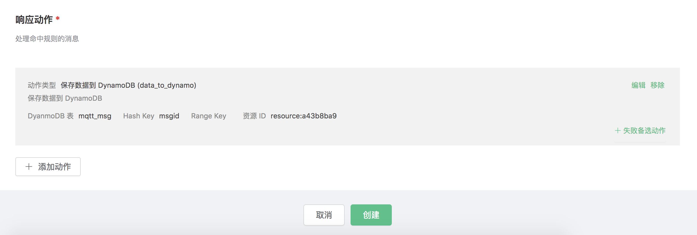
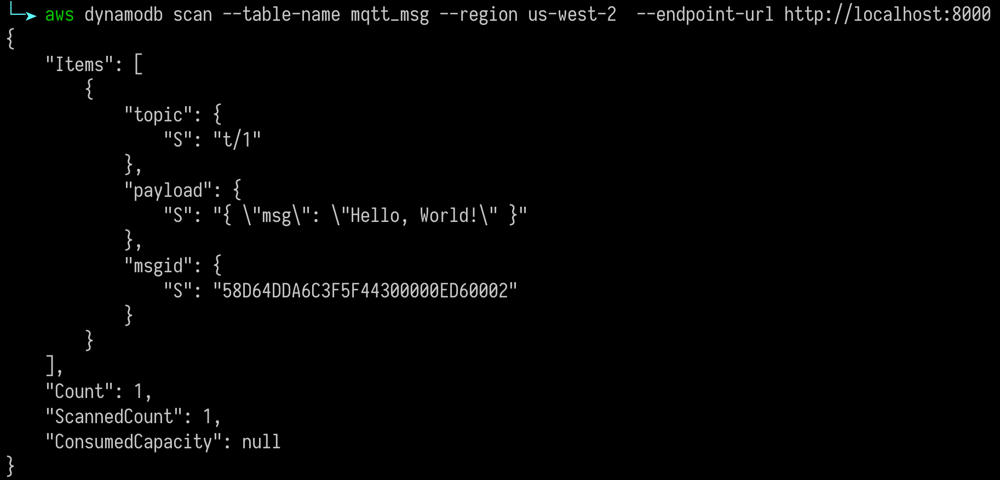

# 保存数据到 DynamoDB

搭建 DynamoDB 数据库，以 MacOS X 为例:

```bash
$ brew install dynamodb-local
$ dynamodb-local
```

创建 DynamoDB 表定义文件 mqtt\_msg.json :

<!-- end list -->

```json
{
   "TableName": "mqtt_msg",
   "KeySchema": [
       { "AttributeName": "msgid", "KeyType": "HASH" }
   ],
   "AttributeDefinitions": [
       { "AttributeName": "msgid", "AttributeType": "S" }
   ],
   "ProvisionedThroughput": {
       "ReadCapacityUnits": 5,
       "WriteCapacityUnits": 5
   }
}
```

初始化 DynamoDB 表:

```bash
$ aws dynamodb create-table --cli-input-json file://mqtt_msg.json --endpoint-url http://localhost:8000
```

创建规则:

打开 [EMQ X Dashboard](http://127.0.0.1:18083/#/rules)，选择左侧的 “规则” 选项卡。

填写规则 SQL:

```sql
SELECT id, topic, payload FROM "#"
```


关联动作:

在 “响应动作” 界面选择 “添加”，然后在 “动作” 下拉框里选择 “保存数据到 DynamoDB”。



填写动作参数:

“保存数据到 DynamoDB” 动作需要两个参数：

1). DynamoDB 表名。这个例子里我们设置的表名为 "mqtt\_msg"

2). DynamoDB Hash Key。这个例子里我们设置的 Hash Key 要与表定义的一致

3). DynamoDB Range Key。由于我们表定义里没有设置 Range Key。这个例子里我们把 Range Key 设置为空。



4). 关联资源的 ID。现在资源下拉框为空，可以点击右上角的 “新建资源” 来创建一个 DynamoDB 资源:

填写资源配置:


点击 “新建” 按钮。

返回响应动作界面，点击 “确认”。



返回规则创建界面，点击 “新建”。



规则已经创建完成，现在发一条数据:

```bash
Topic: "t/a"
QoS: 1
Payload: "hello"
```

然后检查 DynamoDB 的 mqtt\_msg 表，新的 record 是否添加成功:



在规则列表里，可以看到刚才创建的规则的命中次数已经增加了 1:


