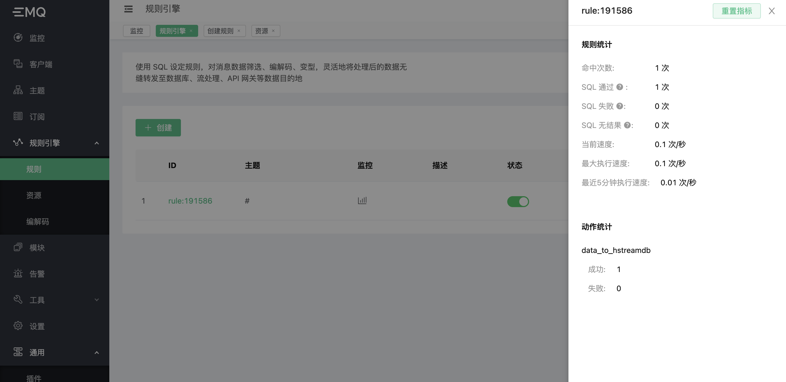

# 保存数据到 HStreamDB

HStreamDB 是一款专为流式数据设计的， 针对大规模实时数据流的接入、存储、处理、 分发等环节进行全生命周期管理的流数据库。它使用标准 SQL (及其流式拓展）作为主要接口语言，以实时性作为主要特征，旨在简化数据流的运维管理以及实时应用的开发


更多详细信息，请参考[HStream官网](https://hstream.io/)。

## 创建 HStreamDB 服务

[部署参考文档](https://hstream.io/docs/en/latest/start/quickstart-with-docker.html)，可使用 docker 本地部署，或云主机部署。
使用命令创建出 hstream-client :

```bash
docker run -it --rm --name some-hstream-cli --network host hstreamdb/hstream:v0.8.0 hstream-client --port 6570 --client-id 1
```

进入控制台

```bash
      __  _________________  _________    __  ___
     / / / / ___/_  __/ __ \/ ____/   |  /  |/  /
    / /_/ /\__ \ / / / /_/ / __/ / /| | / /|_/ /
   / __  /___/ // / / _, _/ /___/ ___ |/ /  / /
  /_/ /_//____//_/ /_/ |_/_____/_/  |_/_/  /_/


Command
  :h                           To show these help info
  :q                           To exit command line interface
  :help [sql_operation]        To show full usage of sql statement

```

创建 stream：

```SQL
> CREATE STREAM demo_stream;
demo_stream
> SHOW STREAMS;
demo_stream
>
```

## 创建 HStreamDB 资源

进入 EMQX Dashboard，点击右侧规则引擎，资源，创建，选取 HStreamDB 资源，输入资源地址与链接池。


## 创建规则

点击，规则引擎，规则，创建。
编辑规则 SQL：

```SQL
SELECT

  payload

FROM

  "#"
```

文档中的规则 SQL 仅作为示例，请按照业务设计编写 SQL。

点击添加动作，选择数据持久化，保存数据到 HSTreamDB。
选择上一步中创建的资源，并输入参数，参数定义见下表：

| 参数名 | 定义 | 类型 |
| ---- | ---- | ---- |
| Stream | Stream 名称，不可使用变量 | String |
| Ordering Key | 分区键，可使用变量 | String |
| 启用批量插入 | 开启或关闭批量写入，默认开启 | Boolean |
| 最大批量数 | 批量最大消息条目数量 | Integer |
| 最大批量间隔(ms) | 批量最大间隔，单位毫秒 | Integer |
| 消息内容模板 | 写入的消息报文内容 | Binary |

点击确定，创建。


现在使用 MQTT 桌面客户端 `MQTTX` 连接至 EMQX，发送一条数据。


点击规则监控



这时数据已经写入 HStreamDB，使用任意消费方式，将消息消费出来。文档中使用的是基于 HStream golang SDK 编写的简单消费工具，读者可自行按照熟悉的编程语言编写消费端。可见消费日志如下：

```shell
{"level":"info","ts":1656311005.5250711,"msg":"[f1]","recordId":"[BatchId: 8589934593, BatchIndex: 0, ShardId: 1317059070792293]","payload":"Hello HSreamDB !"}
```

消息已经成功写入，并被消费完成。
