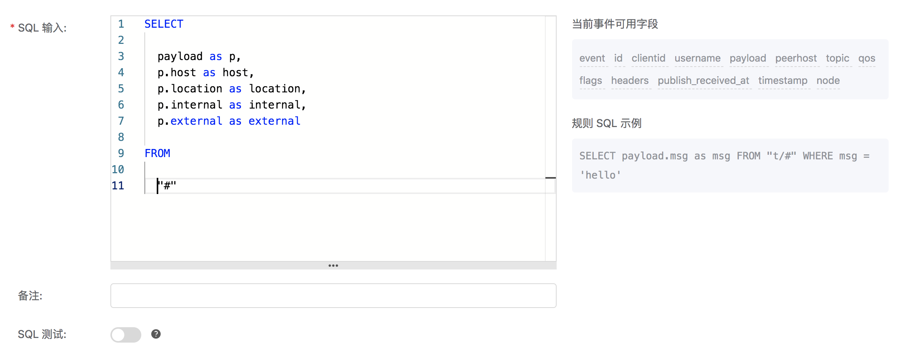
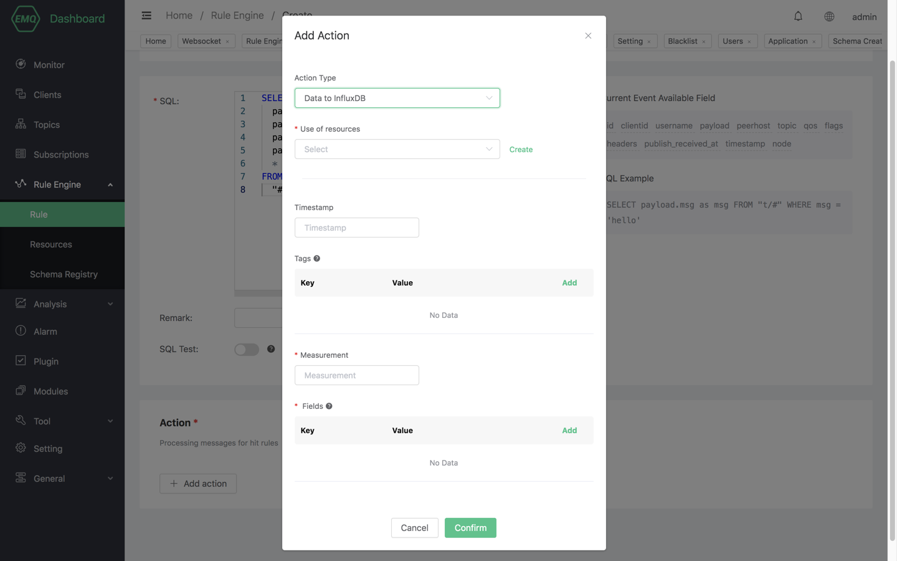
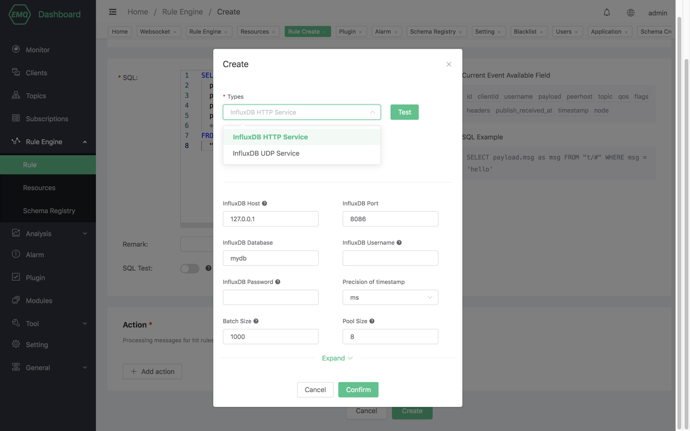
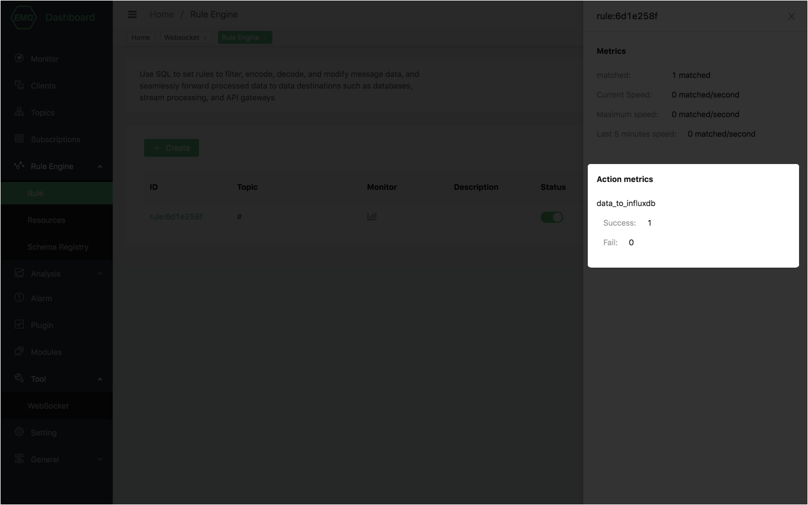

# 保存数据到 InfluxDB

启动 InfluxDB，请确保启用了相应的 Listener（我们假设您已经成功安装了 InfluxDB 环境）

```bash
$ influxd -config /usr/local/etc/influxdb.conf
```

创建规则:

打开 [EMQ X Dashboard](http://127.0.0.1:18083/#/rules)，选择左侧的 “规则” 选项卡。

填写规则 SQL:

```bash
SELECT
    payload.host as host,
    payload.location as location,
    payload.internal as internal,
    payload.external as external,
    *
FROM
    "#"
```



关联动作:

在 “Action” 界面选择 “Add action”，然后在 “Action Type” 下拉框里选择 “Data to InfluxDB”。


填写动作参数:

“Data to InfluxDB” 动作有以下参数：



1). Measurement。指定写入到 InfluxDB 的 data point 的 Measurement，支持固定字符串和占位符两种设置方式。

2). Fields。指定写入到 InfluxDB 的 data point 的 Fields 的 Key 和 Value，支持固定字符串和占位符两种设置方式。

3). Tags。指定写入到 InfluxDB 的 data point 的 Tags 的 Key 和 Value，支持固定字符串和占位符两种设置方式。

4). Timestamp Key。指定写入到 InfluxDB 的 data point 的 Timestamp 的值从哪里获取。

5). Use of reources。指定动作关联的资源，现在资源下拉框为空，可以点击右上角的 “新建资源” 来创建一个 InfluxDB 资源，目前支持 HTTP/HTTPS 和 UDP 两种资源。



填写资源配置:

InfluxDB HTTP 资源包括以下配置：

   

   1). Resource Name。资源名称，支持以易读的形式唯一标识资源。

   2). InfluxDB Host。InfluxDB HTTP 主机地址。

   3). InfluxDB Port。InfluxDB HTTP 主机端口。

   4). InfluxDB Database。InfluxDB 数据库名。

   5). InfluxDB Username。InfluxDB 用户名。

   6). InfluxDB Password。InfluxDB 密码。

   7). Precision of timestamp。时间戳精度。

   8). Batch Size。单次写入能够收集的最大数据点数量，用于提升高并发时的性能。

   9). Pool Size。InfluxDB 写进程池大小，合适的进程池大小可以在一定程度上提升写入性能。

InfluxDB UDP 资源包括以下配置：

   

   1). Resource Name。资源名称，支持以易读的形式唯一标识资源。

   2). InfluxDB Host。InfluxDB UDP 主机地址。

   3). InfluxDB Port。InfluxDB UDP 主机端口。

   8). Batch Size。单次写入能够收集的最大数据点数量，用于提升高并发时的性能。

   9). Pool Size。InfluxDB 写进程池大小，合适的进程池大小可以在一定程度上提升写入性能。

本示例中所有配置保持默认值即可，点击 “测试连接” 按钮，确保连接测试成功。

最后点击 “Confirm” 按钮。

返回响应动作界面，选择刚刚创建的 InfluxDB 资源，填写其余配置后点击 “Confirm” 按钮。

最后返回规则创建界面，点击页面底部的 “Create” 按钮，完成规则创建。 


规则已经创建完成，现在发一条消息:

```bash
Topic: "t/1"

QoS: 0

Payload:
"{"host":"serverA","location":"roomA","internal":25,"external":37}"
```

然后检查 InfluxDB，新的 data point 是否添加成功:

```bash
$ influx -precision rfc3339

> use db
Using database db
> select * from "temperature"
name: temperature
time                external  from            host    internal location
----                --------  ----            ----    -------- --------
1561535778444457348 37        mqttjs_46355e19 serverA 25       roomA
```

在规则列表里，可以看到刚才创建的规则的命中次数已经增加了 1:


