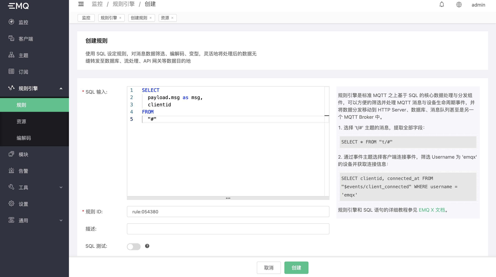

# 集成 InfluxDB V2 & InfluxDB Cloud

 启动 InfluxDB ，或者注册 InfluxDB Cloud 账号申请开通服务。
 本文中使用 docker 部署作为演示，并使用默认端口8086，如有需要请自行替换成其他端口。

 ```shell
#  docker
docker run -d  -p 8086:8086  influxdb
 ```

创建资源

打开 [EMQX Dashboard](http://127.0.0.1:18083/#/rules)，选择左侧的 “资源” 选项卡，点击创建，资源类型选择 ”InfluxDB HTTP V2 服务“。
资源包括以下配置：

- InfluxDB 主机：填写主机地址，或是 InfluxDB Cloud 中创建的服务地址；
- InfluxDB 端口：本地安装或者docker安装默认端口是8086，InfluxDB Cloud 需要使用https默认端口443；
- InfluxDB Bucket：数据库/数据集名称；
- InfluxDB 组织名称：创建服务时填写的组织名称；
- InfluxDB Token：对应数据库权限的 API Token，可以在 InfluxDB 控制台中找到；
- 时间戳精度：默认使用毫秒；
- 进程池大小：连接进程池大小，可根据业务并发量调节（在网速没有瓶颈的情况下，推荐每1万并发增加一个进程数量）；
- 启用 HTTPS：根据安装与服务配置启用证书（InfluxDB Cloud 请打开此选项，但不需要配置额外证书）；

InfluxDB Cloud 获取组织名称示例（本地或 docker 部署，访问部署地址的8086端口即可进入控制台）：


InfluxDB Cloud 获取 API Token 示例（本地或 docker 部署，访问部署地址的8086端口即可进入控制台）：


创建资源：


创建规则:

打开 [EMQX Dashboard](http://127.0.0.1:18083/#/rules)，选择左侧的 “规则” 选项卡。

填写规则 SQL:

```SQL
SELECT
  payload.msg as msg,
  clientid
FROM
  "#"
```



关联动作:

在 “Action” 界面选择 “Add action”，然后在 “Action Type” 下拉框里选择 “Data to InfluxDB”。

需要的字段：

- 启用批量插入：是否开启批量功能；
- 最大批量数：单个请求包含的数据最大条数；
- 最大批量间隔：批量消息最大间隔时间；
- Measurement：InfluxDB Measurement 单元；
- Fields：数据键值对 Fields；
- Tags：数据标签 Tags；


最后点击 “Confirm” 按钮。

返回响应动作界面，选择刚刚创建的 InfluxDB 资源，填写其余配置后点击 “Confirm” 按钮。

规则已经创建完成，现在发一条消息:

```bash
Topic: "t/1"

QoS: 0

Payload:
"hello"
```

在规则列表里，可以看到刚才创建的规则的命中次数已经增加了 1:


在InfluxDB控制台中查询结果:


