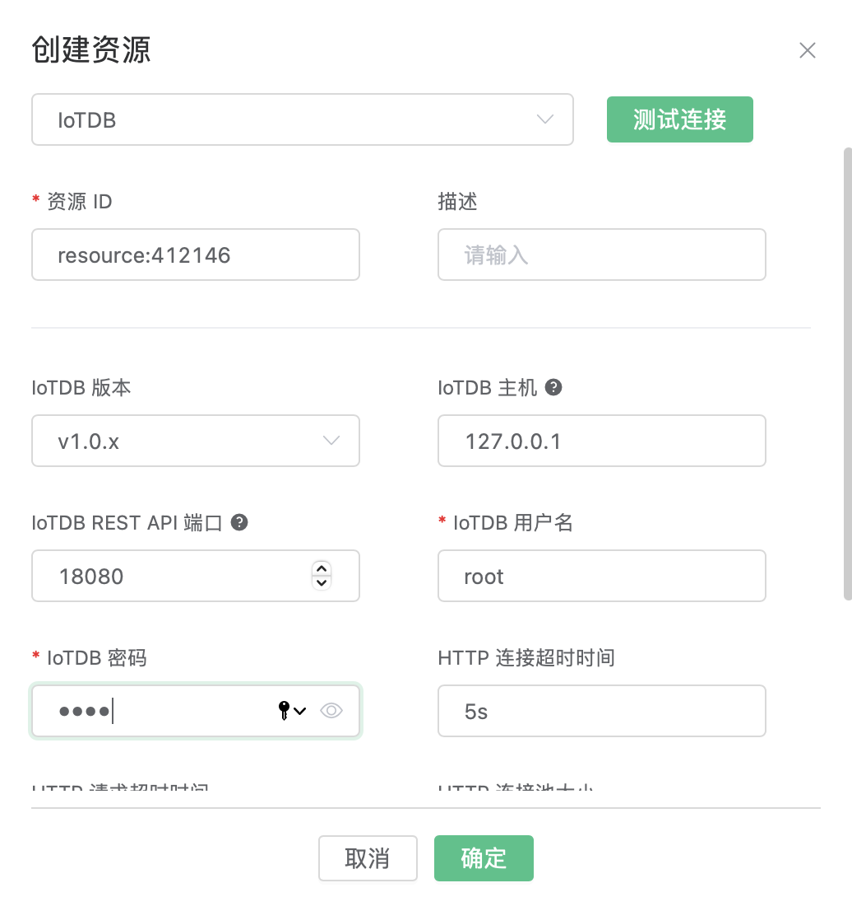
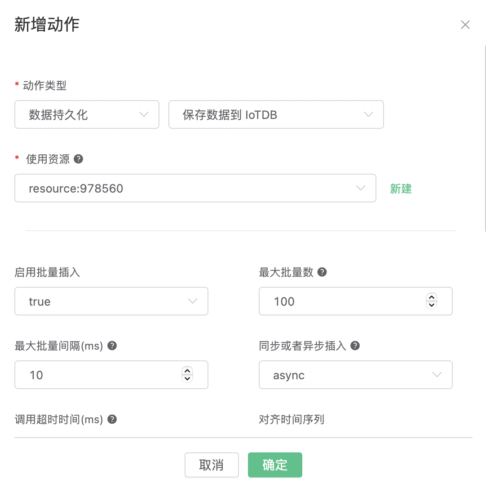
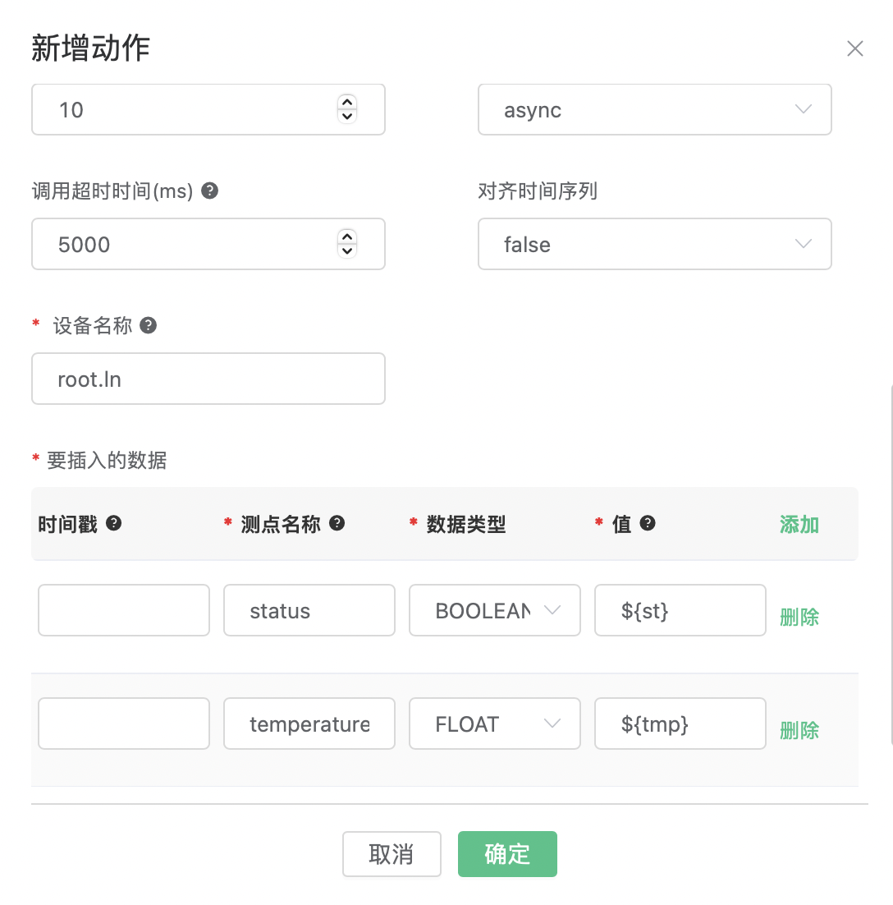

# 数据保存到 IoTDB

## 环境准备

按照 [IoTDB 快速上手](https://iotdb.apache.org/UserGuide/Master/QuickStart/QuickStart.html) 的步骤下载和安装 IoTDB。

### 以 Unix/OS X 系统为例，启动 IoTDB：

```
bash sbin/start-standalone.sh
```

使用 CLI 工具登录 IoTDB 命令行终端：

```
bash sbin/start-cli.sh -h 127.0.0.1 -p 6667 -u root -pw root
```

### 创建数据库和时间序列：

```
IoTDB> CREATE DATABASE root.ln

IoTDB> CREATE TIMESERIES root.ln.status WITH DATATYPE=BOOLEAN, ENCODING=PLAIN
IoTDB> CREATE TIMESERIES root.ln.temperature WITH DATATYPE=FLOAT, ENCODING=RLE
```

## 创建资源

打开 [EMQX Dashboard](http://127.0.0.1:18083/#/resources)，选择左侧的 “资源” 选项卡，点击创建，资源类型选择 “IoTDB”。

填写以下参数：

- IoTDB 版本：根据您下载的 IoTDB 版本选择。
- IoTDB 用户名：用于认证的用户名
- IoTDB 密码：用于认证的密码

其他参数保持默认值。



点击测试链接按钮，显示测试成功之后点击确定按钮创建资源。

## 创建规则

打开 [EMQX Dashboard](http://127.0.0.1:18083/#/rules)，选择左侧的 “规则” 选项卡。

填写规则 SQL:

```SQL
SELECT
  payload.st as st,
  payload.tmp as tmp
FROM
  "t/#"
```

## 关联动作

在创建规则页面下方的 “响应动作” 界面选择 “添加动作”，然后在 “动作类型” 下拉框里选择 “数据持久化” - “保存数据到 IoTDB”。



填写以下参数：

- 使用资源：在下拉框选择上面创建好的资源。
- 设备名称：`root.ln`
- 要插入的数据：要插入 IoTDB 的数据行，其中`时间戳字段`可以为空。`测点名称`和`值`可以使用 `${var}` 格式的占位符。
  |  时间戳   | 测点名称      | 数据类型  | 值     |
  |  ----    |  ----       | ----    | ----   |
  |          | status      | BOOLEAN | ${st}  |
  |          | temperature | FLOAT   | ${tmp} |

其他参数保持默认值。



最后点击 “确定” 按钮完成动作的创建，并返回规则创建页面点击 “确定”。

规则已经创建完成，现在发一条消息:

- Topic: `t/1`

- QoS: `0`

- Payload: `{"st": true, "tmp": 36.5}`

在 IoTDB 终端中查询结果:

```
IoTDB> select * from root.ln;
+-----------------------------+-------------------+--------------+
|                         Time|root.ln.temperature|root.ln.status|
+-----------------------------+-------------------+--------------+
|2023-03-04T13:53:45.804+08:00|               36.5|          true|
+-----------------------------+-------------------+--------------+
```
