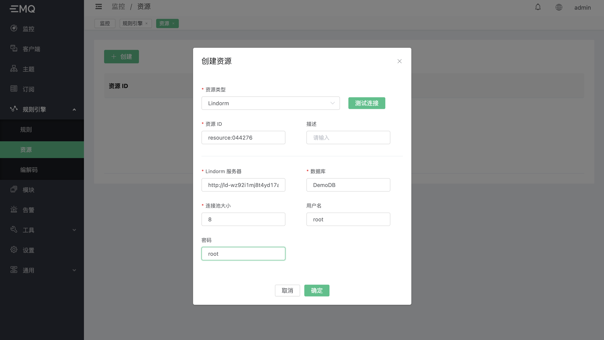
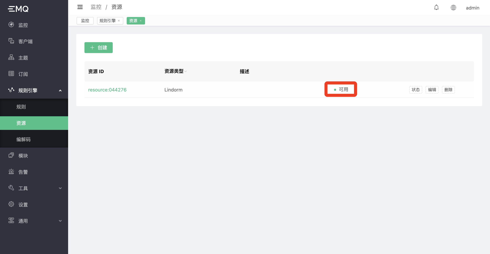
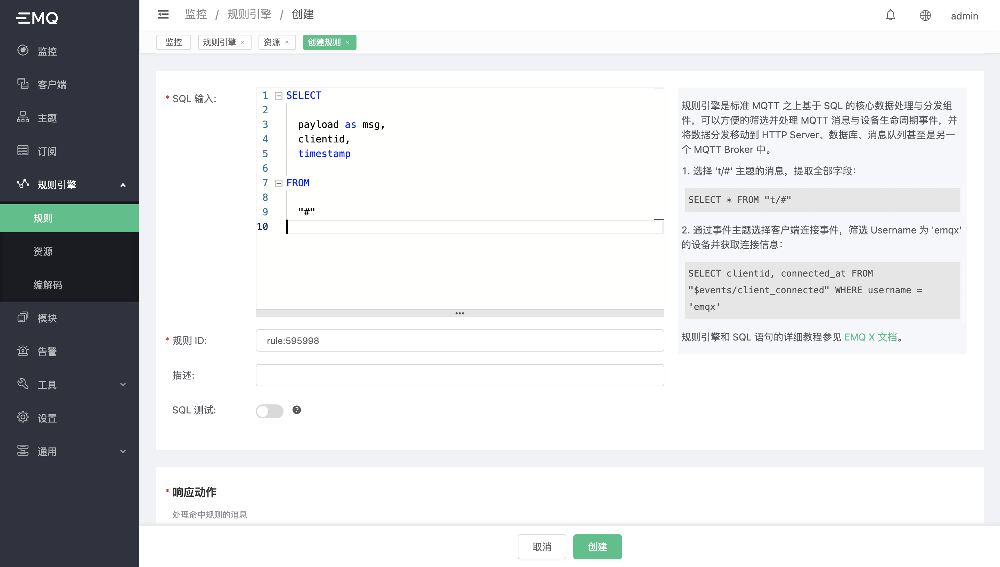
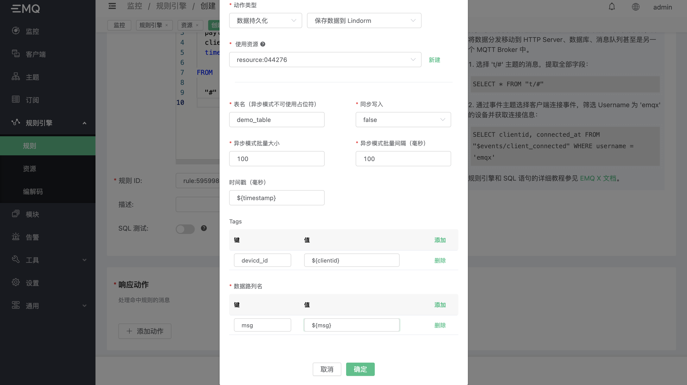
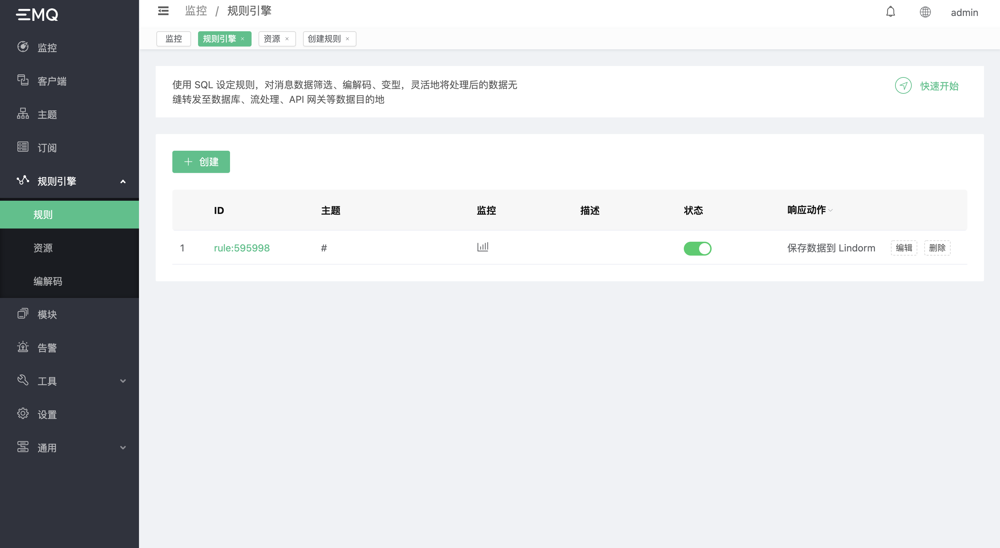
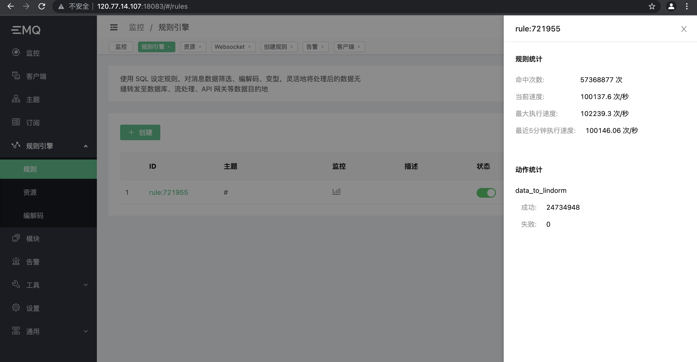

# 保存数据到 Lindorm 数据库 (自 e3.3.6 和 e4.4.1 起）

首先确保 Lindorm 数据库开通服务。
</br>
确保部署 EMQ X 的主机 IP 在访问白名单中。阿里云部署的 EMQ X 可以通过云主机内网访问 Lindorm，其他类型的部署方式需要开启 Lindorm 外网访问功能。此类操作步骤请参考阿里 Lindorm 操作文档。
</br>
创建数据库

```SQL
CREATE DATABASE DemoDB1
```

创建表

```SQL
CREATE TABLE demo_sensor(
    device_id VARCHAR TAG,
    time BIGINT,
    msg VARCHAR)
```

资源需要以下启动参数：

- Lindorm 服务器：Lindorm 访问地址，Lindorm 提供了域名访问，阿里云主机请填写内网访问地址，默认端口 `8242`，根据实际情况填写，需要添加 `http://` 前缀；
- 数据库：数据存储的数据库名称，根据创建的服务填写；
- 连接池大小：数据库写入数据的进程池，根据业务量填写，写入是阻塞型请求，高并发业务推荐 `CPU 核心数 * 4` 或者 `CPU 核心数 * 8` 以上；
- 用户名：未开启用户认证不填写，已经开启请按照实际情况填写；
- 密码：未开启用户认证不填写，已经开启请按照实际情况填写；



确保资源状态可用（非阿里云部署，可能会出现创建后首次链接比较慢导致不可用状态，点击状态按钮刷新状态）。



创建规则

```SQL
SELECT
  payload as msg,
  clientid,
  timestamp
FROM
  "#"
```



添加动作；

- 动作类型：数据持久化；保存数据到 Lindorm；
- 使用资源：选择创建的资源 ID；
- 表名：同步模式可以使用占位符动态规划，异步批量写入请严格使用表名，不能动态改变；
- 同步写入：同步即每条数据立即入库，异步模式开启批量功能，数据将按照批量大小和间隔时间规则写入；
- 异步模式批量大小：默认 100，推荐 100 - 400 取值，可根据业务规划改变；同步模式下忽略此参数；
- 异步模式批量间隔：默认 100，单位毫秒，推荐 10 - 200；
- 时间戳：单位毫秒，推荐使用消息时间，空数据会按照规则命中的时间戳计算；
- Tags： 数据标签键值对，根据创建的表结构填写；
- Fields：数据键值对，根据创建的表结构填写；



点击确定，点击创建，查看规则：



使用 MQTT 客户端发布消息，查看规则命中与成功失败计数；



使用 API 查询数据库写入结果：

```shell
# 替换
# ${LINDORM_SERVER}： 服务器地址
# ${DB_NAME}： 数据库名
# ${LINDORM_TABLE}： 表名
curl -X POST http://${LINDORM_SERVER}:8242/api/v2/sql?database=${DB_NAME} -H "Content-Type: text/plain" -d 'SELECT count(*) FROM ${LINDORM_TABLE}'
```
