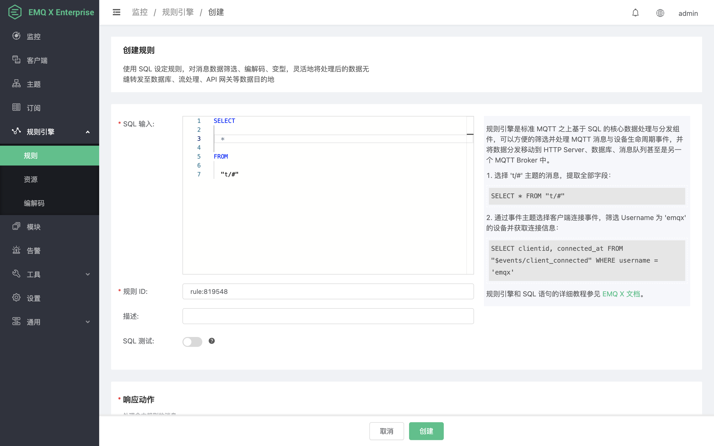
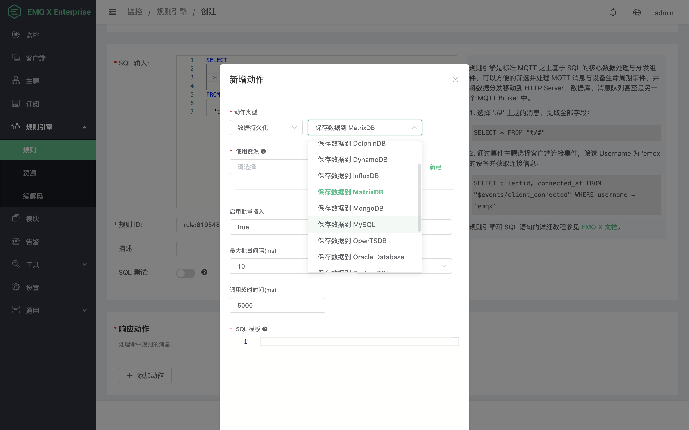
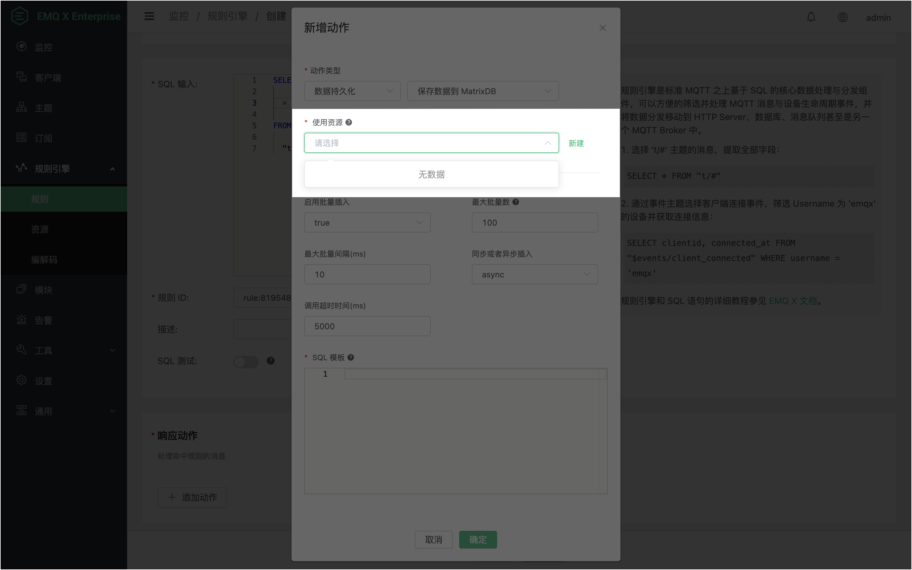
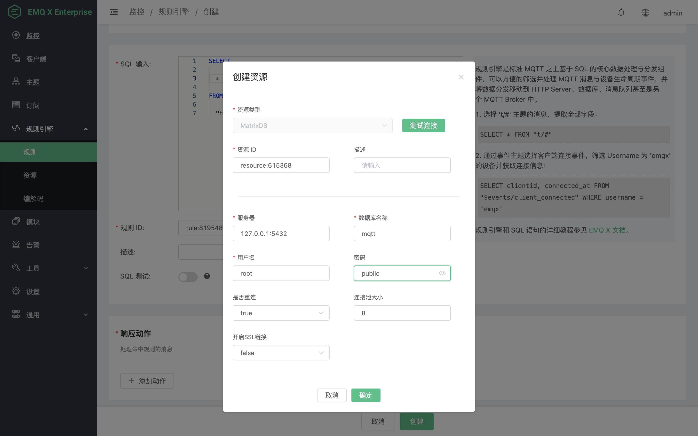
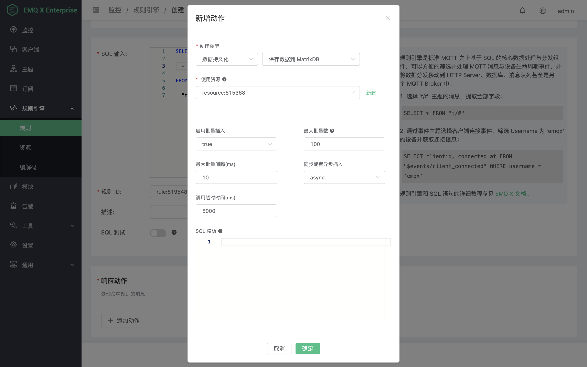
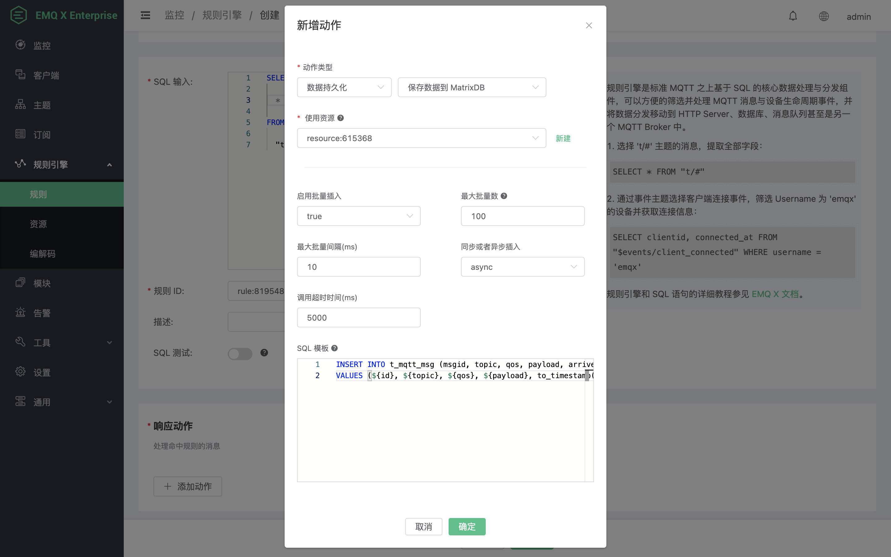
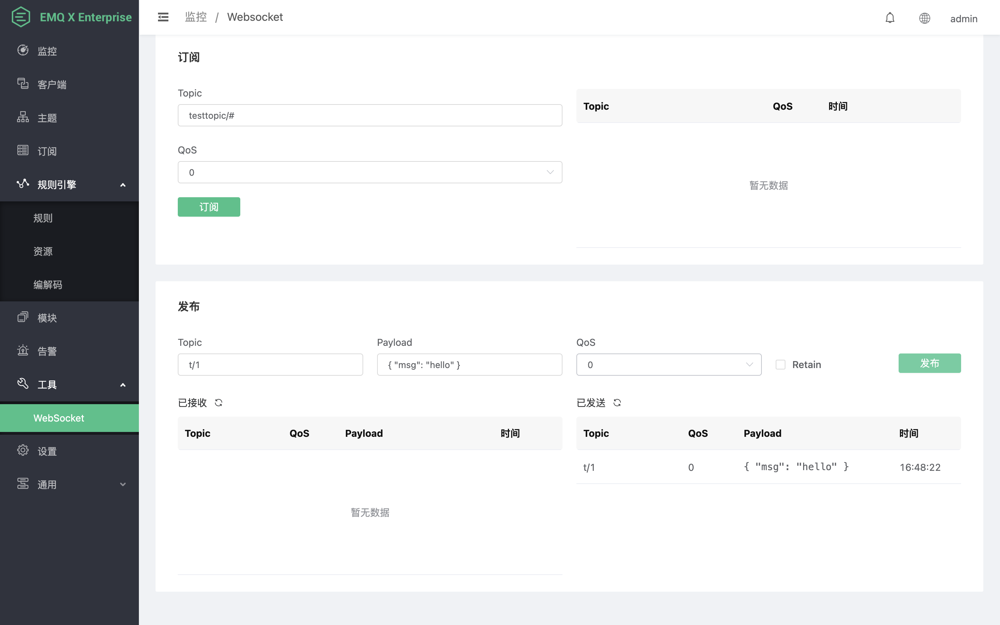
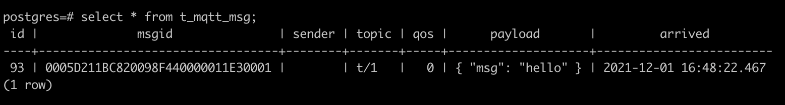

# 保存数据到 MatrixDB

搭建 MatrixDB 数据库，设置用户名密码为 root/public，并创建一个名为 mqtt 的数据库。

通过命令行工具 psql 访问 MatrixDB 并创建 `t_mqtt_msg` 表:

```bash
$ psql -h localhost -U root mqtt
```

```sql
CREATE TABLE t_mqtt_msg (
    id SERIAL primary key,
    msgid character varying(64),
    sender character varying(64),
    topic character varying(255),
    qos integer,
    payload text,
    arrived timestamp without time zone
);
```

创建规则:

打开 [EMQ X Dashboard](http://127.0.0.1:18083/#/rules)，选择左侧的 “规则” 选项卡。

填写规则 SQL:

```bash
SELECT * FROM "t/#"
```



关联动作:

在 “响应动作” 界面选择 “添加”，然后在 “动作” 下拉框里选择 “保存数据到 MatrixDB”。



填写动作参数:

“保存数据到 MatrixDB” 动作需要以下参数：

1). **使用资源**，即资源 ID，现在资源下拉框为空，需要先创建一个可用的 MatrixDB 资源实例。



点击 **使用资源** 右侧的 **新建** 按钮，进入 **创建资源** 页面，MatrixDB 资源提供了以下可配置项：

**服务器**，MatrixDB 的服务器地址。

**数据库名称**，MatrixDB 数据库名称。

**用户名、密码**，身份验证凭据。

**是否重连**，是否启用自动重连。

**连接池大小**，连接进程池大小，合理配置连接池大小以获取最佳性能。

**开启 SSL 连接**，是否启用 TLS 连接。

配置完成后，点击 **确定** 以完成创建。



资源创建成功后我们将回到 **新增动作** 页面，**使用资源** 也自动填充为我们刚刚创建的 Matrix 资源的资源 ID。



2). **启用批量插入**，是否启用批量插入，高并发场景下开启批量插入可显著改善写入性能。

3). **最大批量数**，单次批量请求可以发送的最大 INSERT SQL 条目。

4). **最大批量间隔**，两次批量请求之间最大的等待间隔。

5). **同步或异步插入**，指定进行同步或异步调用。

6). **调用超时时间**，以同步方式执行动作的超时时间，此选项仅在同步插入时有效。

7). **SQL 模板**，包含了占位符的 SQL 模板，用以插入或更新数据到数据库。本示例中我们使用以下 SQL：

```
INSERT INTO t_mqtt_msg (msgid, topic, qos, payload, arrived)
VALUES (${id}, ${topic}, ${qos}, ${payload}, to_timestamp(${timestamp}::double precision / 1000))
```

这里我们使用了 ${id} 等占位符，它们会在动作执行时被替换为运行时数据。



配置完成后，点击 **确定** 以完成动作的添加。然后在规则页面点击最下方的 **创建** 按钮完成规则创建。

完成 MatrixDB 资源和规则的创建后，我们来测试验证一下。我们直接使用 Dashboard 中的 MQTT 客户端工具来发布一条消息。本示例中我们将消息主题改为 `t/1` 以命中我们设置的规则，Payload 和 QoS 保持不变，然后点击 **发布**。



消息发布成功后，我们将可以在 `t_mqtt_msg` 表中看到新写入的数据：


