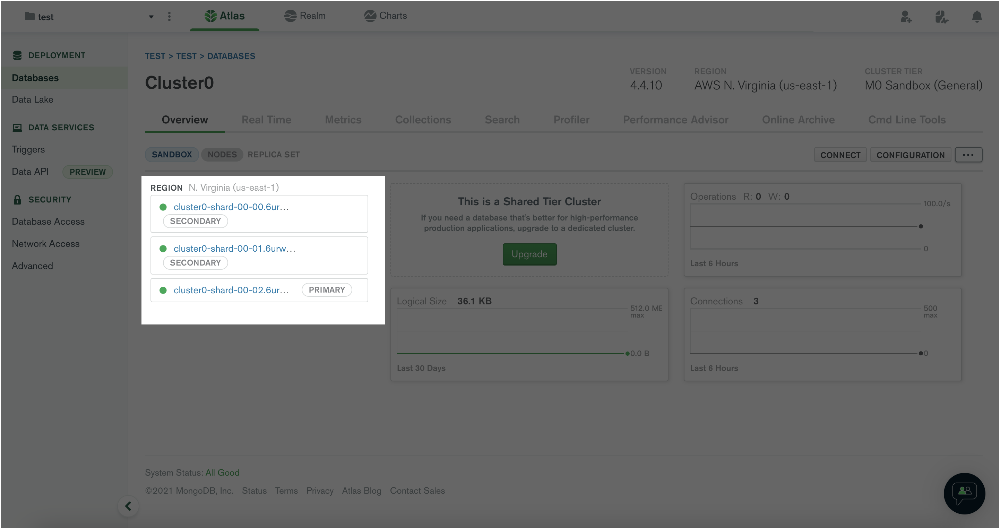
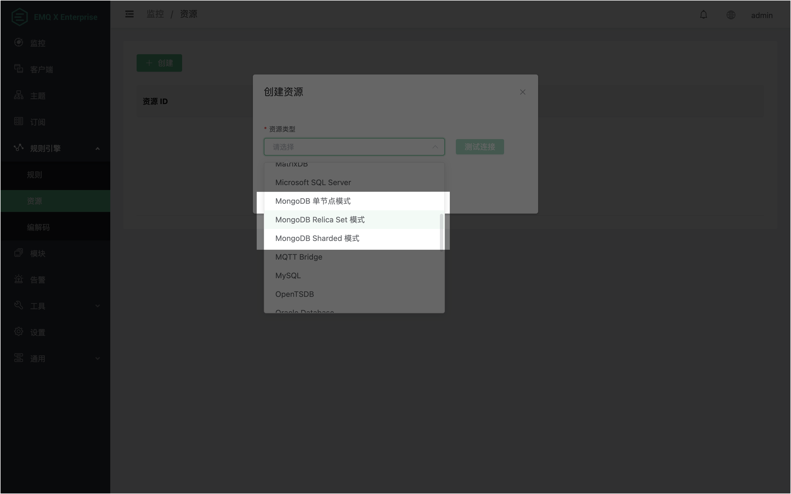
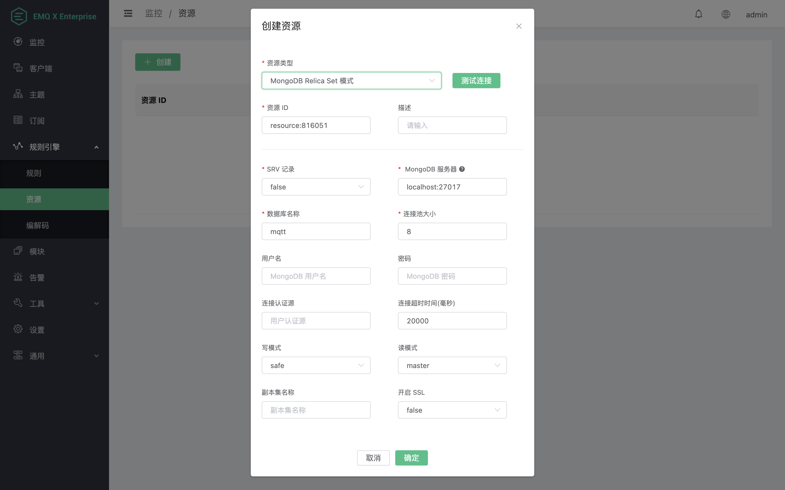
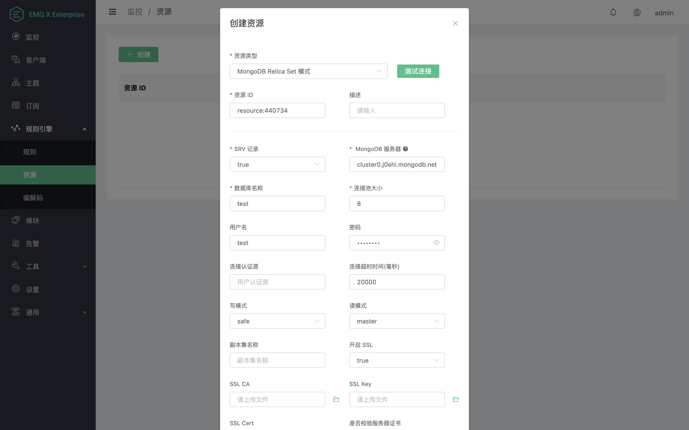
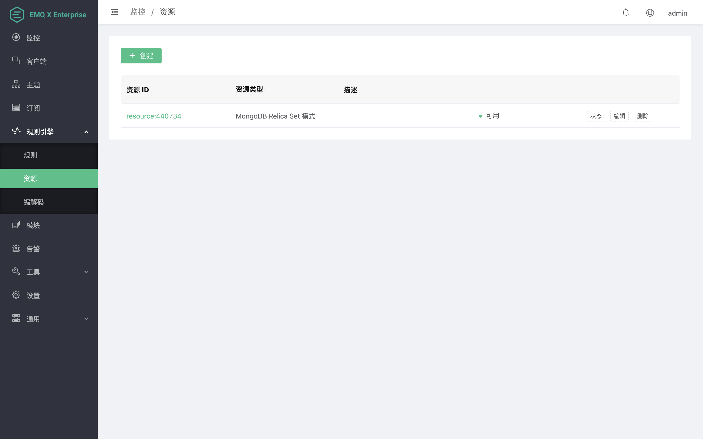
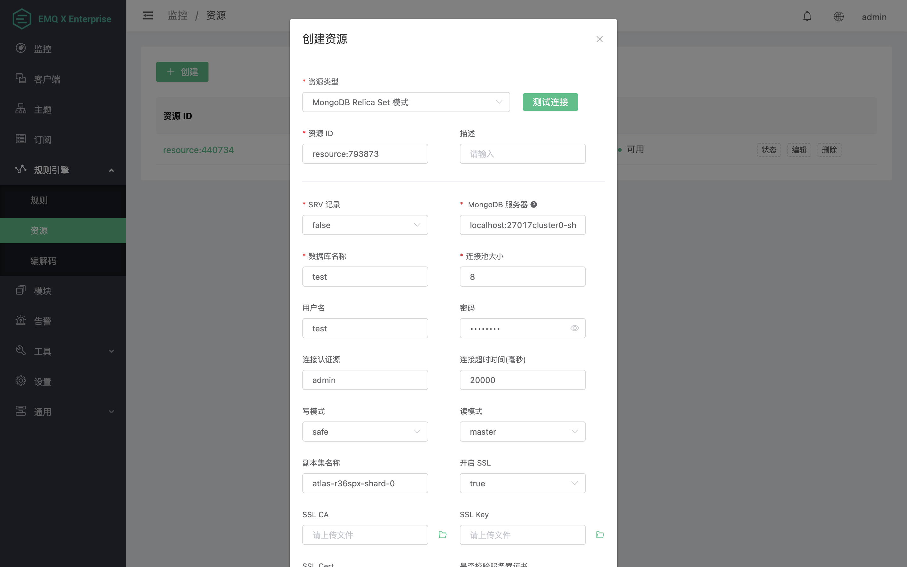
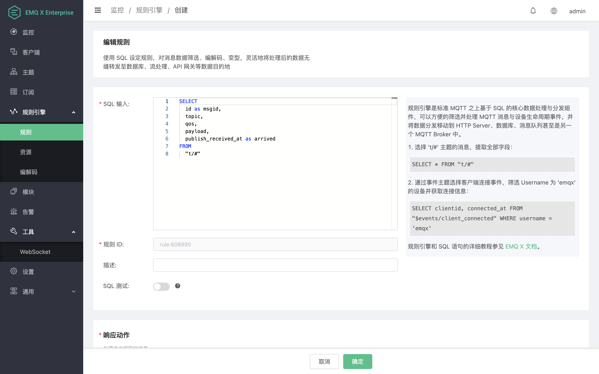
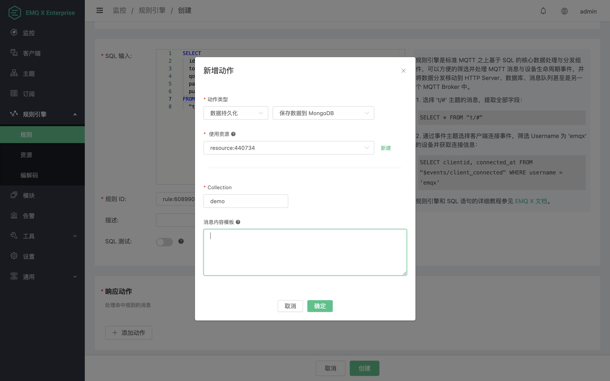
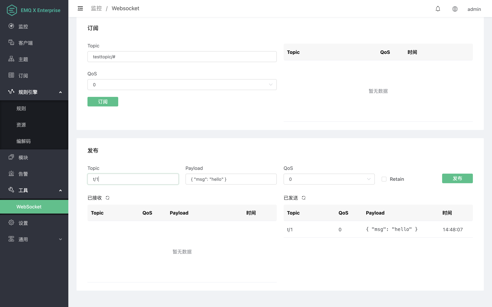

# 保存数据到 MongoDB

为方便演示部分功能，后续内容我们将基于 MongoDB Cloud 展开，不过以其他方式部署 MongoDB 的用户依然通过本文档了解学习规则引擎 MongoDB 资源和动作的使用。

我们首先在 MongoDB Cloud 上以副本集方式部署一个名为 Cluster0 的集群实例：


在本示例中，该集群实例包含了一个主节点和两个从节点：



在进入下一步之前，我们还需要在 `Database Access` 和 `Network Access` 页面配置用户密码和 IP 访问白名单以确保能成功访问。

## 创建资源

完成以上工作后，接下来我们将在 EMQX Dashboard 中完成 MongoDB 资源和规则的创建。

首先打开 EMQX Dashboard，进入规则引擎的资源页面，点击左上角的创建按钮，将弹出 **创建资源** 表单，在表单中的 **资源类型** 下拉框中我们可以看到 **MongoDB 单节点模式**、**MongoDB Relica Set 模式**和 **MongoDB Sharded 模式**三个资源类型，分别对应 MongoDB 的三种部署方式。



这里我们选择 **MongoDB Replica Set 模式**，然后根据 MongoDB Server 的实际情况完成相关参数的配置即可。

以下为 MongoDB 资源的部分参数说明：

- **SRV 记录**，是否查询 SRV 和 TXT 记录以获取服务器列表和 authSource、replicaSet 选项。
- **MongoDB 服务器**，指定服务器列表或添加了 DNS SRV 和 TXT 记录的域名。
- **数据库名称**，MongoDB 数据库名称。
- **连接池大小**，配置连接进程池大小，合理配置连接池大小以获取最佳性能。
- **用户名、密码**，身份验证凭据。
- **连接认证源**，指定用于授权的数据库，默认为 admin。如果启用了 SRV 记录，且您的 MongoDB 服务器域名添加了包含 authSource 选项的的 DNS TXT 记录，将优先使用该记录中的 authSource 选项。
- **写模式**，可设置为 unsafe 或 safe，设置为 safe 时会等待 MongoDB Server 的响应并返回给调用者。未指定时将使用默认值 safe。
- **读模式**，可设置为 master 或 slave_ok，设置为 master 时表示每次查询都将从主节点读取最新数据。未指定时将使用默认值 master。
- **副本集名称**，如果您的 MongoDB 以副本集方式部署，则需要指定相应的副本集名称。但如果 **SRV 记录** 设置为 true，且您的 MongoDB 服务器域名添加了包含 replicaSet 选项的 DNS TXT 记录，那么可以忽略此配置项。
- **开启 SSL**，是否启用 TLS 连接，设置为 true 时会出现更多 TLS 相关配置，请按需配置。注意：连接至 MongoDB Cloud 时必须开启 SSL。



根据是否启用 SRV Record，我们可以使用以下两种方式配置 MongoDB 资源：

### 启用 SRV Record

MongoDB Cloud 默认提供了一个已经添加了 SRV 和 TXT 记录的域名以供连接。

我们在 MongoDB Cloud 的 Databases 页面点击 Cluster0 实例的 Connect 按钮，三个连接方式任选其一，然后就可以看到当前实例需要使用的连接字符串，其中光标选中的部分就是我们稍后需要配置到 EMQX 规则引擎 MongoDB 资源的 **MongoDB 服务器** 字段的内容。


现在，我们继续完成 MongoDB 资源的配置，这里我主要进行了以下修改：

1. 将 **SRV 记录** 设置为 true，然后将 **MongoDB 服务器** 设置为我们刚刚获取的域名。
2. 将 **数据库名称** 设置为 test，这是 MongoDB Cloud 的默认数据库，你可以按需配置。
3. 配置 **用户名** 和 **密码**，你需要按实际情况配置。
4. **连接认证源** 和 **副本集名称** 保持为空，EMQX 会自动查询 DNS TXT 记录。
5. 将 **开启 SSL** 设置为 true，这是 MongoDB Cloud 的连接要求，其他方式部署时请按需配置。



最后，我们点击 **创建资源** 表单最下方的 **确定** 按钮以完成创建，此时一个新的 MongoDB 资源实例就在 EMQX 中创建成功了：



### 不启用 SRV Record

如果我们选择不启用 SRV Record，那么在副本集和分片模式下我们就需要将 MongoDB 集群的所有节点地址都填写到 **MongoDB 服务器** 选项中，并且在副本集模式下还必须指定副本集名称。

为了快速获取这些配置信息，我们可以使用 `nslookup` 命令来查询 DNS 记录：

```
$ nslookup
> set type=SRV 
> _mongodb._tcp.cluster0.j0ehi.mongodb.net
Server:         26.26.26.53
Address:        26.26.26.53#53

Non-authoritative answer:
_mongodb._tcp.cluster0.j0ehi.mongodb.net        service = 0 0 27017 cluster0-shard-00-01.j0ehi.mongodb.net.
_mongodb._tcp.cluster0.j0ehi.mongodb.net        service = 0 0 27017 cluster0-shard-00-02.j0ehi.mongodb.net.
_mongodb._tcp.cluster0.j0ehi.mongodb.net        service = 0 0 27017 cluster0-shard-00-00.j0ehi.mongodb.net.

Authoritative answers can be found from:
> set type=TXT 
> cluster0.j0ehi.mongodb.net
Server:         26.26.26.53
Address:        26.26.26.53#53

Non-authoritative answer:
cluster0.j0ehi.mongodb.net      text = "authSource=admin&replicaSet=atlas-r36spx-shard-0"
```

然后将查询到的服务器列表按 `host[:port][,...hostN[:portN]]` 格式填写到 **MongoDB 服务器** 选项中，并且按照查询到的 TXT 记录内容来配置 **认证数据源** 和 **副本集名称**：

::: warning
MongoDB 要求写入的数据必须是 JSON 格式，所以请务必保证你的模板在占位符替换之后，是一个合法的 JSON 格式。比如你可以这样写：

```
{"client": "${clientid}"}
```
:::

再点击 “新建” 完成规则创建



最后，我们同样点击 **创建资源** 表单最下方的 **确定** 按钮以完成创建。

## 创建规则

### 1. 配置 SQL

资源创建完成后，我们还需创建相应的规则。点击规则页面左上角的 **创建** 按钮进入 **创建规则** 页面，输入以下 SQL：

```
SELECT
	id as msgid,
	topic,
	qos,
	payload,
	publish_received_at as arrived
FROM
	"t/#"
```

这个 SQL 表示所有主题与主题过滤器 `t/#` 匹配的消息都将触发这条规则，例如 `t/1`，`t/1/2` 等，并且使用筛选出来的 msgid，topic 等数据执行后续的动作。



### 2. 添加响应动作

点击 **添加动作** 按钮，**动作类型** 选择数据持久话和保存数据到 MongoDB，然后在 **使用资源** 下拉列表选择一个我们刚刚创建的资源。**Collection** 按需配置，这里我配置为 demo。**消息内容模板 ** 保持为空，表示将 SQL 筛选出来的数据，以 Key-Value 列表的形式转换为 Json 数据写入 MongoDB。每条规则里面都可以添加多个响应动作，这里我们只需要用到一个响应动作，所以添加完以下动作时，就可以点击页面最下方的 **创建** 按钮完成规则的创建。



## 测试验证

我们直接使用 Dashboard 中的 MQTT 客户端工具来发布一条消息。本示例中我们将消息主题改为 `t/1` 以命中我们设置的规则，Payload 和 QoS 保持不变，然后点击 **发布**。



消息发布成功后，我们就可以在 MongoDB Cloud 的 Cluster0 集群实例的 Collections 页面看到刚刚写入的数据：


