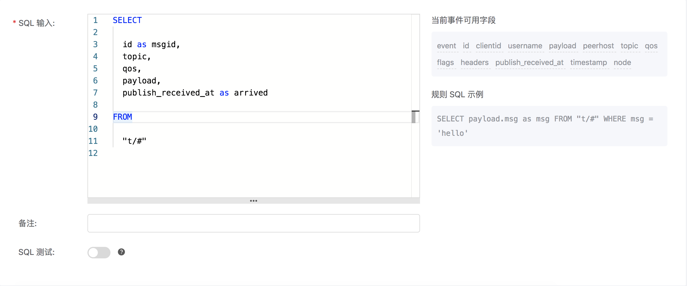
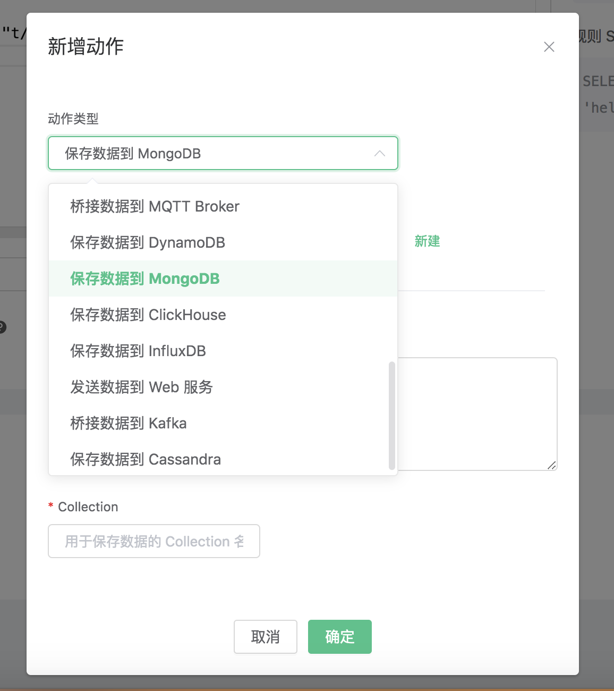
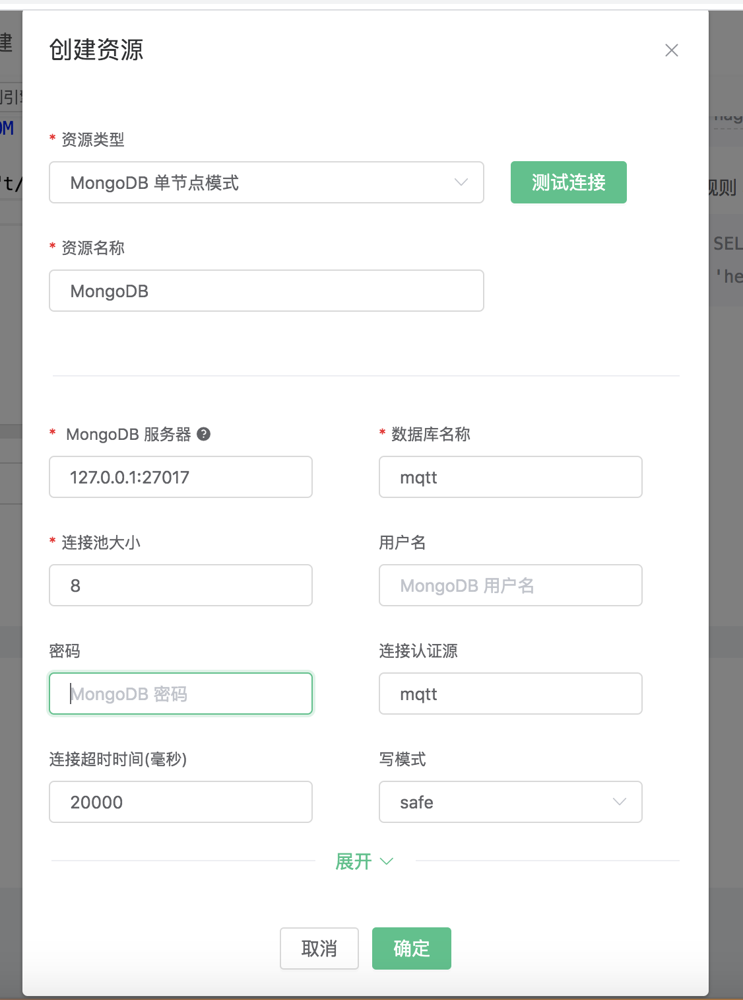
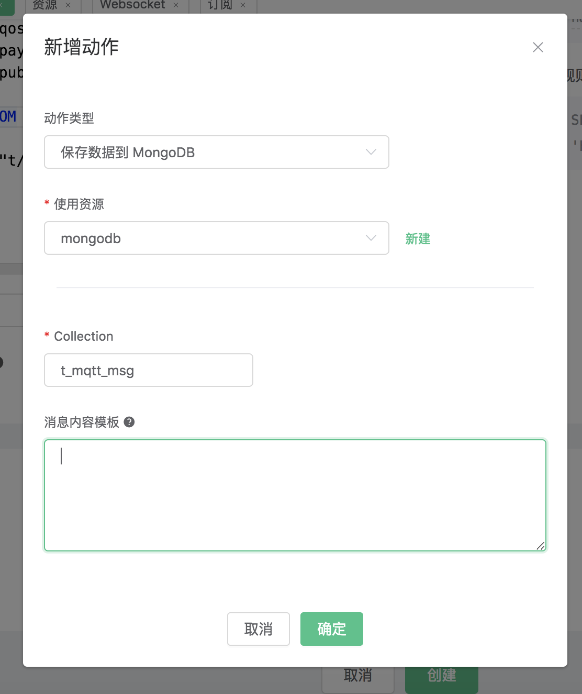

# 保存数据到 MongoDB

搭建 MongoDB 数据库，并设置用户名密码为 root/public，以 MacOS X 为例:

```bash
$ brew install mongodb
$ brew services start mongodb

## 新增 root/public 用户
$ use mqtt;
$ db.createUser({user: "root", pwd: "public", roles: [{role: "readWrite", db: "mqtt"}]});

## 修改配置，关闭匿名认证
$ vim /usr/local/etc/mongod.conf

    security:
    authorization: enabled

$ brew services restart mongodb
```

初始化 MongoDB 表:

```bash
$ mongo 127.0.0.1/mqtt -uroot -ppublic
db.createCollection("t_mqtt_msg");
```

创建规则:

打开 [EMQ X Dashboard](http://127.0.0.1:18083/#/rules)，选择左侧的 “规则” 选项卡。

填写规则 SQL:

```bash
SELECT id as msgid, topic, qos, payload, publish_received_at as arrived FROM "t/#"
```



关联动作:

在 “响应动作” 界面选择 “添加”，然后在 “动作” 下拉框里选择 “保存数据到 MongoDB”。



填写动作参数:

“保存数据到 MongoDB” 动作需要三个参数：

1). 关联资源的 ID。初始状况下，资源下拉框为空，现点击右上角的 “新建资源” 来创建一个 MongoDB 单节点 资源。


填写资源配置:

数据库名称 填写 “mqtt”，用户名填写 “root”，密码填写 “public”，连接认证源填写 “mqtt”
其他配置保持默认值，然后点击 “测试连接” 按钮，确保连接测试成功。



点击 “新建” 按钮，完成资源的创建。

2). Collection 名称。这个例子我们向刚刚新建的 collection 插入数据，填 “t_mqtt\_msg”

3). Payload Tmpl 模板。这个例子里我们向 MongoDB 插入一条数据，模板为空, 插入的数据是上面SQL语句select出来的结果用json格式写入到MongoDB中




在点击 “新建” 完成规则创建


现在发送一条数据，测试该规则:

```bash
Topic: "t/mongo"
QoS: 1
Payload: "hello"
```

然后检查 MongoDB 表，可以看到该消息已成功保存:


在规则列表里，可以看到刚才创建的规则的命中次数已经增加了 1:


