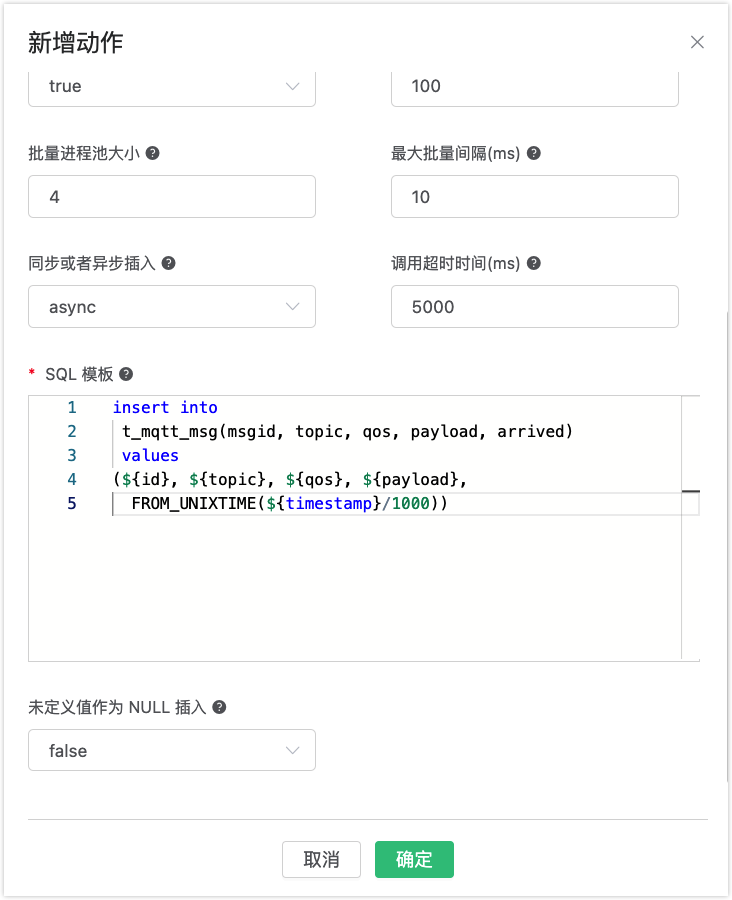
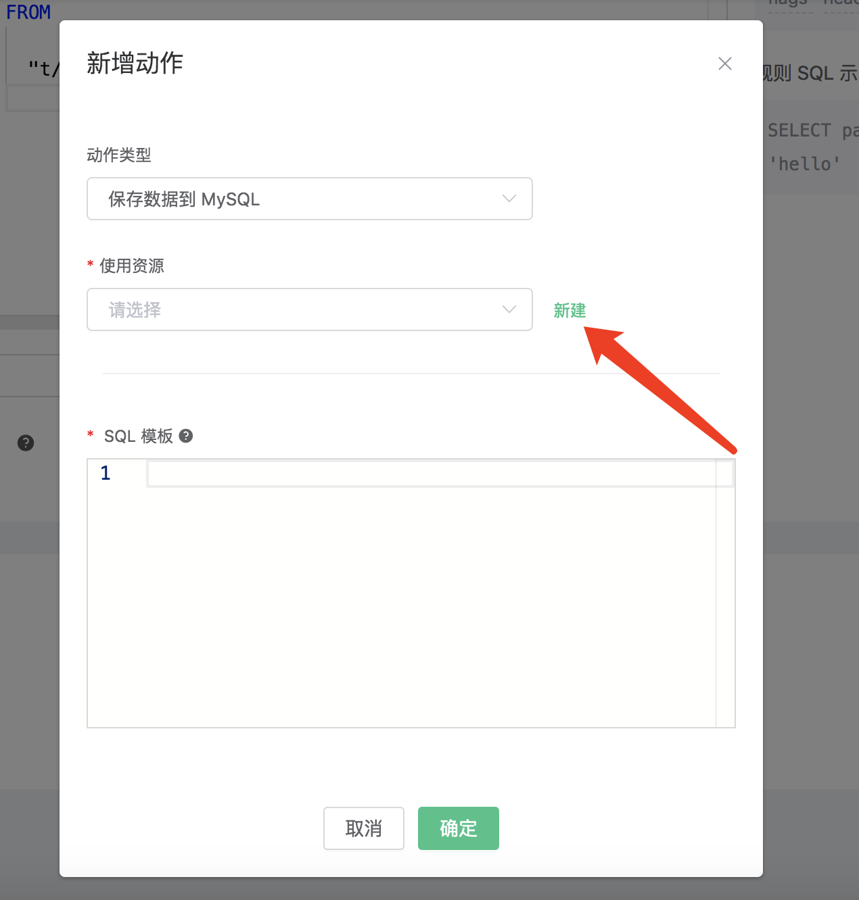
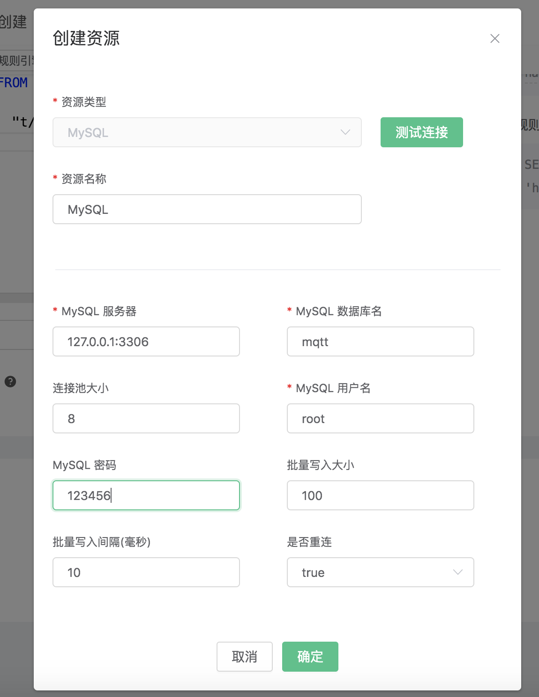
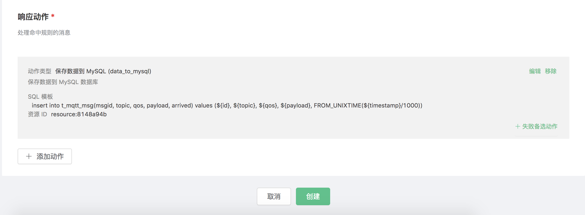

# 集成 MySQL

搭建 MySQL 数据库，并设置用户名密码为 root/public，以 MacOS X 为例:

```bash
$ brew install mysql

$ brew services start mysql

$ mysql -u root -h localhost -p

ALTER USER 'root'@'localhost' IDENTIFIED BY 'public';
```

初始化 MySQL 表:

```bash
$ mysql -u root -h localhost -ppublic
```

创建 “test” 数据库:
```bash
CREATE DATABASE test;
```
创建 t_mqtt_msg 表:

```sql
USE test;
CREATE TABLE `t_mqtt_msg` (
`id` int(11) unsigned NOT NULL AUTO_INCREMENT,
`msgid` varchar(64) DEFAULT NULL,
`topic` varchar(255) NOT NULL,
`qos` tinyint(1) NOT NULL DEFAULT '0',
`payload` blob,
`arrived` datetime NOT NULL,
PRIMARY KEY (`id`),
INDEX topic_index(`topic`)
) ENGINE=InnoDB DEFAULT CHARSET=utf8MB4;
```


创建规则:

打开 [EMQX Dashboard](http://127.0.0.1:18083/#/rules)，选择左侧的 “规则” 选项卡。

填写规则 SQL:

```sql
SELECT * FROM "t/#"
```


关联动作:

在 “响应动作” 界面选择 “添加”，然后在 “动作” 下拉框里选择 “保存数据到 MySQL”。


填写动作参数:

“保存数据到 MySQL” 动作需要两个参数：

1). SQL 模板。这个例子里我们向 MySQL 插入一条数据，SQL
​    模板为:

```sql
insert into t_mqtt_msg(msgid, topic, qos, payload, arrived) values (${id}, ${topic}, ${qos}, ${payload}, FROM_UNIXTIME(${timestamp}/1000))
```

插入数据之前，SQL 模板里的 ${id} 占位符会被替换为相应的值。

如果占位符变量未定义，您可以使用**未定义值作为 NULL 插入**选项来规定规则引擎的行为：

- `false` （默认）：规则引擎可能会插入 `undefined` 字符串到数据库中。
- `true`：当变量未定义时，规则引擎使用 `NULL` 写入到数据库。



2). 关联资源的 ID。现在资源下拉框为空，可以点击右上角的 “新建” 来创建一个 MySQL 资源:



填写资源配置:

数据库名填写 “mqtt”，用户名填写 “root”，密码填写 “123456”



点击 “新建” 按钮。

返回响应动作界面，点击 “确认”。

返回规则创建界面，点击 “创建”。



在规则列表里，点击 “查看” 按钮或规则 ID 连接，可以预览刚才创建的规则:


规则已经创建完成，现在发一条数据:

```bash
Topic: "t/a"
QoS: 1
Payload: "hello"
```

然后检查 MySQL 表，新的 record 是否添加成功:

