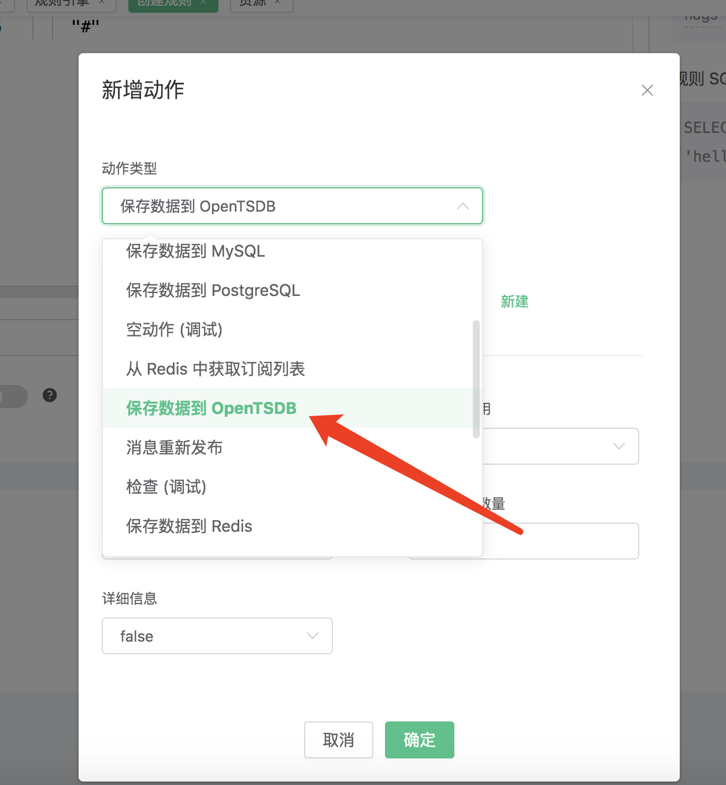
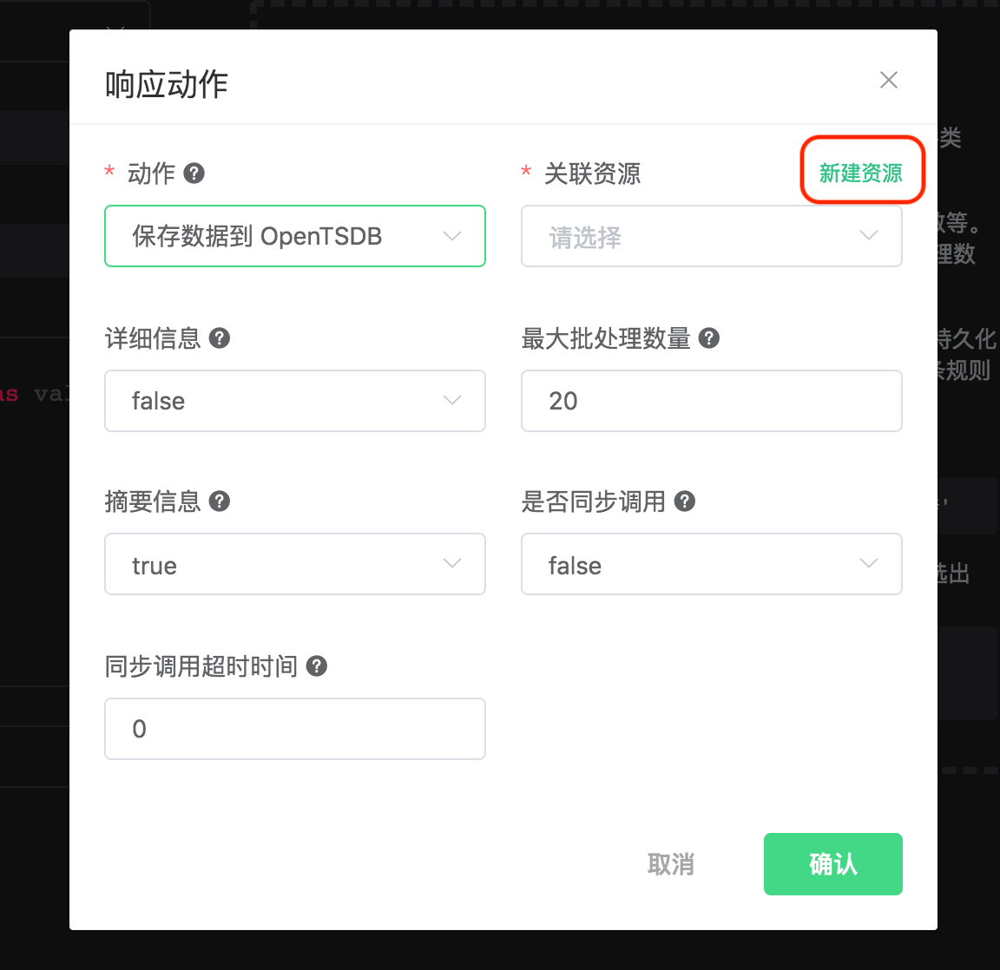
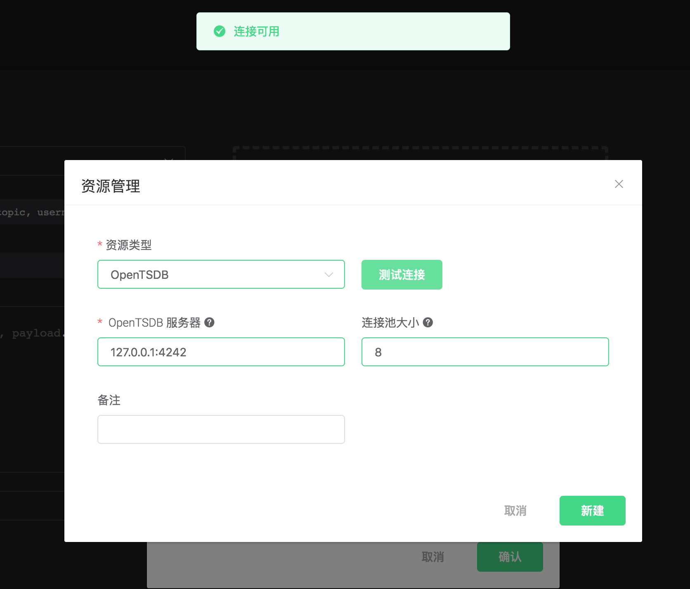
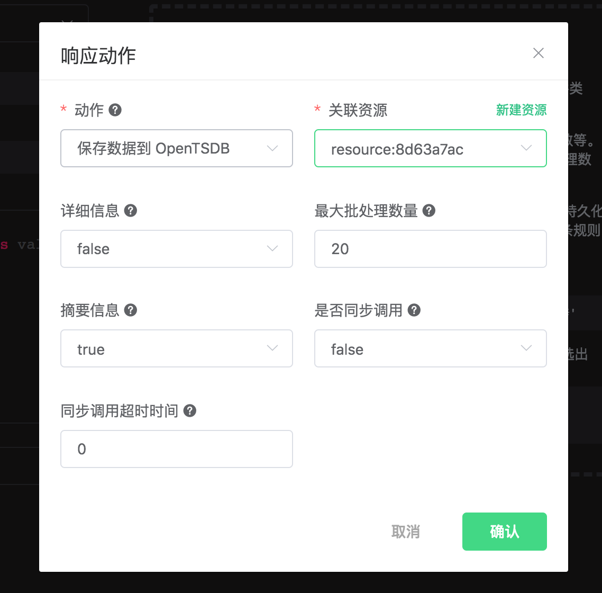
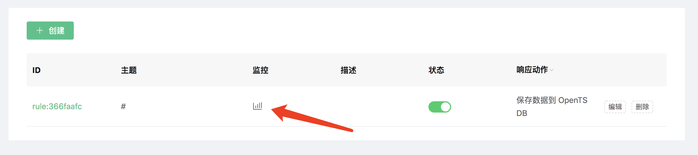

# 保存数据到 OpenTSDB

搭建 OpenTSDB 数据库环境，以 MacOS X 为例:

```bash
$ docker pull petergrace/opentsdb-docker

$ docker run -d --name opentsdb -p 4242:4242 petergrace/opentsdb-docker
```

创建规则:

打开 [EMQ X Dashboard](http://127.0.0.1:18083/#/rules)，选择左侧的 “规则” 选项卡。

填写规则 SQL:

```sql
SELECT
    payload as p,
    p.metric as metric, p.tags as tags, p.value as value
FROM
    "#"
```


关联动作:

在 “响应动作” 界面选择 “添加”，然后在 “动作” 下拉框里选择 “保存数据到 OpenTSDB”。



填写动作参数:

“保存数据到 OpenTSDB” 动作需要六个参数:

1). 详细信息。是否需要 OpenTSDB Server 返回存储失败的 data point 及其原因的列表，默认为 false。

2). 摘要信息。是否需要 OpenTSDB Server 返回 data point 存储成功与失败的数量，默认为 true。

3). 最大批处理数量。消息请求频繁时允许 OpenTSDB 驱动将多少个 Data Points 合并为一次请求，默认为 20。

4). 是否同步调用。指定 OpenTSDB Server 是否等待所有数据都被写入后才返回结果，默认为 false。

5). 同步调用超时时间。同步调用最大等待时间，默认为 0。

6). 关联资源。现在资源下拉框为空，可以点击右上角的 “新建资源” 来创建一个 OpenTSDB 资源:



选择 “OpenTSDB 资源”:

填写资源配置:

本示例中所有配置保持默认值即可，点击 “测试连接” 按钮，确保连接测试成功。

最后点击 “新建” 按钮。



返回响应动作界面，点击 “确认”。



返回规则创建界面，点击 “新建”。


规则已经创建完成，现在发一条消息:

```bash
Topic: "t/1"

QoS: 0

Payload: "{"metric":"cpu","tags":{"host":"serverA"},"value":12}"
```

我们通过 Postman 或者 curl 命令，向 OpenTSDB Server 发送以下请求:

```bash
POST /api/query HTTP/1.1
Host: 127.0.0.1:4242
Content-Type: application/json
cache-control: no-cache
Postman-Token: 69af0565-27f8-41e5-b0cd-d7c7f5b7a037
{
    "start": 1560409825000,
    "queries": [
        {
            "aggregator": "last",
            "metric": "cpu",
            "tags": {
                "host": "*"
            }
        }
    ],
    "showTSUIDs": "true",
    "showQuery": "true",
    "delete": "false"
}
------WebKitFormBoundary7MA4YWxkTrZu0gW--
```

如果 data point 存储成功，将会得到以下应答:

```json
[
  {
      "metric": "cpu",
      "tags": {
          "host": "serverA"
      },
      "aggregateTags": [],
      "query": {
          "aggregator": "last",
          "metric": "cpu",
          "tsuids": null,
          "downsample": null,
          "rate": false,
          "filters": [
              {
                  "tagk": "host",
                  "filter": "*",
                  "group_by": true,
                  "type": "wildcard"
              }
          ],
          "index": 0,
          "tags": {
              "host": "wildcard(*)"
          },
          "rateOptions": null,
          "filterTagKs": [
              "AAAC"
          ],
          "explicitTags": false
      },
      "tsuids": [
          "000002000002000007"
      ],
      "dps": {
          "1561532453": 12
      }
  }
]
```

在规则列表里，可以看到刚才创建的规则的命中次数已经增加了 1:



