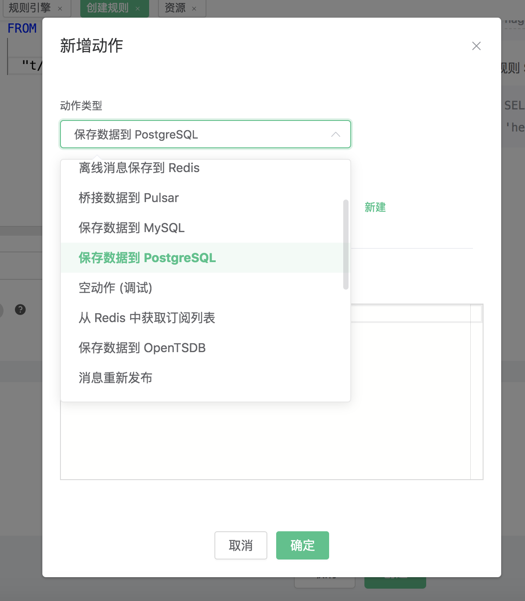
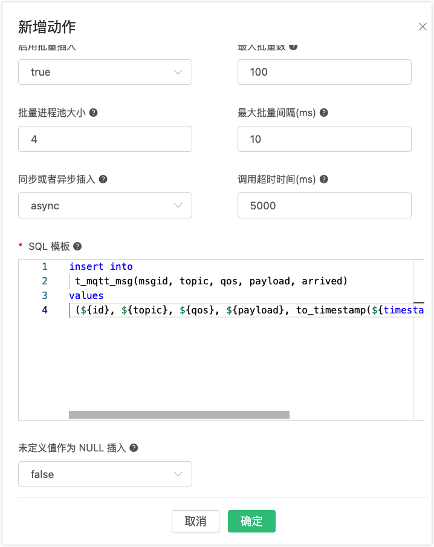

# 保存数据到 PostgreSQL

搭建 PostgreSQL 数据库，以 MacOS X 为例:

```bash
$ brew install postgresql
$ brew services start postgresql
```

```bash
## 使用用户名 root 创建名为 'mqtt' 的数据库
$ createdb -U root mqtt

$ psql -U root mqtt

mqtt=> \dn;
List of schemas
Name  | Owner
--------+-------
public | shawn
(1 row)
```

初始化 PgSQL 表:

```bash
$ psql -U root mqtt
```

创建 `t_mqtt_msg` 表:

```sql
CREATE TABLE t_mqtt_msg (
    id SERIAL primary key,
    msgid character varying(64),
    sender character varying(64),
    topic character varying(255),
    qos integer,
    payload text,
    arrived timestamp without time zone
);
```

创建规则:

打开 [EMQ X Dashboard](http://127.0.0.1:18083/#/rules)，选择左侧的 “规则” 选项卡。

填写规则 SQL:

```bash
SELECT * FROM "t/#"
```


关联动作:

在 “响应动作” 界面选择 “添加”，然后在 “动作” 下拉框里选择 “保存数据到 PostgreSQL”。



填写动作参数:

“保存数据到 PostgreSQL” 动作需要两个参数：

1). 关联资源的 ID。现在资源下拉框为空，可以点击右上角的 “新建资源” 来创建一个 PostgreSQL 资源:


选择 “PostgreSQL 资源”。

填写资源配置:

数据库名填写 “mqtt”，用户名填写 “root”，其他配置保持默认值，然后点击 “测试连接” 按钮，确保连接测试成功。

最后点击 “新建” 按钮。


返回响应动作界面，点击 “确认”。

2).SQL 模板。这个例子里我们向 PostgreSQL 插入一条数据，SQL
​    模板为:

```bash
insert into t_mqtt_msg(msgid, topic, qos, payload, arrived) values (${id}, ${topic}, ${qos}, ${payload}, to_timestamp(${timestamp}::double precision /1000))
```

插入数据之前，SQL 模板里的 ${key} 占位符会被替换为相应的值。



返回规则创建界面，点击 “创建”。


规则已经创建完成，现在发一条数据:

```bash
Topic: "t/1"
QoS: 0
Payload: "hello1"
```

然后检查 PostgreSQL 表，新的 record 是否添加成功:


在规则列表里，可以看到刚才创建的规则的命中次数已经增加了 1:

