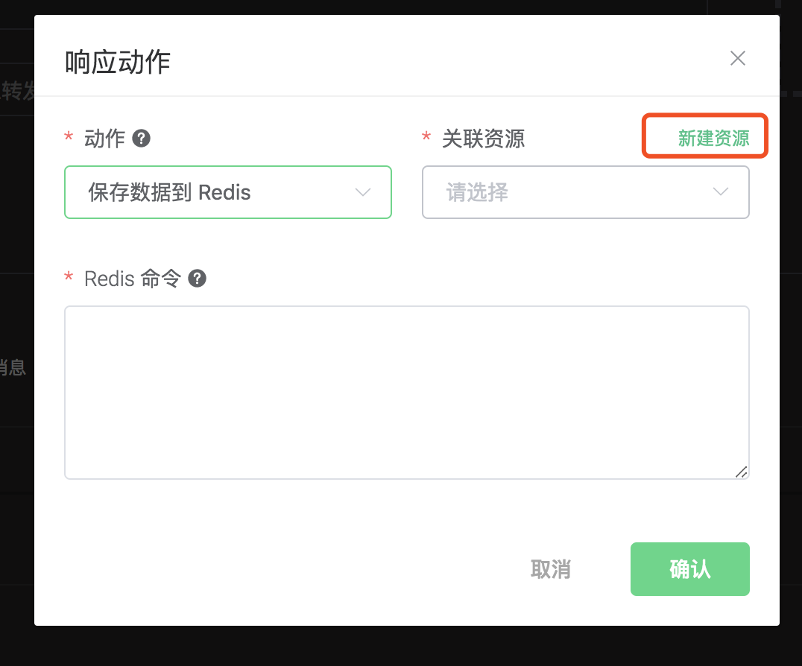
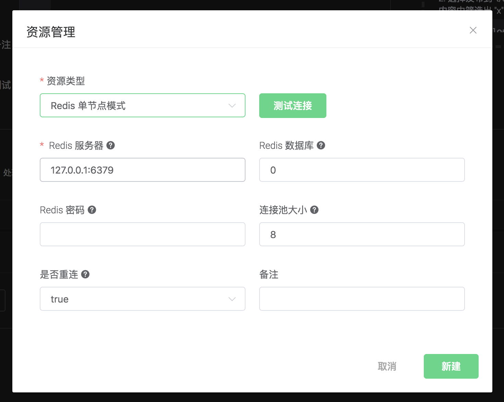
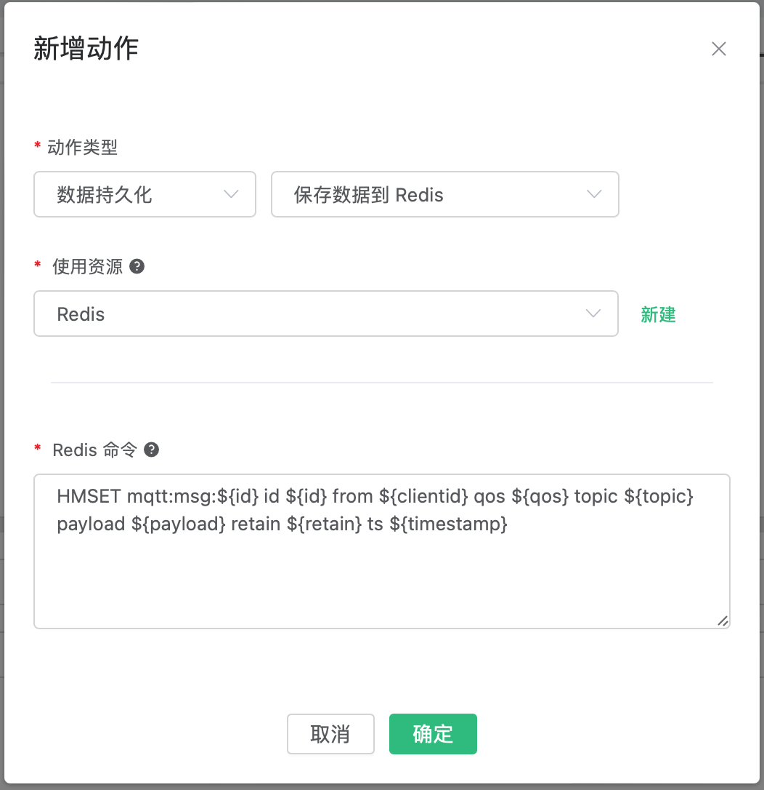
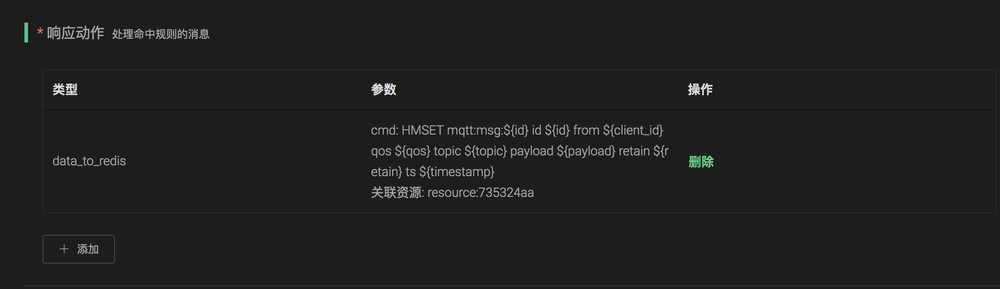
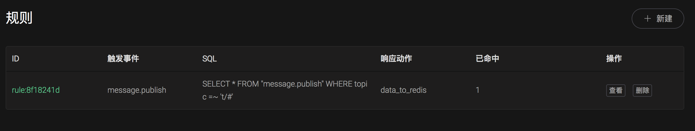

# 保存数据到 Redis

搭建 Redis 环境，以 MacOS X 为例:

```bash
 $ wget http://download.redis.io/releases/redis-4.0.14.tar.gz
$ tar xzf redis-4.0.14.tar.gz
$ cd redis-4.0.14
$ make && make install

# 启动 redis
$ redis-server
```

创建规则:

打开 [EMQ X Dashboard](http://127.0.0.1:18083/#/rules)，选择左侧的 “规则” 选项卡。

填写规则 SQL:

```bash
SELECT * FROM "t/#"
```


关联动作:

在 “响应动作” 界面选择 “添加”，然后在 “动作” 下拉框里选择 “保存数据到 Redis”。


填写动作参数:

“保存数据到 Redis 动作需要两个参数：

1). 关联资源。现在资源下拉框为空，可以点击右上角的 “新建资源” 来创建一个 Redis 资源:



选择 Redis 单节点模式资源”。

填写资源配置:

   填写真实的 Redis 服务器地址，其他配置保持默认值，然后点击 “测试连接” 按钮，确保连接测试成功。

最后点击 “新建” 按钮。



返回响应动作界面，点击 “确认”。

2). Redis 的命令:

```bash
HMSET mqtt:msg:${id} id ${id} from ${client_id} qos ${qos} topic ${topic} payload ${payload} ts ${timestamp}
```



返回规则创建界面，点击 “新建”。



规则已经创建完成，现在发一条数据:

```bash
Topic: "t/1"

QoS: 0

Payload: "hello"
```

然后通过 Redis 命令去查看消息是否生产成功:

```bash
$ redis-cli

KEYS mqtt:msg*

hgetall Key
```


在规则列表里，可以看到刚才创建的规则的命中次数已经增加了 1:


