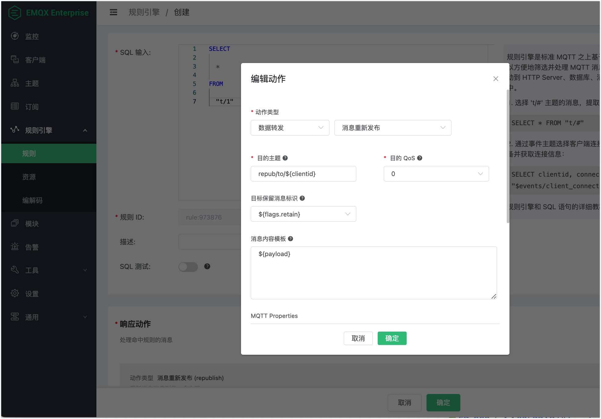
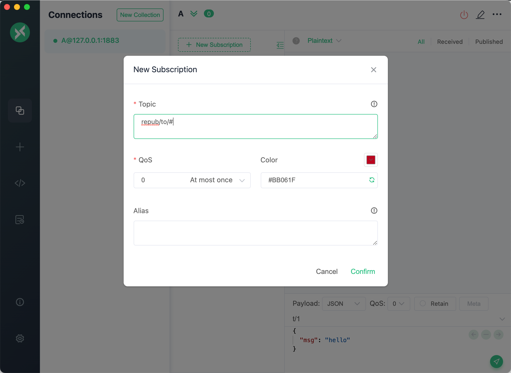
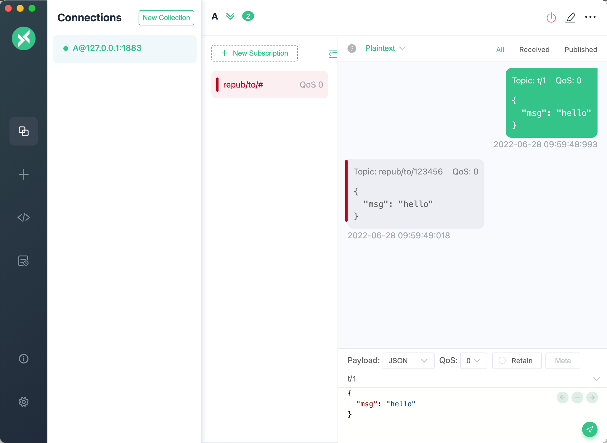

# 消息重新发布

消息的接收者，需要获取消息中更多的信息，比如消息来源（发布者 ClientID，Username 等），消息本身的属性（发布时间，消息流入的节点等），而原始的消息中没有携带这些信息，就需要使用重新发布功能，由 EMQX 将消息信息重组，实现不升级不改变老设备的业务行为，兼容新的业务需求。

## 创建规则

点击规则引擎 - 规则 - 创建规则，输入 SQL：

```SQL
SELECT

    *

FROM

  "t/1"
```

文档中的 SQL 仅作为示例，实际需求请按照业务编写。

## 创建动作

点击添加动作，选择数据转发，消息重新发布，输入目的主题等参数，参数定义请参考下表：

| 参数名 | 定义 | 类型 |
| --- | --- | --- |
| 目的主题 | 转发消息的主题名，可以使用占位符变量。文档中使用的`${repub/to/${clientid}}`，在规则 SQL 配合使用的情况下，表示使用发布者的 clientid 作为后缀。自定义业务规则 SQL，可以使用其他的变量来代替 | String |
| 目的 QoS | 转发消息的 QoS 等级，使用 0、1 或 2，也可以使用占位符变量。文档中使用的`${qos}`，在规则 SQL 配合使用的情况下，表示使用原消息的 QoS 等级。自定义业务规则 SQL，可以使用其他的 Integer 类型的变量来代替 | Integer 或 占位符变量 |
| 目标保留消息标识 | 转发消息的保留消息标识，可以使用占位符变量。文档中使用的`${flags.retain}`，在规则 SQL 配合使用的情况下，表示使用原消息的 Retain 标识。自定义业务规则 SQL，可以使用其他的 Boolean 类型的变量来代替 | Boolean 或 占位符变量 |
| 消息内容模板 | 转发消息的报文内容，可以使用占位符变量。文档中使用的`${payload}`，在规则 SQL 配合使用的情况下，表示使用原消息的 Payload 内容。自定义业务规则 SQL，可以使用其他的变量来代替 | String |

注意，当 QoS 与 Retain 使用占位符变量之后，从消息信息中获取到的参数不合法（即 QoS 不是 0、1 或 2，Retain 不是 true 、 false）时，消息会被丢弃，并标记此 action 失败。



## 使用

使用桌面 MQTT 客户端 MQTTX，设置 clientid 为 `123456`， 连接设备并订阅 `repub/to/#`。



发布一条消息，可以看到收到了 topic 为 `repub/to/123456` 的消息。


