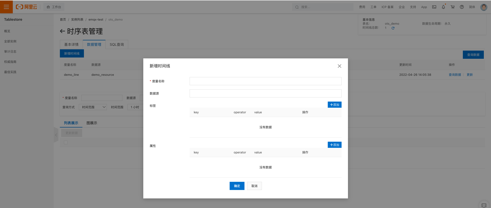
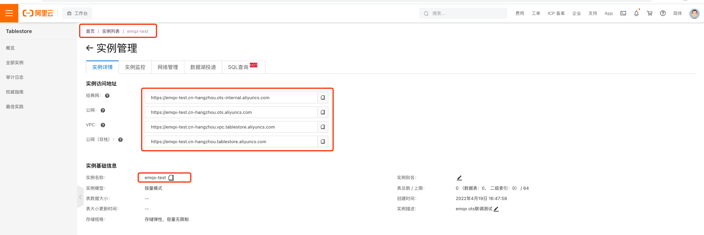

# 保存数据到 Alibaba Tablestore 数据库

创建数据库实例（创建实例操作步骤请参考 Tablestore 官方文档）。

</br>点击实例管理，点击时序表列表。创建时序表。


点击上一步中创建的时序表，进入时序表管理。点击数据管理，创建时间线，按照业务设计创建出时间线。
（此步骤可以跳过，当写入不存在的时间线时，Tablestore 会自动创建出新的时间线，示例中不对时间线操作）



## 创建规则引擎资源

点击规则引擎，资源，创建资源，下拉框中找到 `Tablestore (时序)`


使用创建出的实例属性，填写对应 `Tablestore 服务器` 和 `实例` 名称。
</br>
AccessKey & Secret 需要使用阿里账号申请，详细申请步骤，请参考 Tablestore 官方文档。
</br>
服务器地址请按照部署方式的不同，填写不同的域名。



## 创建规则

规则中 SQL 语句的编写，请参考官网文档中规则引擎章节。


示例中使用的规则 SQL

```SQL
SELECT

payload.k_int as k_int,
payload.k_bool as k_bool,
payload.k_str as k_str,
payload.k_bin as k_bin,
payload.k_float as k_float,
clientid

FROM
 "#"
```

### 创建动作
表名与度量名称，请按照创建的表名与度量名称填写（度量名称可以为空字符串）。


参数列表
| 参数 | 定义 |
| --- | --- |
| 度量名称 | Tablestore 度量名称 |
| 数据源 | Tablestore 数据源，可为空字符串 |
| 时间戳（微秒） | 单位微秒，EMQX 中 MQTT 消息中默认带有毫秒精度的时间戳，不可直接使用。缺省值为消息到达 EMQX 的微秒时间戳 |
| 时间线缓存 | Tablestore 识别当前数据是否需要创建或更新时间线元数据，默认开启 |
| 同步写入 | 开启批量写入，或单条同步写入。批量写入时，备选动作不会触发 |
| 异步模式批量大小 | 批量写入最大数据条数，仅在关闭同步写入时生效 |
| 异步模式批量间隔（毫秒） | 批量写入最长时间间隔，仅在关闭同步写入时生效 |
| Tags | 数据标签，所有数据都以字符串形式处理 |
| 数据列名 | 数据键值对，数据类型自动识别。字符串数据默认按照二进制数据处理以保证字符集最佳兼容性 |
| 字符型数据列名 | 字符串键值对，数据会按照字符串类型处理 |

Tablestore 支持的数据格式：

- int
- float
- boolean
- string
- binary

这些格式可以被规则引擎自动的识别并分类。但是字符串型数据，默认处理方式为二进制数据，以保证最佳的兼容性。如果需要指定字段值为字符串类型，可以在创建动作时，将字段填写到 `字符型数据列名` 中。之后会则引擎会按照字符串的格式方式处理改字段值。


### 生产测试数据

使用先进的桌面 MQTT 客户端 `MQTT X` ，登录设备，并发送一条数据。


输入度量名称（演示使用的是 `m_re2`），client ID 为 `123456`，我们使用 `client=123456` 作为查询条件，点击查询。


可以看到数据已经写入成功。
