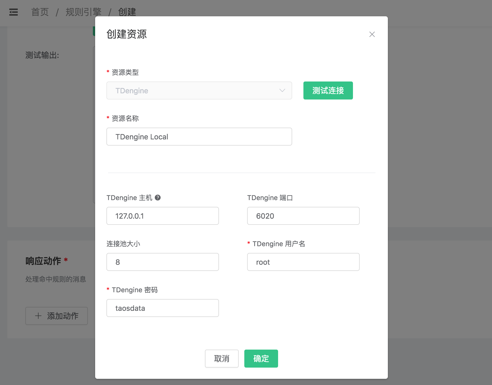
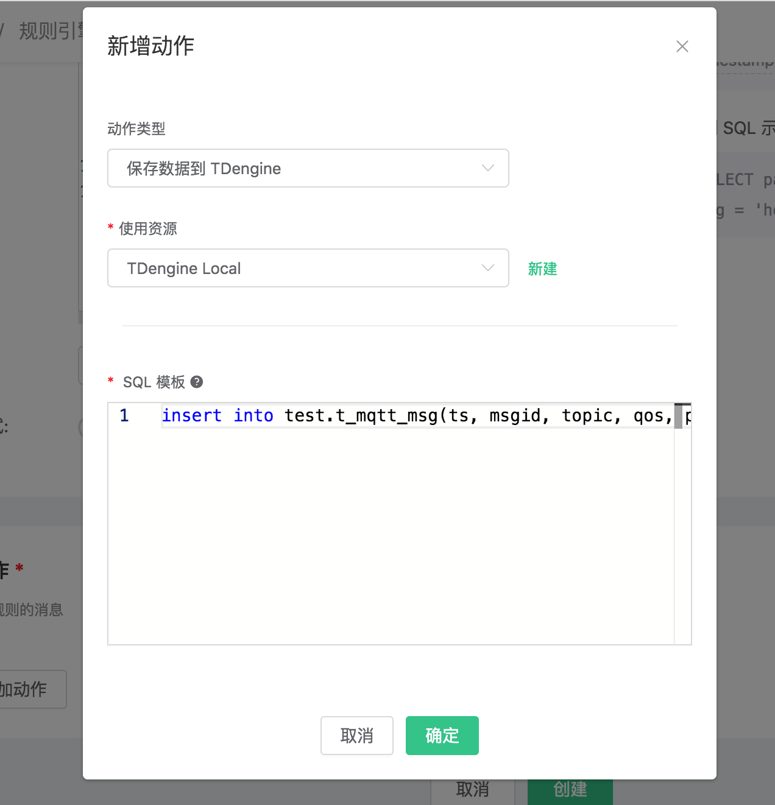
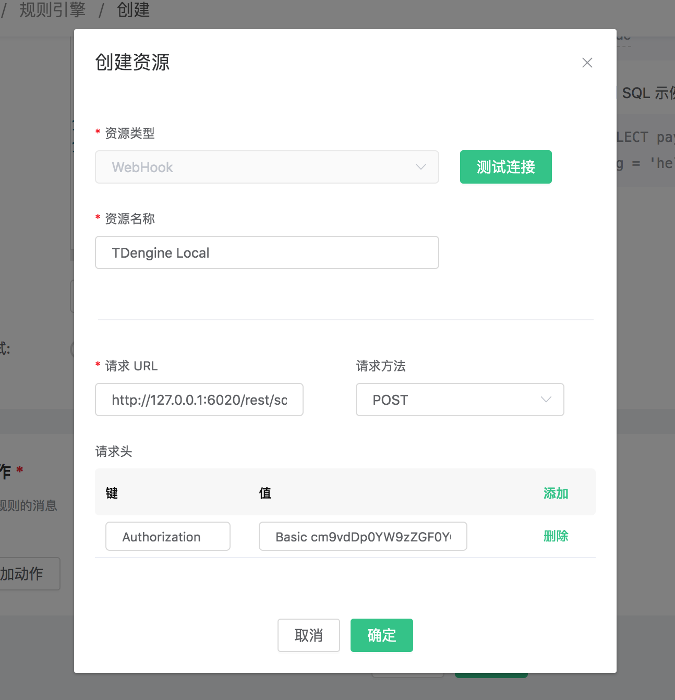
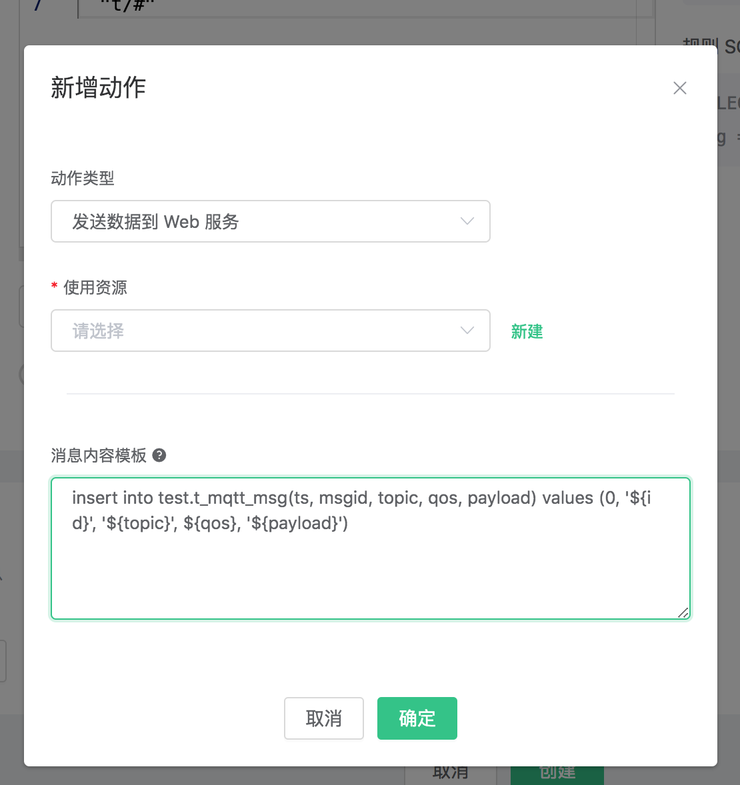

# 保存数据到 TDengine

[TDengine](https://github.com/taosdata/TDengine) 是[涛思数据](https://www.taosdata.com/cn/)推出的一款开源的专为物联网、车联网、工业互联网、IT 运维等设计和优化的大数据平台。除核心的快 10 倍以上的时序数据库功能外，还提供缓存、数据订阅、流式计算等功能，最大程度减少研发和运维的复杂度。

EMQ X 支持通过 **发送到 Web 服务** 的方式保存数据到 TDengine，也在企业版上提供原生的 TDengine 驱动实现直接保存。

使用 Docker 安装 TDengine 或在 [Cloud](https://marketplace.huaweicloud.com/product/OFFI454488918838128640) 上部署：

```bash
docker run --name TDengine -d -p 6030:6030 -p 6035:6035 -p 6041:6041 -p 6030-6040:6030-6040/udp TDengine/TDengine 
```

进入 Docker 容器：

```bash
docker exec -it TDengine bash
taos
```

创建 “test” 数据库:
```bash
create database test;
```
创建 t_mqtt_msg 表，关于 TDengine 数据结构以及 SQL 命令参见 [TAOS SQL](https://www.taosdata.com/cn/documentation/taos-sql/#表管理)：

```sql
use test;
CREATE TABLE t_mqtt_msg (
  ts timestamp,
 	msgid NCHAR(64),
  topic NCHAR(255),
  qos TINYINT,
  payload BINARY(1024),
  arrived timestamp
);
```


创建规则:

打开 [EMQ X Dashboard](http://127.0.0.1:18083/#/rules)，选择左侧的 “规则” 选项卡。

填写规则 SQL:

```sql
SELECT * FROM "t/#"
```


后续动作创建操作可以根据你的 EMQ X 版本灵活选择。

## 原生方式（企业版）

关联动作:

在 “响应动作” 界面选择 “添加”，然后在 “动作” 下拉框里选择 “保存数据到 TDengine”。

> 仅限企业版 4.1.1 及以后版本。

填写动作参数:

“保存数据到 TDengine” 动作需要两个参数：

1). SQL 模板。这个例子里我们向 TDengine 插入一条数据，注意我们应当在 SQL 中指定数据库名，字符类型也要用单引号括起来，SQL 模板为：

```sql
insert into test.t_mqtt_msg(ts, msgid, topic, qos, payload) values (now, '${id}', '${topic}', ${qos}, '${payload}')
```


2). 关联资源的 ID。现在资源下拉框为空，可以点击右上角的 “新建资源” 来创建一个 TDengine资源:

填写资源配置:

用户名填写 “root”，密码填写缺省密码 “taosdata”，**TDengine 不在资源中配置数据库名，请在 SQL 中自行配置。**



点击 “新建” 按钮。

返回响应动作界面，点击 “确认”。



返回规则创建界面，点击 “创建”。


## 通过发送数据到 Web 服务写入

为支持各种不同类型平台的开发，TDengine 提供符合 REST 设计标准的 API。通过 [RESTful Connector](https://www.taosdata.com/cn/documentation/connector/#RESTful-Connector) 提供了最简单的连接方式，即使用 HTTP 请求携带认证信息与要执行的 SQL 操作 TDengine。

EMQ X 规则引擎中有功能强大的**发送数据到 Web 服务功能**，可以实现无缝实现上述操作。


关联动作:

在 “响应动作” 界面选择 “添加”，然后在 “动作” 下拉框里选择 “保存数据到 Web 服务“。

EMQ X 规则引擎中有功能强大的***\*发送数据到 Web 服务功能\****，可以实现无缝实现上述操作。

填写动作参数:

“保存数据到 Web 服务” 动作需要两个参数：

1). 消息内容模板，即 HTTP 请求体。这个例子里我们向 TDengine 插入一条数据，应当在请求体内拼接携带 INSERT SQL。注意我们应当在 SQL 中指定数据库名，字符类型也要用单引号括起来， 消息内容模板为：

```sql
insert into test.t_mqtt_msg(ts, msgid, topic, qos, payload) values (now, '${id}', '${topic}', ${qos}, '${payload}')
```

2). 关联资源的 ID。现在资源下拉框为空，可以点击旁边的 “新建” 来创建一个 Web 服务资源:

填写资源配置:

请求 URL 填写 http://127.0.0.1:6041/rest/sql ，请求方法选择 POST;
**还需添加 Authorization 请求头作为认证信息**，请求头的值为 Basic + TDengine {username}:{password} 经过Base64 编码之后的字符串, 例如默认的 root:taosdata 编码后为 `cm9vdDp0YW9zZGF0YQ==`，
填入的值为 `Basic cm9vdDp0YW9zZGF0YQ==`。



点击 “新建” 按钮。

返回响应动作界面，点击 “确认”。



返回规则创建界面，点击 “创建”。


## 测试

在规则列表里，点击 “查看” 按钮或规则 ID 连接，可以预览刚才创建的规则:


规则已经创建完成，现在发一条数据:

```bash
Topic: "t/a"
QoS: 1
Payload: "hello"
```

然后检查 TDengine 表，新的 record 是否添加成功:

```sql
select * from t_mqtt_msg;
```


