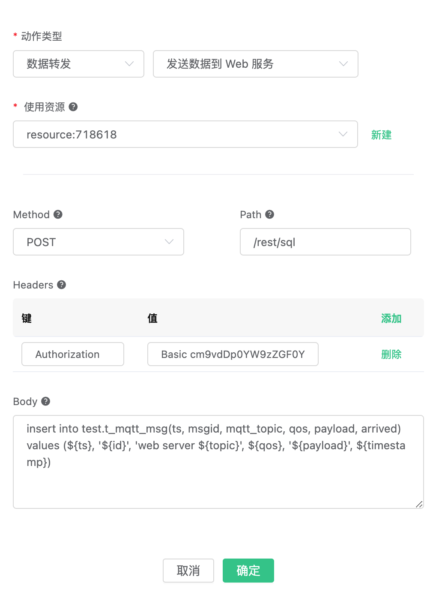

# Save data to TDengine

[TDengine](https://github.com/taosdata/TDengine) 是[涛思数据](https://www.taosdata.com/cn/)推出的一款开源的专为物联网、车联网、工业互联网、IT 运维等设计和优化的大数据平台。除核心的快 10 倍以上的时序数据库功能外，还提供缓存、数据订阅、流式计算等功能，最大程度减少研发和运维的复杂度。

EMQX 支持通过 **发送到 Web 服务** 的方式保存数据到 TDengine，也在企业版上提供原生的 TDengine 驱动实现直接保存。

使用 Docker 安装 TDengine 或在 [Cloud](https://marketplace.huaweicloud.com/product/OFFI454488918838128640) 上部署：

```bash
docker run --name TDengine -d -p 6030:6030 -p 6035:6035 -p 6041:6041 -p 6030-6040:6030-6040/udp tdengine/tdengine 
```

进入 Docker 容器：

```bash
docker exec -it TDengine bash
taos
```

创建 “test” 数据库:
```bash
create database test;
```
创建 t_mqtt_msg 表，关于 TDengine 数据结构以及 SQL 命令参见 [TAOS SQL](https://www.taosdata.com/cn/documentation/taos-sql/#表管理)：

```sql
USE test;
CREATE TABLE t_mqtt_msg (
  ts timestamp,
  msgid NCHAR(64),
  mqtt_topic NCHAR(255),
  qos TINYINT,
  payload BINARY(1024),
  arrived timestamp
);
```

创建规则:

打开 [EMQX Dashboard](http://127.0.0.1:18083/#/rules)，选择左侧的 “规则” 选项卡。

填写规则 SQL:

```sql
SELECT

  *,
  now_timestamp('millisecond')  as ts

FROM

  "#"
```


后续动作创建操作可以根据你的 EMQX 版本灵活选择。

## 原生方式（企业版）

关联动作:

在 “响应动作” 界面选择 “添加”，然后在 “动作” 下拉框里选择 “保存数据到 TDengine”。

> 仅限企业版 4.1.1 及以后版本。

填写动作参数:

“保存数据到 TDengine” 动作需要两个参数：

1. SQL 模板。这个例子里我们向 TDengine 插入一条数据，注意我们应当在 SQL 中指定数据库名，字符类型也要用单引号括起来，SQL 模板为：

```sql
insert into test.t_mqtt_msg(ts, msgid, mqtt_topic, qos, payload, arrived) values (${ts}, '${id}', '${topic}', ${qos}, '${payload}', ${timestamp})
```

2. 关联资源的 ID。现在资源下拉框为空，可以点击右上角的 “新建资源” 来创建一个 TDengine资源:

填写资源配置:

用户名填写 “root”，密码填写缺省密码 “taosdata”，**TDengine 不在资源中配置数据库名，请在 SQL 中自行配置。**


点击 “新建” 按钮。

返回响应动作界面，点击 “确认”。


返回规则创建界面，点击 “创建”。

## 通过发送数据到 Web 服务写入

为支持各种不同类型平台的开发，TDengine 提供符合 REST 设计标准的 API。通过 [RESTful Connector](https://www.taosdata.com/cn/documentation/connector/#RESTful-Connector) 提供了最简单的连接方式，即使用 HTTP 请求携带认证信息与要执行的 SQL 操作 TDengine。

您可通过 EMQX 规则引擎中的**发送数据到 Web 服务**功能实现上述操作。

关联动作:

在 “响应动作” 界面选择 “添加”，然后在 “动作” 下拉框里选择 “保存数据到 Web 服务“。

您可以通过 EMQX 规则引擎中的**发送数据到 Web 服务功能**，实现上述操作。

填写动作参数:

“保存数据到 Web 服务” 动作需要 5 个参数：

1. 使用资源：关联 Web Server 资源，可点击创建按钮新建资源
2. Method：HTTP 请求方式，使用 `POST`
3. Path：写入数据路径 `/rest/sql`
4. Headers：使用 `Basic` 认证，默认用户名密码 "root:taosdata" `base64` 编码 `cm9vdDp0YW9zZGF0YQ==`
5. Body：请求体
    这个例子里我们向 TDengine 插入一条数据，应当在请求体内拼接携带 INSERT SQL 。注意我们应当在 SQL 中指定数据库名，字符类型也要用单引号括起来，消息内容模板为：

```sql
-- 注意：topic 处添加了作为标识，因为此示例中我们会有两个资源写入 TDengine，标识区分了原生方式与 Web Server 写入的数据
insert into test.t_mqtt_msg(ts, msgid, mqtt_topic, qos, payload, arrived) values (${ts}, '${id}', 'http server ${topic}', ${qos}, '${payload}', ${timestamp})
```



创建关联的 Web Server 资源：
</br>
填写资源配置：
</br>
请求 URL 填写 http://127.0.0.1:6041，其他字段按照服务器设定填写即可。配置了加密传输请填写证书信息。示例中仅使用默认的参数配置。
</br>
返回规则创建界面，点击 “创建”。


## 测试

在规则列表里，点击规则 ID 连接，可以预览刚才创建的规则:


规则已经创建完成，现在发一条数据:

```bash
Topic: "t/a"
QoS: 1
Payload: {"msg": "hello"}
```

然后检查 TDengine 表，新的 record 是否添加成功:

```sql
select * from t_mqtt_msg;
```


