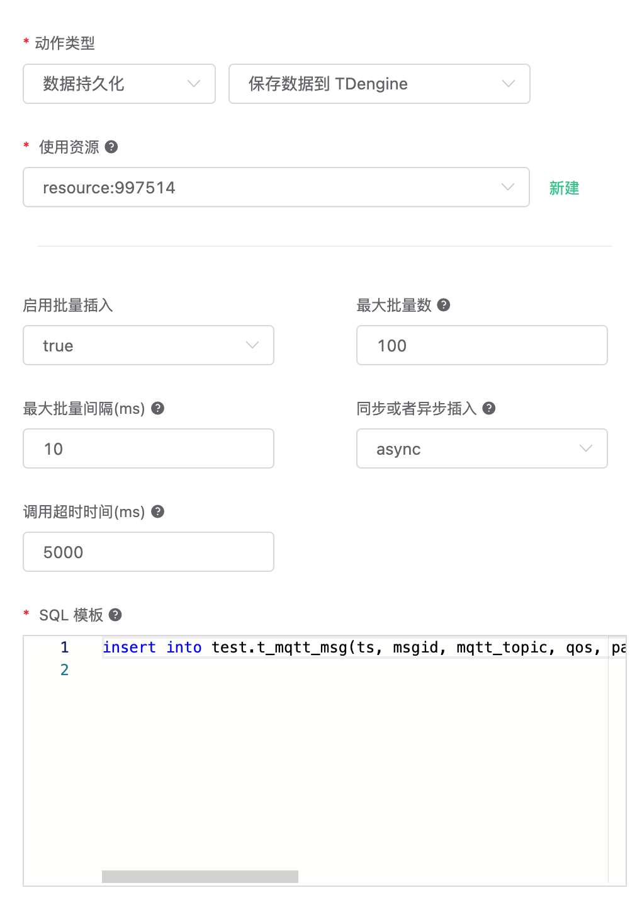

# 保存数据到 TDengine

[TDengine](https://github.com/taosdata/TDengine) 是[涛思数据](https://www.taosdata.com/cn/)推出的一款开源的专为物联网、车联网、工业互联网、IT 运维等设计和优化的大数据平台。除核心的快 10 倍以上的时序数据库功能外，还提供缓存、数据订阅、流式计算等功能，最大程度减少研发和运维的复杂度。

您可以在 [华为云](https://marketplace.huaweicloud.com/product/OFFI454488918838128640) 上直接部署 TDengine，也可以通过 Docker 安装：

:::tip
如需使用 TDengine 3.x 版本，请使用 EMQX v4.4.12 及之后的版本。
:::

```bash
docker run --name TDengine -d -p 6030:6030 -p 6041:6041 -p 6043-6049:6043-6049 -p 6043-6049:6043-6049/udp tdengine/tdengine
```

进入 Docker 容器：

```bash
docker exec -it TDengine bash
taos
```

创建 “test” 数据库:

```bash
create database test;
```

创建 t_mqtt_msg 表，关于 TDengine 数据结构以及 SQL 命令参见 [TDengine SQL](https://docs.taosdata.com/taos-sql/)：

```sql
USE test;
CREATE TABLE t_mqtt_msg (
  ts timestamp,
  msgid NCHAR(64),
  mqtt_topic NCHAR(255),
  qos TINYINT,
  payload BINARY(1024),
  arrived timestamp
);
```

创建规则:

打开 [EMQX Dashboard](http://127.0.0.1:18083/#/rules)，选择左侧的 “规则” 选项卡。

填写规则 SQL:

```sql
SELECT

  *,
  now_timestamp('millisecond')  as ts

FROM

  "#"
```


后续动作创建操作可以根据你的 EMQX 版本灵活选择。

关联动作:

在 “响应动作” 界面选择 “添加”，然后在 “动作” 下拉框里选择 “保存数据到 TDengine”。

> 仅限企业版 4.1.1 及以后版本。

填写动作参数:

“保存数据到 TDengine” 动作需要两个参数：

1. SQL 模板。这个例子里我们向 TDengine 插入一条数据，注意我们应当在 SQL 中指定数据库名，字符类型也要用单引号括起来，SQL 模板为：

```sql
insert into test.t_mqtt_msg(ts, msgid, mqtt_topic, qos, payload, arrived) values (${ts}, '${id}', '${topic}', ${qos}, '${payload}', ${timestamp})
```

2. 关联资源的 ID。现在资源下拉框为空，可以点击右上角的 “新建资源” 来创建一个 TDengine 资源:

填写资源配置:

用户名填写 “root”，密码填写缺省密码 “taosdata”，**TDengine 不在资源中配置数据库名，请在 SQL 中自行配置。**


点击 “新建” 按钮。

返回响应动作界面，点击 “确认”。



返回规则创建界面，点击 “创建”。

测试：

在规则列表里，点击规则 ID 连接，可以预览刚才创建的规则:


规则已经创建完成，现在发一条数据:

```bash
Topic: "t/a"
QoS: 1
Payload: {"msg": "hello"}
```

然后检查 TDengine 表，新的 record 是否添加成功:

```sql
select * from t_mqtt_msg;
```


