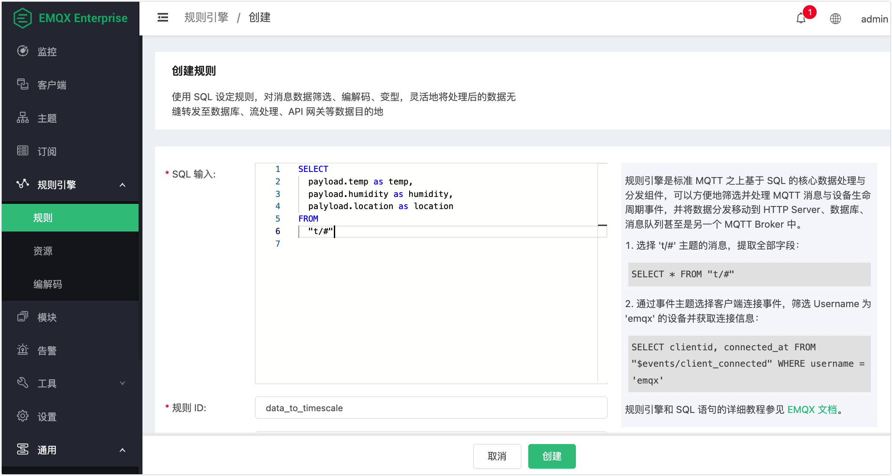
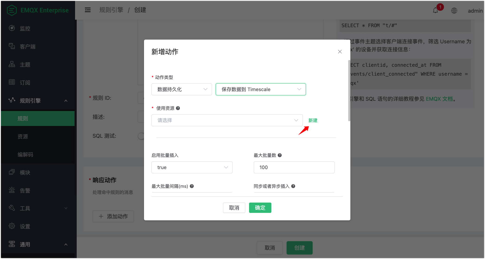
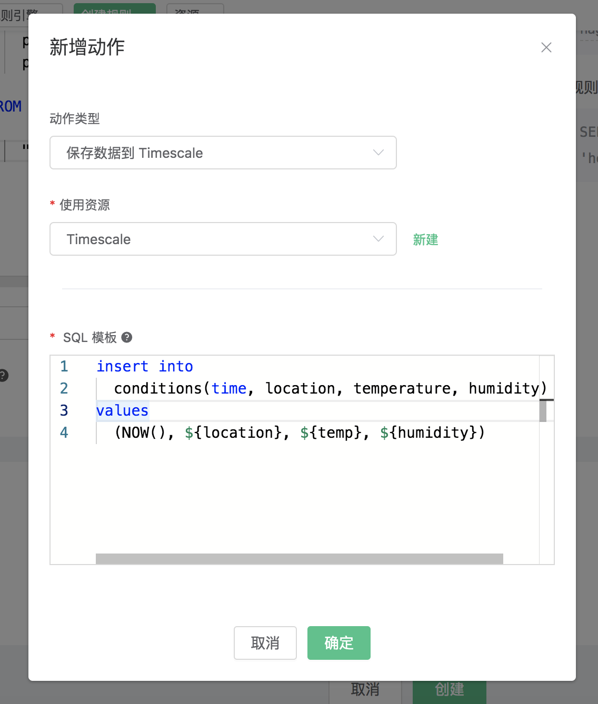
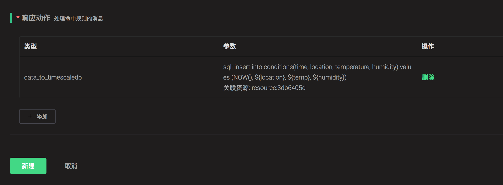

# 保存数据到 TimescaleDB

搭建 TimescaleDB 数据库环境，以 MacOS X 为例:

```bash
$ docker pull timescale/timescaledb

$ docker run -d --name timescaledb -p 5432:5432 -e POSTGRES_PASSWORD=password timescale/timescaledb:latest-pg11

$ docker exec -it timescaledb psql -U postgres

## 创建并连接 tutorial 数据库
CREATE database tutorial;

\c tutorial

CREATE EXTENSION IF NOT EXISTS timescaledb CASCADE;
```

初始化 TimescaleDB 表:

```bash
$ docker exec -it timescaledb psql -U postgres -d tutorial
```

创建 `conditions` 表:

```sql
CREATE TABLE conditions (
    time        TIMESTAMPTZ       NOT NULL,
    location    TEXT              NOT NULL,
    temperature DOUBLE PRECISION  NULL,
    humidity    DOUBLE PRECISION  NULL
);

SELECT create_hypertable('conditions', 'time');
```

创建规则:

打开 [EMQ X Dashboard](http://127.0.0.1:18083/#/rules)，选择左侧的 “规则” 选项卡。

填写规则 SQL:

```sql
SELECT
    payload as p,
    p.temp as temp,
    p.humidity as humidity,
    p.location as location
FROM
    "#"
```



关联动作:

在 “响应动作” 界面选择 “添加”，然后在 “动作” 下拉框里选择 “保存数据到 TimescaleDB”。



填写动作参数:

“保存数据到 TimescaleDB” 动作需要两个参数：

1). SQL 模板。这个例子里我们向 TimescaleDB 插入一条数据，SQL
​    模板为:

```sql
insert into conditions(time, location, temperature, humidity) values (NOW(), ${location}, ${temp}, ${humidity})
```

插入数据之前，SQL 模板里的 ${key} 占位符会被替换为相应的值。

2). 关联资源。现在资源下拉框为空，可以点击右上角的 “新建资源” 来创建一个 TimescaleDB 资源:


选择 “PostgreSQL 资源”。

填写资源配置:

数据库名填写 “mqtt”，用户名填写 “root”，其他配置保持默认值，然后点击 “测试连接” 按钮，确保连接测试成功。

最后点击 “新建” 按钮。


返回响应动作界面，点击 “确认”。



返回规则创建界面，点击 “新建”。



规则已经创建完成，现在发一条数据:

```bash
Topic: "t/1"

QoS: 0

Payload: "{"temp":24,"humidity":30,"location":"hangzhou"}"
```

然后检查 TimescaleDB 表，新的 record 是否添加成功:

```bash
tutorial=# SELECT * FROM conditions LIMIT 100;
            time              | location | temperature | humidity
-------------------------------+----------+-------------+----------
2019-06-27 01:41:08.752103+00 | hangzhou |          24 |       30
```

在规则列表里，可以看到刚才创建的规则的命中次数已经增加了 1:


