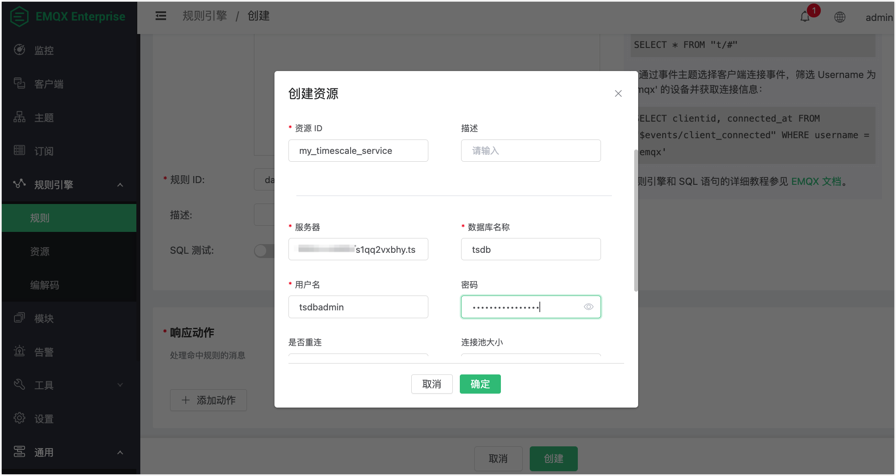

# 集成 TimescaleDB

EMQX 支持与 TimescaleDB 集成以便您将 MQTT 消息和客户端事件保存到 TimescaleDB 或 Timescale Service。

## 搭建 TimescaleDB 环境并创建数据表

您可以使用 Timescale Service 或 TimescaleDB Docker 镜像来创建一个 TimescaleDB 实例。

:::: tabs 
::: tab Timescale Service

1. 如果您还没有 Timescale 帐户，参考[创建 Timescale 帐户](https://docs.timescale.com/getting-started/latest/services/#create-your-timescale-account)。

2. 登录 Timescale portal 并[创建一个 Timescale 服务](https://docs.timescale.com/getting-started/latest/services/#create-your-first-service)。 保存服务**密码 **。

3. 在服务概览页面获取连接信息。 EMQX 要求的字段包括 **Database name**， **Host**，**Port** 和 **Username**。

4. 用 psql 客户端[连接服务](https://docs.timescale.com/getting-started/latest/services/#connect-to-your-service)。

   ```bash
   # connect to service by service URL
   psql "postgres://tsdbadmin@xxxxx.xxxxx.tsdb.cloud.timescale.com:32541/tsdb?sslmode=require"
   # use password in step 2
   Password for user tsdbadmin:
   ```

5. 创建数据表用来保存客户端传感器数据。

   ```sql
   CREATE TABLE sensor_data (
       time        TIMESTAMPTZ       NOT NULL,
       location    TEXT              NOT NULL,
       temperature DOUBLE PRECISION  NULL,
       humidity    DOUBLE PRECISION  NULL
   );
   
   SELECT create_hypertable('sensor_data', 'time');
   ```

数据表成功创建后，您可以在 Services 中的 **Explore** 页签下查看数据表 `sensor_data` 的信息。


:::

::: tab TimescaleDB Docker

1. 如果您还未安装 Docker，参考[安装 Docker](https://docs.docker.com/install/)。

2. 通过 Docker 创建一个 TimescaleDB 容器，并使用环境变量 `POSTGRES_PASSWORD` 设置数据库密码。

   ```bash
   docker run -d --name timescaledb \
       -p 5432:5432 \
       -e POSTGRES_PASSWORD=<your-password> \
       timescale/timescaledb:latest-pg13
   ```

3. 创建一个数据库用来保存客户端传感器数据。

   ```bash
   docker exec -it timescaledb psql -U postgres
   
   ## create tsdb database
   > CREATE database tsdb;
   
   > \c tsdb;
   ```

4. 创建并初始化数据表。

   ```sql
   CREATE TABLE sensor_data (
       time        TIMESTAMPTZ       NOT NULL,
       location    TEXT              NOT NULL,
       temperature DOUBLE PRECISION  NULL,
       humidity    DOUBLE PRECISION  NULL
   );
   
   SELECT create_hypertable('sensor_data', 'time');
   ```

:::

::::

## 创建规则

1. 打开 [EMQX Dashboard](http://127.0.0.1:18083/#/rules)，选择左侧导航菜单中的**规则引擎** -> **规则**。

2. 在 **SQL 输入**中填写规则 SQL:

   ```sql
   SELECT
       payload.temp as temp,
       payload.humidity as humidity,
       payload.location as location
   FROM
       "t/#"
   ```

   

3. 在**响应动作**区域点击**+  添加动作**，在**动作类型**下拉框里选择**数据持久化** -> **保存数据到 Timescale**。点击**新建**创建一个 Timescale 资源。

   

4. 在弹出的**创建资源**对话框中，填写连接信息。使用 `<host>:<port>` 作为 **Server** 的填写格式。点击**确定**创建一个 Timescale 资源。

   

5. 在**新增动作**对话框中的 **SQL 模板** 中输入 SQL 模版以规定当动作被触发时启动的 SQL 命令。 这个例子里您可以使用以下 SQL 模版实现向 TimescaleDB 插入一条消息数据：

   ::: tip

   插入数据之前，SQL 模板里的 ${key} 占位符会被替换为相应的值。

   :::

   ```sql
   INSERT INTO 
       sensor_data (time, location, temperature, humidity)
   VALUES 
       (NOW(), ${location}, ${temp}, ${humidity})
   ```

6. 点击**确认**完成动作添加。
7. 在创建规则界面，点击**新建**。您可以看到新建的规则 `data_to_timesacle` 显示在规则列表中。

## 测试规则

您可以使用 MQTTX CLI 向 MEQX 发一条 MQTT 消息来测试规则：

```bash
mqttx pub -t t/1 -m '{"temp":24,"humidity":30,"location":"hangzhou"}'
```

然后检查 TimescaleDB 数据表，新的 record 是否添加成功:

```bash
tsdb=> select * from sensor_data;
             time              | location | temperature | humidity
-------------------------------+----------+-------------+----------
 2023-06-25 10:14:05.456206+00 | hangzhou |          24 |       30
(1 row)
```

点击规则列表里的监控图标，可以看到刚才创建的规则的命中次数已经增加了 1。


