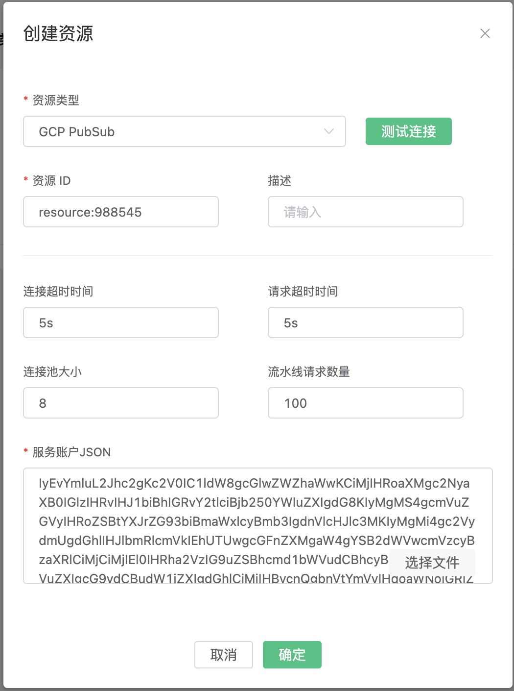
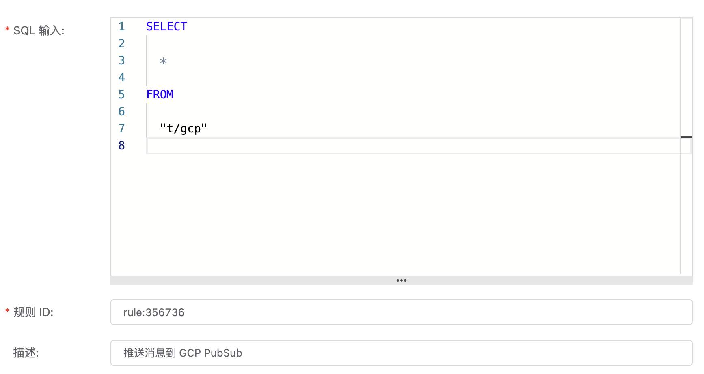
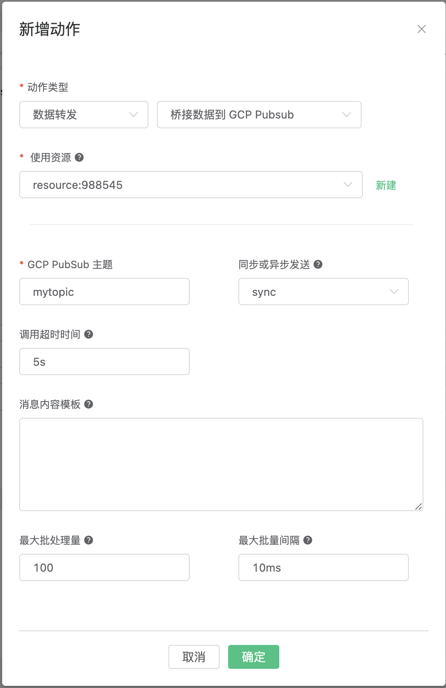
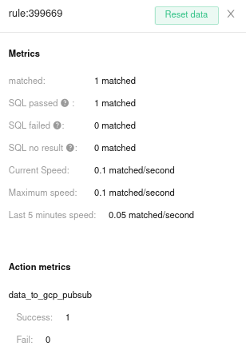

# 桥接数据到 GCP PubSub

## 设置

1. 创建一个[服务账户](https://developers.google.com/identity/protocols/oauth2/service-account#creatinganaccount)，
   在你的GCP账户中确保服务账户有权限，可以向需要的主题发布消息。
2. 为该账户创建一个服务账户密钥，并下载其为 JSON 格式文件。
3. 创建一个 PubSub 主题（记住，服务账户必须有权限来发布到该主题）。

## 创建 GCP PubSub 资源

转到 [EMQX 仪表板](http://127.0.0.1:18083/#/resources)，
在左边的菜单上选择“规则引擎”项目，然后选择“资源”。
然后，点击“创建”。

在对话框中，选择“GCP PubSub”类型，并点击“选择文件”。
选择上传前面下载的服务账户JSON 文件。
点击“确认”。



## 创建规则和动作

转到 [EMQX仪表板](http://127.0.0.1:18083/#/resources)，选择左边菜单上的
“规则引擎”项目，然后选择“规则”。 然后点击“创建”。

输入以下SQL。

```sql
SELECT
    *
FROM
    "t/gcp"
```



然后，点击“添加动作”。 选择行动类型“数据转发”，“桥接到GCP PubSub”，在“使用资源”中选择 之前创建的 GCP PubSub 资源。
填入动作的参数。 这里唯一需要定义的参数是 PubSub Topic，即消息发送的目标。 点击“确认”。



最后，点击页面底部的“创建”。

## 测试动作

你可以通过向 EMQX 发送一个 MQTT 消息来测试新的动作。

```bash
Topic: "t/gcp"

QoS: 0

Retained: false

Payload: "hello"
```

通过从 PubSub 主题中提取消息，可以验证数据已被转发到GCP。

```bash
# 为你的主题创建一个订阅
gcloud pubsub subscriptions create my_subscription_id --topic=mytopic

# 从 PubSub 订阅消息
gcloud pubsub subscriptions pull my_subscription_id --auto-ack
```

另外，你可以检查该规则的统计指标。


